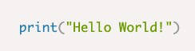
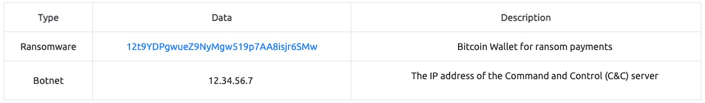
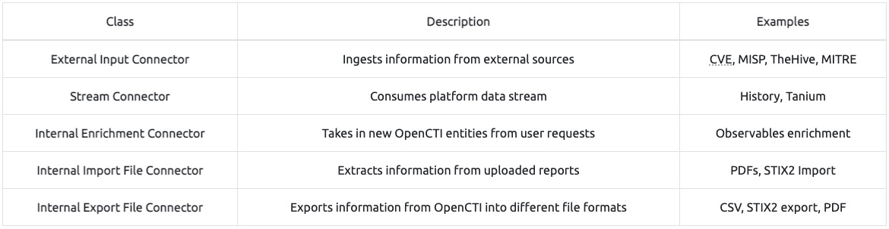

# **Cyber Threat Intelligence**

## **--Intro to Cyber Threat Intel--**

### _**Introduction**_
This room will introduce you to cyber threat intelligence (CTI) and various frameworks used to share intelligence. As security analysts, CTI is vital for investigating and reporting against adversary attacks with organisational stakeholders and external communities.

Learning Objectives
- The basics of CTI and its various classifications.  
    
- The lifecycle followed to deploy and use intelligence during threat investigations.
- Frameworks and standards used in distributing intelligence.

### _**Cyber Threat Intelligence**_
Cyber Threat Intelligence (CTI) can be defined as evidence-based knowledge about adversaries, including their indicators, tactics, motivations, and actionable advice against them. These can be utilised to protect critical assets and inform cybersecurity teams and management business decisions.

It would be typical to use the terms “data”, “information”, and “intelligence” interchangeably. However, let us distinguish between them to understand better how CTI comes into play.

**Data:** Discrete indicators associated with an adversary such as IP addresses, URLs or hashes.

**Information:** A combination of multiple data points that answer questions such as “How many times have employees accessed tryhackme.com within the month?”

**Intelligence:** The correlation of data and information to extract patterns of actions based on contextual analysis.

The primary goal of CTI is to understand the relationship between your operational environment and your adversary and how to defend your environment against any attacks. You would seek this goal by developing your cyber threat context by trying to answer the following questions:  

- Who’s attacking you?
- What are their motivations?
- What are their capabilities?
- What artefacts and indicators of compromise (IOCs) should you look out for?

With these questions, threat intelligence would be gathered from different sources under the following categories:

- **Internal:**
    
    - Corporate security events such as vulnerability assessments and incident response reports.
    - Cyber awareness training reports.
    - System logs and events.
- **Community:**
    
    - Open web forums.
    - Dark web communities for cybercriminals.
- **External**
    
    - Threat intel feeds (Commercial & Open-source)
    - Online marketplaces.
    - Public sources include government data, publications, social media, financial and industrial assessments.

### Threat Intelligence Classifications:

Threat Intel is geared towards understanding the relationship between your operational environment and your adversary. With this in mind, we can break down threat intel into the following classifications: 

- **Strategic Intel:** High-level intel that looks into the organisation’s threat landscape and maps out the risk areas based on trends, patterns and emerging threats that may impact business decisions.
    
- **Technical Intel:** Looks into evidence and artefacts of attack used by an adversary. Incident Response teams can use this intel to create a baseline attack surface to analyse and develop defence mechanisms.
    
- **Tactical Intel:** Assesses adversaries’ tactics, techniques, and procedures (TTPs). This intel can strengthen security controls and address vulnerabilities through real-time investigations.
    
- **Operational Intel:** Looks into an adversary’s specific motives and intent to perform an attack. Security teams may use this intel to understand the critical assets available in the organisation (people, processes and technologies) that may be targeted.

### _**CTI Lifecycle**_
Threat intel is obtained from a data-churning process that transforms raw data into contextualised and action-oriented insights geared towards triaging security incidents. The transformational process follows a six-phase cycle:

## Direction

Every threat intel program requires to have objectives and goals defined, involving identifying the following parameters:
- Information assets and business processes that require defending.
- Potential impact to be experienced on losing the assets or through process interruptions.
- Sources of data and intel to be used towards protection.
- Tools and resources that are required to defend the assets.

This phase also allows security analysts to pose questions related to investigating incidents.

## Collection

Once objectives have been defined, security analysts will gather the required data to address them. Analysts will do this by using commercial, private and open-source resources available. Due to the volume of data analysts usually face, it is recommended to automate this phase to provide time for triaging incidents.

## Processing

Raw logs, vulnerability information, malware and network traffic usually come in different formats and may be disconnected when used to investigate an incident. This phase ensures that the data is extracted, sorted, organised, correlated with appropriate tags and presented visually in a usable and understandable format to the analysts. SIEMs are valuable tools for achieving this and allow quick parsing of data.

## Analysis

Once the information aggregation is complete, security analysts must derive insights. Decisions to be made may involve:
- Investigating a potential threat through uncovering indicators and attack patterns.
- Defining an action plan to avert an attack and defend the infrastructure.
- Strengthening security controls or justifying investment for additional resources.

## Dissemination
Different organisational stakeholders will consume the intelligence in varying languages and formats. For example, C-suite members will require a concise report covering trends in adversary activities, financial implications and strategic recommendations. At the same time, analysts will more likely inform the technical team about the threat IOCs, adversary TTPs and tactical action plans.

## Feedback
The final phase covers the most crucial part, as analysts rely on the responses provided by stakeholders to improve the threat intelligence process and implementation of security controls. Feedback should be regular interaction between teams to keep the lifecycle working.

### _**CTI Standards & Frameworks**_
Standards and frameworks provide structures to rationalise the distribution and use of threat intel across industries. They also allow for common terminology, which helps in collaboration and communication. Here, we briefly look at some essential standards and frameworks commonly used.

### MITRE ATT&CK
The [ATT&CK framework](https://tryhackme.com/room/mitre) is a knowledge base of adversary behaviour, focusing on the indicators and tactics. Security analysts can use the information to be thorough while investigating and tracking adversarial behaviour.

### TAXII
[The Trusted Automated eXchange of Indicator Information (TAXII)](https://oasis-open.github.io/cti-documentation/taxii/intro) defines protocols for securely exchanging threat intel to have near real-time detection, prevention and mitigation of threats. The protocol supports two sharing models:

- Collection: Threat intel is collected and hosted by a producer upon request by users using a request-response model.
- Channel: Threat intel is pushed to users from a central server through a publish-subscribe model.

### STIX
[Structured Threat Information Expression (STIX)](https://oasis-open.github.io/cti-documentation/stix/intro) is a language developed for the "specification, capture, characterisation and communication of standardised cyber threat information". It provides defined relationships between sets of threat info such as observables, indicators, adversary TTPs, attack campaigns, and more.  

### Cyber Kill Chain
Developed by Lockheed Martin, the Cyber Kill Chain breaks down adversary actions into steps. This breakdown helps analysts and defenders identify which stage-specific activities occurred when investigating an attack. The phases defined are shown in the image below.

Over time, the kill chain has been expanded using other frameworks such as ATT&CK and formulated a new Unified Kill Chain.

### The Diamond Model
The diamond model looks at intrusion analysis and tracking attack groups over time. It focuses on four key areas, each representing a different point on the diamond. These are:
- Adversary: The focus here is on the threat actor behind an attack and allows analysts to identify the motive behind the attack.
- Victim: The opposite end of adversary looks at an individual, group or organisation affected by an attack.
- Infrastructure: The adversaries' tools, systems, and software to conduct their attack are the main focus. Additionally, the victim's systems would be crucial to providing information about the compromise.
- Capabilities: The focus here is on the adversary's approach to reaching its goal. This looks at the means of exploitation and the TTPs implemented across the attack timeline.

An example of the diamond model in play would involve an adversary targeting a victim using phishing attacks to obtain sensitive information and compromise their system, as displayed on the diagram. As a threat intelligence analyst, the model allows you to pivot along its properties to produce a complete picture of an attack and correlate indicators.

### _**Practical Analysis**_
As part of the dissemination phase of the lifecycle, CTI is also distributed to organisations using published threat reports. These reports come from technology and security companies that research emerging and actively used threat vectors. They are valuable for consolidating information presented to all suitable stakeholders. Some notable threat reports come from [Mandiant](https://www.mandiant.com/resources), [Recorded Future](https://www.recordedfuture.com/resources/global-issues) and [AT&TCybersecurity](https://cybersecurity.att.com/).


## **--Threat Intelligence Tools--**

### _**Room Outline**_
This room will cover the concepts of Threat Intelligence and various open-source tools that are useful. The learning objectives include:
- Understanding the basics of threat intelligence & its classifications.
- Using UrlScan.io to scan for malicious URLs.
- Using Abuse.ch to track malware and botnet indicators.
- Investigate phishing emails using PhishTool
- Using Cisco's Talos Intelligence platform for intel gathering.

### _**Threat Intelligence**_
Threat Intelligence is the analysis of data and information using tools and techniques to generate meaningful patterns on how to mitigate against potential risks associated with existing or emerging threats targeting organisations, industries, sectors or governments.

To mitigate against risks, we can start by trying to answer a few simple questions:
- Who's attacking you?
- What's their motivation?
- What are their capabilities?
- What artefacts and indicators of compromise should you look out for?

### Threat Intelligence Classifications:
Threat Intel is geared towards understanding the relationship between your operational environment and your adversary. With this in mind, we can break down threat intel into the following classifications: 
- **Strategic Intel:** High-level intel that looks into the organisation's threat landscape and maps out the risk areas based on trends, patterns and emerging threats that may impact business decisions.
- **Technical Intel:** Looks into evidence and artefacts of attack used by an adversary. Incident Response teams can use this intel to create a baseline attack surface to analyse and develop defence mechanisms.
- **Tactical Intel:** Assesses adversaries' tactics, techniques, and procedures (TTPs). This intel can strengthen security controls and address vulnerabilities through real-time investigations.
- **Operational Intel:** Looks into an adversary's specific motives and intent to perform an attack. Security teams may use this intel to understand the critical assets available in the organisation (people, processes, and technologies) that may be targeted.

### _**UrlScan.io**_
[**Urlscan.io**](https://urlscan.io/) is a free service developed to assist in scanning and analysing websites. It is used to automate the process of browsing and crawling through websites to record activities and interactions.

When a URL is submitted, the information recorded includes the domains and IP addresses contacted, resources requested from the domains, a snapshot of the web page, technologies utilised and other metadata about the website.

The site provides two views, the first one showing the most recent scans performed and the second one showing current live scans.

#### **Scan Results**
URL scan results provide ample information, with the following key areas being essential to look at:
- **Summary:** Provides general information about the URL, ranging from the identified IP address, domain registration details, page history and a screenshot of the site.
- **HTTP:** Provides information on the HTTP connections made by the scanner to the site, with details about the data fetched and the file types received.
- **Redirects:** Shows information on any identified HTTP and client-side redirects on the site.
- **Links:** Shows all the identified links outgoing from the site's homepage.
- **Behaviour:** Provides details of the variables and cookies found on the site. These may be useful in identifying the frameworks used in developing the site.
- **Indicators:** Lists all IPs, domains and hashes associated with the site. These indicators do not imply malicious activity related to the site.

### _**Abuse.ch**_
[Abuse.ch](https://abuse.ch/) is a research project hosted by the Institue for Cybersecurity and Engineering at the Bern University of Applied Sciences in Switzerland. It was developed to identify and track malware and botnets through several operational platforms developed under the project. These platforms are:
- **Malware Bazaar:**  A resource for sharing malware samples.
- **Feodo Tracker:** A resource used to track botnet command and control (C2) infrastructure linked with Emotet, Dridex and TrickBot.
- **SSL Blacklist:**  A resource for collecting and providing a blocklist for malicious SSL certificates and JA3/JA3s fingerprints.
- **URL Haus:**  A resource for sharing malware distribution sites.
- **Threat Fox:**  A resource for sharing indicators of compromise (IOCs).

Let us look into these platforms individually.

#### [MalwareBazaar](https://bazaar.abuse.ch/)
As the name suggests, this project is an all in one malware collection and analysis database. The project supports the following features:
- **Malware Samples Upload:** Security analysts can upload their malware samples for analysis and build the intelligence database. This can be done through the browser or an API.
- **Malware Hunting:** Hunting for malware samples is possible through setting up alerts to match various elements such as tags, signatures, YARA rules, ClamAV signatures and vendor detection.

#### [FeodoTracker](https://feodotracker.abuse.ch/)
With this project, Abuse.ch is targeting to share intelligence on botnet Command & Control (C&C) servers associated with Dridex, Emotes (aka Heodo), TrickBot, QakBot and BazarLoader/BazarBackdoor. This is achieved by providing a database of the C&C servers that security analysts can search through and investigate any suspicious IP addresses they have come across. Additionally, they provide various IP and IOC blocklists and mitigation information to be used to prevent botnet infections.

#### [SSL Blacklist](https://sslbl.abuse.ch/)
Abuse.ch developed this tool to identify and detect malicious SSL connections. From these connections, SSL certificates used by botnet C2 servers would be identified and updated on a denylist that is provided for use. The denylist is also used to identify JA3 fingerprints that would help detect and block malware botnet C2 communications on the TCP layer.

You can browse through the SSL certificates and JA3 fingerprints lists or download them to add to your deny list or threat hunting rulesets.

#### [URLhaus](https://urlhaus.abuse.ch/)
As the name points out, this tool focuses on sharing malicious URLs used for malware distribution. As an analyst, you can search through the database for domains, URLs, hashes and filetypes that are suspected to be malicious and validate your investigations.

The tool also provides feeds associated with country, AS number and Top Level Domain that an analyst can generate based on specific search needs.

#### [ThreatFox](https://threatfox.abuse.ch/)
With ThreatFox,  security analysts can search for, share and export indicators of compromise associated with malware. IOCs can be exported in various formats such as MISP events, Suricata IDS Ruleset, Domain Host files, DNS Response Policy Zone, JSON files and CSV files.

### _**PhishTool**_
Email phishing is one of the main precursors of any cyber attack. Unsuspecting users get duped into the opening and accessing malicious files and links sent to them by email, as they appear to be legitimate. As a result, adversaries infect their victims’ systems with malware, harvesting their credentials and personal data and performing other actions such as financial fraud or conducting ransomware attacks.

[PhishTool](https://www.phishtool.com/) seeks to elevate the perception of phishing as a severe form of attack and provide a responsive means of email security. Through email analysis, security analysts can uncover email IOCs, prevent breaches and provide forensic reports that could be used in phishing containment and training engagements.

PhishTool has two accessible versions: **Community** and **Enterprise**. We shall mainly focus on the Community version and the core features in this task. Sign up for an account via this [link](https://app.phishtool.com/sign-up/community) to use the tool.

The core features include:
- **Perform email analysis:** PhishTool retrieves metadata from phishing emails and provides analysts with the relevant explanations and capabilities to follow the email’s actions, attachments, and URLs to triage the situation.
- **Heuristic intelligence:** OSINT is baked into the tool to provide analysts with the intelligence needed to stay ahead of persistent attacks and understand what TTPs were used to evade security controls and allow the adversary to social engineer a target.
- **Classification and reporting:** Phishing email classifications are conducted to allow analysts to take action quickly. Additionally, reports can be generated to provide a forensic record that can be shared.

Additional features are available on the Enterprise version:
- Manage user-reported phishing events.
- Report phishing email findings back to users and keep them engaged in the process.
- Email stack integration with Microsoft 365 and Google Workspace.

We are presented with an upload file screen from the Analysis tab on login. Here, we submit our email for analysis in the stated file formats. Other tabs include:  
- **History:** Lists all submissions made with their resolutions.
- **In-tray:** An Enterprise feature used to receive and process phish reports posted by team members through integrating Google Workspace and Microsoft 365.

#### **Analysis Tab**

Once uploaded, we are presented with the details of our email for a more in-depth look. Here, we have the following tabs:
- **Headers:** Provides the routing information of the email, such as source and destination email addresses, Originating IP and DNS addresses and Timestamp.
- **Received Lines:** Details on the email traversal process across various SMTP servers for tracing purposes.
- **X-headers:** These are extension headers added by the recipient mailbox to provide additional information about the email.
- **Security:** Details on email security frameworks and policies such as Sender Policy Framework (SPF), DomainKeys Identified Mail (DKIM) and Domain-based Message Authentication, Reporting and Conformance (DMARC).
- **Attachments:** Lists any file attachments found in the email.
- **Message URLs:** Associated external URLs found in the email will be found here.

We can further perform lookups and flag indicators as malicious from these options. On the right-hand side of the screen, we are presented with the Plaintext and Source details of the email.

Above the Plaintext section, we have a Resolve checkmark. Here, we get to perform the resolution of our analysis by classifying the email, setting up flagged artefacts and setting the classification codes. Once the email has been classified, the details will appear on the Resolution tab on the analysis of the email.

What organisation is the attacker trying to pose as in the email?
- linkedin

What is the senders email address?
- darkabutla@sc500.whpservers.com

What is the recipient's email address?
- cabbagecare@hotsmail.com

What is the Originating IP address? Defang the IP address.
- 204[.]93[.]183[.]11

How many hops did the email go through to get to the recipient?
- 4

### _**Cisco Talos Intelligence**_
IT and Cybersecurity companies collect massive amounts of information that could be used for threat analysis and intelligence. Being one of those companies, Cisco assembled a large team of security practitioners called Cisco Talos to provide actionable intelligence, visibility on indicators, and protection against emerging threats through data collected from their products. The solution is accessible as [Talos Intelligence](https://talosintelligence.com/).

Cisco Talos encompasses six key teams:
- **Threat Intelligence & Interdiction:** Quick correlation and tracking of threats provide a means to turn simple IOCs into context-rich intel.
- **Detection Research:** Vulnerability and malware analysis is performed to create rules and content for threat detection.
- **Engineering & Development:** Provides the maintenance support for the inspection engines and keeps them up-to-date to identify and triage emerging threats.
- **Vulnerability Research & Discovery:** Working with service and software vendors to develop repeatable means of identifying and reporting security vulnerabilities.
- **Communities:** Maintains the image of the team and the open-source solutions.
- **Global Outreach:** Disseminates intelligence to customers and the security community through publications.

More information about Cisco Talos can be found on their [White Paper](https://www.talosintelligence.com/docs/Talos_WhitePaper.pdf)

#### **Talos Dashboard**

Accessing the open-source solution, we are first presented with a reputation lookup dashboard with a world map. This map shows an overview of email traffic with indicators of whether the emails are legitimate, spam or malware across numerous countries. Clicking on any marker, we see more information associated with IP and hostname addresses, volume on the day and the type.

At the top, we have several tabs that provide different types of intelligence resources. The primary tabs that an analyst would interact with are:  

- **Vulnerability Information:** Disclosed and zero-day vulnerability reports marked with CVE numbers and CVSS scores. Details of the vulnerabilities reported are provided when you select a specific report, including the timeline taken to get the report published. Microsoft vulnerability advisories are also provided, with the applicable snort rules that can be used.
- **Reputation Center:** Provides access to searchable threat data related to IPs and files using their SHA256 hashes. Analysts would rely on these options to conduct their investigations. Additional email and spam data can be found under the **Email & Spam Data tab**.

What is the listed domain of the IP address from the previous task?
- scnet.net

What is the customer name of the IP address?
- Complete Web Reviews

### _**Scenario 1**_
According to Email2.eml, what is the recipient's email address?
- chris.lyons@supercarcenterdetroit.com
- found with phishtool

From Talos Intelligence, the attached file can also be identified by the Detection Alias that starts with an H...
- HIDDENEXT/Worm.Gen
- found with talos using sha256 hash on attachment
- 435BFC4C3A3C887FD39C058E8C11863D5DD1F05E0C7A86E232C93D0E979FDB28

### _**Scenario 2**_
What is the name of the attachment on Email3.eml?
- Sales_Receipt 5606.xls
- found with phishtool

What malware family is associated with the attachment on Email3.eml?
- dridex
- found with malwarebazaar
- sha256:b8ef959a9176aef07fdca8705254a163b50b49a17217a4ff0107487f59d4a35d

### _**Conclusion**_
n/a

## **--Yara--**

### _**Introduction**_
This room will expect you to understand basic Linux familiarity, such as installing software and commands for general navigation of the system. Moreso, this room isn't designed to test your knowledge or for point-scoring. It is here to encourage you to follow along and experiment with what you have learned here.

Yara *(Yet Another Ridiculous Acronym)* was developed by Victor M. Alvarez ([@plusvic](https://twitter.com/plusvic)) and [@VirusTotal](https://twitter.com/virustotal). Check the GitHub repo [here](https://github.com/virustotal/yara).

### _**What is Yara?**_
_All about Yara_

*"The pattern matching swiss knife for malware researchers (and everyone else)" ([Virustotal., 2020](https://virustotal.github.io/yara/))*

With such a fitting quote, Yara can identify information based on both binary and textual patterns, such as hexadecimal and strings contained within a file.

Rules are used to label these patterns. For example, Yara rules are frequently written to determine if a file is malicious or not, based upon the features - or patterns - it presents. Strings are a fundamental component of programming languages. Applications use strings to store data such as text.

For example, the code snippet below prints "Hello World" in Python. The text "Hello World" would be stored as a string.



We could write a Yara rule to search for "hello world" in every program on our operating system if we would like. 

_Why does Malware use Strings?_

Malware, just like our "Hello World" application, uses strings to store textual data. Here are a few examples of the data that various malware types store within strings:



_Caveat: Malware Analysis_

Explaining the functionality of malware is vastly out of scope for this room due to the sheer size of the topic. I have covered strings in much more detail in "Task 12 - Strings" of my [MAL: Introductory room](https://tryhackme.com/room/malmalintroductory). In fact, I am creating a whole Learning Path for it. If you'd like to get a taster whilst learning the fundamentals, I'd recommend my room.

### _**Deploy**_
This room deploys an Instance with the tools being showcased already installed for you.  Press the "Start Machine" button and wait for an IP address to be displayed and connect in one of two ways:

_In-Browser (No  VPN required)_

Deploy your own instance by pressing the green "Start Machine" button and scroll up to the top of the room and await the timer. The machine will start in a split-screen view. In case the VM is not visible, use the blue "Show Split View" button at the top-right of the page.

_Using SSH (TryHackMe VPN required)._

You must be connected to the TryHackMe VPN if you wish to connect your deployed Instance from your own device.  If you are unfamiliar with this process, please visit the [TryHackMe OpenVPN](https://tryhackme.com/room/openvpn) room to get started. If you have any issues, please [read our support articles](https://help.tryhackme.com/).

### _**Introduction to Yara Rules**_
Your First Yara Rule

The proprietary language that Yara uses for rules is fairly trivial to pick up, but hard to master. This is because your rule is only as effective as your understanding of the patterns you want to search for.  
  
Using a Yara rule is simple. Every `yara` command requires two arguments to be valid, these are:  
**1)** The rule file we create  
**2)** Name of file, directory, or process ID to use the rule for.  
  
Every rule must have a name and condition.  
  
For example, if we wanted to use "myrule.yar" on directory "some directory", we would use the following command:  
`yara myrule.yar somedirectory`  
  
Note that **.yar** is the standard file extension for all Yara rules. We'll make one of the most basic rules you can make below.  
  
1. Make a file named "**somefile**" via `touch somefile`  
2\. Create a new file and name it "**myfirstrule.yar**" like below:

Creating a file named somefile

           `cmnatic@thm:~$ touch somefile`  

Creating a file named myfirstrule.yar

           `cmnatic@thm touch myfirstrule.yar`  

3\. Open the "myfirstrule.yar" using a text editor such as `nano` and input the snippet below and save the file:

```yaml
rule examplerule {
        condition: true
}
```

  

Inputting our first snippet into "myfirstrule.yar" using nano

           `cmnatic@thm nano myfirstrule.yar   GNU nano 4.8 myfirstrule.yar Modified
rule examplerule {
        condition: true
}`
     

The **name** of the rule in this snippet is `examplerule`, where we have one condition - in this case, the **condition** is `condition`. As previously discussed, every rule requires both a name and a condition to be valid. This rule has satisfied those two requirements.  
  
Simply, the rule we have made checks to see if the file/directory/PID that we specify exists via `condition: true`. If the file does exist, we are given the output of `examplerule`  
  
Let's give this a try on the file **"somefile"** that we made in step one:  
`yara myfirstrule.yar somefile`  
  
If "somefile" exists, Yara will say `examplerule` because the pattern has been met - as we can see below:  
  

Verifying our the examplerule is correct

           `cmnatic@thm:~$ yara myfirstrule.yar somefile 
examplerule somefile`  

If the file does not exist, Yara will output an error such as that below:  
  

Yara complaining that the file does not exist

           `cmnatic@thm:~$ yara myfirstrule.yar sometextfile
error scanning sometextfile: could not open file`       

Congrats! You've made your first rule.

### _**Expanding on Yara Rules**_
_Yara Conditions Continued..._

Checking whether or not a file exists isn't all that helpful. After all, we can figure that out for ourselves...Using much better tools for the job.  
  
Yara has a few conditions, which I encourage you to read [here](https://yara.readthedocs.io/en/stable/writingrules.html) at your own leisure. However, I'll detail a few below and explain their purpose.  

Keyword

Desc  

Meta  

Strings  

Conditions  

Weight  


_Meta_

This section of a Yara rule is reserved for descriptive information by the author of the rule. For example, you can use `desc`, short for description, to summarise what your rule checks for. Anything within this section does not influence the rule itself. Similar to commenting code, it is useful to summarise your rule.

_Strings_

Remember our discussion about strings in Task 2? Well, here we go. You can use strings to search for specific text or hexadecimal in files or programs. For example, say we wanted to search a directory for all files containing "Hello World!", we would create a rule such as below:

```yaml
rule helloworld_checker{
	strings:
		$hello_world = "Hello World!"
}
```

We define the keyword `Strings` where the string that we want to search, i.e., "Hello World!" is stored within the variable `$hello_world`  
  
Of course, we need a condition here to make the rule valid. In this example, to make this string the condition, we need to use the variable's name. In this case, `$hello_world`:

```yaml
rule helloworld_checker{
	strings:
		$hello_world = "Hello World!"

	condition:
		$hello_world
}
```

Essentially, if any file has the string "Hello World!" then the rule will match. However, this is literally saying that it will only match if "Hello World!" is found and will not match if "_hello world_" or "_HELLO WORLD_."

  
To solve this, the condition `any of them` allows multiple strings to be searched for, like below:  

```yaml
rule helloworld_checker{
	strings:
		$hello_world = "Hello World!"
		$hello_world_lowercase = "hello world"
		$hello_world_uppercase = "HELLO WORLD"

	condition:
		any of them
}
```

Now, any file with the strings of:

1\. Hello World!

2\. hello world

3\. HELLO WORLD

  

Will now trigger the rule.

  

Conditions

We have already used the `true` and `any of them` condition. Much like regular programming, you can use operators such as:  

**<=** less than or equal to

**\>=** more than or equal to

**!=** not equal to

  

For example, the rule below would do the following:

```yaml
rule helloworld_checker{
	strings:
		$hello_world = "Hello World!"

	condition:
        #hello_world <= 10
}
```

  
The rule will now:

1\. Look for the "Hello World!" string  
2\. Only say the rule matches if there are less than or equal to ten occurrences of the "Hello World!" string  
  

Combining keywords

Moreover, you can use keywords such as:

**and**

**not**

**or** 

  

To combine multiple conditions. Say if you wanted to check if a file has a string and is of a certain size (in this example, the sample file we are checking is **less than** <10 kb and has "Hello World!" you can use a rule like below:  
  

```yaml
rule helloworld_checker{
	strings:
		$hello_world = "Hello World!" 
        
        condition:
	        $hello_world and filesize < 10KB 
}
```

  
The rule will only match if both conditions are true. To illustrate: below, the rule we created, in this case, did not match because although the file has "Hello World!", it has a file size larger than 10KB:

Yara failing to match the file mytextfile because it is larger than 10kb

           `cmnatic@thm:~$ <output intentionally left blank>`
        

However, the rule matched this time because the file has both "Hello World!" and a file size of less than 10KB.

Yara successfully matching the file mytextfile because it has "Hello World" and a file size of less than 10KB

           `cmnatic@thm:~$ yara myfirstrule.yar mytextfile.txt
helloworld_textfile_checker mytextfile.txt`
        

Remembering that the text within the red box is the name of our rule, and the text within the green is the matched file.

Anatomy of a Yara Rule

  

Information security researcher "fr0gger\_" has recently created a [handy cheatsheet](https://medium.com/malware-buddy/security-infographics-9c4d3bd891ef#18dd) that breaks down and visualises the elements of a YARA rule (shown above, all image credits go to him). It's a great reference point for getting started!

### _**Yara Modules**_
Integrating With Other Libraries  

Frameworks such as the [Cuckoo Sandbox](https://cuckoosandbox.org/) or [Python's PE Module](https://pypi.org/project/pefile/) allow you to improve the technicality of your Yara rules ten-fold.  

Cuckoo

Cuckoo Sandbox is an automated malware analysis environment. This module allows you to generate Yara rules based upon the behaviours discovered from Cuckoo Sandbox. As this environment executes malware, you can create rules on specific behaviours such as runtime strings and the like.

Python PE

Python's PE module allows you to create Yara rules from the various sections and elements of the Windows Portable Executable (PE) structure.

Explaining this structure is out of scope as it is covered in my [malware introductory room](https://tryhackme.com/room/malmalintroductory). However, this structure is the standard formatting of all executables and DLL files on windows. Including the programming libraries that are used. 

Examining a PE file's contents is an essential technique in malware analysis; this is because behaviours such as cryptography or worming can be largely identified without reverse engineering or execution of the sample.

### _**Other tools and Yara**_
_Yara Tools_

Knowing how to create custom Yara rules is useful, but luckily you don't have to create many rules from scratch to begin using Yara to search for evil. There are plenty of GitHub [resources](https://github.com/InQuest/awesome-yara) and open-source tools (along with commercial products) that can be utilized to leverage Yara in hunt operations and/or incident response engagements. 

_LOKI (What, not who, is Loki?)_

LOKI is a free open-source IOC (_Indicator of Compromise_) scanner created/written by Florian Roth.

Based on the GitHub page, detection is based on 4 methods:

1. File Name IOC Check
2. Yara Rule Check **(we are here)**
3. Hash Check
4. C2 Back Connect Check

There are additional checks that LOKI can be used for. For a full rundown, please reference the [GitHub readme](https://github.com/Neo23x0/Loki/blob/master/README.md).

LOKI can be used on both Windows and Linux systems and can be downloaded [here](https://github.com/Neo23x0/Loki/releases).

*Please note that you are not expected to use this tool in this room.*

Displaying Loki's help menu
```
           cmnatic@thm:~/Loki$ python3 loki.py -h
usage: loki.py [-h] [-p path] [-s kilobyte] [-l log-file] [-r remote-loghost]
               [-t remote-syslog-port] [-a alert-level] [-w warning-level]
               [-n notice-level] [--allhds] [--alldrives] [--printall]
               [--allreasons] [--noprocscan] [--nofilescan] [--vulnchecks]
               [--nolevcheck] [--scriptanalysis] [--rootkit] [--noindicator]
               [--dontwait] [--intense] [--csv] [--onlyrelevant] [--nolog]
               [--update] [--debug] [--maxworkingset MAXWORKINGSET]
               [--syslogtcp] [--logfolder log-folder] [--nopesieve]
               [--pesieveshellc] [--python PYTHON] [--nolisten]
               [--excludeprocess EXCLUDEPROCESS] [--force]

Loki - Simple IOC Scanner

optional arguments:
  -h, --help            show this help message and exit`
```        

  

_THOR (_superhero named programs for a superhero blue teamer)__

THOR _Lite_ is Florian's newest multi-platform IOC AND YARA scanner. There are precompiled versions for Windows, Linux, and macOS. A nice feature with THOR Lite is its scan throttling to limit exhausting CPU resources. For more information and/or to download the binary, start [here](https://www.nextron-systems.com/thor-lite/). You need to subscribe to their mailing list to obtain a copy of the binary. **Note that THOR is geared towards corporate customers**. THOR Lite is the free version.

*Please note that you are not expected to use this tool in this room.*

Displaying Thor Lite's help menu
```
           cmnatic@thm:~$ ./thor-lite-linux-64 -h
Thor Lite
APT Scanner
Version 10.7.3 (2022-07-27 07:33:47)
cc) Nextron Systems GmbH
Lite Version

> Scan Options
  -t, --template string      Process default scan parameters from this YAML file
  -p, --path strings         Scan a specific file path. Define multiple paths by specifying this option multiple times. Append ':NOWALK' to the path for non-recursive scanning (default: only the system drive) (default [])
      --allhds               (Windows Only) Scan all local hard drives (default: only the system drive)
      --max_file_size uint   Max. file size to check (larger files are ignored). Increasing this limit will also increase memory usage of THOR. (default 30MB)

> Scan Modes
      --quick     Activate a number of flags to speed up the scan at cost of some detection.
                  This is equivalent to: --noeventlog --nofirewall --noprofiles --nowebdirscan --nologscan --noevtx --nohotfixes --nomft --lookback 3 --lookback-modules filescan
```        

  

_FENRIR (naming convention still mythical themed)_

This is the 3rd [tool](https://github.com/Neo23x0/Fenrir) created by Neo23x0 (Florian Roth). You guessed it; the previous 2 are named above. The updated version was created to address the issue from its predecessors, where requirements must be met for them to function. Fenrir is a bash script; it will run on any system capable of running bash (nowadays even Windows). 

_Please note that you are not expected to use this tool in this room._

Running Fenrir
```
           `cmnatic@thm-yara:~/tools$ ./fenrir.sh
##############################################################
 ____             _
   / __/__ ___  ____(_)___
  / _// -_) _ \/ __/ / __/
 /_/  \__/_//_/_/ /_/_/
 v0.9.0-log4shell

 Simple Bash IOC Checker
 Florian Roth, Dec 2021 ##############################################################`
```        

  

_YAYA (*Yet Another Yara Automaton*)_

YAYA was created by the [EFF](https://www.eff.org/deeplinks/2020/09/introducing-yaya-new-threat-hunting-tool-eff-threat-lab) (_Electronic Frontier Foundation_) and released in September 2020. Based on their website, "_YAYA is a new open-source tool to help researchers manage multiple YARA rule repositories. YAYA starts by importing a set of high-quality YARA rules and then lets researchers add their own rules, disable specific rulesets, and run scans of files._"

Note: Currently, YAYA will only run on Linux systems. 

Running YAYA
```
           `cmnatic@thm-yara:~/tools$ yaya
YAYA - Yet Another Yara Automaton
Usage:
yaya [-h]  
    -h print this help screen
Commands:
   update - update rulesets
   edit - ban or remove rulesets
   add - add a custom ruleset, located at 
   scan - perform a yara scan on the directory at` 
```        

  

In the next section, we will examine [LOKI](https://github.com/Neo23x0/Loki) further...

### _**Using LOKI and its Yara rule set**_
Using LOKI

As a security analyst, you may need to research various threat intelligence reports, blog postings, etc. and gather information on the latest tactics and techniques used in the wild, past or present. Typically in these readings, IOCs (hashes, IP addresses, domain names, etc.) will be shared so rules can be created to detect these threats in your environment, along with Yara rules. On the flip side, you might find yourself in a situation where you've encountered something unknown, that your security stack of tools can't/didn't detect. Using tools such as Loki, you will need to add your own rules based on your threat intelligence gathers or findings from an incident response engagement (forensics). 

  

As mentioned before, Loki already has a set of Yara rules that we can benefit from and start scanning for evil on the endpoint straightaway.  

  

Navigate to the Loki directory. Loki is located in the `tools`.

  

Listing the tools directory
```
           cmnatic@thm-yara:~/tools$ ls
Loki  yarGen
```
        

Run `python loki.py -h` to see what options are available. 

  

If you are running Loki on your own system, the first command you should run is `--update`. This will add the `signature-base` directory, which Loki uses to scan for known evil. This command was already executed within the attached VM. 

  

Listing Loki signature-base directory

           `cmnatic@thm-yara:~/tools/Loki/signature-base$ ls
iocs  misc  yara`
        

Navigate to the `yara` directory. Feel free to inspect the different Yara files used by Loki to get an idea of what these rules will hunt for.

  

To run Loki, you can use the following command (**note that I am calling Loki from within the file 1 directory**)

  

Instructing Loki to scan the suspicious file

           `cmnatic@thm-yara:~/suspicious-files/file1$ python ../../tools/Loki/loki.py -p .`
        

**Scenario**: You are the security analyst for a mid-size law firm. A co-worker discovered suspicious files on a web server within your organization. These files were discovered while performing updates to the corporate website. The files have been copied to your machine for analysis. The files are located in the `suspicious-files` directory. Use Loki to answer the questions below.

### _**Creating Yara rules with yarGen**_
From the previous section, we realized that we have a file that Loki didn't flag on. At this point, we are unable to run Loki on other web servers because if **file 2** exists in any of the webs servers, it will go undetected.

We need to create a Yara rule to detect this specific web shell in our environment. Typically this is what is done in the case of an incident, which is an event that affects/impacts the organization in a negative fashion.

We can manually open the file and attempt to sift through lines upon lines of code to find possible strings that can be used in our newly created Yara rule.

Let's check how many lines this particular file has. You can run the following: `strings <file name> | wc -l`.

Using wc to count the amount of lines in the file
```
cmnatic@thm-yara:~/suspicious-files/file2$ strings 1ndex.php | wc -l
3580
```        

If you try to go through each string, line by line manually, you should quickly realize that this can be a daunting task.

Catting the output of 1ndex.php
```
if(res=='error'){ $('.ulProgress'+ulType+i).html('( failed )');
}
else{ $('.ulRes'+ulType+i).html(res);
}
loading_stop();
},
error: function(){
loading_stop(); $('.ulProgress'+ulType+i).html('( failed )');
$('.ulProgress'+ulType+i).removeClass('ulProgress'+ulType+i);
$('.ulFilename'+ulType+i).removeClass('ulFilename'+ulType+i);
}
});
}

function ul_go(ulType){
ulFile = (ulType=='comp')? $('.ulFileComp'):$('.ulFileUrl');
ulResult = (ulType=='comp')? $('.ulCompResult'):$('.ulUrlResult');
ulResult.html('');

ulFile.each(function(i){
if(((ulType=='comp')&&this.files[0])||((ulType=='url')&&(this.value!=''))){
file = (ulType=='comp')? this.files[0]: this.value;
filename = (ulType=='comp')? file.name: file.substring(file.lastIndexOf('/')+1);

ulSaveTo = (ulType=='comp')? $('.ulSaveToComp')[i].value:$('.ulSaveToUrl')[i].value;
ulFilename = (ulType=='comp')? $('.ulFilenameComp')[i].value:$('.ulFilenameUrl')[i].value;

--snippet cropped for brevity--`
```        

  

Luckily, we can use [yarGen](https://github.com/Neo23x0/yarGen) (yes, another tool created by Florian Roth) to aid us with this task.

What is yarGen? yarGen is a generator for YARA rules.

From the README - "_T__he main principle is the creation of yara rules from strings found in malware files while removing all strings that also appear in goodware files. Therefore yarGen includes a big goodware strings and opcode database as ZIP archives that have to be extracted before the first use_."

Navigate to the `yarGen` directory, which is within `tools`. If you are running yarGen on your own system, you need to update it first by running the following command: `python3 yarGen.py --update`.  

  

This will update the good-opcodes and good-strings DB's from the online repository. This update will take a few minutes. 

 Once it has been updated successfully, you'll see the following message at the end of the output.

Updating yarGen
```
cmnatic@thm-yara:~/tools/yarGen$ python3 yarGen.py --update
------------------------------------------------------------------------
                   _____
    __ _____ _____/ ___/__ ___
   / // / _ `/ __/ (_ / -_) _ \
   \_, /\_,_/_/  \___/\__/_//_/
  /___/  Yara Rule Generator
         Florian Roth, July 2020, Version 0.23.3

  Note: Rules have to be post-processed
  See this post for details: https://medium.com/@cyb3rops/121d29322282
------------------------------------------------------------------------
Downloading good-opcodes-part1.db from https://www.bsk-consulting.de/yargen/good-opcodes-part1.db ... 
```        

  

To use yarGen to generate a Yara rule for file 2, you can run the following command:

`python3 yarGen.py -m /home/cmnatic/suspicious-files/file2 --excludegood -o /home/cmnatic/suspicious-files/file2.yar` 

A brief explanation of the parameters above:

- `-m` is the path to the files you want to generate rules for
- `--excludegood` force to exclude all goodware strings (_these are strings found in legitimate software and can increase false positives_)
- `-o` location & name you want to output the Yara rule

If all is well, you should see the following output.

Using yarGen to generate a rule for file2
```
[=] Generated 1 SIMPLE rules.
[=] All rules written to /home/cmnatic/suspicious-files/file2.yar
[+] yarGen run finished`
```        

  

Generally, you would examine the Yara rule and remove any strings that you feel might generate false positives. For this exercise, we will leave the generated Yara rule as is and test to see if Yara will flag file 2 or no. 

**Note**: Another tool created to assist with this is called [yarAnalyzer](https://github.com/Neo23x0/yarAnalyzer/) (you guessed it - created by Florian Roth). We will not examine that tool in this room, but you should read up on it, especially if you decide to start creating your own Yara rules. 

**Further Reading on creating Yara rules and using yarGen**:

- [https://www.bsk-consulting.de/2015/02/16/write-simple-sound-yara-rules/](https://www.bsk-consulting.de/2015/02/16/write-simple-sound-yara-rules/)  
    
- [https://www.bsk-consulting.de/2015/10/17/how-to-write-simple-but-sound-yara-rules-part-2/](https://www.bsk-consulting.de/2015/10/17/how-to-write-simple-but-sound-yara-rules-part-2/)
- [https://www.bsk-consulting.de/2016/04/15/how-to-write-simple-but-sound-yara-rules-part-3/](https://www.bsk-consulting.de/2016/04/15/how-to-write-simple-but-sound-yara-rules-part-3/)

### _**Valhalla**_
**Valhalla** is an online Yara feed created and hosted by [Nextron-Systems](https://www.nextron-systems.com/valhalla/) (erm, Florian Roth). By now, you should be aware of the ridiculous amount of time and energy Florian has dedicated to creating these tools for the community. Maybe we should have just called this the Florian Roth room. (lol)

Per the website, "_Valhalla boosts your detection capabilities with the power of thousands of hand-crafted high-quality YARA rules._"

  

From the image above, we should denote that we can conduct searches based on a keyword, tag, ATT&CK technique, sha256, or rule name. 

**Note**: For more information on ATT&CK, please visit the [MITRE](https://tryhackme.com/room/mitre) room. 

Taking a look at the data provided to us, let's examine the rule in the screenshot below:

  

We are provided with the name of the rule, a brief description, a reference link for more information about the rule, along with the rule date. 

Feel free to look at some rules to become familiar with the usefulness of Valhalla. The best way to learn the product is by just jumping right in. 

Picking up from our scenario, at this point, you know that the 2 files are related. Even though Loki classified the files are suspicious, you know in your gut that they are malicious. Hence the reason you created a Yara rule using yarGen to detect it on other web servers. But let's further pretend that you are not code-savvy (FYI - not all security professionals know how to code/script or read it). You need to conduct further research regarding these files to receive approval to eradicate these files from the network. 

Time to use Valhalla for some threat intelligence gathering...

## **--OpenCTI--**

### _**Room Overview**_
This room will cover the concepts and usage of OpenCTI, an open-source threat intelligence platform. The room will help you understand and answer the following questions:

- What is OpenCTI and how is it used?
- How would I navigate through the platform?
- What functionalities will be important during a security threat analysis?

Prior to going through this room, we recommend checking out these rooms as prerequisites:

- [MITRE ATT&CK Framework](https://tryhackme.com/room/mitre)
- [TheHive](https://tryhackme.com/room/thehiveproject)
- [MISP](https://tryhackme.com/room/misp)
- [Threat Intelligence Tools](http://tryhackme.com/room/threatinteltools)

### _**Introduction to OpenCTI**_
Cyber Threat Intelligence is typically a managerial mystery to handle, with organisations battling with how to input, digest, analyse and present threat data in a way that will make sense. From the rooms that have been linked on the overview, it is clear that there are numerous platforms that have been developed to tackle the juggernaut that is Threat Intelligence.

_OpenCTI_

[OpenCTI](https://www.opencti.io/) is another open-sourced platform designed to provide organisations with the means to manage CTI through the storage, analysis, visualisation and presentation of threat campaigns, malware and IOCs.  

_Objective_

Developed by the collaboration of the [French National cybersecurity agency (ANSSI)](https://www.ssi.gouv.fr/), the platform's main objective is to create a comprehensive tool that allows users to capitalise on technical and non-technical information while developing relationships between each piece of information and its primary source. The platform can use the [MITRE ATT&CK framework](https://tryhackme.com/room/mitre) to structure the data. Additionally, it can be integrated with other threat intel tools such as MISP and TheHive. Rooms to these tools have been linked in the overview.

### _**OpenCTI Data Model**_
OpenCTI uses a variety of knowledge schemas in structuring data, the main one being the Structured Threat Information Expression ([STIX2](https://oasis-open.github.io/cti-documentation/stix/intro)) standards. STIX is a serialised and standardised language format used in threat intelligence exchange. It allows for the data to be implemented as entities and relationships, effectively tracing the origin of the provided information.

This data model is supported by how the platform's architecture has been laid out. The image below gives an architectural structure for your know-how.

Source: [OpenCTI Public Knowledge Base](https://luatix.notion.site/OpenCTI-Public-Knowledge-Base-d411e5e477734c59887dad3649f20518)

The highlight services include:

- **GraphQL API:** The API connects clients to the database and the messaging system.
- **Write workers:** Python processes utilised to write queries asynchronously from the RabbitMQ messaging system.
- **Connectors:** Another set of python processes used to ingest, enrich or export data on the platform. These connectors provide the application with a robust network of integrated systems and frameworks to create threat intelligence relations and allow users to improve their defence tactics.

According to OpenCTI, connectors fall under the following classes:



Refer to the [connectors](https://github.com/OpenCTI-Platform/connectors) and [data model](https://luatix.notion.site/Data-model-4427344d93a74fe194d5a52ce4a41a8d) documentation for more details on configuring connectors and the data schema.

### _**OpenCTI Dashboard 1**_
### OpenCTI Dashboard

Once connected to the platform, the opening dashboard showcases various visual widgets summarising the threat data ingested into OpenCTI. Widgets on the dashboard showcase the current state of entities ingested on the platform via the total number of entities, relationships, reports and observables ingested, and changes to these properties noted within 24 hours.

### Activities & Knowledge

The OpenCTI categorises and presents entities under the **Activities and Knowledge** groups on the left-side panel. The activities section covers security incidents ingested onto the platform in the form of reports. It makes it easy for analysts to investigate these incidents. In contrast, the Knowledge section provides linked data related to the tools adversaries use, targeted victims and the type of threat actors and campaigns used.

#### Analysis

The Analysis tab contains the input entities in reports analysed and associated external references. Reports are central to OpenCTI as knowledge on threats and events are extracted and processed. They allow for easier identification of the source of information by analysts. Additionally, analysts can add their investigation notes and other external resources for knowledge enrichment. As displayed below, we can look at the **Triton** Software report published by MITRE ATT&CK and observe or add to the details provided.

#### Events

Security analysts investigate and hunt for events involving suspicious and malicious activities across their organisational network. Within the Events tab, analysts can record their findings and enrich their threat intel by creating associations for their incidents.

#### Observations

Technical elements, detection rules and artefacts identified during a cyber attack are listed under this tab: one or several identifiable makeup indicators. These elements assist analysts in mapping out threat events during a hunt and perform correlations between what they observe in their environments against the intel feeds. 

#### Threats

All information classified as threatening to an organisation or information would be classified under threats. These will include:

- **Threat Actors:** An individual or group of attackers seeking to propagate malicious actions against a target.
    
- **Intrusion Sets:** An array of TTPs, tools, malware and infrastructure used by a threat actor against targets who share some attributes. APTs and threat groups are listed under this category on the platform due to their known pattern of actions.
    
- **Campaigns:** Series of attacks taking place within a given period and against specific victims initiated by advanced persistent threat actors who employ various TTPs. Campaigns usually have specified objectives and are orchestrated by threat actors from a nation state, crime syndicate or other disreputable organisation.

#### Arsenal

This tab lists all items related to an attack and any legitimate tools identified from the entities.

- **Malware:** Known and active malware and trojan are listed with details of their identification and mapping based on the knowledge ingested into the platform. In our example, we analyse the **4H RAT** malware and we can extract information and associations made about the malware.
    
- **Attack Patterns:** Adversaries implement and use different TTPs to target, compromise, and achieve their objectives. Here, we can look at the details of the **Command-Line Interface and make decisions based on the relationships established on the platform and navigate through an investigation associated with the technique.**
    
- **Courses of Action:** MITRE maps out concepts and technologies that can be used to prevent an attack technique from being employed successfully. These are represented as Courses of Action (CoA) against the TTPs.
    
- **Tools:** Lists all legitimate tools and services developed for network maintenance, monitoring and management. Adversaries may also use these tools to achieve their objectives. For example, for the Command-Line Interface attack pattern, it is possible to narrow down that **CMD** would be used as an execution tool. As an analyst, one can investigate reports and instances associated with the use of the tool.
    
- **Vulnerabilities:** Known software bugs, system weaknesses and exposures are listed to provide enrichment for what attackers may use to exploit and gain access to systems. The Common Vulnerabilities and Exposures (CVE) list maintained by MITRE is used and imported via a connector.

#### Entities

This tab categorises all entities based on operational sectors, countries, organisations and individuals. This information allows for knowledge enrichment on attacks, organisations or intrusion sets.

### _**OpenCTI Dashboard 2**_
### General Tabs Navigation  

The day-to-day usage of OpenCTI would involve navigating through different entities within the platform to understand and utilise the information for any threat analysis. We will be looking at the **Cobalt Strike** malware entity for our walkthrough, mainly found under the Arsenal tab we've covered previously. When you select an intelligence entity, the details are presented to the user through:  

- **Overview Tab:** Provides the general information about an entity being analysed and investigated. In our case, the dashboard will present you with the entity ID, confidence level, description, relations created based on threats, intrusion sets and attack patterns, reports mentioning the entity and any external references.

- **Knowledge Tab:** Presents linked information associated with the entity selected. This tab will include the reports associated, indicators, relations and attack pattern timeline of the entity. Additionally, an analyst can view fine-tuned details from the tabs on the right-hand pane, where information about the threats, attack vectors, events and observables used within the entity are presented.

- **Analysis Tab**: Provides the reports where the identified entry has been seen. The analysis provides usable information about a threat and guides investigation tasks.

- **Indicators Tab**: Provides information on IOC identified for all the threats and entities.

- **Data Tab:** Contains the files uploaded or generated for export that are related to the entity. These assist in communicating information about threats being investigated in either technical or non-technical formats.

- **History Tab:** Changes made to the element, attributes, and relations are tracked by the platform worker and this tab will outline the changes.

## **--MISP--**

### _**Room Overview**_
MISP - MALWARE INFORMATION SHARING PLATFORM
This room explores the MISP Malware & Threat Sharing Platform through its core objective to foster sharing of structured threat information among security analysts, malware researchers and IT professionals.

### _**MISP Introduction: Features & Terminologies**_
[MISP (Malware Information Sharing Platform)](https://www.misp-project.org/) is an open-source threat information platform that facilitates the collection, storage and distribution of threat intelligence and Indicators of Compromise (IOCs) related to malware, cyber attacks, financial fraud or any intelligence within a community of trusted members. 

Information sharing follows a distributed model, with supported closed, semi-private, and open communities (public). Additionally, the threat information can be distributed and consumed by Network Intrusion Detection Systems (NIDS), log analysis tools and Security Information and Event Management Systems (SIEM).

MISP is effectively useful for the following use cases:

- **Malware Reverse Engineering**: Sharing of malware indicators to understand how different malware families function.
- **Security Investigations:** Searching, validating and using indicators in investigating security breaches.
- **Intelligence Analysis:** Gathering information about adversary groups and their capabilities.
- **Law Enforcement:** Using indicators to support forensic investigations.
- **Risk Analysis:** Researching new threats, their likelihood and occurrences.
- **Fraud Analysis:** Sharing of financial indicators to detect financial fraud.

## **What does MISP support?**   

MISP provides the following core functionalities:  

- **IOC database:** This allows for the storage of technical and non-technical information about malware samples, incidents, attackers and intelligence.
- **Automatic Correlation:** Identification of relationships between attributes and indicators from malware, attack campaigns or analysis.
- **Data Sharing:** This allows for sharing of information using different models of distributions and among different MISP instances.
- **Import & Export Features:** This allows the import and export of events in different formats to integrate other systems such as NIDS, HIDS, and OpenIOC.
- **Event Graph:** Showcases the relationships between objects and attributes identified from events.
- **API support:** Supports integration with own systems to fetch and export events and intelligence.

  

The following terms are commonly used within MISP and are related to the functionalities described above and the general usage of the platform:

- **Events:** Collection of contextually linked information.
- **Attributes:** Individual data points associated with an event, such as network or system indicators.
- **Objects:** Custom attribute compositions.
- **Object References:** Relationships between different objects.
- **Sightings:** Time-specific occurrences of a given data point or attribute detected to provide more credibility.
- **Tags:** Labels attached to events/attributes.
- **Taxonomies:** Classification libraries are used to tag, classify and organise information.
- **Galaxies:** Knowledge base items used to label events/attributes.
- **Indicators:** Pieces of information that can detect suspicious or malicious cyber activity.

### _**Using the System**_
Dashboard  

The analyst's view of MISP provides you with the functionalities to track, share and correlate events and IOCs identified during your investigation. The dashboard's menu contains the following options, and we shall look into them further:

- **Home button:** Returns you to the application's start screen, the event index page or the page set as a custom home page using the star in the top bar.
- **Event Actions:** All the malware data entered into MISP comprises an event object described by its connected attributes. The Event actions menu gives access to all the functionality related to the creation, modification, deletion, publishing, searching and listing of events and attributes.
- **Dashboard:** This allows you to create a custom dashboard using widgets.
- **Galaxies:** Shortcut to the list of [MISP Galaxies](https://github.com/MISP/misp-book/blob/main/galaxy) on the MISP instance. More on these on the Feeds & Taxonomies Task.
- **Input Filters:** Input filters alter how users enter data into this instance. Apart from the basic validation of attribute entry by type, the site administrators can define regular expression replacements and blocklists for specific values and block certain values from being exportable. Users can view these replacement and blocklist rules here, while an administrator can alter them.
- **Global Actions:** Access to information about MISP and this instance. You can view and edit your profile, view the manual, read the news or the terms of use again, see a list of the active organisations on this instance and a histogram of their contributions by an attribute type.
- **MISP:** Simple link to your baseurl.
- **Name:** Name (Auto-generated from Mail address) of currently logged in user.
- **Envelope:** Link to User Dashboard to consult some of your notifications and changes since the last visit. Like some of the proposals received for your organisation.
- **Log out:** The Log out button to end your session immediately.

## Event Management

The Event Actions tab is where you, as an analyst, will create all malware investigation correlations by providing descriptions and attributes associated with the investigation. Splitting the process into three significant phases, we have: 

- Event Creation.
- Populating events with attributes and attachments.
- Publishing.

We shall follow this process to create an event based on an investigation of Emotet Epoch 4 infection with Cobalt Strike and Spambot from [malware-traffic-analysis.net](https://www.malware-traffic-analysis.net/2022/03/01/index.html). Follow along with the examples provided below.

### Event Creation

In the beginning, events are a storage of general information about an incident or investigation. We add the description, time, and risk level deemed appropriate for the incident by clicking the **Add Event** button. Additionally, we specify the distribution level we would like our event to have on the MISP network and community. According to MISP, the following distribution options are available:

- **Your organisation only:** This only allows members of your organisation to see the event.
- **This Community-only:** Users that are part of your MISP community will be able to see the event. This includes your organisation, organisations on this MISP server and organisations running MISP servers that synchronise with this server.
- **Connected communities:** Users who are part of your MISP community will see the event, including all organisations on this MISP server, all organisations on MISP servers synchronising with this server, and the hosting organisations of servers that are two hops away from this one.
- **All communities:** This will share the event with all MISP communities, allowing the event to be freely propagated from one server to the next.

Additionally, MISP provides a means to add a sharing group, where an analyst can define a predefined list of organisations to share events.

Event details can also be populated by filling out predefined fields on a defined template, including adding attributes to the event. We can use the email details of the CobaltStrike investigation to populate details of our event. We will be using the Phishing E-mail category from the templates.

Attributes & Attachments  

Attributes can be added manually or imported through other formats such as OpenIOC and ThreatConnect. To add them manually, click the **Add Attribute** and populate the form fields.

Some essential options to note are: 

- **For Intrusion Detection System:** This allows the attribute to be used as an IDS signature when exporting the NIDS data unless it overrides the permitted list. If not set, the attribute is considered contextual information and not used for automatic detection.
- **Batch import:** If there are several attributes of the same type to enter (such as a list of IP addresses, it is possible to join them all into the same value field, separated by a line break between each line. This will allow the system to create separate lines for each attribute.

The analyst can also add file attachments to the event. These may include malware, report files from external analysis or simply artefacts dropped by the malware. We have added the Cobalt Strike EXE binary file to our event in our example. You also have to check the Malware checkbox to mark the file as malware. This will ensure that it is zipped and passworded to protect users from accidentally downloading and executing the file.

Publish Event  

Once the analysts have created events, the _organisation admin_ will review and publish those events to add them to the pool of events. This will also share the events to the distribution channels set during the creation of the events.

### _**Feeds & Taxonomies**_
### Feeds

Feeds are resources that contain indicators that can be imported into MISP and provide attributed information about security events. These feeds provide analysts and organisations with continuously updated information on threats and adversaries and aid in their proactive defence against attacks.

MISP Feeds provide a way to:

- Exchange threat information.
- Preview events along with associated attributes and objects.
- Select and import events to your instance.
- Correlate attributes identified between events and feeds.

Feeds are enabled and managed by the **Site Admin** for the analysts to obtain information on events and indicators.

### Taxonomies  

A taxonomy is a means of classifying information based on standard features or attributes. On MISP, taxonomies are used to categorise events, indicators and threat actors based on tags that identify them.

Analysts can use taxonomies to:

- Set events for further processing by external tools such as [VirusTotal](https://virustotal.com/).
- Ensure events are classified appropriately before the Organisation Admin publishes them.
- Enrich intrusion detection systems' export values with tags that fit specific deployments.

Taxonomies are expressed in machine tags, which comprise three vital parts:

- **Namespace:** Defines the tag's property to be used.
- **Predicate:** Specifies the property attached to the data.
- **Value:** Numerical or text details to map the property.

Taxonomies are listed under the _Event Actions_ tab. The site admin can enable relevant taxonomies.

### Tagging

Information from feeds and taxonomies, tags can be placed on events and attributes to identify them based on the indicators or threats identified correctly. Tagging allows for effective sharing of threat information between users, communities and other organisations using MISP to identify various threats.

In our CobaltStrike event example, we can add tags by clicking on the buttons in the **Tags** section and searching from the available options appropriate to the case. The buttons represent _global_ tags and _local_ tags, respectively. It is also important to note that you can add your unique tags to your MISP instance as an analyst or organisation that would allow you to ingest, navigate through and share information quickly within the organisation.

### Tagging Best Practices

_Tagging at Event level vs Attribute Level_

Tags can be added to an event and attributes. Tags are also inheritable when set. It is recommended to set tags on the entire event and only include tags on attributes when they are an exception from what the event indicates. This will provide a more fine-grained analysis.

_The minimal subset of Tags_

The following tags can be considered a must-have to provide a well-defined event for distribution:

- **[Traffic Light Protocol:](https://www.first.org/tlp/)** Provides a colour schema to guide how intelligence can be shared.
- **Confidence:** Provides an indication as to whether or not the data being shared is of high quality and has been vetted so that it can be trusted to be good for immediate usage.
- **Origin:** Describes the source of information and whether it was from automation or manual investigation.
- **Permissible Actions Protocol:** An advanced classification that indicates how the data can be used to search for compromises within the organisation.

### _**Conclusion**_
### Recap

Hopefully, you learned a lot about MISP and its use in sharing malware and threat information in this room. This tool is useful in the real world regarding incident reporting. You should be able to use the knowledge gained to effectively document, report and share incident information. 

  

### Additional Resources

### There is plenty of information and capabilities that were not covered in this room. This leaves plenty of room for research and learning more about MISP.  To guide you towards that, look at the following attached links and feel free to come back to the room to practice.

- [MISP Book](https://www.circl.lu/doc/misp/)
- [MISP GitHub](https://github.com/MISP/)
- [CIRCL MISP Training Module 1](https://www.youtube.com/watch?v=aM7czPsQyaI)
- [CIRCL MISP Training Module 2](https://www.youtube.com/watch?v=Jqp8CVHtNVk)

We wish to give credit to [CIRCL](https://www.circl.lu/services/misp-malware-information-sharing-platform/) for providing guidelines that supported this room.

