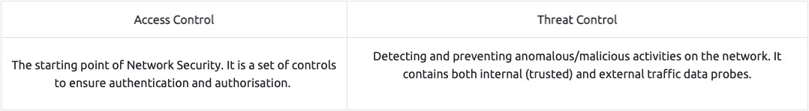
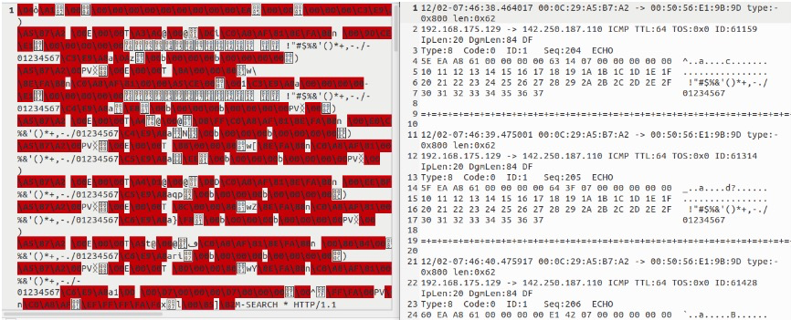

# Network Security and Traffic Analysis

## **--Traffic Analysis Essentials--**

### _**Introduction**_
Network Security is a set of operations for protecting data, applications, devices and systems connected to the network. It is accepted as one of the significant subdomains of cyber security. It focuses on the system design, operation and management of the architecture/infrastructure to provide network accessibility, integrity, continuity and reliability. Traffic analysis (often called Network Traffic Analysis) is a subdomain of the Network Security domain, and its primary focus is investigating the network data to identify problems and anomalies. 

This room will cover the foundations of Network Security and Traffic analysis and introduce the essential concepts of these disciplines to help you step into Traffic/Packet Analysis. We suggest completing the "[Network Fundamentals](https://tryhackme.com/module/network-fundamentals)" module before starting working in this room.

### _**Network Security and Network Data**_
Network Security  

The essential concern of Network Security focuses on two core concepts: authentication and authorisation. There are a variety of tools, technologies, and approaches to ensure and measure implementations of these two key concepts and go beyond to provide continuity and reliability. Network security operations contain three base control levels to ensure the maximum available security management.

Base Network Security Control Levels:

There are two main approaches and multiple elements under these control levels. The most common elements used in network security operations are explained below.

The main approaches:

The key elements of Access Control:

The key elements of Threat Control:

Typical Network Security Management Operation is explained in the given table:

Managed Security Services  

Not every organisation has enough resources to create dedicated groups for specific security domains. There are plenty of reasons for this: budget, employee skillset, and organisation size could determine how security operations are handled. At this point, Managed Security Services (MSS) come up to fulfil the required effort to ensure/enhance security needs. MSS are services that have been outsourced to service providers. These service providers are called Managed Security Service Providers (MSSPs). Today, most MSS are time and cost effective, can be conducted in-house or outsourced, are easy to engage, and ease the management process. There are various elements of MSS, and the most common ones are explained below.

### _**Traffic Analysis**_
Traffic Analysis / Network Traffic Analysis  

Traffic Analysis is a method of intercepting, recording/monitoring, and analysing network data and communication patterns to detect and respond to system health issues, network anomalies, and threats. The network is a rich data source, so traffic analysis is useful for security and operational matters. The operational issues cover system availability checks and measuring performance, and the security issues cover anomaly and suspicious activity detection on the network. 

Traffic analysis is one of the essential approaches used in network security, and it is part of multiple disciplines of network security operations listed below:

- Network Sniffing and Packet Analysis (Covered in [**Wireshark room**](https://tryhackme.com/room/wiresharkthebasics))
- Network Monitoring (Covered in [**Zeek room**](https://tryhackme.com/room/zeekbro))
- Intrusion Detection and Prevention (Covered in [**Snort room**](https://tryhackme.com/room/snort))  
    
- Network Forensics (Covered in [**NetworkMiner room**](https://tryhackme.com/room/networkminer))
- Threat Hunting (Covered in [**Brim room**](https://tryhackme.com/room/brim))

There are two main techniques used in Traffic Analysis:

Benefits of the Traffic Analysis:

- Provides full network visibility.
- Helps comprehensive baselining for asset tracking.
- Helps to detect/respond to anomalies and threats.

Does the Traffic Analysis Still Matter?  

The widespread usage of security tools/services and an increasing shift to cloud computing force attackers to modify their tactics and techniques to avoid detection. Network data is a pure and rich data source. Even if it is encoded/encrypted, it still provides a value by pointing to an odd, weird or unexpected pattern/situation. Therefore traffic analysis is still a must-to-have skill for any security analyst who wants to detect and respond to advanced threats.

Now you know what Traffic Analysis is and how it operates. Now use the static site to simulate a traffic analysis operation and find the flags.

## **--Snort--**

### _**Introduction**_
This room expects you to be familiar with basic Linux command-line functionalities like general system navigation and Network fundamentals (ports, protocols and traffic data). The room aims to encourage you to start working with Snort to analyse live and captured traffic.

Before joining this room, we suggest completing the ['Network Fundamentals'](https://tryhackme.com/module/network-fundamentals) module. If you have general knowledge of network basics and Linux fundamentals, you will be ready to begin! If you feel you need assistance in the Linux command line, you can always refer to our "Linux Fundamentals" rooms (here [1](https://tryhackme.com/room/linuxfundamentalspart1) [2](https://tryhackme.com/room/linuxfundamentalspart2) [3](https://tryhackme.com/room/linuxfundamentalspart3)); 

SNORT is an **open-source, rule-based** Network Intrusion Detection and Prevention System **(NIDS/NIPS)**. It was developed and still maintained by Martin Roesch, open-source contributors, and the Cisco Talos team. 

**[The official description](https://www.snort.org/):** *"__Snort is the foremost Open Source Intrusion Prevention System (IPS) in the world. Snort IPS uses a series of rules that help define malicious network activity and uses those rules to find packets that match against them and generate alerts for users.__"*

### _**Interactive Material and VM**_

### _**Introduction to IDS/IPS**_
Before diving into Snort and analysing traffic, let's have a brief overview of what an Intrusion Detection System (IDS) and Intrusion Prevention System (IPS) is. It is possible to configure your network infrastructure and use both of them, but before starting to use any of them, let's learn the differences.  
  
**Intrusion Detection System (IDS)**

IDS is a passive monitoring solution for detecting possible malicious activities/patterns, abnormal incidents, and policy violations. It is responsible for generating alerts for each suspicious event. 

There are two main types of IDS systems;

- Network Intrusion Detection System (NIDS) - NIDS monitors the traffic flow from various areas of the network. The aim is to investigate the traffic on the entire subnet. If a signature is identified, an alert is created.
- Host-based Intrusion Detection System (HIDS) - HIDS monitors the traffic flow from a single endpoint device. The aim is to investigate the traffic on a particular device. If a signature is identified, an alert is created.

  
Intrusion Prevention System (IPS)

IPS is an active protecting solution for preventing possible malicious activities/patterns, abnormal incidents, and policy violations. It is responsible for stopping/preventing/terminating the suspicious event as soon as the detection is performed.

 **There are four main types of IPS systems;**

- Network Intrusion Prevention System (NIPS) - NIPS monitors the traffic flow from various areas of the network. The aim is to protect the traffic on the entire subnet. If a signature is identified, the connection is terminated.
- Behaviour-based Intrusion Prevention System (Network Behaviour Analysis - NBA) - Behaviour-based systems monitor the traffic flow from various areas of the network. The aim is to protect the traffic on the entire subnet. If a signature is identified, **the connection is terminated.**

Network Behaviour Analysis System works similar to NIPS. The difference between NIPS and Behaviour-based is; behaviour based systems require a training period (also known as "baselining") to learn the normal traffic and differentiate the malicious traffic and threats. This model provides more efficient results against new threats.  

The system is trained to know the "normal" to detect "abnormal". The training period is crucial to avoid any false positives. In case of any security breach during the training period, the results will be highly problematic. Another critical point is to ensure that the system is well trained to recognise benign activities.   

- Wireless Intrusion Prevention System (WIPS) - WIPS monitors the traffic flow from of wireless network. The aim is to protect the wireless traffic and stop possible attacks launched from there. If a signature is identified, the connection is terminated.
- Host-based Intrusion Prevention System (HIPS) - HIPS actively protects the traffic flow from a single endpoint device. The aim is to investigate the traffic on a particular device. If a signature is identified, **the connection is terminated.**

HIPS working mechanism is similar to HIDS. The difference between them is that **while HIDS creates alerts for threats,** **HIPS stops the threats by terminating the connection.  
**

  
Detection/Prevention Techniques

There are three main detection and prevention techniques used in IDS and IPS solutions;

Summary  

**Phew!** That was a long ride and lots of information. Let's summarise the overall functions of the IDS and IPS in a nutshell.

- **IDS** can identify threats but require user assistance to stop them.
- **IPS** can identify and block the threats with less user assistance at the detection time.  
    

**Now let's talk about Snort. [Here is the rest of the official description](https://www.snort.org/) of the snort;**

_"__Snort can be deployed inline to stop these packets, as well. Snort has three primary uses: As a packet sniffer like tcpdump, as a packet logger — which is useful for network traffic debugging, or it can be used as a full-blown network intrusion prevention system. Snort can be downloaded and configured for personal and business use alike."_  

SNORT is an open-source, rule-based Network Intrusion Detection and Prevention System (NIDS/NIPS). It was developed and still maintained by Martin Roesch, open-source contributors, and the Cisco Talos team. 

Capabilities of Snort:
- Live traffic analysis
- Attack and probe detection
- Packet logging
- Protocol analysis
- Real-time alerting
- Modules & plugins
- Pre-processors
- Cross-platform support! (Linux & Windows)

Snort has three main use models:  
- Sniffer Mode - Read IP packets and prompt them in the console application.
- Packet Logger Mode - Log all IP packets (inbound and outbound) that visit the network.
- NIDS (Network Intrusion Detection System)  and NIPS (Network Intrusion Prevention System) Modes - Log/drop the packets that are deemed as malicious according to the user-defined rules.

### _**First Interaction with Snort**_
The First Interaction with Snort

First, let's verify snort is installed. The following command will show you the instance version.

`snort -V`

Before getting your hands dirty, we should ensure our configuration file is valid.  

Here **"-T"** is used for testing configuration, and **"-c"** is identifying the configuration file **(snort.conf)**.  
Note that it is possible to use an additional configuration file by pointing it with **"-c"**.

`sudo snort -c /etc/snort/snort.conf -T`

Once we use a configuration file, snort got much more power! The configuration file is an all-in-one management file of the snort. Rules, plugins, detection mechanisms, default actions and output settings are identified here. It is possible to have multiple configuration files for different purposes and cases but can only use one at runtime.  

Note that every time you start the Snort, it will automatically show the default banner and initial information about your setup. You can prevent this by using the "**\-q"** parameter.

### _**Operation Mode 1: Sniffer Mode**_
**Let's run Snort in Sniffer Mode**

Like tcpdump, Snort has various flags capable of viewing various data about the packet it is ingesting.  

Sniffer mode parameters are explained in the table below;

Let's start using each parameter and see the difference between them. Snort needs active traffic on your interface, so we need to generate traffic to see Snort in action.  

To do this, use **the traffic-generator** script (find this in the Task-Exercise folder)  

  
Sniffing with parameter "-i"  

Start the Snort instance in **verbose mode (-v)** and **use the interface (-i)** "eth0"; `sudo snort -v-i eth0`

In case you have only one interface, Snort uses it by default. The above example demonstrates to sniff on the interface named "eth0". Once you simulate the parameter -v, you will notice it will automatically use the "eth0" interface and prompt it.

**  
Sniffing with parameter "-v"**  

Start the Snort instance in **verbose mode (-v)**; `sudo snort -v`

Now run the traffic-generator script as sudo and start **ICMP/HTTP traffic**. Once the traffic is generated, snort will start showing the  packets in verbosity mode as follows;

As you can see in the given output, verbosity mode provides tcpdump like output information. Once we interrupt the sniffing with CTRL+C, it stops and summarises the sniffed packets.  

  
Sniffing with parameter "-d"  

Start the Snort instance in **dumping packet data mode (-d)**; `sudo snort -d`

Now run the traffic-generator script as sudo and start ICMP/HTTP traffic. Once the traffic is generated, snort will start showing the  packets in verbosity mode as follows;

As you can see in the given output, packet data payload mode covers the verbose mode and provides more data.  

  
Sniffing with parameter "-de"  

Start the Snort instance in **dump (-d)** and **link-layer header grabbing (-e)** mode; `snort -d -e`

Now run the traffic-generator script as sudo and start ICMP/HTTP traffic. Once the traffic is generated, snort will start showing the  packets in verbosity mode as follows;

Sniffing with parameter "-X"  

Start the Snort instance in **full packet dump mode (-X)**; `sudo snort -X`

Now run the traffic-generator script as sudo and start ICMP/HTTP traffic. Once the traffic is generated, snort will start showing the  packets in verbosity mode as follows;

Note that you can use the parameters both in combined and separated form as follows;**

- snort -v
- snort -vd
- snort -de
- snort -v -d -e
- snort -X

Make sure you understand and practice each parameter with different types of traffic and discover your favourite combination.

### _**Operation Mode 2: Packet Logger Mode**_
Let's run Snort in Logger Mode  

You can use Snort as a sniffer and log the sniffed packets via logger mode. You only need to use the packet logger mode parameters, and Snort does the rest to accomplish this.

Packet logger parameters are explained in the table below;

Let's start using each parameter and see the difference between them. Snort needs active traffic on your interface, so we need to generate traffic to see Snort in action.  

**  
Logfile Ownership**

Before generating logs and investigating them, we must remember the Linux file ownership and permissions. No need to deep dive into user types and permissions. The fundamental file ownership rule; **whoever creates a file becomes the owner of the corresponding file**.  

Snort needs superuser (root) rights to sniff the traffic, so once you run the snort with the "sudo" command, the "root" account will own the generated log files. Therefore you will need "root" rights to investigate the log files. There are two different approaches to investigate the generated log files;  
  

- Elevation of privileges **-** You can elevate your privileges to examine the files. You can use the "sudo" command to execute your command as a superuser with the following command `sudo command`. You can also elevate the session privileges and switch to the superuser account to examine the generated log files with the following command: `sudo su`

- Changing the ownership of files/directories - You can also change the ownership of the file/folder to read it as your user: `sudo chown username file` or `sudo chown username -R directory` The "-R" parameter helps recursively process the files and directories.

  
Logging with parameter "-l"  

First, start the Snort instance in packet logger mode; `sudo snort -dev -l .`

Now start ICMP/HTTP traffic with the traffic-generator script.  

Once the traffic is generated, Snort will start showing the packets and log them in the target directory. You can configure the default output directory in snort.config file. However, you can use the "-l" parameter to set a target directory. Identifying the default log directory is useful for continuous monitoring operations, and the "-l" parameter is much more useful for testing purposes.

The `-l .` part of the command creates the logs in the current directory. You will need to use this option to have the logs for each exercise in their folder.

`sudo snort -dev -l .`

Now, let's check the generated log file. Note that the log file names will be different in your case.

`ls .`

As you can see, it is a single all-in-one log file. It is a binary/tcpdump format log. This is what it looks like in the folder view.

Logging with parameter "-K ASCII"  

Start the Snort instance in packet logger mode; `sudo snort -dev -K ASCII`

Now run the traffic-generator script as sudo and start ICMP/HTTP traffic. Once the traffic is generated, Snort will start showing the  packets in verbosity mode as follows;

`sudo snort -dev -K ASCII -l .`

Now, let's check the generated log file.

`ls .`

The logs created with "-K ASCII" parameter is entirely different. There are two folders with IP address names. Let's look into them.

`ls ./<IP>`

Once we look closer at the created folders, we can see that the logs are in ASCII and categorised format, so it is possible to read them without using a Snort instance.

In a nutshell, ASCII mode provides multiple files in human-readable format, so it is possible to read the logs easily by using a text editor. By contrast with ASCII format, binary format is not human-readable and requires analysis using Snort or an application like tcpdump.

Let's compare the ASCII format with the binary format by opening both of them in a text editor. The difference between the binary log file and the ASCII log file is shown below. (Left side: binary format. Right side: ASCII format).

Reading generated logs with parameter "-r"  

Start the Snort instance in packet reader mode; `sudo snort -r`

`sudo snort -r snort.log.<number>`

**Note that** Snort can read and handle the binary like output (tcpdump and Wireshark also can handle this log format). However, if you create logs with "-K ASCII" parameter, Snort will not read them. As you can see in the above output, Snort read and displayed the log file just like in the sniffer mode.

Opening log file with tcpdump.

`sudo tcpdump -r snort.log.<number> -ntc 10`

"-r" parameter also allows users to filter the binary log files. **You can filter the processed log to see specific packets with the "-r" parameter and Berkeley Packet Filters (BPF).** 

- `sudo snort -r logname.log -X`
- `sudo snort -r logname.log icmp`
- `sudo snort -r logname.log tcp`
- `sudo snort -r logname.log 'udp and port 53'`

The output will be the same as the above, but only packets with the chosen protocol will be shown. Additionally, you can specify the number of processes with the parameter "-n". **The following command will process only the first 10 packets:** `snort -dvr logname.log -n 10`

Please use the following resources to understand how the BPF works and its use.  

- [https://en.wikipedia.org/wiki/Berkeley\_Packet\_Filter](https://en.wikipedia.org/wiki/Berkeley_Packet_Filter)
- [https://biot.com/capstats/bpf.html](https://biot.com/capstats/bpf.html)
- [https://www.tcpdump.org/manpages/tcpdump.1.html](https://www.tcpdump.org/manpages/tcpdump.1.html)

### _**Operation Mode 3: IDS/IPS**_
Snort in IDS/IPS Mode

Capabilities of Snort are not limited to sniffing and logging the traffic. IDS/IPS mode helps you manage the traffic according to user-defined rules.

**Note that** (N)IDS/IPS mode depends on the rules and configuration. **TASK-10** summarises the essential paths, files and variables. Also, **TASK-3** covers configuration testing. Here, we need to understand the operating logic first, and then we will be going into rules in **TASK-9**.  

  
Let's run Snort in IDS/IPS Mode  

NIDS mode parameters are explained in the table below;

Let's start using each parameter and see the difference between them. Snort needs active traffic on your interface, so we need to generate traffic to see Snort in action. To do this, use the traffic-generator script and sniff the traffic. 

**Once you start running IDS/IPS mode,** you need to use rules. As we mentioned earlier, we will use a pre-defined ICMP rule as an example. The defined rule will only generate alerts in any direction of ICMP packet activity.

`alert icmp any any <> any any  (msg: "ICMP Packet Found"; sid: 100001; rev:1;)`  

This rule is located in "/etc/snort/rules/local.rules".  

Remember, in this module, we will focus only on the operating modes. The rules are covered in TASK9&10. **Snort will create an "alert" file if the traffic flow triggers an alert.** **One last note;** once you start running IPS/IDS mode, the sniffing and logging mode will be semi-passive. However, you can activate the functions using the parameters discussed in previous tasks. **(-i, -v, -d, -e, -X, -l, -K ASCII)** If you don't remember the purpose of these commands, please revisit TASK4.

  
IDS/IPS mode with parameter "-c and -T"  

Start the Snort instance and test the configuration file. `sudo snort -c /etc/snort/snort.conf -T` This command will check your configuration file and prompt it if there is any misconfiguratioın in your current setting. You should be familiar with this command if you covered TASK3. If you don't remember the output of this command, **please revisit TASK4**.

  
IDS/IPS mode with parameter "-N"

Start the Snort instance and disable logging by running the following command: `sudo snort -c /etc/snort/snort.conf -N`

Now run the traffic-generator script as sudo and start ICMP/HTTP traffic. This command will disable logging mode. The rest of the other functions will still be available (if activated).

The command-line output will provide the information requested with the parameters. So, if you activate verbosity (-v) or full packet dump (-X) you will still have the output in the console, but there will be no logs in the log folder.  

  
IDS/IPS mode with parameter "-D"  

Start the Snort instance in background mode with the following command: `sudo snort -c /etc/snort/snort.conf -D`

Now run the traffic-generator script as sudo and start ICMP/HTTP traffic. Once the traffic is generated, snort will start processing the packets and accomplish the given task with additional parameters.

The command-line output will provide the information requested with the parameters. So, if you activate **verbosity (-v)** or **full packet dump (-X)** with **packet logger mode (-l)** you will still have the logs in the logs folder, but there will be no output in the console.

Once you start the background mode and want to check the corresponding process, you can easily use the "ps" command as shown below;

`ps -ef | grep snort`

If you want to stop the daemon, you can easily use the "kill" command to stop the process.

`sudo kill -9 <process id>`

Note that daemon mode is mainly used to automate the Snort. This parameter is mainly used in scripts to start the Snort service in the background. It is not recommended to use this mode unless you have a working knowledge of Snort and stable configuration.  

  
_IDS/IPS mode with parameter "-A"_

**Remember that there are several alert modes available in snort;**  

- console: Provides fast style alerts on the console screen.
- cmg: Provides basic header details with payload in hex and text format.
- **full:** Full alert mode, providing all possible information about the alert.  
    
- **fast:** Fast mode, shows the alert message, timestamp, source and destination ıp along with port numbers.
- **none:** Disabling alerting.  
    

In this section, only the **"console"** and **"cmg"** parameters provide alert information in the console. It is impossible to identify the difference between the rest of the alert modes via terminal. Differences can be identified by looking at generated logs. 

At the end of this section, we will compare the "full", "fast" and "none" modes. Remember that these parameters don't provide console output, so we will continue to identify the differences through log formats.  

  
_IDS/IPS mode with parameter "-A console"_

Console mode provides fast style alerts on the console screen. Start the Snort instance in **console** alert mode (-A console ) with the following command `sudo snort -c /etc/snort/snort.conf -A console`

Now run the traffic-generator script as sudo and start ICMP/HTTP traffic. Once the traffic is generated, snort will start generating alerts according to provided ruleset defined in the configuration file.

_IDS/IPS mode with parameter "-A cmg"_

Cmg mode provides basic header details with payload in hex and text format. Start the Snort instance in cmg alert mode (-A cmg ) with the following command `sudo snort -c /etc/snort/snort.conf -A cmg`

Now run the traffic-generator script as sudo and start ICMP/HTTP traffic. Once the traffic is generated, snort will start generating alerts according to provided ruleset defined in the configuration file.

**Let's compare the console and cmg outputs** before moving on to other alarm types. As you can see in the given outputs above, **console mode** provides basic header and rule information. **Cmg mode** provides full packet details along with rule information. 

  
_IDS/IPS mode with parameter "-A fast"_

Fast mode provides alert messages, timestamps, and source and destination IP addresses. **Remember, there is no console output in this mode.** Start the Snort instance in fast alert mode (-A fast ) with the following command `sudo snort -c /etc/snort/snort.conf -A fast`

Now run the traffic-generator script as sudo and start ICMP/HTTP traffic. Once the traffic is generated, snort will start generating alerts according to provided ruleset defined in the configuration file.

_IDS/IPS mode with parameter "-A full"_

Full alert mode provides all possible information about the alert. **Remember, there is no console output in this mode.** Start the Snort instance in full alert mode (-A full ) with the following command `sudo snort -c /etc/snort/snort.conf -A full`

Now run the traffic-generator script as sudo and start ICMP/HTTP traffic. Once the traffic is generated, snort will start generating alerts according to provided ruleset defined in the configuration file.

_IDS/IPS mode with parameter "-A none"_

Disable alerting. This mode doesn't create the alert file. However, it still logs the traffic and creates a log file in binary dump format. Remember, there is no console output in this mode. Start the Snort instance in none alert mode (-A none) with the following command `sudo snort -c /etc/snort/snort.conf -A none`

Now run the traffic-generator script as sudo and start ICMP/HTTP traffic. Once the traffic is generated, snort will start generating alerts according to provided ruleset defined in the configuration file.

_IDS/IPS mode: "Using rule file without configuration file"_

It is possible to run the Snort only with rules without a configuration file. Running the Snort in this mode will help you test the user-created rules. However, this mode will provide less performance.

`sudo snort -c /etc/snort/rules/local.rules -A console`

_IPS mode and dropping packets_

Snort IPS mode activated with \-Q --daq afpacket parameters. You can also activate this mode by editing snort.conf file. However, you don't need to edit snort.conf file in the scope of this room. Review the bonus task or snort manual for further information on daq and advanced configuration settings: `-Q --daq afpacket`

Activate the Data Acquisition (DAQ) modules and use the afpacket module to use snort as an IPS: `-i eth0:eth1`

Identifying interfaces note that Snort IPS require at least two interfaces to work. Now run the traffic-generator script as sudo and start ICMP/HTTP traffic.

`sudo snort -c /etc/snort/snort.conf -q -Q --daq afpacket -i eth0:eth1 -A console`

### _**Operation Mode 4: PCAP Investigation**_
