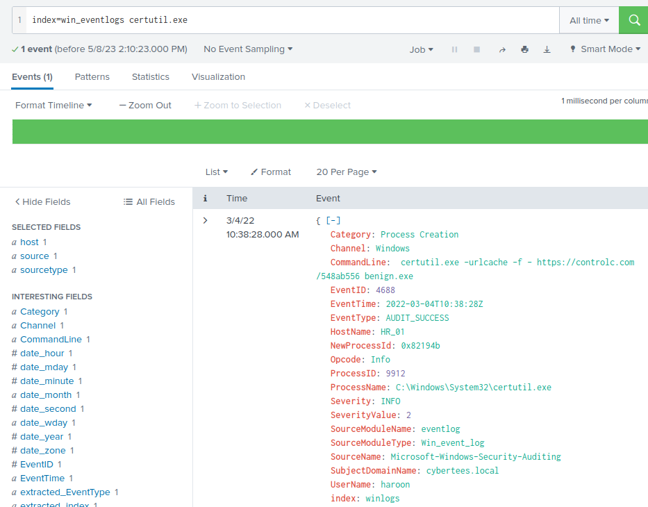

# Benign

Challenge room to investigate a compromised host with Splunk.

[Link](https://tryhackme.com/room/benign)

## _**1: Introduction**_

We will investigate host-centric logs in this challenge room to find suspicious process execution. To learn more about Splunk and how to investigate the logs, look at the rooms [splunk101](https://tryhackme.com/room/splunk101) and [splunk201](https://tryhackme.com/room/splunk201).

Room Machine

Before moving forward, deploy the machine. When you deploy the machine, it will be assigned an IP. Access this room via the AttackBox, or via the VPN at `MACHINE_IP`. The machine will take up to 3-5 minutes to start. ll the required logs are ingested in the index `win_eventlogs`.

## _**2: Scenario: Identify and Investigate an Infected Host**_

One of the client’s IDS indicated a potentially suspicious process execution indicating one of the hosts from the HR department was compromised. Some tools related to network information gathering / scheduled tasks were executed which confirmed the suspicion. Due to limited resources, we could only pull the process execution logs with Event ID: 4688 and ingested them into Splunk with the index **win\_eventlogs** for further investigation.  

About the Network Information

The network is divided into three logical segments. It will help in the investigation.  

**IT Department  
**

- James
- Moin
- Katrina

**HR department  
**

- Haroon
- Chris
- Diana

**Marketing department**

- Bell
- Amelia
- Deepak

**Questions**

How many logs are ingested from the month of March?

- open splunk web page
- click "Search & Reporting"
- enter `index=win_eventlogs` into the search box and change the time to `All time` and click the magnifying glass
- 13959 events

Imposter Alert: There seems to be an imposter account observed in the logs, what is the name of that user?

- scroll down and click on the `UserName` field then in the pop up click on `Rare values`
- at the top of the list you can see `Amel1a` only has 1 in the count field

Which user from the HR department was observed to be running scheduled tasks?

- search for `index=win_eventlogs schtasks`
- scroll down and select `UserName` and look for the HR user
- `Chris.fort`

Which user from the HR department executed a system process (LOLBIN) to download a payload from a file-sharing host.

- [LOLBAS](https://lolbas-project.github.io/)
- seach `index=win_eventlogs`
- click on `ProcessName` then click on `Rare values`
- `index=win_eventlogs| rare limit=20 ProcessName` is now in the search bar
- There are only 2 process that have a count of 1 (certutil.exe and whoami.exe). Search LOLBAS for both. 
- [certutil.exe](https://lolbas-project.github.io/lolbas/Binaries/Certutil/)
- `index=win_eventlogs certutil.exe` in the search bar
- UserName: `haroon`

To bypass the security controls, which system process (lolbin) was used to download a payload from the internet?

- This was found in the previous step. 
- `certutil.exe`

What was the date that this binary was executed by the infected host? format (YYYY-MM-DD)

- `index=win_eventlogs certutil.exe`
- EventTime: `2022-03-04T10:38:28Z`
- `2022-03-04`

Which third-party site was accessed to download the malicious payload?

- `controlc.com`

What is the name of the file that was saved on the host machine from the C2 server during the post-exploitation phase?

- `benign.exe`

The suspicious file downloaded from the C2 server contained malicious content with the pattern THM{..........}; what is that pattern?

- In the vm open a new web page `https://controlc.com/548ab556`
- `THM{KJ&*H^B0}`

What is the URL that the infected host connected to?

- `https://controlc.com/548ab556`

