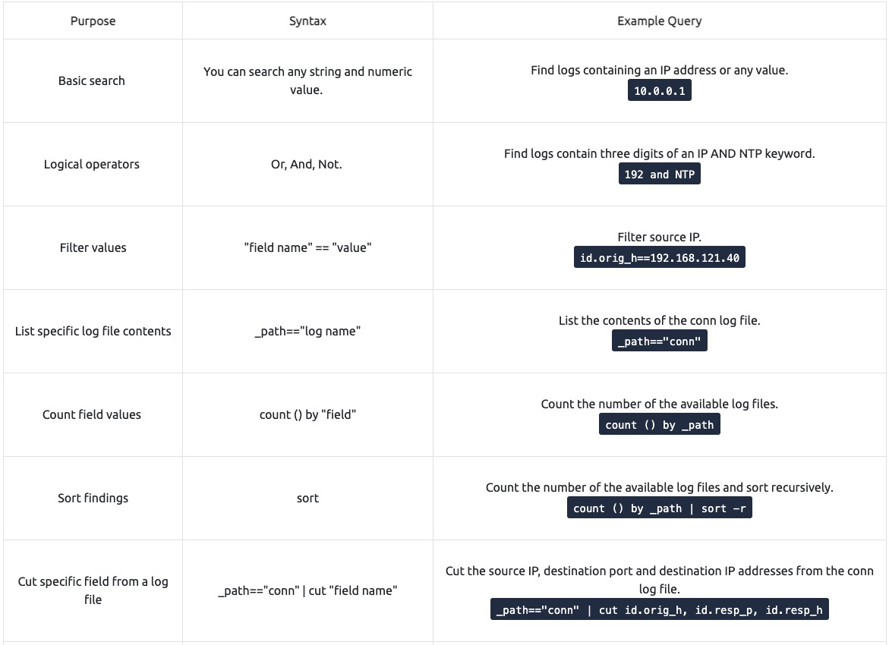
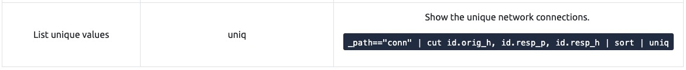

# **Brim**

## _**1: Introduction**_

[BRIM](https://www.brimdata.io/) is an open-source desktop application that processes pcap files and logs files. Its primary focus is providing search and analytics. In this room, you will learn how to use Brim, process pcap files and investigate log files to find the needle in the haystack! This room expects you to be familiar with basic security concepts and processing Zeek log files.

## _**2: What is Brim?**_

Brim is an open-source desktop application that processes pcap files and logs files, with a primary focus on providing search and analytics. It uses the Zeek log processing format. It also supports Zeek signatures and Suricata Rules for detection.

It can handle two types of data as an input;

- Packet Capture Files: Pcap files created with tcpdump, tshark and Wireshark like applications.
- Log Files: Structured log files like Zeek logs.

Brim is built on open-source platforms:

- **Zeek:** Log generating engine.
- **Zed Language:** Log querying language that allows performing keywoırd searches with filters and pipelines.
- **ZNG Data Format:** Data storage format that supports saving data streams.
- **Electron and React:** Cross-platform UI.

**Why Brim?**

Ever had to investigate a big pcap file? Pcap files bigger than one gigabyte are cumbersome for Wireshark. Processing big pcaps with tcpdump and Zeek is efficient but requires time and effort. Brim reduces the time and effort spent processing pcap files and investigating the log files by providing a simple and powerful GUI application.

**Brim vs Wireshark vs Zeek**

While each of them is powerful and useful, it is good to know the strengths and weaknesses of each tool and which one to use for the best outcome. As a traffic capture analyser, some overlapping functionalities exist, but each one has a unique value for different situations.

The common best practice is handling medium-sized pcaps with Wireshark, creating logs and correlating events with Zeek, and processing multiple logs in Brim.

## _**3: The Basics**_

**Landing Page**  

Once you open the application, the landing page loads up. The landing page has three sections and a file importing window. It also provides quick info on supported file formats.

- **Pools:** Data resources, investigated pcap and log files.
- **Queries:** List of available queries.
- **History:** List of launched queries.

**Pools and Log Details**

Pools represent the imported files. Once you load a pcap, Brim processes the file and creates Zeek logs, correlates them, and displays all available findings in a timeline, as shown in the image below.

The timeline provides information about capture start and end dates. Brim also provides information fields. You can hover over fields to have more details on the field. The above image shows a user hovering over the Zeek's conn.log file and uid value. This information will help you in creating custom queries. The rest of the log details are shown in the right pane and provides details of the log file fields. Note that you can always export the results by using the export function located near the timeline.

You can correlate each log entry by reviewing the correlation section at the log details pane (shown on the left image). This section provides information on the source and destination addresses, duration and associated log files. This quick information helps you answer the "Where to look next?" question and find the event of interest and linked evidence.  

You can also right-click on each field to filter and accomplish a list of tasks.

- Filtering values
- Counting fields
- Sorting (A-Z and Z-A)
- Viewing details 
- Performing whois lookup on IP address
- Viewing the associated packets in Wireshark

The image below demonstrates how to perform whois lookup and Wireshark packet inspection.

**Queries and History** 

Queries help us to correlate finding and find the event of the interest. History stores executed queries.

The image on the left demonstrates how to browse the queries and load a specific query from the library.  

Queries can have names, tags and descriptions. Query library lists the query names, and once you double-click, it passes the actual query to the search bar.

You can double-click on the query and execute it with ease. Once you double-click on the query, the actual query appears on the search bar and is listed under the history tab.

The results are shown under the search bar. In this case, we listed all available log sources created by Brim. In this example, we only insert a pcap file, and it automatically creates nine types of Zeek log files. 

Brim has 12 premade queries listed under the "Brim" folder. These queries help us discover the Brim query structure and accomplish quick searches from templates.  You can add new queries by clicking on the "+" button near the "Queries" menu.

**Questions**

Process the "sample.pcap" file and look at the details of the first DNS log that appear on the dashboard. What is the "qclass_name"?

- right click line with `dns` and `open details` look for qclass_name
- C_INTERNET

Look at the details of the first NTP log that appear on the dashboard. What is the "duration" value?

- 0.005

Look at the details of the STATS packet log that is visible on the dashboard. What is the "reassem_tcp_size"?

- 540

## _**4: Default Queries**_

We mentioned that Brim had 12 premade queries in the previous task. Let's see them in action! Now, open Brim, import the sample pcap and go through the walkthrough.

**Reviewing Overall Activity**

This query provides general information on the pcap file. The provided information is valuable for accomplishing further investigation and creating custom queries. It is impossible to create advanced or case-specific queries without knowing the available log files.
 
**Windows Specific Networking Activity**

This query focuses on Windows networking activity and details the source and destination addresses and named pipe, endpoint and operation detection. The provided information helps investigate and understand specific Windows events like SMB enumeration, logins and service exploiting.

**Unique Network Connections and Transferred Data**

These two queries provide information on unique connections and connection-data correlation. The provided info helps analysts detect weird and malicious connections and suspicious and beaconing activities. The uniq list provides a clear list of unique connections that help identify anomalies. The data list summarises the data transfer rate that supports the anomaly investigation hypothesis.

**DNS and HTTP Methods**

These queries provide the list of the DNS queries and HTTP methods. The provided information helps analysts to detect anomalous DNS and HTTP traffic. You can also narrow the search by viewing the "HTTP POST" requests with the available query and modifying it to view the "HTTP GET" methods.

**File Activity**

This query provides the list of the available files. It helps analysts to detect possible data leakage attempts and suspicious file activity. The query provides info on the detected file MIME and file name and hash values (MD5, SHA1).

**IP Subnet Statistics**

This query provides the list of the available IP subnets. It helps analysts detect possible communications outside the scope and identify out of ordinary IP addresses. 

**Suricata Alerts**

These queries provide information based on Suricata rule results. Three different queries are available to view the available logs in different formats (category-based, source and destination-based, and subnet based). 

**Note:** Suricata is an open-source threat detection engine that can act as a rule-based Intrusion Detection and Prevention System. It is developed by the Open Information Security Foundation (OISF). Suricata works and detects anomalies in a similar way to [**Snort**](https://tryhackme.com/room/snort) and can use the same signatures.

**Questions**

Investigate the files. What is the name of the detected GIF file?

- open file `task4-sample-b.pcap`
- click on file activity and search for the gif filename
- cat01_with_hidden_text.gif

Investigate the conn logfile. What is the number of the identified city names?

- paste into search bar and hit enter `_path=="conn" | cut geo.resp.country_code, geo.resp.region, geo.resp.city`
- double click the `geo > resp > city` column to sort
- 2

Investigate the Suricata alerts. What is the Signature id of the alert category "Potential Corporate Privacy Violation"?

- alert.category=="Potential Corporate Privacy Violation"
- right click on an alert and open details, look for alert > signature_id
- 2,102,887

## _**5: Use Cases**_

There are a variety of use case examples in traffic analysis. For a security analyst, it is vital to know the common patterns and indicators of anomaly or malicious traffic. In this task, we will cover some of them. Let's review the basics of the Brim queries before focusing on the custom and advanced ones.  

**Brim Query Reference**

|
|Purpose|Syntax|Example Query|
|Basic search|You can search any string and numeric value.|Find logs containing an IP address or any value. `10.0.0.1`|
|Logical operators| Or, And, Not. |Find logs contain three digits of an IP AND NTP keyword. `192 and NTP`|
|Filter values | "field name" == "value" | Filter source IP. `id.orig_h==192.168.121.40`|
|List specific log file contents |\_path=="log name" | List the contents of the conn log file. `_path=="conn"`|
|Count field values | count () by "field" |Count the number of the available log files. `count () by _path`|
|Sort findings | sort |Count the number of the available log files and sort recursively. `count () by _path | sort -r`|
|Cut specific field from a log | file\_path=="conn" \| cut "field name" | Cut the source IP, destination port and destination IP addresses from the conn log file. `_path=="conn" | cut id.orig_h, id.resp_p, id.resp_h`|
|List unique values | uniq | Show the unique network connections. `_path=="conn" | cut id.orig_h, id.resp_p, id.resp_h | sort | uniq`|

**Note:** It is highly suggested to use field names and filtering options and not rely on the blind/irregular search function. Brim provides great indexing of log sources, but it is not performing well in irregular search queries. The best practice is always to use the field filters to search for the event of interest.

_Communicated Hosts_

Identifying the list of communicated hosts is the first step of the investigation. Security analysts need to know which hosts are actively communicating on the network to detect any suspicious and abnormal activity in the first place. This approach will help analysts to detect possible access violations, exploitation attempts and malware infections.

Query: `_path=="conn" | cut id.orig_h, id.resp_h | sort | uniq`  

_Frequently Communicated Hosts_ 

After having the list of communicated hosts, it is important to identify which hosts communicate with each other most frequently. This will help security analysts to detect possible data exfiltration, exploitation and backdooring activities.

Query: `_path=="conn" | cut id.orig_h, id.resp_h | sort | uniq -c | sort -r`

_Most Active Ports_

Suspicious activities are not always detectable in the first place. Attackers use multiple ways of hiding and bypassing methods to avoid detection. However, since the data is evidence, it is impossible to hide the packet traces. Investigating the most active ports will help analysts to detect silent and well-hidden anomalies by focusing on the data bus and used services. 

**Query:** `_path=="conn" | cut id.resp_p, service | sort | uniq -c | sort -r count`  

Query:  `_path=="conn" | cut id.orig_h, id.resp_h, id.resp_p, service | sort id.resp_p | uniq -c | sort -r`   

_Long Connections_

For security analysts, the long connections could be the first anomaly indicator. If the client is not designed to serve a continuous service, investigating the connection duration between two IP addresses can reveal possible anomalies like backdoors.

Query: `_path=="conn" | cut id.orig_h, id.resp_p, id.resp_h, duration | sort -r duration`  

_Transferred Data_

Another essential point is calculating the transferred data size. If the client is not designed to serve and receive files and act as a file server, it is important to investigate the total bytes for each connection. Thus, analysts can distinguish possible data exfiltration or suspicious file actions like malware downloading and spreading.

Query: `_path=="conn" | put total_bytes := orig_bytes + resp_bytes | sort -r total_bytes | cut uid, id, orig_bytes, resp_bytes, total_bytes`

_DNS and HTTP Queries_

Identifying suspicious and out of ordinary domain connections and requests is another significant point for a security analyst. Abnormal connections can help detect C2 communications and possible compromised/infected hosts. Identifying the suspicious DNS queries and HTTP requests help security analysts to detect malware C2 channels and support the investigation hypothesis.  

Query: `_path=="dns" | count () by query | sort -r`  

Query: `_path=="http" | count () by uri | sort -r`

_Suspicious Hostnames_

Identifying suspicious and out of ordinary hostnames helps analysts to detect rogue hosts. Investigating the DHCP logs provides the hostname and domain information.

Query: `_path=="dhcp" | cut host_name, domain`  

_Suspicious IP Addresses_

For security analysts, identifying suspicious and out of ordinary IP addresses is essential as identifying weird domain addresses. Since the connection logs are stored in one single log file (conn), filtering IP addresses is more manageable and provides more reliable results.

Query: `_path=="conn" | put classnet := network_of(id.resp_h) | cut classnet | count() by classnet | sort -r`  

_Detect Files_

Investigating transferred files is another important point of traffic investigation. Performing this hunt will help security analysts to detect the transfer of malware or infected files by correlating the hash values. This act is also valuable for detecting transferring of sensitive files.

Query: `filename!=null`  

_SMB Activity_

Another significant point is investigating the SMB activity. This will help analysts to detect possible malicious activities like exploitation, lateral movement and malicious file sharing. When running an investigation, it is suggested to ask, "What is going on in SMB?".

Query: `_path=="dce_rpc" OR _path=="smb_mapping" OR _path=="smb_files"`

_Known Patterns_

Known patterns represent alerts generated by security solutions. These alerts are generated against the common attack/threat/malware patterns and known by endpoint security products, firewalls and IDS/IPS solutions. This data source highly relies on available signatures, attacks and anomaly patterns. Investigating available log sources containing alerts is vital for a security analyst.

Brim supports the Zeek and Suricata logs, so any anomaly detected by these products will create a log file. Investigating these log files can provide a clue where the analyst should focus.

Query: `event_type=="alert" or _path=="notice" or _path=="signatures"`

## _**Exercise: Threat Hunting with Brim | Malware C2 Detection**_

It's just another malware campaign spread with CobaltStrike. We know an employee clicks on a link, downloads a file, and then network speed issues and anomalous traffic activity arises. Now, open Brim, import the Task 6 pcap and go through the walkthrough.

 Let's investigate the traffic sample to detect malicious C2 activities!

Let's look at the available logfiles first to see what kind of data artefact we could have. The image on the left shows that we have many alternative log files we could rely on. Let's review the frequently communicated hosts before starting to investigate individual logs.

**Query:** `cut id.orig_h, id.resp_p, id.resp_h | sort  | uniq -c | sort -r count`

**Query:** `_path=="conn" | cut id.orig_h, id.resp_p, id.resp_h | sort  | uniq -c | sort -r count`

This query provides sufficient data that helped us decide where to focus. The IP addresses "10.22.xx" and "104.168.xx" draw attention in the first place. Let's look at the port numbers and available services before focusing on the suspicious IP address and narrowing our search.

**Query:** `_path=="conn" | cut id.resp_p, service | sort | uniq -c | sort -r count`

Nothing extremely odd in port numbers, but there is a massive DNS record available. Let's have a closer look.

**Query:** `_path=="dns" | count() by query | sort -r`

There are out of ordinary DNS queries. Let's enrich our findings by using [VirusTotal](https://www.virustotal.com/gui/home/search) to identify possible malicious domains.
- hashingold[.]top
- ouldmakeithapp[.]top

We have detected two additional malicious IP addresses (we have the IP 45.147.xx from the log files and gathered the 68.138.xx and 185.70.xx from VirusTotal) linked with suspicious DNS queries with the help of external research. Let's look at the HTTP requests before narrowing down our investigation with the found malicious IP addresses.

**Query:** `_path=="http" | cut id.orig_h, id.resp_h, id.resp_p, method, host, uri | uniq -c | sort value.uri`

We detect a file download request from the IP address we assumed as malicious. Let's validate this idea with [VirusTotal](https://www.virustotal.com/gui/home/search) and validate our hypothesis. 

- 104[.]168[.]44[.]45

VirusTotal results show that the IP address "104.xx" is linked with a file. Once we investigate that file, we discover that these two findings are associated with CobaltStrike. Up to here, we've followed the abnormal activity and found the malicious IP addresses. Our findings represent the C2 communication. Now let's conclude our hunt by gathering the low hanging fruits with Suricata logs.

**Query:** `event_type=="alert" | count() by alert.severity,alert.category | sort count`

Now we can see the overall malicious activities detected by Suricata. Note that you can investigate the rest of the IP addresses to identify the secondary C2 traffic anomaly without using the Suricata logs. This task demonstrates two different approaches to detecting anomalies. 

Investigating each alarm category and signature to enhance the threat hunting activities and post-hunting system hardening operations is suggested. Please note, Adversaries using CobaltStrike are usually skilled threats and don't rely on a single C2 channel. Common experience and use cases recommend digging and keeping the investigation by looking at additional C2 channels.

This concludes our hunt for the given case. Now, repeat this exercise in the attached VM and ask the questions below.

**Questions**

What is the name of the file downloaded from the CobaltStrike C2 connection?

- `_path=="http" | cut id.orig_h, id.resp_h, id.resp_p, method, host, uri | uniq -c | sort value.uri`
- 

What is the number of CobaltStrike connections using port 443?

- `id.resp_h==104.168.44.45 id.resp_p==443 |count()`
- 657 , didn't work
- `104.168.44.45 dest_port==443 |count()`
- 328

There is an additional C2 channel in used the given case. What is the name of the secondary C2 channel?

- `event_type=="alert" | cut alert.signature | sort -r | uniq -c | sort -r count`
- new search with 
- `"ET MALWARE Win32/IcedID Request Cookie"`
- IcedID

## _**7: Exercise: Threat Hunting with Brim | Crypto Mining**_

Cryptocurrencies are frequently on the agenda with their constantly rising value and legal aspect. The ability to obtain cryptocurrencies by mining other than purchasing is becoming one of the biggest problems in today's corporate environments. Attackers not only compromise the systems and ask for a ransom, but sometimes they also install mining tools (cryptojacking). Other than the attackers and threat actors, sometimes internal threats and misuse of trust and privileges end up installing coin miners in the corporate environment.

Usually, mining cases are slightly different from traditional compromising activities. Internal attacks don't typically contain major malware samples. However, this doesn't mean they aren't malicious as they are exploiting essential corporate resources like computing power, internet, and electricity. Also, crypto mining activities require third party applications and tool installations which could be vulnerable or create backdoors. Lastly, mining activities are causing network performance and stability problems. Due to these known facts, coin mining is becoming one of the common use cases of threat hunters.

Now, open Brim, import the Task 7 sample pcap and go through the walkthrough.

Let's investigate a traffic sample to detect a coin mining activity!

Let's look at the available logfiles first to see what kind of data artefact we could have. The image on the left shows that we don't have many alternative log files we could rely on. Let's review the frequently communicated hosts to see if there is an anomaly indicator.   

**Query:** `cut id.orig_h, id.resp_p, id.resp_h | sort  | uniq -c | sort -r`

**Query:** `_path=="conn" | cut id.orig_h, id.resp_p, id.resp_h | sort  | uniq -c | sort -r count`

This query provided sufficient data that helped us decide where to focus. The IP address "192.168.xx" draws attention in the first place. Let's look at the port numbers and available services before focusing on the suspicious IP address and narrowing our search.

**Query:** `_path=="conn" | cut id.resp_p, service | sort | uniq -c | sort -r count`

There is multiple weird port usage, and this is not usual. Now, we are one step closer to the identification of the anomaly. Let's look at the transferred data bytes to support our findings and find more indicators.

**Query:** `_path=="conn" | put total_bytes := orig_bytes + resp_bytes | sort -r total_bytes | cut uid, id, orig_bytes, resp_bytes, total_bytes`

The query result proves massive traffic originating from the suspicious IP address. The detected IP address is suspicious. However, we don't have many supportive log files to correlate our findings and detect accompanying activities. At this point, we will hunt the low hanging fruits with the help of Suricata rules. Let's investigate the Suricata logs.  
**Query:** `event_type=="alert" | count() by alert.severity,alert.category | sort count`

Suricata rules have helped us conclude our hunt quickly, as the alerts tell us we are investigating a "Crypto Currency Mining" activity. Let's dig deeper and discover which data pool is used for the mining activity. First, we will list the associated connection logs with the suspicious IP, and then we will run a VirusTotal search against the destination IP.

**Query:** `_path=="conn" | 192.168.1.100`

[VirusTotal](https://www.virustotal.com/gui/ip-address/103.3.62.64/relations) : search for the IP using port 9999/6666

We investigated the first destination IP address and successfully identified the mining server. In real-life cases, you may need to investigate multiple IP addresses to find the event of interest.

Lastly, let's use Suricata logs to discover mapped out MITRE ATT&CK techniques.

**Query:** `event_type=="alert" | cut alert.category, alert.metadata.mitre_technique_name, alert.metadata.mitre_technique_id, alert.metadata.mitre_tactic_name | sort | uniq -c`

Now we can identify the mapped out MITRE ATT&CK details as shown in the table below.

<table class="table table-bordered"><tbody><tr><td style="text-align:center">Suricata Category </td><td style="text-align:center"><a class="er4cLIJs glossary-term" onclick="initPopOver('MITRE', 'er4cLIJs')" href="">MITRE</a> Technique Name </td><td style="text-align:center"><a class="q5k826r0 glossary-term" onclick="initPopOver('MITRE', 'q5k826r0')" href="">MITRE</a> Technique Id </td><td style="text-align:center"><a class="GBRJTOLB glossary-term" onclick="initPopOver('MITRE', 'GBRJTOLB')" href="">MITRE</a> Tactic Name </td></tr><tr><td style="text-align:center">Crypto Currency Mining </td><td style="text-align:center">Resource_Hijacking </td><td style="text-align:center">T1496 </td><td style="text-align:center">Impact </td></tr></tbody></table>

This concludes our hunt for the given case. Now, repeat this exercise in the attached VM and ask the questions below.

**Questions**

How many connections used port 19999?

- `_path=="conn" | cut id.resp_p, service | sort | uniq -c | sort -r count`
- 22

What is the name of the service used by port 6666?

- `_path=="conn" | cut id.resp_p, service | sort | uniq -c | sort -r count`
- irc

What is the amount of transferred total bytes to "101.201.172.235:8888"?

- `_path=="conn" id.resp_h==101.201.172.235 | put total_bytes := orig_bytes + resp_bytes | sort -r total_bytes | cut uid, id, orig_bytes, resp_bytes, total_bytes`
- 3,729

What is the detected MITRE tactic id?

- Search for the Mitre Tactic ID
- `event_type=="alert" | cut alert.category, alert.metadata.mitre_technique_name, alert.metadata.mitre_tactic_id, alert.metadata.mitre_technique_id, alert.metadata.mitre_tactic_name | sort | uniq -c`
- TA0040

## _**8: Conclusion**_

Congratulations! You just finished the Brim room.  

In this room, we covered Brim, what it is, how it operates, and how to use it to investigate threats. 

Now, we invite you to complete the Brim challenge room: [**Masterminds**](https://tryhackme.com/room/mastermindsxlq)

