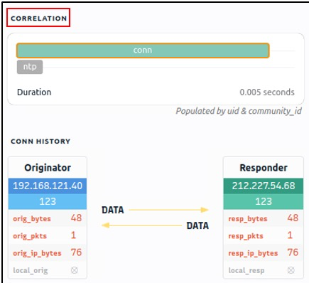

# **Brim**

## _**Introduction**_

[BRIM](https://www.brimdata.io/) is an open-source desktop application that processes pcap files and logs files. Its primary focus is providing search and analytics. In this room, you will learn how to use Brim, process pcap files and investigate log files to find the needle in the haystack! This room expects you to be familiar with basic security concepts and processing Zeek log files.

## _**What is Brim?**_

Brim is an open-source desktop application that processes pcap files and logs files, with a primary focus on providing search and analytics. It uses the Zeek log processing format. It also supports Zeek signatures and Suricata Rules for detection.

It can handle two types of data as an input;

- Packet Capture Files: Pcap files created with tcpdump, tshark and Wireshark like applications.
- Log Files: Structured log files like Zeek logs.

Brim is built on open-source platforms:

- **Zeek:** Log generating engine.
- **Zed Language:** Log querying language that allows performing keywoırd searches with filters and pipelines.
- **ZNG Data Format:** Data storage format that supports saving data streams.
- **Electron and React:** Cross-platform UI.

**Why Brim?**

Ever had to investigate a big pcap file? Pcap files bigger than one gigabyte are cumbersome for Wireshark. Processing big pcaps with tcpdump and Zeek is efficient but requires time and effort. Brim reduces the time and effort spent processing pcap files and investigating the log files by providing a simple and powerful GUI application.

**Brim vs Wireshark vs Zeek**

While each of them is powerful and useful, it is good to know the strengths and weaknesses of each tool and which one to use for the best outcome. As a traffic capture analyser, some overlapping functionalities exist, but each one has a unique value for different situations.

The common best practice is handling medium-sized pcaps with Wireshark, creating logs and correlating events with Zeek, and processing multiple logs in Brim.

## _**The Basics**_

**Landing Page**  

Once you open the application, the landing page loads up. The landing page has three sections and a file importing window. It also provides quick info on supported file formats.

- **Pools:** Data resources, investigated pcap and log files.
- **Queries:** List of available queries.
- **History:** List of launched queries.

**Pools and Log Details**

Pools represent the imported files. Once you load a pcap, Brim processes the file and creates Zeek logs, correlates them, and displays all available findings in a timeline, as shown in the image below.

The timeline provides information about capture start and end dates. Brim also provides information fields. You can hover over fields to have more details on the field. The above image shows a user hovering over the Zeek's conn.log file and uid value. This information will help you in creating custom queries. The rest of the log details are shown in the right pane and provides details of the log file fields. Note that you can always export the results by using the export function located near the timeline.

You can correlate each log entry by reviewing the correlation section at the log details pane (shown on the left image). This section provides information on the source and destination addresses, duration and associated log files. This quick information helps you answer the "Where to look next?" question and find the event of interest and linked evidence.  

You can also right-click on each field to filter and accomplish a list of tasks.

- Filtering values
- Counting fields
- Sorting (A-Z and Z-A)
- Viewing details 
- Performing whois lookup on IP address
- Viewing the associated packets in Wireshark

The image below demonstrates how to perform whois lookup and Wireshark packet inspection.

**Queries and History** 

Queries help us to correlate finding and find the event of the interest. History stores executed queries.

The image on the left demonstrates how to browse the queries and load a specific query from the library.  

Queries can have names, tags and descriptions. Query library lists the query names, and once you double-click, it passes the actual query to the search bar.

You can double-click on the query and execute it with ease. Once you double-click on the query, the actual query appears on the search bar and is listed under the history tab.

The results are shown under the search bar. In this case, we listed all available log sources created by Brim. In this example, we only insert a pcap file, and it automatically creates nine types of Zeek log files. 

Brim has 12 premade queries listed under the "Brim" folder. These queries help us discover the Brim query structure and accomplish quick searches from templates.  You can add new queries by clicking on the "+" button near the "Queries" menu.

**Questions**

Process the "sample.pcap" file and look at the details of the first DNS log that appear on the dashboard. What is the "qclass_name"?

- right click line with `dns` and `open details` look for qclass_name
- C_INTERNET

Look at the details of the first NTP log that appear on the dashboard. What is the "duration" value?

- 0.005

Look at the details of the STATS packet log that is visible on the dashboard. What is the "reassem_tcp_size"?

- 540

## _**Default Queries**_

