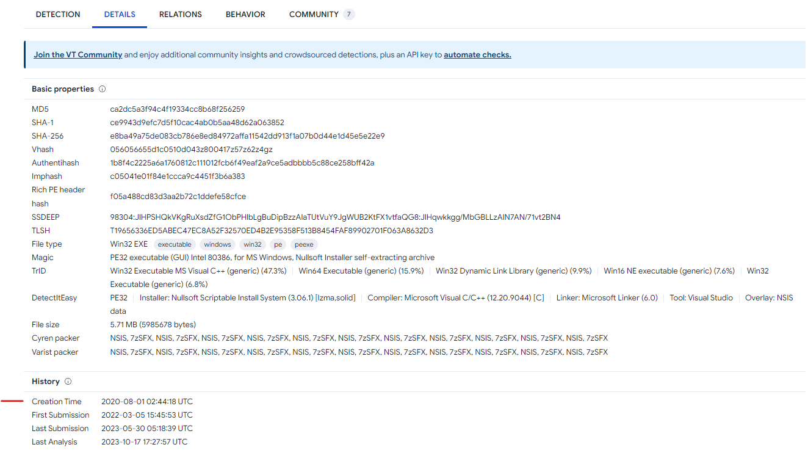

# Intro to Malware Analysis

What to do when you run into suspected malware

[Link](https://tryhackme.com/room/intromalwareanalysis)

# 1: Introduction

Every once in a while, when you are working as a SOC analyst, you will come across content (a file or traffic) that seems suspicious, and you will have to decide whether that content is malicious or not. It is normal to feel confused with all the mixed signals that such content provides. This becomes a little overwhelming for somebody who is just starting in Cybersecurity, and it is common to begin self-guessing oneself. Knowing what steps to take to resolve such a scenario is helpful. This room will lay down some steps to help you make the initial conclusion about a particular suspicious file.

Notably, in this room, you will learn:

- What is malware?
- How to start analyzing a malware
- Static and Dynamic malware analysis
- Resources to help you analyze malware

So let's get started!


# 2: Malware Analysis

## Malware

The word malware is derived from the term MALicious softWARE. Therefore, any software that has a malicious purpose can be considered malware. Malware is further classified into different categories based on its behavior. However, we will not go into the details of those in this room. Here we will ponder the steps we will take if we suspect that we found malware on a machine. So, let's get started.

## The purpose behind Malware Analysis

Malware Analysis is an important skill to have. As a quick overview, Malware Analysis is performed by the following people in the Security Industry:

- **Security Operations** teams analyze malware to write detections for malicious activity in their networks.
- **Incident Response** teams analyze malware to determine what damage has been done to an environment to remediate and revert that damage.
- **Threat Hunt** teams analyze malware to identify IOCs, which they use to hunt for malware in a network.
- **Malware Researchers** in security product vendor teams analyze malware to add detections for them in their security products.
- **Threat Research** teams in OS Vendors like Microsoft and Google analyze malware to discover the vulnerabilities exploited and add more security features to the OS/applications.

Overall, it seems like many different people do malware Analysis for many compelling reasons. So let's see how to start!

## Before we begin!

Please note that malware is like a weapon because it can produce great harm if not handled with care. For this reason, always take the following precautions while analyzing malware:

- Never analyze malware or suspected malware on a machine that does not have the sole purpose of analyzing malware.
- When not analyzing or moving malware samples around to different locations, always keep them in password-protected zip/rar or other archives so that we can avoid accidental detonation.
- Only extract the malware from this password-protected archive inside the isolated environment, and only when analyzing it.
- Create an isolated VM specifically for malware analysis, which has the capability of being reverted to a clean slate once you are done.
- Ensure that all internet connections are closed or at least monitored.
- Once you are done with malware analysis, revert the VM to its clean slate for the next malware analysis session to avoid residue from a previous malware execution corrupting the next one.

## _**Answer the questions below**_

Which team uses malware analysis to look for IOCs and hunt for malware in a network?

- Threat Hunt Team


# 3: Techniques of malware analysis

Malware Analysis is like solving a puzzle. Different tools and techniques are used to find the pieces of this puzzle, and joining those pieces gives us the complete picture of what the malware is trying o do. Most of the time, you will have an executable file (also called a binary or a PE file. PE stands for Portable Executable), a malicious document file, or a Network Packet Capture (Pcap). The Portable Executable is the most prevalent type of file analyzed while performing Malware Analysis.

To find the different puzzle pieces, you will often use various tools, tricks, and shortcuts. These techniques can be grouped into the following two categories:

- Static Analysis
- Dynamic Analysis

## Static Analysis

When malware is analyzed without being executed, it is called Static Analysis. In this case, the different properties of the PE file are analyzed without running it. Similarly, in the case of a malicious document, exploring the document's properties without analyzing it will be considered Static Analysis. Examples of static analysis include checking for strings in malware, checking the PE header for information related to different sections, or looking at the code using a disassembler. We will look at some of these techniques later in the room.

Malware often uses techniques to avoid static analysis. Some of these techniques use obfuscation, packing, or other means of hiding its properties. To circumvent these techniques, we often use dynamic analysis.

## Dynamic Analysis

Malware faces a dilemma. It has to execute to fulfill its purpose, and no matter how much obfuscation is added to the code, it becomes an easy target for detection once it runs. 

Static analysis might provide us with crucial information regarding malware, but sometimes that is not enough. We might need to run the malware in a controlled environment to observe what it does in these cases. Malware can often hide its properties to thwart Static Analysis. However, in most of those cases, Dynamic Analysis can prove fruitful. Dynamic analysis techniques include running the malware in a VM, either in a manual fashion with tools installed to monitor the malware's activity or in the form of sandboxes that perform this task automatically. We will learn about some of these techniques later in this room. Once we run the malware in a controlled environment, we can use our knowledge from the Windows Forensics rooms to identify what it did in our environment. The advantage here is that since we control the environment, we can configure it to avoid noise, like activity from a legitimate user or Windows Services. Thus, everything we observe in such an environment points to malware activity, making it easier to identify what the malware did in this scenario.

Malware, however, often uses techniques to prevent an analyst from performing dynamic analysis. Since most dynamic analysis is performed in a controlled environment, most methods to bypass dynamic analysis include detecting the environment in which it is being run. Therefore, in these cases, the malware uses a different, benign code path if it identifies that it is being run in a controlled environment.

## Advanced Malware Analysis

Advanced malware analysis techniques are used to analyze malware that evades basic static and dynamic analysis. For performing advanced malware analysis, disassemblers and debuggers are used. Disassemblers convert the malware's code from binary to assembly so that an analyst can look at the instructions of the malware statically. Debuggers attach to a program and allow the analyst to monitor the instructions in malware while it is running. A debugger allows the analyst to stop and run the malware at different points to identify interesting pieces of information while also providing an overview of the memory and CPU of the system. We will not cover advanced malware analysis in this room. However, it will be covered in a future module targeting malware analysis.

## _**Answer the questions below**_

Which technique is used for analyzing malware without executing it?

- Static Analysis

Which technique is used for analyzing malware by executing it and observing its behavior in a controlled environment?

- Dynamic Analysis


# 4: Basic Static Analysis

When analyzing a new piece of malware, the first step is usually performing basic static analysis. Basic static analysis can be considered sizing up the malware, trying to find its properties before diving deep into analysis. It provides us with an overview of what we are dealing with. Sometimes it might give us some critical information, for example, what API calls the malware is making or whether it's packed or not. However, other times, it might only give us information to help us size the malware up and give us an idea of the effort required to analyze it.

So without further ado, let's see some of the techniques we can use to perform basic static analysis.

## Caution!

Although static analysis is performed without running the malware, it is highly recommended that you perform malware analysis in an isolated Virtual Machine. You can create a clean snapshot of your Virtual Machine before performing any malware analysis and revert it to start from a clean state again after every analysis. Don't perform malware analysis on a live machine not purpose-built for malware analysis. For this room, we will be using the attached [Remnux VM](https://docs.remnux.org/). Remnux (**R**everse **E**ngineering **M**alware Li**nux**) is a Linux distribution purpose-built for malware analysis. It has many tools required for malware analysis already installed on it.

## Accessing the Attached VM:

For the following steps, we will use the attached VM. Start the machine by clicking on the Start Machine button in the top-right corner of this task.

The machine will start in the split view. Alternatively, you can access the machine using the following credentials:

## Examining the file type

Though often the file type of malware is visible in the file extension and is obvious, sometimes malware authors try to trick users by using misleading file extensions. In such scenarios, it is helpful to know how to find the actual file type of a file without depending on file extensions. In Linux, we can find the file type of a file using the `file` command. To understand what the file command does, we can read its `man page` or use the `--help` option:

`man file` or `file --help`

We will find out that it is a simple command to use. We can use the following command to find the file type of a file:

`file <filename>`

```Remnux
user@machine$ file wannacry 
wannacry: PE32 executable (GUI) Intel 80386, for MS Windows
user@machine$
```

There is a folder named `Samples` on the Desktop in the attached VM. We will be using the samples present in that folder for our analysis. The above terminal shows the `file` command being run on the 'wannacry' sample. The output shows a PE32 executable file with a Graphical User Interface, which was compiled for a system that runs Microsoft Windows with an Intel 80386-based processor. The Intel 80386 processor was one of the first 32-bit processors ever, and the instruction set designed for the 80386 is still used for 32-bit Intel processors, which is why you see "x86" processors and code. This means that the "80386" in the output above tells us that this application was designed for 32-bit Intel processors.

## Examining Strings

Another really important command that provides us with useful information about a file is the `strings` command. This command lists down the strings present in a file. To understand what the string command does, we can read its `man page` or use the `--help` option:

`man strings` or `strings --help`

We will find that it is also a simple command to use. We can use the following command to find the strings in a file:

`strings <filename>`

Looking at strings in a file can often give clues related to the behavior of malware. For example, if we see URLDownloadToFile in the output of the strings command, we will know that this malware is doing something with the URLDownloadToFile Windows API. Most likely, it is downloading a file from the internet and saving it on the disk. Similarly, strings might also provide contextual information that helps us later during malware analysis.

```Remnux
user@machine$ strings wannacry
!This program cannot be run in DOS mode.
Rich
.text
`.rdata
@.data
.rsrc
49t$
TVWj
PVVh
tE9u
.
.
.
.
 inflate 1.1.3 Copyright 1995-1998 Mark Adler
 n;^
Qkkbal
i]Wb
9a&g
MGiI
wn>Jj
#.zf
+o*7
- unzip 0.15 Copyright 1998 Gilles Vollant
CloseHandle
GetExitCodeProcess
TerminateProcess
WaitForSingleObject
CreateProcessA
GlobalFree
GetProcAddress
LoadLibraryA
GlobalAlloc
SetCurrentDirectoryA
GetCurrentDirectoryA
GetComputerNameW
SetFileTime
SetFilePointer
MultiByteToWideChar
GetFileAttributesW
GetFileSizeEx
.
.
.
.
user@machine$
```
        

Here we can see the `strings` command being run against the 'wannacry' sample. We will see that the output starts with the `DOS Stub`, which is the text that says `!This program cannot be run in DOS mode`. Some values don't make much sense and look like garbage, but you will also see useful output. For example, we can see above that some strings look like Windows APIs. For example, `CloseHandle`, `GetExitCodeProcess`, `TerminateProcess`, and so on. Similarly, we can see text that says `inflate 1.1.3 Copyright 1995-1998 Mark Adler`. A quick search shows that it is a part of the [zlib data compression](http://zlib.net/) library, this tells us that the sample might be using this library.

**Tip:** Sometimes, the output of the strings command is too big to be shown on the terminal completely. We can redirect it, write it to a file, and read it using vim or any other tool. The below terminal shows the output being redirected to a file named str:

```Remnux
user@machine$ strings wannacry>str
user@machine$
```

Alternatively, you can use the `more` or `less` command to parse the output in a more visible manner:

```Remnux
user@machine$ strings wannacry |more
!This program cannot be run in DOS mode.
Rich
.text
`.rdata
@.data
.rsrc
49t$
TVWj
PVVh
tE9u
PVVW
SVWjcf
X_^[
X_^[
^t19
QPPh
tXVP
X_^]
^t)9
X_^[]
WWWWWPj
SjJ3
X[_^
Yu#j
uSh8
Yu8S
SSh 
hn!@
SVWj@
--more--
```

We can use the space key to scroll down the list of strings here. If you are interested, [this room](https://tryhackme.com/room/malstrings) contains more information about strings.

## Calculating Hashes

File Hashing provides us with a fixed-size unique number that identifies a file. A File Hash can therefore be considered a unique identifier for a file, similar to Social Security Numbers or National Identification Numbers used for the citizens of a country. Hashing is an important concept in malware analysis. It can be used as an identifier for specific malware. As we will see later in this task, this identifier can then be shared with other analysts or searched online for information sharing purposes. Please note that a single bit of difference in two files will result in different hashes, so changing the hash of a file is as simple as changing one bit in it.

Commonly, `md5sum`, `sha1sum` and `sha256sum` hashes are used for file hashing. We can calculate file hashes by using a simple command in Linux, as shown below for the md5sum hash:

`md5sum <filename>`

```Remnux
user@machine$ md5sum wannacry 
84c82835a5d21bbcf75a61706d8ab549  wannacry
user@machine$
```
        

Above, we can see the md5sum hash is calculated for the file named 'wannacry'.

Similarly, `sha1sum` and `sha256sum` commands can be used for calculating `sha1sum` or `sha256sum` of a file (Hashes are often referred to without the 'sum' at the end, e.g. `md5` instead of `md5sum` and so on.)

If you are interested in learning more about hashes, you can check out [this room](https://tryhackme.com/room/malresearching).

## AV scans and VirusTotal

Scanning a file using AVs or searching for a hash on [VirusTotal](https://www.virustotal.com/gui/home/upload) can also provide useful information about the classification of malware performed by security researchers. However, when using an online scanner, it is recommended to search for the malware's hash instead of uploading online to avoid leaking sensitive information online. Only upload a sample if you are sure of what you are doing.

Let's see what it says about the sample we calculated the hash for above. We can search for the md5sum we calculated for the wannacry sample on the VirusTotal homepage:

  

VirusTotal has a mix of handy features. It provides scan results from 60+ AV vendors and each AV vendor's classification to the sample. 

  

The details tab lists the history of the sample, the first submission, the last submission, and the metadata of the sample.

  

Sometimes it also provides information about the behavior of a sample and its relations as seen in different environments online.

  

We can also find comments about the sample by the community on VirusTotal, which can sometimes provide additional context about the sample.


Perhaps it is very clear from the above screenshots that we are looking at a sample of wannacry ransomware.

## _**Answer the questions below**_

In the attached VM, there is a sample named 'redline' in the Desktop/Samples directory. What is the md5sum of this sample?

- `md5sum redline`
- ca2dc5a3f94c4f19334cc8b68f256259

What is the creation time of this sample?

- 2020-08-01 02:44:18 UTC
- [Link](https://www.virustotal.com/gui/file/e8ba49a75de083cb786e8ed84972affa11542dd913f1a07b0d44e1d45e5e22e9/details)




# 5: The PE file Header

