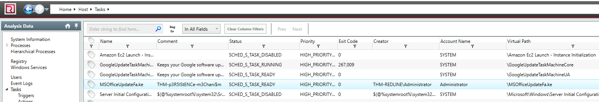
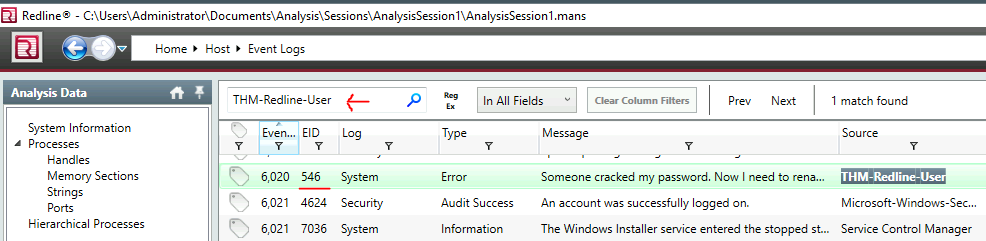
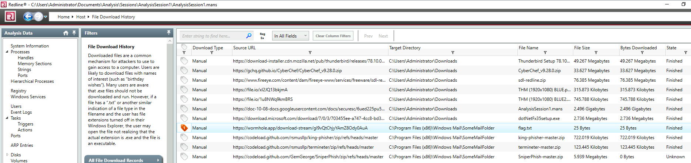
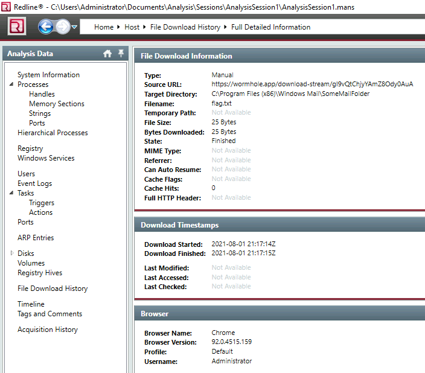
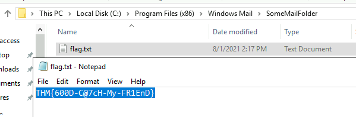

# **Redline**
   
Learn how to use Redline to perform memory analysis and to scan for IOCs on an endpoint.

[Link](https://tryhackme.com/room/btredlinejoxr3d)

# _**1: Introduction**_

Many tools can aid a security analyst or incident responder in performing memory analysis on a potentially compromised endpoint. One of the most popular tools is **[Volatility](https://tryhackme.com/room/volatility)**, which will allow an analyst to dig deep into the weeds when examining memory artifacts from an endpoint. But this process can take time. Often, when an analyst is triaging, time is of the essence, and the analyst needs to perform a quick assessment to determine the nature of a security event.

That is where the FireEye tool [**Redline**](https://www.fireeye.com/services/freeware/redline.html) comes in. Redline will essentially give an analyst a 30,000-foot view (10 kilometers high view) of a Windows, Linux, or macOS endpoint. Using Redline, you can analyze a potentially compromised endpoint through the memory dump, including various file structures. With a nice-looking GUI (Graphical User Interface) - you can easily find the signs of malicious activities. 

Here is what you can do using Redline:

- Collect registry data (Windows hosts only)
- Collect running processes
- Collect memory images (before Windows 10)
- Collect Browser History
- Look for suspicious strings
- And much more!

Installing Redline on your local machine is straightforward. Run the MSI file and follow the installation process.

Questions

Who created Redline?

- FireEye

# _**2: Data Collection**_

Now that you have the overview for Redline, let's move to the Data Collection stage.

There are three ways or options to collect data using Redline: 

  

1. Standard Collector - this method configures the script to gather a minimum amount of data for the analysis. This is going to be our preferred method to collect data in this room. It is also usually the fastest method to collect the data you need. It takes only a few minutes to complete.
2. Comprehensive Collector - this method configures the script to gather the most data from your host for further analysis. This method takes up to an hour or more. You will choose this method if you prefer the full analysis of the system.
3. IOC Search Collector (Windows only) - this method collects data that matches with the [Indicators of Compromise (IOCs)](https://www.crowdstrike.com/cybersecurity-101/indicators-of-compromise/) that you created with the help of [IOC Editor](https://www.fireeye.com/services/freeware/ioc-editor.html). You will choose this method if you want to run the data collection against known IOCs that you have gathered either through threat intelligence (data feed or narrative report), incident response, or malware analysis. You imported them into [IOC Editor](https://www.fireeye.com/services/freeware/ioc-editor.html). We'll look at the IOC Editor a bit further in the next task.

Before proceeding, launch Redline. The icon is conveniently on the taskbar. 

  

In this task, we will be using the Standard Collector method.

- From Redline, click on "Create a Standard Collector".
- You will have an option to choose the target platform. In our case, we will select **Windows**.

  

- Under the _Review Script Configuration,_ click on “Edit your script”, this is one of the crucial steps since you will be presented with the set of data to choose to collect from the host. There will be five tabs, which include **Memory, Disk, System, Network**, and **Other.**

Let's dive into some details:

Memory:

  

You can configure the script to collect memory data such as process listings, drivers enumeration (Windows hosts only), and hook detection (versions before Windows 10).

**Note**: For this exercise, uncheck **Hook Detection** and make sure **Aquire Memory Image** is also unchecked. 

Be sure to make changes to the settings in each tab as necessary to mirror the settings illustrated in the task content. 

Disk: 

This is where you can collect the data on Disks partitions and Volumes along with File Enumeration.

  

System:

The system will provide you with machine information:

- Machine and operating system (OS) information
- Analyze system restore points (Windows versions before 10 only)
- Enumerate the registry hives (Windows only)
- Obtain user accounts (Windows and OS X only)
- Obtain groups (OS X only)
- Obtain the prefetch cache (Windows only) 

  

Network:

Network Options supports Windows, OS X, and Linux platforms. You can configure the script to collect network information and browser history, which is essential when investigating the browser activities, including malicious file downloads and inbound/outbound connections. 

  

Other:

  

With this option, you can collect the data on different services and tasks running on the system, including the hashes.

- Now we are ready to proceed to the next important step. After choosing your data options - click OK. And then click on_"Browse"_ under _"Save Your Collector To"_. Why is this an important step? Because you will need to create a folder where your analysis file will be saved and the script for collecting the data you need. In our case, we are saving it to the _Analysis_ folder.

**Note**: You can choose any folder you wish but make sure that the folder is EMPTY. Complete this dialog by clicking the OK button. 

- After you choose to save the collector to the folder, you will see the Collector Instructions.

  

- If you go into the folder, you will notice the bat file under the name "RunRedlineAudit". This is the executable script to collect data from the host. The script needs to be _run as Administrator_ to be able to collect the data we need.

- Running the script will open a command prompt window; this indicates that the script is running successfully. It will close automatically when the data collection process finishes. 

**Note**: This process may take between 15-20 minutes to complete.

- After the script is finished, you will notice a new file created - AnalysisSession1 (in the **Sessions** folder) with the _.mans_ extension. This file is what we need to be able to import into Redline for investigation. Just double-click on the file to import the audit data.

  

d

**Tip**: If you run the script multiple times, the naming convention of the analysis file will increment by 1. For example, if you run the script two times, you will see **AnalysisSession1** and **AnalysisSession2**. 

Congratulations! Now you have the data you need and are ready to dive into the investigation process in the upcoming tasks. 

**Questions**

[Redline User Guide](https://fireeye.market/assets/apps/211364/documents/877936_en.pdf)

What data collection method takes the least amount of time?

- Standard Collector

You are reading a research paper on a new strain of ransomware. You want to run the data collection on your computer based on the patterns provided, such as domains, hashes, IP addresses, filenames, etc. What method would you choose to run a granular data collection against the known indicators?

- IOC Search Collector

What script would you run to initiate the data collection process? Please include the file extension. 

- RunRedlineAudit.bat

If you want to collect the data on Disks and Volumes, under which option can you find it? 

- Disk Enumeration

What cache does Windows use to maintain a preference for recently executed code? 

- prefetch
- Windows uses prefetch to maintain a reference to recently executed code. This reference is stored in the %SYSTEMROOT%\Prefetch directory.

# _**3: The Redline Interface**_

You should have your first analysis file. Double-click on the _AnalysisSession1.mans_ file and the data will be imported automatically into Redline. Please give it up to 10 minutes to get the data imported.  

When the data is imported, you will be presented with this view:

On the left panel, you will see different types of _Analysis Data;_ this is where you will perform information gathering and investigation process.

- System Information: this is where you will see the information about the machine, BIOS (Windows only), operating system, and user information.
- Processes: processes will contain different attributes such as Process Name, PID, Path, Arguments, Parent process, Username, etc. When you expand the Processes tab, there will be four sections: Handles, Memory Sections, Strings, and Ports.

A handle is a connection from a process to an object or resource in a Windows operating system. Operating systems use handles for referencing internal objects like files, registry keys, resources, etc.

Memory Sections will let you investigate unsigned memory sections used by some processes. Many processes usually use legitimate dynamic link libraries (DLLs), which will be signed. This is particularly interesting because if you see any unsigned DLLs then it will be worth taking a closer look. 

Strings \- you will see the information on the captured strings.

Ports \- this is one of the critical sections to pay attention to. Most malware often initiates the outbound or inbound connections to communicate to their command and control server (C2) to do some malicious activities like exfiltrating the data or grabbing a payload to the machine. This situation is where you can review the suspicious connections from ports and IP addresses. Pay attention to the system processes as well. The threat actors like to avoid detection by hiding under the system processes. For example, explorer.exe or notepad.exe shouldn't be on the list of processes with outbound connections. 

Some of the other important sections you need to pay attention to are:

- File System (**not included in this analysis session**)
- Registry
- Windows Services
- Tasks (Threat actors like to create scheduled tasks for persistence)
- Event Logs (this another great place to look for the suspicious Windows PowerShell events as well as the Logon/Logoff, user creation events, and others)
- ARP and Route Entries (**not included in this analysis session**)
- Browser URL History (**not included in this analysis session**)
- File Download History

The **Timeline** will help you to better understand when the compromise happened and what steps the malicious actor took to escalate the attack. The **Timeline** will also record every action on the file if it got create, changed, modified, accessed. 

  

If you know when the host compromise or suspicious activity occurred, you can use TimeWrinkles™ to filter out the timeline to only the events that took place around that time. 

  

  

TimeCrunches™ helps to reduce the excessive amount of data that is not relevant in the table view. A TimeCrunch will hide the same types of events that occurred within the same minute you specified.

  

You can find out more about each type of data analysis using the Redline User Guide: [https://www.fireeye.com/content/dam/fireeye-www/services/freeware/ug-redline.pdf](https://www.fireeye.com/content/dam/fireeye-www/services/freeware/ug-redline.pdf).  

Now you have learned some basics of different data types to help you during the investigation process. Let's go hunting and see if you can answer some of the questions in the next task.

**Questions**

Where in the Redline UI can you view information about the Logged in User?

- System Information

# _**4: Standard Collector Analysis**_

Now you should be familiar with some of the data collection terms and techniques as shown in the previous task. Armed with this knowledge, can you find what the intruder planted for you on the computer? 

**Note**: You will analyze the .mans file you imported from the previous task to answer the questions below.

I imported this one `C:\Users\Administrator\Documents\Analysis\Sessions\AnalysisSession1\`

There is another one at this location `C:\Users\Administrator\Desktop\Endpoint Investigation`

**Questions**

Provide the Operating System detected for the workstation.

- Windows Server 2019 Standard 17763

Be sure to check the rest of the System Information section for other useful data.

- N/A

What is the suspicious scheduled task that got created on the victim's computer? 

- MSOfficeUpdateFa.ke

Find the message that the intruder left for you in the task.

- THM-p3R5IStENCe-m3Chani$m

There is a new System Event ID created by an intruder with the source name "THM-Redline-User" and the Type "ERROR". Find the Event ID #.

- 546

Provide the message for the Event ID.

- Someone cracked my password. Now I need to rename my puppy-++-

It looks like the intruder downloaded a file containing the flag for Question 8. Provide the full URL of the website.

- Defanged URL `hxxps[://]wormhole[.]app/download-stream/gI9vQtChjyYAmZ8Ody0AuA`

Provide the full path to where the file was downloaded to including the filename.

- C:\Program Files (x86)\Windows Mail\SomeMailFolder\flag.txt

Provide the message the intruder left for you in the file.

- THM{600D-C@7cH-My-FR1EnD}
- Went to the folder on the VM

# _**5: IOC Search Collector**_

