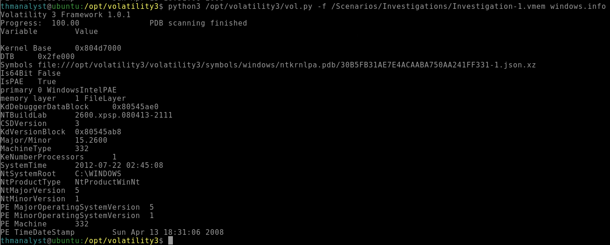
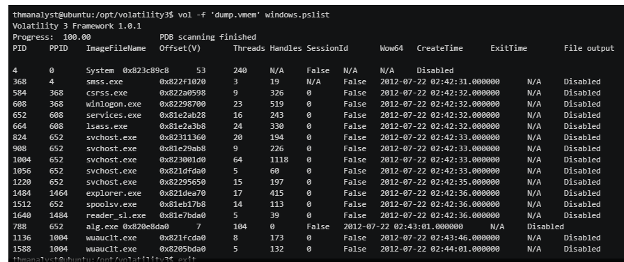
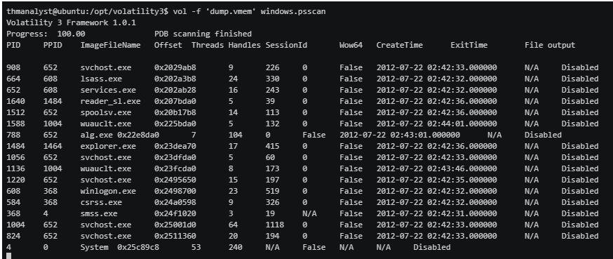
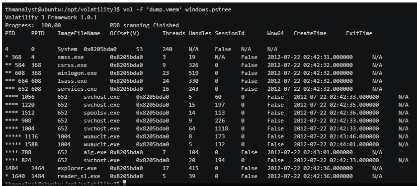
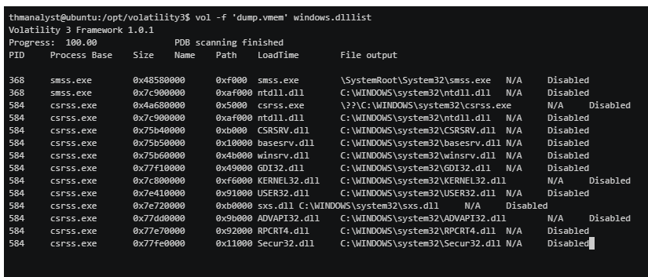
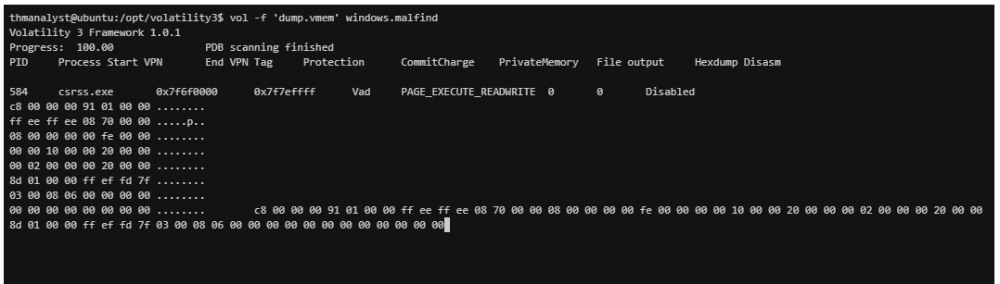

# Volatility
   
Learn how to perform memory forensics with Volatility!

[Link](https://tryhackme.com/room/volatility)

# _**1: Introduction**_

Volatility is a free memory forensics tool developed and maintained by Volatility Foundation, commonly used by malware and SOC analysts within a blue team or as part of their detection and monitoring solutions. Volatility is written in Python and is made up of python plugins and modules designed as a plug-and-play way of analyzing memory dumps.

Volatility is available for Windows, Linux, and Mac OS and is written purely in Python.

This room uses memory dumps from THM rooms and memory samples from Volatility Foundation.

Before completing this room, we recommend completing the [Core Windows Processes](https://tryhackme.com/room/btwindowsinternals) room.

If you plan on using your own machine or the AttackBox to run Volatility, download the files attached to this task. If you plan to use the provided machine, you can deploy it in Task 3.

# _**2: Volatility Overview**_

From the Volatility Foundation Wiki, "Volatility is the world's most widely used framework for extracting digital artifacts from volatile memory (RAM) samples. The extraction techniques are performed completely independent of the system being investigated but offer visibility into the runtime state of the system. The framework is intended to introduce people to the techniques and complexities associated with extracting digital artifacts from volatile memory samples and provide a platform for further work into this exciting area of research."

Volatility is built off of multiple plugins working together to obtain information from the memory dump. To begin analyzing a dump, you will first need to identify the image type; there are multiple ways of identifying this information that we will cover further in later tasks. Once you have your image type and other plugins sorted, you can then begin analyzing the dump by using various volatility plugins against it that will be covered in depth later in this room.

Since Volatility is entirely independent of the system under investigation, this allows complete segmentation but full insight into the runtime state of the system.

At the time of writing, there are two main repositories for Volatility; one built off of python 2 and another built off python 3. For this room, we recommend using the Volatility3 version build off of python 3. [https://github.com/volatilityfoundation/volatility3](https://github.com/volatilityfoundation/volatility3)  

Note: When reading blog posts and articles about Volatility, you may see volatility2 syntax mentioned or used, all syntax changed in volatility3, and within this room, we will be using the most recent version of the plugin syntax for Volatility.

# _**3: Installing Volatility**_

Since Volatility is written purely in Python, it makes the installation steps and requirements very easy and universal for Windows, Linux, and Mac. If you already attempted to use Python on Windows and Mac, it is suggested to begin on Linux; however, all operating systems will work the same.

If you're using TryHackMe's AttackBox, Volatility is already present on the box, and you can skip these steps and move on.

  

When downloading, you can make a choice to use the pre-packaged executable (.whl file) that will work the same and requires no dependencies (Windows Only), or you can decide to run it directly from Python.

To obtain a pre-packaged executable, simply download a zip file containing the application from their releases page. [https://github.com/volatilityfoundation/volatility3/releases/tag/v1.0.1](https://github.com/volatilityfoundation/volatility3/releases/tag/v1.0.1)

To begin running the project from source, you will need to first download the following dependencies: `Python 3.5.3 or later` and `Pefile 2017.8.1 or later`. [https://pypi.org/project/pefile/](https://pypi.org/project/pefile/)

You can also download these optional dependencies (recommended for this room): `yara-python 3.8.0 or later` [https://github.com/VirusTotal/yara-python](https://github.com/VirusTotal/yara-python) and `capstone 3.0.0 or later` [https://www.capstone-engine.org/download.html](https://www.capstone-engine.org/download.html).

Once you have your dependencies sorted, you can clone the repository from GitHub.

Command used: `git clone https://github.com/volatilityfoundation/volatility3.git`

You now have Volatility installed!

To test your installation run the `vol.py` file with the help parameter.

Command used: `python3 vol.py -h`

- add color to the terminal
- `export PS1="\[\033[36m\]\u\[\033[m\]@\[\033[32m\]\h:\[\033[33;1m\]\w\[\033[m\]\$ "`

It is important to note that for any Linux or Mac memory files, you will need to download the symbol files from the Volatility GitHub. [https://github.com/volatilityfoundation/volatility3#symbol-tables](https://github.com/volatilityfoundation/volatility3#symbol-tables)

We have an Ubuntu machine with Volatility and Volatility 3 already present in the /opt directory, along with all the memory files you need throughout this room. The machine will start in a split-screen view. In case the VM is not visible, use the blue Show Split View button at the top-right of the page.

# _**4: Memory Extraction**_

Extracting a memory dump can be performed in numerous ways, varying based on the requirements of your investigation. Listed below are a few of the techniques and tools that can be used to extract a memory from a bare-metal machine.

- FTK Imager
- Redline
- DumpIt.exe
- win32dd.exe / win64dd.exe
- Memoryze
- FastDump

When using an extraction tool on a bare-metal host, it can usually take a considerable amount of time; take this into consideration during your investigation if time is a constraint.

Most of the tools mentioned above for memory extraction will output a .raw file with some exceptions like Redline that can use its own agent and session structure.

  

For virtual machines, gathering a memory file can easily be done by collecting the virtual memory file from the host machine’s drive. This file can change depending on the hypervisor used; listed below are a few of the hypervisor virtual memory files you may encounter.

- VMWare - .vmem
- Hyper-V - .bin
- Parallels - .mem
- VirtualBox - .sav file \*_this is only a partial memory file_

Exercise caution whenever attempting to extract or move memory from both bare-metal and virtual machines.

# _**5: Plugins Overview**_

Since converting to Python 3, the plugin structure for Volatility has changed quite drastically. In previous Volatility versions, you would need to identify a specific OS profile exact to the operating system and build version of the host, which could be hard to find or used with a plugin that could provide false positives. With Volatility3, profiles have been scrapped, and Volatility will automatically identify the host and build of the memory file.

The naming structure of plugins has also changed. In previous versions of Volatility, the naming convention has been simply the name of the plugin and was universal for all operating systems and profiles. Now with Volatility3, you need to specify the operating system prior to specifying the plugin to be used, for example, `windows.info` vs `linux.info`. This is because there are no longer profiles to distinguish between various operating systems for plugins as each operating system has drastically different memory structures and operations. Look below for options of operating system plugin syntax.

- .windows
- .linux
- .mac

There are several plugins available with Volatility as well as third-party plugins; we will only be covering a small portion of the plugins that Volatility has to offer.

To get familiar with the plugins available, utilize the help menu. As Volatility3 is currently in active development, there is still a short list of plugins compared to its python 2 counterpart; however, the current list still allows you to do all of your analysis as needed.
- `python3 /opt/volatility3/vol.py -h`

# _**6: Identifying Image Info and Profiles**_

By default, Volatility comes with all existing Windows profiles from Windows XP to Windows 10.

Image profiles can be hard to determine if you don't know exactly what version and build the machine you extracted a memory dump from was. In some cases, you may be given a memory file with no other context, and it is up to you to figure out where to go from there. In that case, Volatility has your back and comes with the `imageinfo` plugin. This plugin will take the provided memory dump and assign it a list of the best possible OS profiles. OS profiles have since been deprecated with Volatility3, so we will only need to worry about identifying the profile if using Volatility2; this makes life much easier for analyzing memory dumps.

Note: `imageinfo` is not always correct and can have varied results depending on the provided dump; use with caution and test multiple profiles from the provided list.

If we are still looking to get information about what the host is running from the memory dump, we can use the following three plugins `windows.info` `linux.info` `mac.info`. This plugin will provide information about the host from the memory dump.

Syntax: `python3 vol.py -f <file> windows.info`

- To practice any commands in this room you can utilize either of the memory files present in the /Scenarios/Investigations/ directory or downloaded from Task 1.
- `python3 /opt/volatility3/vol.py -f /Scenarios/Investigations/Investigation-1.vmem windows.info`

# _**7: Listing Processes and Connections**_

Five different plugins within Volatility allow you to dump processes and network connections, each with varying techniques used. In this task, we will be discussing each and its pros and cons when it comes to evasion techniques used by adversaries.

The most basic way of listing processes is using `pslist`; this plugin will get the list of processes from the doubly-linked list that keeps track of processes in memory, equivalent to the process list in task manager. The output from this plugin will include all current processes and terminated processes with their exit times.

Syntax: `python3 vol.py -f <file> windows.pslist`

Some malware, typically rootkits, will, in an attempt to hide their processes, unlink itself from the list. By unlinking themselves from the list you will no longer see their processes when using `pslist`. To combat this evasion technique, we can use `psscan`;this technique of listing processes will locate processes by finding data structures that match `_EPROCESS`. While this technique can help with evasion countermeasures, it can also cause false positives.

Syntax: `python3 vol.py -f <file> windows.psscan`

The third process plugin, `pstree`, does not offer any other kind of special techniques to help identify evasion like the last two plugins; however, this plugin will list all processes based on their parent process ID, using the same methods as `pslist`. This can be useful for an analyst to get a full story of the processes and what may have been occurring at the time of extraction.

Syntax: `python3 vol.py -f <file> windows.pstree`

Now that we know how to identify processes, we also need to have a way to identify the network connections present at the time of extraction on the host machine. `netstat` will attempt to identify all memory structures with a network connection.

Syntax: `python3 vol.py -f <file> windows.netstat`

This command in the current state of volatility3 can be very unstable, particularly around old Windows builds. To combat this, you can utilize other tools like bulk\_extractor to extract a PCAP file from the memory file. In some cases, this is preferred in network connections that you cannot identify from Volatility alone. [https://tools.kali.org/forensics/bulk-extractor](https://tools.kali.org/forensics/bulk-extractor)

The last plugin we will cover is `dlllist`. This plugin will list all DLLs associated with processes at the time of extraction. This can be especially useful once you have done further analysis and can filter output to a specific DLL that might be an indicator for a specific type of malware you believe to be present on the system.

Syntax: `python3 vol.py -f <file> windows.dlllist`

# _**8: Volatility Hunting and Detection Capabilities**_

Volatility offers a plethora of plugins that can be used to aid in your hunting and detection capabilities when hunting for malware or other anomalies within a system's memory.

It is recommended that you have a basic understanding of how evasion techniques and various malware techniques are employed by adversaries, as well as how to hunt and detect them before going through this section.

The first plugin we will be talking about that is one of the most useful when hunting for code injection is `malfind`. This plugin will attempt to identify injected processes and their PIDs along with the offset address and a Hex, Ascii, and Disassembly view of the infected area. The plugin works by scanning the heap and identifying processes that have the executable bit set `RWE or RX` and/or no memory-mapped file on disk (file-less malware).

Based on what `malfind` identifies, the injected area will change. An MZ header is an indicator of a Windows executable file. The injected area could also be directed towards shellcode which requires further analysis.

Syntax: `python3 vol.py -f <file> windows.malfind`

Volatility also offers the capability to compare the memory file against YARA rules. `yarascan` will search for strings, patterns, and compound rules against a rule set. You can either use a YARA file as an argument or list rules within the command line.

Syntax: `python3 vol.py -f <file> windows.yarascan`

There are other plugins that can be considered part of Volatility's hunting and detection capabilities; however, we will be covering them in the next task.

# 9: 