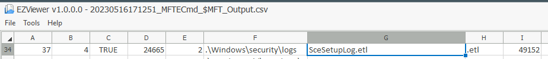
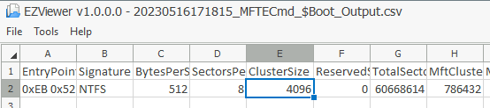

# Windows Forensics 2
   
Learn about common Windows file systems and forensic artifacts in the file systems.

[Link](https://tryhackme.com/room/windowsforensics2)

# _**1: Introduction**_

We learned about Windows Forensics in the [previous room](https://tryhackme.com/room/windowsforensics1) and practiced extracting forensic artifacts from the Windows Registry. We learned about gathering system information, user information, files and folders accessed, programs run, and external devices connected to the system, all from the Windows registry.

However, the registry is not the only place where forensic artifacts are present. In this room, we will learn about forensic artifacts in other places. We will learn about the different file systems commonly used by Windows and where to look in these file systems when looking for artifacts. We will identify locations and artifacts to prove evidence of execution, file/folder usage or knowledge, and external device usage. We will also cover the basics of recovering deleted files. We will use [Eric Zimmerman's tools](https://ericzimmerman.github.io/#!index.md) to parse information present in the artifacts for most of this room. We already used Registry Explorer and ShellBags Explorer in the previous room. For some of the tasks, we will use Autopsy.


# _**2: The FAT file systems**_

A storage device in a computer system, for example, a hard disk drive or a USB device, is just a collection of bits. To convert these bits into meaningful information, they need to be organized. For this purpose, computer scientists and engineers have created different file systems that organize the bits in a hard drive as per a standard, so that information stored in these bits can be interpreted easily.

## The File Allocation Table (FAT):

The File Allocation Table (FAT) is one of these file systems. It has been the default file system for Microsoft Operating Systems since at least the late 1970s and is still in use, though not the default anymore. As the name suggests, the File Allocation Table creates a table that indexes the location of bits that are allocated to different files. If you are interested in the history of the FAT file system, you can head to the [Wikipedia page](https://en.wikipedia.org/wiki/File_Allocation_Table) for it.

## **Data structures of the FAT file system:**

The FAT file system supports the following Data structures:

### Clusters:

A cluster is a basic storage unit of the FAT file system. Each file stored on a storage device can be considered a group of clusters containing bits of information.

### Directory:

A directory contains information about file identification, like file name, starting cluster, and filename length.

### File Allocation Table:

The File Allocation Table is a linked list of all the clusters. It contains the status of the cluster and the pointer to the next cluster in the chain.

In summary, the bits that make up a file are stored in clusters. All the filenames on a file system, their starting clusters, and their lengths are stored in directories. And the location of each cluster on the disk is stored in the File Allocation Table. We can see that we started with a raw disk composed of bits and organized it to define what group of bits refers to what file stored on the disk.

**FAT12, FAT16, and FAT32:**

The FAT file format divides the available disk space into clusters for more straightforward addressing. The number of these clusters depends on the number of bits used to address the cluster. Hence the different variations of the FAT file system. FAT was initially developed with 8-bit cluster addressing, and it was called the FAT Structure. Later, as the storage needed to be increased, FAT12, FAT16, and FAT32 were introduced. The last one of them was introduced in 1996.

Theoretically, FAT12 used 12-bit cluster addressing for a maximum of 4096 clusters(2^12). FAT16 used 16-bit cluster addressing for a maximum of 65,536 clusters (2^16). In the case of FAT32, the actual bits used to address clusters are 28, so the maximum number of clusters is actually 268,435,456 or 2^28. However, not all of these clusters are used for file storage. Some are used for administrative purposes, e.g., to store the end of a chain of clusters, the unusable parts of the disk, or other such purposes.

The following table summarizes the information as mentioned earlier and how it impacts the maximum volume and file sizes:

<table class="table table-bordered"><tbody><tr><td><b>Attribute</b></td><td><b>FAT12</b></td><td><b>FAT16</b></td><td><b>FAT32</b></td></tr><tr><td><b>Addressable bits</b></td><td>12</td><td>16</td><td>28</td></tr><tr><td><b>Max number of clusters</b></td><td>4,096</td><td>65,536</td><td>268,435,456</td></tr><tr><td><b>Supported size of clusters</b></td><td>512B - 8KB</td><td>2KB - 32KB</td><td>4KB - 32KB</td></tr><tr><td><b>Maximum Volume size</b></td><td>32MB</td><td>2GB</td><td>2TB</td></tr></tbody></table>

Even though the maximum volume size for FAT32 is 2TB, Windows limits formatting to only 32GB. However, volume sizes formatted on other OS with larger volume sizes are supported by Windows.

The chances of coming across a FAT12 filesystem are very rare nowadays. FAT16 and FAT32 are still used in some places, like USB drives, SD cards, or Digital cameras. However, the maximum volume size and the maximum file size (4GB - 1 file size for both FAT16 and FAT32) are limiting factors that have reduced their usage. 

## **The exFAT file system:**

As the file sizes have grown, especially with higher resolution images and videos being supported by the newer digital cameras, the maximum file size limit of FAT32 became a substantial limiting factor for camera manufacturers. Though Microsoft had moved on to the NTFS file system, it was not suitable for digital media devices as they did not need the added security features and the overhead that came with it. Therefore, these manufacturers lobbied Microsoft to create the exFAT file system.

The exFAT file system is now the default for SD cards larger than 32GB. It has also been adopted widely by most manufacturers of digital devices. The exFAT file system supports a cluster size of 4KB to 32MB. It has a maximum file size and a maximum volume size of 128PB (Petabytes). It also reduces some of the overheads of the FAT file system to make it lighter and more efficient. It can have a maximum of 2,796,202 files per directory.

**Questions**

How many addressable bits are there in the FAT32 file system?

- 28 bits

What is the maximum file size supported by the FAT32 file system?

- 4GB

Which file system is used by digital cameras and SD cards?

- exFAT


# _**3: The NTFS File System**_

As observed in the previous task, the FAT file system is a very basic file system. It does the job when it comes to organizing our data, but it offers little more in terms of security, reliability, and recovery capabilities. It also has certain limitations when it comes to file and volume sizes. Hence, Microsoft developed a newer file system called the New Technology File System (NTFS) to add these features. This file system was introduced in 1993 with the Windows NT 3.1. However, it became mainstream since Windows XP. The NTFS file system resolves many issues present in the FAT file system and introduces a lot of new features. We will discuss some of the features below.

### Journaling

The NTFS file system keeps a log of changes to the metadata in the volume. This feature helps the system recover from a crash or data movement due to defragmentation. This log is stored in $LOGFILE in the volume's root directory. Hence the NTFS file system is called a journaling file system.

### Access Controls

The FAT file system did not have access controls based on the user. The NTFS file system has access controls that define the owner of a file/directory and permissions for each user.

### Volume Shadow Copy

The NTFS file system keeps track of changes made to a file using a feature called Volume Shadow Copies. Using this feature, a user can restore previous file versions for recovery or system restore. In recent ransomware attacks, ransomware actors have been noted to delete the shadow copies on a victim's file systems to prevent them from recovering their data.

### Alternate Data Streams

A file is a stream of data organized in a file system. Alternate data streams (ADS) is a feature in NTFS that allows files to have multiple streams of data stored in a single file. Internet Explorer and other browsers use Alternate Data Streams to identify files downloaded from the internet (using the ADS Zone Identifier). Malware has also been observed to hide their code in ADS.

## **Master File Table**

Like the File Allocation Table, there is a Master File Table in NTFS. However, the Master File Table, or MFT, is much more extensive than the File Allocation Table. It is a structured database that tracks the objects stored in a volume. Therefore, we can say that the NTFS file system data is organized in the Master File Table. From a forensics point of view, the following are some of the critical files in the MFT:

### $MFT

The $MFT is the first record in the volume. The Volume Boot Record (VBR) points to the cluster where it is located. $MFT stores information about the clusters where all other objects present on the volume are located. This file contains a directory of all the files present on the volume.

### $LOGFILE

The $LOGFILE stores the transactional logging of the file system. It helps maintain the integrity of the file system in the event of a crash.

### $UsnJrnl

It stands for the Update Sequence Number (USN) Journal. It is present in the $Extend record. It contains information about all the files that were changed in the file system and the reason for the change. It is also called the change journal.

### MFT Explorer

MFT Explorer is one of Eric Zimmerman's tools used to explore MFT files. It is available in both command line and GUI versions. We will be using the CLI version for this task.

Start the machine attached with the task. It will open in the split view. If preferred, login to the machine through RDP using the following credentials:

Username: thm-4n6

Password: 123

Open an elevated command prompt (right-click command prompt, and click `Run as Administrator`). Navigate to the directory `C:\Users\THM-4n6\Desktop\Eztools` and run the command `MFTECmd.exe`. You will see the following options:

```
# Administrator: Command Prompt

user@machine$ MFTECmd.exe

MFTECmd version 0.5.0.1

Author: Eric Zimmerman (saericzimmerman@gmail.com)
https://github.com/EricZimmerman/MFTECmd

        f               File to process ($MFT | $J | $LogFile | $Boot | $SDS). Required
        m               $MFT file to use when -f points to a $J file (Use this to resolve parent path in $J CSV output).

        json            Directory to save JSON formatted results to. This or --csv required unless --de or --body is specified
        jsonf           File name to save JSON formatted results to. When present, overrides default name
        csv             Directory to save CSV formatted results to. This or --json required unless --de or --body is specified
        csvf            File name to save CSV formatted results to. When present, overrides default name

        body            Directory to save bodyfile formatted results to. --bdl is also required when using this option
        bodyf           File name to save body formatted results to. When present, overrides default name
        bdl             Drive letter (C, D, etc.) to use with bodyfile. Only the drive letter itself should be provided
        blf             When true, use LF vs CRLF for newlines. Default is FALSE

        dd              Directory to save exported FILE record. --do is also required when using this option
        do              Offset of the FILE record to dump as decimal or hex. Ex: 5120 or 0x1400 Use --de or --vl 1 to see offsets

        de              Dump full details for entry/sequence #. Format is 'Entry' or 'Entry-Seq' as decimal or hex. Example: 5, 624-5 or 0x270-0x5.
        fls             When true, displays contents of directory specified by --de. Ignored when --de points to a file.
        ds              Dump full details for Security Id as decimal or hex. Example: 624 or 0x270

        dt              The custom date/time format to use when displaying time stamps. Default is: yyyy-MM-dd HH:mm:ss.fffffff
        sn              Include DOS file name types. Default is FALSE
        fl              Generate condensed file listing. Requires --csv. Default is FALSE
        at              When true, include all timestamps from 0x30 attribute vs only when they differ from 0x10. Default is FALSE

        vss             Process all Volume Shadow Copies that exist on drive specified by -f . Default is FALSE
        dedupe          Deduplicate -f & VSCs based on SHA-1. First file found wins. Default is FALSE

        debug           Show debug information during processing
        trace           Show trace information during processing


Examples: MFTECmd.exe -f "C:\Temp\SomeMFT" --csv "c:\temp\out" --csvf MyOutputFile.csv
          MFTECmd.exe -f "C:\Temp\SomeMFT" --csv "c:\temp\out"
          MFTECmd.exe -f "C:\Temp\SomeMFT" --json "c:\temp\jsonout"
          MFTECmd.exe -f "C:\Temp\SomeMFT" --body "c:\temp\bout" --bdl c
          MFTECmd.exe -f "C:\Temp\SomeMFT" --de 5-5

          Short options (single letter) are prefixed with a single dash. Long commands are prefixed with two dashes
```

MFTECmd parses data from the different files created by the NTFS file system like $MFT, $Boot, etc. The above screenshot shows the available options for parsing MFT files. For parsing the $MFT file, we can use the following command:

`MFTECmd.exe -f <path-to-$MFT-file> --csv <path-to-save-results-in-csv>`

You can then use the EZviewer tool inside the EZtools folder to view the output of MFTECmd, or to view CSV files in the next tasks as well. You will see that it lists information about all the files present on the volume. You can similarly parse the $Boot file, which will provide information about the boot sector of the volume. MFTECmd doesn't support $LOGFILE as of now.

Let's parse the MFT files present on the location `C:\users\THM-4n6\Desktop\triage\C\` in the attached VM and answer the questions below. Currently, MFTECmd.exe doesn't support $Logfile.

**Questions**

Parse the $MFT file placed in C:\users\THM-4n6\Desktop\triage\C\ and analyze it. 

What is the Size of the file located at .\Windows\Security\logs\SceSetupLog.etl

- 49152
- `MFTECmd.exe -f c:\Users\THM-4n6\Desktop\triage\C\$MFT --csv c:\Users\THM-4n6\Desktop\mft.csv`
- open file in EZViewer `C:\Users\THM-4n6\Desktop\EZtools\EZViewer\EZViewer.exe`
- Ctrl + f to seach for the file name 



What is the size of the cluster for the volume from which this triage was taken?

- 4096
- `MFTECmd.exe -f c:\Users\THM-4n6\Desktop\triage\C\$Boot --csv c:\Users\THM-4n6\Desktop\boot.csv`
- open file in EZViewer `C:\Users\THM-4n6\Desktop\EZtools\EZViewer\EZViewer.exe`




# _**4: Recovering deleted files**_