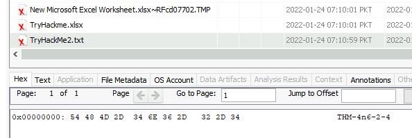
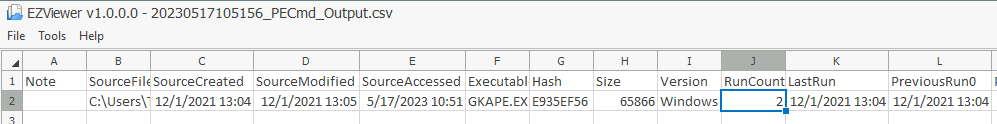
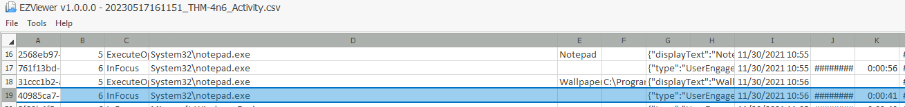
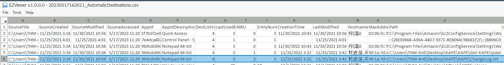
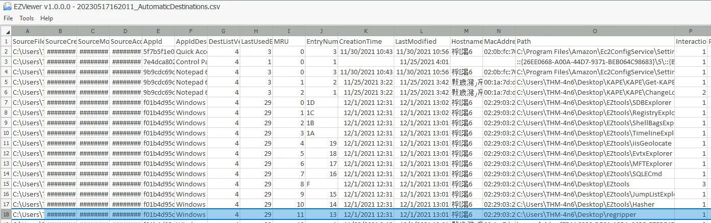

# Windows Forensics 2
   
Learn about common Windows file systems and forensic artifacts in the file systems.

[Link](https://tryhackme.com/room/windowsforensics2)

# _**1: Introduction**_

We learned about Windows Forensics in the [previous room](https://tryhackme.com/room/windowsforensics1) and practiced extracting forensic artifacts from the Windows Registry. We learned about gathering system information, user information, files and folders accessed, programs run, and external devices connected to the system, all from the Windows registry.

However, the registry is not the only place where forensic artifacts are present. In this room, we will learn about forensic artifacts in other places. We will learn about the different file systems commonly used by Windows and where to look in these file systems when looking for artifacts. We will identify locations and artifacts to prove evidence of execution, file/folder usage or knowledge, and external device usage. We will also cover the basics of recovering deleted files. We will use [Eric Zimmerman's tools](https://ericzimmerman.github.io/#!index.md) to parse information present in the artifacts for most of this room. We already used Registry Explorer and ShellBags Explorer in the previous room. For some of the tasks, we will use Autopsy.


# _**2: The FAT file systems**_

A storage device in a computer system, for example, a hard disk drive or a USB device, is just a collection of bits. To convert these bits into meaningful information, they need to be organized. For this purpose, computer scientists and engineers have created different file systems that organize the bits in a hard drive as per a standard, so that information stored in these bits can be interpreted easily.

## The File Allocation Table (FAT):

The File Allocation Table (FAT) is one of these file systems. It has been the default file system for Microsoft Operating Systems since at least the late 1970s and is still in use, though not the default anymore. As the name suggests, the File Allocation Table creates a table that indexes the location of bits that are allocated to different files. If you are interested in the history of the FAT file system, you can head to the [Wikipedia page](https://en.wikipedia.org/wiki/File_Allocation_Table) for it.

## **Data structures of the FAT file system:**

The FAT file system supports the following Data structures:

### Clusters:

A cluster is a basic storage unit of the FAT file system. Each file stored on a storage device can be considered a group of clusters containing bits of information.

### Directory:

A directory contains information about file identification, like file name, starting cluster, and filename length.

### File Allocation Table:

The File Allocation Table is a linked list of all the clusters. It contains the status of the cluster and the pointer to the next cluster in the chain.

In summary, the bits that make up a file are stored in clusters. All the filenames on a file system, their starting clusters, and their lengths are stored in directories. And the location of each cluster on the disk is stored in the File Allocation Table. We can see that we started with a raw disk composed of bits and organized it to define what group of bits refers to what file stored on the disk.

**FAT12, FAT16, and FAT32:**

The FAT file format divides the available disk space into clusters for more straightforward addressing. The number of these clusters depends on the number of bits used to address the cluster. Hence the different variations of the FAT file system. FAT was initially developed with 8-bit cluster addressing, and it was called the FAT Structure. Later, as the storage needed to be increased, FAT12, FAT16, and FAT32 were introduced. The last one of them was introduced in 1996.

Theoretically, FAT12 used 12-bit cluster addressing for a maximum of 4096 clusters(2^12). FAT16 used 16-bit cluster addressing for a maximum of 65,536 clusters (2^16). In the case of FAT32, the actual bits used to address clusters are 28, so the maximum number of clusters is actually 268,435,456 or 2^28. However, not all of these clusters are used for file storage. Some are used for administrative purposes, e.g., to store the end of a chain of clusters, the unusable parts of the disk, or other such purposes.

The following table summarizes the information as mentioned earlier and how it impacts the maximum volume and file sizes:

<table class="table table-bordered"><tbody><tr><td><b>Attribute</b></td><td><b>FAT12</b></td><td><b>FAT16</b></td><td><b>FAT32</b></td></tr><tr><td><b>Addressable bits</b></td><td>12</td><td>16</td><td>28</td></tr><tr><td><b>Max number of clusters</b></td><td>4,096</td><td>65,536</td><td>268,435,456</td></tr><tr><td><b>Supported size of clusters</b></td><td>512B - 8KB</td><td>2KB - 32KB</td><td>4KB - 32KB</td></tr><tr><td><b>Maximum Volume size</b></td><td>32MB</td><td>2GB</td><td>2TB</td></tr></tbody></table>

Even though the maximum volume size for FAT32 is 2TB, Windows limits formatting to only 32GB. However, volume sizes formatted on other OS with larger volume sizes are supported by Windows.

The chances of coming across a FAT12 filesystem are very rare nowadays. FAT16 and FAT32 are still used in some places, like USB drives, SD cards, or Digital cameras. However, the maximum volume size and the maximum file size (4GB - 1 file size for both FAT16 and FAT32) are limiting factors that have reduced their usage. 

## **The exFAT file system:**

As the file sizes have grown, especially with higher resolution images and videos being supported by the newer digital cameras, the maximum file size limit of FAT32 became a substantial limiting factor for camera manufacturers. Though Microsoft had moved on to the NTFS file system, it was not suitable for digital media devices as they did not need the added security features and the overhead that came with it. Therefore, these manufacturers lobbied Microsoft to create the exFAT file system.

The exFAT file system is now the default for SD cards larger than 32GB. It has also been adopted widely by most manufacturers of digital devices. The exFAT file system supports a cluster size of 4KB to 32MB. It has a maximum file size and a maximum volume size of 128PB (Petabytes). It also reduces some of the overheads of the FAT file system to make it lighter and more efficient. It can have a maximum of 2,796,202 files per directory.

**Questions**

How many addressable bits are there in the FAT32 file system?

- 28 bits

What is the maximum file size supported by the FAT32 file system?

- 4GB

Which file system is used by digital cameras and SD cards?

- exFAT


# _**3: The NTFS File System**_

As observed in the previous task, the FAT file system is a very basic file system. It does the job when it comes to organizing our data, but it offers little more in terms of security, reliability, and recovery capabilities. It also has certain limitations when it comes to file and volume sizes. Hence, Microsoft developed a newer file system called the New Technology File System (NTFS) to add these features. This file system was introduced in 1993 with the Windows NT 3.1. However, it became mainstream since Windows XP. The NTFS file system resolves many issues present in the FAT file system and introduces a lot of new features. We will discuss some of the features below.

### Journaling

The NTFS file system keeps a log of changes to the metadata in the volume. This feature helps the system recover from a crash or data movement due to defragmentation. This log is stored in $LOGFILE in the volume's root directory. Hence the NTFS file system is called a journaling file system.

### Access Controls

The FAT file system did not have access controls based on the user. The NTFS file system has access controls that define the owner of a file/directory and permissions for each user.

### Volume Shadow Copy

The NTFS file system keeps track of changes made to a file using a feature called Volume Shadow Copies. Using this feature, a user can restore previous file versions for recovery or system restore. In recent ransomware attacks, ransomware actors have been noted to delete the shadow copies on a victim's file systems to prevent them from recovering their data.

### Alternate Data Streams

A file is a stream of data organized in a file system. Alternate data streams (ADS) is a feature in NTFS that allows files to have multiple streams of data stored in a single file. Internet Explorer and other browsers use Alternate Data Streams to identify files downloaded from the internet (using the ADS Zone Identifier). Malware has also been observed to hide their code in ADS.

## **Master File Table**

Like the File Allocation Table, there is a Master File Table in NTFS. However, the Master File Table, or MFT, is much more extensive than the File Allocation Table. It is a structured database that tracks the objects stored in a volume. Therefore, we can say that the NTFS file system data is organized in the Master File Table. From a forensics point of view, the following are some of the critical files in the MFT:

### $MFT

The $MFT is the first record in the volume. The Volume Boot Record (VBR) points to the cluster where it is located. $MFT stores information about the clusters where all other objects present on the volume are located. This file contains a directory of all the files present on the volume.

### $LOGFILE

The $LOGFILE stores the transactional logging of the file system. It helps maintain the integrity of the file system in the event of a crash.

### $UsnJrnl

It stands for the Update Sequence Number (USN) Journal. It is present in the $Extend record. It contains information about all the files that were changed in the file system and the reason for the change. It is also called the change journal.

### MFT Explorer

MFT Explorer is one of Eric Zimmerman's tools used to explore MFT files. It is available in both command line and GUI versions. We will be using the CLI version for this task.

Start the machine attached with the task. It will open in the split view. If preferred, login to the machine through RDP using the following credentials:

Username: thm-4n6

Password: 123

Open an elevated command prompt (right-click command prompt, and click `Run as Administrator`). Navigate to the directory `C:\Users\THM-4n6\Desktop\Eztools` and run the command `MFTECmd.exe`. You will see the following options:

```
# Administrator: Command Prompt

user@machine$ MFTECmd.exe

MFTECmd version 0.5.0.1

Author: Eric Zimmerman (saericzimmerman@gmail.com)
https://github.com/EricZimmerman/MFTECmd

        f               File to process ($MFT | $J | $LogFile | $Boot | $SDS). Required
        m               $MFT file to use when -f points to a $J file (Use this to resolve parent path in $J CSV output).

        json            Directory to save JSON formatted results to. This or --csv required unless --de or --body is specified
        jsonf           File name to save JSON formatted results to. When present, overrides default name
        csv             Directory to save CSV formatted results to. This or --json required unless --de or --body is specified
        csvf            File name to save CSV formatted results to. When present, overrides default name

        body            Directory to save bodyfile formatted results to. --bdl is also required when using this option
        bodyf           File name to save body formatted results to. When present, overrides default name
        bdl             Drive letter (C, D, etc.) to use with bodyfile. Only the drive letter itself should be provided
        blf             When true, use LF vs CRLF for newlines. Default is FALSE

        dd              Directory to save exported FILE record. --do is also required when using this option
        do              Offset of the FILE record to dump as decimal or hex. Ex: 5120 or 0x1400 Use --de or --vl 1 to see offsets

        de              Dump full details for entry/sequence #. Format is 'Entry' or 'Entry-Seq' as decimal or hex. Example: 5, 624-5 or 0x270-0x5.
        fls             When true, displays contents of directory specified by --de. Ignored when --de points to a file.
        ds              Dump full details for Security Id as decimal or hex. Example: 624 or 0x270

        dt              The custom date/time format to use when displaying time stamps. Default is: yyyy-MM-dd HH:mm:ss.fffffff
        sn              Include DOS file name types. Default is FALSE
        fl              Generate condensed file listing. Requires --csv. Default is FALSE
        at              When true, include all timestamps from 0x30 attribute vs only when they differ from 0x10. Default is FALSE

        vss             Process all Volume Shadow Copies that exist on drive specified by -f . Default is FALSE
        dedupe          Deduplicate -f & VSCs based on SHA-1. First file found wins. Default is FALSE

        debug           Show debug information during processing
        trace           Show trace information during processing


Examples: MFTECmd.exe -f "C:\Temp\SomeMFT" --csv "c:\temp\out" --csvf MyOutputFile.csv
          MFTECmd.exe -f "C:\Temp\SomeMFT" --csv "c:\temp\out"
          MFTECmd.exe -f "C:\Temp\SomeMFT" --json "c:\temp\jsonout"
          MFTECmd.exe -f "C:\Temp\SomeMFT" --body "c:\temp\bout" --bdl c
          MFTECmd.exe -f "C:\Temp\SomeMFT" --de 5-5

          Short options (single letter) are prefixed with a single dash. Long commands are prefixed with two dashes
```

MFTECmd parses data from the different files created by the NTFS file system like $MFT, $Boot, etc. The above screenshot shows the available options for parsing MFT files. For parsing the $MFT file, we can use the following command:

`MFTECmd.exe -f <path-to-$MFT-file> --csv <path-to-save-results-in-csv>`

You can then use the EZviewer tool inside the EZtools folder to view the output of MFTECmd, or to view CSV files in the next tasks as well. You will see that it lists information about all the files present on the volume. You can similarly parse the $Boot file, which will provide information about the boot sector of the volume. MFTECmd doesn't support $LOGFILE as of now.

Let's parse the MFT files present on the location `C:\users\THM-4n6\Desktop\triage\C\` in the attached VM and answer the questions below. Currently, MFTECmd.exe doesn't support $Logfile.

**Questions**

Parse the $MFT file placed in C:\users\THM-4n6\Desktop\triage\C\ and analyze it. 

What is the Size of the file located at .\Windows\Security\logs\SceSetupLog.etl

- 49152
- `MFTECmd.exe -f c:\Users\THM-4n6\Desktop\triage\C\$MFT --csv c:\Users\THM-4n6\Desktop\mft.csv`
- open file in EZViewer `C:\Users\THM-4n6\Desktop\EZtools\EZViewer\EZViewer.exe`
- Ctrl + f to seach for the file name 


What is the size of the cluster for the volume from which this triage was taken?

- 4096
- `MFTECmd.exe -f c:\Users\THM-4n6\Desktop\triage\C\$Boot --csv c:\Users\THM-4n6\Desktop\boot.csv`
- open file in EZViewer `C:\Users\THM-4n6\Desktop\EZtools\EZViewer\EZViewer.exe`


# _**4: Recovering deleted files**_

## **Deleted files and Data recovery:**

Understanding the file systems makes it easier to know how files are deleted, recovered, and wiped. As we learned in the previous two tasks, a file system stores the location of a file on the disk in a table or a database. When we delete a file from the file system, the file system deletes the entries that store the file's location on the disk. For the file system, the location where the file existed is now available for writing or unallocated. However, the file contents on disk are still there, as long as they are not overwritten by the file system while copying another file or by the disk firmware while performing maintenance on the disk.

Similarly, there is data on the disk in different unallocated clusters, which can possibly be recovered. To recover this data, we have to understand the file structure of different file types to identify the specific file through the data we see in a hex editor. However, we will not cover that in this room. What we will do, is to use a tool that does this work for us and identifies deleted files in a disk image file. But what is a disk image file?

### Disk Image:

A disk image file is a file that contains a bit-by-bit copy of a disk drive. A bit-by-bit copy saves all the data in a disk image file, including the metadata, in a single file. Thus, while performing forensics, one can make several copies of the physical evidence, i.e., the disk, and use them for investigation. This helps in two ways. 1) The original evidence is not contaminated while performing forensics, and 2) The disk image file can be copied to another disk and analyzed without using specialized hardware.

### Recovering files using Autopsy

With that out of the way, let's see how we can recover deleted files from a disk. We will use Autopsy for recovering deleted files. For a room dedicated to Autopsy, you can go [here](https://tryhackme.com/room/btautopsye0).

On the attached VM, you will find an icon for Autopsy on the Desktop. Double-click it to run Autopsy. You will be greeted with the following screen:


Click on the 'New Case' Option. You will find a window similar to the following:


Enter a name to save your case by, and click Next.


You can add the required details here. For now, we can click Finish to move forward. Autopsy will perform some processing and then show the following screen. Click Next to move forward.


You will see this screen. Since we will be performing analysis on a disk image, select the topmost option, Disk Image or VM File.


It will ask you for the location of the data source.


Provide the location of the data source. You will find a disk image named 'usb.001' on the Desktop. Provide the path to that file in the above window and click next. You will see the following window:


Here, click Deselect All. These are different modules that Autopsy runs on the data for processing. For this task, we don't need any of these. If enabled, they take a lot of time to run. Click Next after clicking Deselect All. Autopsy will load the disk image. You will see the following in the left panel.


The Data Sources show the data sources that we have added to Autopsy. We can add more sources as well. The File Views and Tags menus show what Autopsy has found after processing the data. Expand the Data Sources, and click on the usb.001 device. Autopsy will show the contents of the disk image in the following way:


The contents of the disk are shown on the right side. All the files and folders present in the disk are listed in the upper tab. In the lower tab, details about the selected files are shown. There are different options to see the details here. You can check them out to find interesting information.

Notice the X mark on the last file in the screenshot above, named New Microsoft Excel Worksheet.xlsx~RFcd07702.TMP. This indicates that this is a deleted file. Deleted files will have this X mark on them. To recover a deleted file, right-click on it, and select the Extract File(s) option. 


Provide the path to save the extracted file, and you will have your deleted file recovered. Now let's see what other deleted files you can find on this disk image and answer the following questions.

**Questions**

There is another xlsx file that was deleted. What is the full name of that file?

- TryHackme.xlsx

What is the name of the TXT file that was deleted from the disk?

- TryHackMe2.txt

Recover the TXT file from Question #2. What was written in this txt file?

- THM-4n6-2-4



# _**5: Evidence of Execution**_

Now that we have learned about the File system, let's learn where to find artifacts present in the file system to perform forensic analysis. In this task, we will look into the artifacts that provide us evidence of execution:

## Windows Prefetch files

When a program is run in Windows, it stores its information for future use. This stored information is used to load the program quickly in case of frequent use. This information is stored in prefetch files which are located in the `C:\Windows\Prefetch` directory.

Prefetch files have an extension of `.pf`. Prefetch files contain the last run times of the application, the number of times the application was run, and any files and device handles used by the file. Thus it forms an excellent source of information about the last executed programs and files.

We can use Prefetch Parser (PECmd.exe) from Eric Zimmerman's tools for parsing Prefetch files and extracting data. When we run PECmd.exe in an elevated command prompt, we get this output:

```
# Administrator: Command Prompt

user@machine$ PECmd.exe

PECmd version 1.4.0.0

Author: Eric Zimmerman (saericzimmerman@gmail.com)
https://github.com/EricZimmerman/PECmd

        d               Directory to recursively process. Either this or -f is required
        f               File to process. Either this or -d is required
        k               Comma separated list of keywords to highlight in output. By default, 'temp' and 'tmp' are highlighted. Any additional keywords will be added to these.
        o               When specified, save prefetch file bytes to the given path. Useful to look at decompressed Win10 files
        q               Do not dump full details about each file processed. Speeds up processing when using --json or --csv. Default is FALSE

        json            Directory to save json representation to.
        jsonf           File name to save JSON formatted results to. When present, overrides default name
        csv             Directory to save CSV results to. Be sure to include the full path in double quotes
        csvf            File name to save CSV formatted results to. When present, overrides default name
        html            Directory to save xhtml formatted results to. Be sure to include the full path in double quotes
        dt              The custom date/time format to use when displaying timestamps. See https://goo.gl/CNVq0k for options. Default is: yyyy-MM-dd HH:mm:ss
        mp              When true, display higher precision for timestamps. Default is FALSE

        vss             Process all Volume Shadow Copies that exist on drive specified by -f or -d . Default is FALSE
        dedupe          Deduplicate -f or -d & VSCs based on SHA-1. First file found wins. Default is TRUE

        debug           Show debug information during processing
        trace           Show trace information during processing

Examples: PECmd.exe -f "C:\Temp\CALC.EXE-3FBEF7FD.pf"
          PECmd.exe -f "C:\Temp\CALC.EXE-3FBEF7FD.pf" --json "D:\jsonOutput" --jsonpretty
          PECmd.exe -d "C:\Temp" -k "system32, fonts"
          PECmd.exe -d "C:\Temp" --csv "c:\temp" --csvf foo.csv --json c:\temp\json
          PECmd.exe -d "C:\Windows\Prefetch"

          Short options (single letter) are prefixed with a single dash. Long commands are prefixed with two dashes

Either -f or -d is required. Exiting
```

To run Prefetch Parser on a file and save the results in a CSV, we can use the following command:

`PECmd.exe -f <path-to-Prefetch-files> --csv <path-to-save-csv>`  

Similarly, for parsing a whole directory, we can use the following command:

`PECmd.exe -d <path-to-Prefetch-directory> --csv <path-to-save-csv>`

We can use this information to answer the questions at the end.

## Windows 10 Timeline

Windows 10 stores recently used applications and files in an SQLite database called the Windows 10 Timeline. This data can be a source of information about the last executed programs. It contains the application that was executed and the focus time of the application. The Windows 10 timeline can be found at the following location:

`C:\Users\<username>\AppData\Local\ConnectedDevicesPlatform\{randomfolder}\ActivitiesCache.db`

We can use Eric Zimmerman's WxTCmd.exe for parsing Windows 10 Timeline. We get the following options when we run it:

```
user@machine$ WxTCmd.exe

WxTCmd version 0.6.0.0

Author: Eric Zimmerman (saericzimmerman@gmail.com)
https://github.com/EricZimmerman/WxTCmd

        f               File to process. Required
        csv             Directory to save CSV formatted results to. Be sure to include the full path in double quotes
        dt              The custom date/time format to use when displaying timestamps. See https://goo.gl/CNVq0k for options. Default is: yyyy-MM-dd HH:mm:ss

Examples: WxTCmd.exe -f "C:\Users\eric\AppData\Local\ConnectedDevicesPlatform\L.eric\ActivitiesCache.db" --csv c:\temp

          Database files are typically found at 'C:\Users\\AppData\Local\ConnectedDevicesPlatform\L.\ActivitiesCache.db'

          Short options (single letter) are prefixed with a single dash. Long commands are prefixed with two dashes

-f is required. Exiting
```

We can use the following command to run WxTCmd:

`WxTCmd.exe -f <path-to-timeline-file> --csv <path-to-save-csv>`  

## Windows Jump Lists

Windows introduced jump lists to help users go directly to their recently used files from the taskbar. We can view jumplists by right-clicking an application's icon in the taskbar, and it will show us the recently opened files in that application. This data is stored in the following directory:

`C:\Users\<username>\AppData\Roaming\Microsoft\Windows\Recent\AutomaticDestinations`

Jumplists include information about the applications executed, first time of execution, and last time of execution of the application against an AppID.

We can use Eric Zimmerman's JLECmd.exe to parse Jump Lists. We get the following options when we run it:

```
user@machine$ JLECmd.exe

JLECmd version 1.4.0.0

Author: Eric Zimmerman (saericzimmerman@gmail.com)
https://github.com/EricZimmerman/JLECmd

        d               Directory to recursively process. Either this or -f is required
        f               File to process. Either this or -d is required
        q               Only show the filename being processed vs all output. Useful to speed up exporting to json and/or csv. Default is FALSE

        all             Process all files in directory vs. only files matching *.automaticDestinations-ms or *.customDestinations-ms. Default is FALSE

        csv             Directory to save CSV formatted results to. Be sure to include the full path in double quotes
        csvf            File name to save CSV formatted results to. When present, overrides default name

        html            Directory to save xhtml formatted results to. Be sure to include the full path in double quotes
        json            Directory to save json representation to. Use --pretty for a more human readable layout
        pretty          When exporting to json, use a more human readable layout. Default is FALSE

        ld              Include more information about lnk files. Default is FALSE
        fd              Include full information about lnk files (Alternatively, dump lnk files using --dumpTo and process with LECmd). Default is FALSE

        appIds          Path to file containing AppIDs and descriptions (appid|description format). New appIds are added to the built-in list, existing appIds will have their descriptions updated
        dumpTo          Directory to save exported lnk files
        withDir         When true, show contents of Directory not accounted for in DestList entries
        Debug           Debug mode

        dt              The custom date/time format to use when displaying timestamps. See https://goo.gl/CNVq0k for options. Default is: yyyy-MM-dd HH:mm:ss
        mp              Display higher precision for timestamps. Default is FALSE

Examples: JLECmd.exe -f "C:\Temp\f01b4d95cf55d32a.customDestinations-ms" --mp
          JLECmd.exe -f "C:\Temp\f01b4d95cf55d32a.automaticDestinations-ms" --json "D:\jsonOutput" --jsonpretty
          JLECmd.exe -d "C:\CustomDestinations" --csv "c:\temp" --html "c:\temp" -q
          JLECmd.exe -d "C:\Users\e\AppData\Roaming\Microsoft\Windows\Recent" --dt "ddd yyyy MM dd HH:mm:ss.fff"

          Short options (single letter) are prefixed with a single dash. Long commands are prefixed with two dashes

Either -f or -d is required. Exiting
```

We can use the following command to parse Jumplists using JLECmd.exe:

`JLECmd.exe -f <path-to-Jumplist-file> --csv <path-to-save-csv>`  

In the folder named `triage`, present on the Desktop of the attached machine, we have extracted the Windows directory of a system we want to investigate. It retains the directory structure of the original Windows directory, that is, `C:\Windows` directory from the system is mapped on to `C:\users\thm-4n6\Desktop\triage\C\Windows`. Now let's use the information we have learned to perform analysis on the data saved in the folder named `triage` on the Desktop in the attached VM and answer the following questions.

If you are having trouble viewing the CSV file, you can use EZviewer from the EZtools folder.  

**Questions**

How many times was gkape.exe executed?

- `cd c:\Users\THM-4n6\Desktop\EZtools`
- `PECmd.exe -f C:\Users\THM-4n6\Desktop\triage\C\Windows\prefetch\GKAPE.EXE-E935EF56.pf --csv c:\Users\THM-4n6\Desktop\gkape-prefetch.csv`
- open file in EZViewer `C:\Users\THM-4n6\Desktop\EZtools\EZViewer\EZViewer.exe`
- 2



What is the last execution time of gkape.exe

- 12/01/2021 13:04

When Notepad.exe was opened on 11/30/2021 at 10:56, how long did it remain in focus?

- `WxtCmd.exe -f C:\Users\THM-4n6\Desktop\triage\C\Users\THM-4n6\AppData\Local\ConnectedDevicesPlatform\L.THM-4n6\ActivitiesCache.db --csv c:\Users\THM-4n6\Desktop\timeline.csv`
- 00:00:41



What program was used to open C:\Users\THM-4n6\Desktop\KAPE\KAPE\ChangeLog.txt?

- `JLECmd.exe -d C:\Users\THM-4n6\Desktop\triage\C\Users\THM-4n6\AppData\Roaming\Microsoft\Windows\Recent\AutomaticDestinations --csv C:\Users\THM-4n6\Desktop\jumplist.csv`
- notepad.exe




# _**6: File/folder knowledge**_

## Shortcut Files

Windows creates a shortcut file for each file opened either locally or remotely. The shortcut files contain information about the first and last opened times of the file and the path of the opened file, along with some other data. Shortcut files can be found in the following locations:

`C:\Users\<username>\AppData\Roaming\Microsoft\Windows\Recent\`

`C:\Users\<username>\AppData\Roaming\Microsoft\Office\Recent\`

We can use Eric Zimmerman's LECmd.exe (Lnk Explorer) to parse Shortcut files. When we run the LECmd.exe, we see the following options:

```
user@machine$ LECmd.exe

LECmd version 1.4.0.0

Author: Eric Zimmerman (saericzimmerman@gmail.com)
https://github.com/EricZimmerman/LECmd

        d               Directory to recursively process. Either this or -f is required
        f               File to process. Either this or -d is required
        q               Only show the filename being processed vs all output. Useful to speed up exporting to json and/or csv. Default is FALSE

        r               Only process lnk files pointing to removable drives. Default is FALSE
        all             Process all files in directory vs. only files matching *.lnk. Default is FALSE

        csv             Directory to save CSV formatted results to. Be sure to include the full path in double quotes
        csvf            File name to save CSV formatted results to. When present, overrides default name

        xml             Directory to save XML formatted results to. Be sure to include the full path in double quotes
        html            Directory to save xhtml formatted results to. Be sure to include the full path in double quotes
        json            Directory to save json representation to. Use --pretty for a more human readable layout
        pretty          When exporting to json, use a more human readable layout. Default is FALSE

        nid             Suppress Target ID list details from being displayed. Default is FALSE
        neb             Suppress Extra blocks information from being displayed. Default is FALSE

        dt              The custom date/time format to use when displaying time stamps. See https://goo.gl/CNVq0k for options. Default is: yyyy-MM-dd HH:mm:ss
        mp              Display higher precision for time stamps. Default is FALSE

Examples: LECmd.exe -f "C:\Temp\foobar.lnk"
          LECmd.exe -f "C:\Temp\somelink.lnk" --json "D:\jsonOutput" --jsonpretty
          LECmd.exe -d "C:\Temp" --csv "c:\temp" --html c:\temp --xml c:\temp\xml -q
          LECmd.exe -f "C:\Temp\some other link.lnk" --nid --neb
          LECmd.exe -d "C:\Temp" --all

          Short options (single letter) are prefixed with a single dash. Long commands are prefixed with two dashes

Either -f or -d is required. Exiting
```

We can use the following command to parse shortcut files using LECmd.exe:

`LECmd.exe -f <path-to-shortcut-files> --csv <path-to-save-csv>`  

The creation date of the shortcut file points to the date/time when the file was first opened. The date/time of modification of the shortcut file points to the last time the file was accessed.

## IE/Edge history

An interesting thing about the IE/Edge browsing history is that it includes files opened in the system as well, whether those files were opened using the browser or not. Hence, a valuable source of information on opened files in a system is the IE/Edge history. We can access the history in the following location:

`C:\Users\<username>\AppData\Local\Microsoft\Windows\WebCache\WebCacheV*.dat`

The files/folders accessed appear with a `file:///*` prefix in the IE/Edge history. Though several tools can be used to analyze Web cache data, you can use Autopsy to do so in the attached VM. For doing that, select Logical Files as a data source. 


It will then ask you to select the path from which you want files to be analyzed. You can provide the path to the triage folder.

  

In the Window where Autopsy asks about ingest modules to process data, check the box in front of 'Recent Activity' and uncheck everything else.


You will be able to view local files accessed in the Web history option in the left panel.


This is what it will look like in the right panel.

  

As shown above, the 'Data Artifacts' tab displays information about the file accessed.

## Jump Lists

As we already learned in the last task, Jump Lists create a list of the last opened files. This information can be used to identify both the last executed programs and the last opened files in a system. Remembering from the last task, Jump Lists are present at the following location:

`C:\Users\<username>\AppData\Roaming\Microsoft\Windows\Recent\AutomaticDestinations`

We have already learned about parsing Jump lists in the previous task so we won't go over that again. Let's analyze the triage data available on the following location in the attached VM to answer the questions:

`C:\Users\THM-4n6\Desktop\triage\C\`  

**Questions**

When was the folder C:\Users\THM-4n6\Desktop\regripper last opened?

- open jumplist from pervious task
- 12/1/2021 13:01

When was the above-mentioned folder first opened?

- 12/1/2021 12:31




# _**7: External Devices/USB device forensics**_

Setupapi dev logs for USB devices

When any new device is attached to a system, information related to the setup of that device is stored in the `setupapi.dev.log`. This log is present at the following location:

`C:\Windows\inf\setupapi.dev.log`

This log contains the device serial number and the first/last times when the device was connected. 

  

Here is what it looks like when opened in Notepad.exe. Notice the first line where we can see the device ID and Serial Number.

## Shortcut files

As we learned in the previous task, shortcut files are created automatically by Windows for files opened locally or remotely. These shortcut files can sometimes provide us with information about connected USB devices. It can provide us with information about the volume name, type, and serial number. Recalling from the previous task, this information can be found at:

`C:\Users\<username>\AppData\Roaming\Microsoft\Windows\Recent\`

`C:\Users\<username>\AppData\Roaming\Microsoft\Office\Recent\`

As we have already learned about parsing Shortcut files using Eric Zimmerman's LECmd.exe in a previous task, we will not go over it again. 

**Questions**

Which artifact will tell us the first and last connection times of a removable drive?

- setupapi.dev.log


# _**8: Conclusion and Further material**_

That wraps up our Windows Forensics 2 room. It's been fun learning how Microsoft Windows logs everything performed on a system.

If you haven't already, check out the [Windows Forensics 1](https://tryhackme.com/room/windowsforensics1) room for learning about the Windows registry and all the different artifacts it provides us. If you think all of this effort is a little too much and you want some of it automated, you can check out the [KAPE room](https://tryhackme.com/room/kape).


