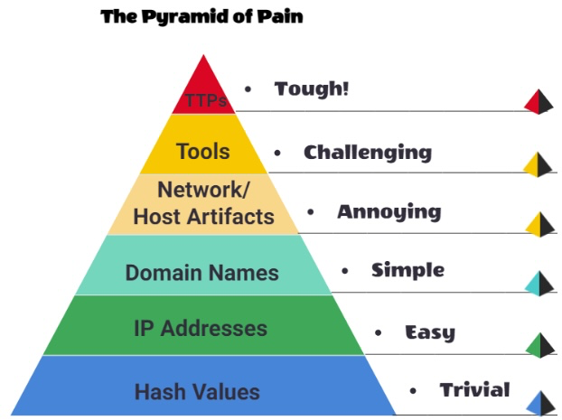
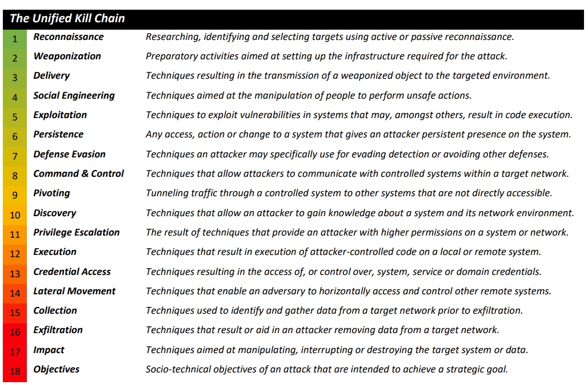
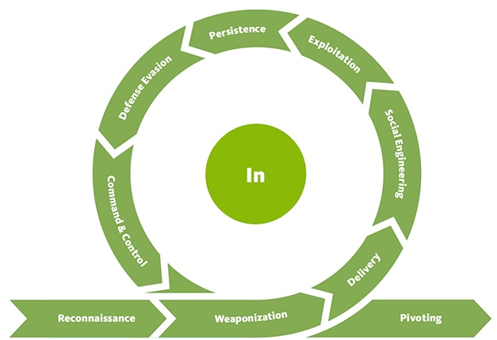
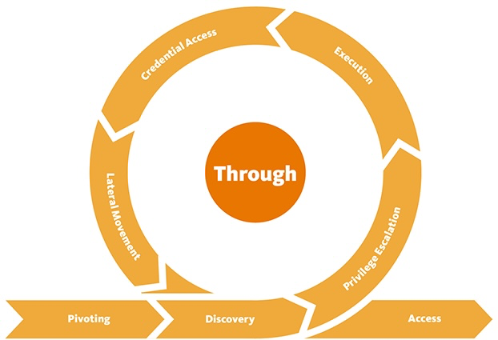
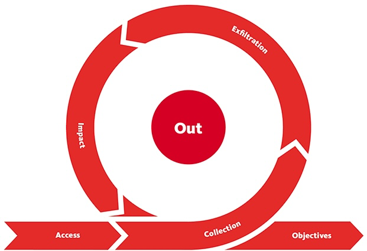

# **Cyber Defense Frameworks**

## **--Junior Security Analyst Intro--**
 
### **A career as a Junior (Associate) Security Analyst**
In the Junior Security Analyst role, you will be a Triage Specialist. You will spend a lot of time triaging or monitoring the event logs and alerts.

### **Security Operations Center**
- SOC (Security Operations Center)
- TTPs (Tactics, Techniques, and Procedures)
- CISA (Cybersecurity & Infrastructure Security Agency)
- SIEM (Security information and event management)
- EDR (endpoint detection and response)

### **A day In the life of a Junior (Associate) Security Analyst**
- IPS (intrusion prevention system)
- IDS (intrusion detection system)

There are many open-source databases out there like AbuseIPDB, Cisco Talos Intelligence, where you can perform a reputation and location check for the IP address.

## **--Pyramid of Pain--**
This well-renowned concept is being applied to cybersecurity solutions like [Cisco Security](https://gblogs.cisco.com/ca/2020/08/26/the-canadian-bacon-cisco-security-and-the-pyramid-of-pain/), [SentinelOne](https://www.sentinelone.com/blog/revisiting-the-pyramid-of-pain-leveraging-edr-data-to-improve-cyber-threat-intelligence/), and [SOCRadar](https://socradar.io/re-examining-the-pyramid-of-pain-to-use-cyber-threat-intelligence-more-effectively/) to improve the effectiveness of CTI (Cyber Threat Intelligence), threat hunting, and incident response exercises.

### **Hash Values**
Hash Values are a numeric value of a fixed length that uniquely identifies data

- MD5 (Message Digest, defined by [RFC 1321](https://www.ietf.org/rfc/rfc1321.txt))
- SHA-1 (Secure Hash Algorithm 1, defined by [RFC 3174](https://tools.ietf.org/html/rfc3174))
- SHA-2 (Secure Hash Algorithm 2)

Check out [The DFIR Report](https://thedfirreport.com/) and [FireEye Threat Research Blogs](https://www.fireeye.com/blog/threat-research.html) for examples.

Various online tools can be used to do hash lookups like [VirusTotal](https://www.virustotal.com/gui/) and [Metadefender Cloud - OPSWAT](https://metadefender.opswat.com/?lang=en).

- IOC (indicatior of compromise)

### **IP Address**
Fast Flux is a DNS technique used by botnets to hide phishing, web proxying, malware delivery, and malware communication activities behind compromised hosts acting as proxies.

### **Domain Names**
Domain Names can be thought as simply mapping an IP address to a string of text.

- DNS (domain name system)

Punnycode attack: Punycode is a way of converting words that cannot be written in ASCII, into a Unicode ASCII encoding.

Attackers can hide the malicious domains under **URL Shorteners.** A URL Shortener is a tool that creates a short and unique URL that will redirect to the specific website specified during the initial step of setting up the URL Shortener link. Attackers can use the following URL Shortening services to generate malicious links: 

- bit.ly
- goo.gl
- ow.ly
- s.id
- smarturl.it
- tiny.pl
- tinyurl.com
- x.co

You can see the actual website the shortened link is redirecting you to by appending "+" to it (see the examples below). Type the shortened URL in the address bar of the web browser and add the above characters to see the redirect URL.

### **Host Artifacts**
Host artifacts are the traces or observables that attackers leave on the system, such as registry values, suspicious process execution, attack patterns or IOCs (Indicators of Compromise), files dropped by malicious applications, or anything exclusive to the current threat.

### **Network Artifacts**
A network artifact can be a user-agent string, C2 information, or URI patterns followed by the HTTP POST requests.An attacker might use a User-Agent string that hasn’t been observed in your environment before or seems out of the ordinary. The User-Agent is defined by [RFC2616](https://datatracker.ietf.org/doc/html/rfc2616#page-145) as the request-header field that contains the information about the user agent originating the request.

[Any Run](https://any.run/)

### **Tools**
- C2 (command and control infrastructure)

Attackers would use the utilities to create malicious macro documents (maldocs) for spearphishing attempts, a backdoor that can be used to establish C2 (Command and Control Infrastructure), any custom .EXE, and .DLL files, payloads, or password crackers.

[MalwareBazaar](https://bazaar.abuse.ch/) and [Malshare](https://malshare.com/) are good resources to provide you with access to the samples, malicious feeds, and YARA results

For detection rules, [SOC Prime Threat Detection Marketplace](https://tdm.socprime.com/) is a great platform, where security professionals share their detection rules for different kinds of threats including the latest CVE's that are being exploited in the wild by adversaries.

Fuzzy hashing is also a strong weapon against the attacker's tools.
One of the examples of fuzzy hashing is the usage of [SSDeep](https://ssdeep-project.github.io/ssdeep/index.html)

### **TTPs**
TTPs stands for Tactics, Techniques & Procedures. This includes the whole [MITRE](https://attack.mitre.org/) [ATT&CK Matrix](https://attack.mitre.org/), which means all the steps taken by an adversary to achieve his goal, starting from phishing attempts to persistence and data exfiltration. 

If you can detect and respond to the TTPs quickly, you leave the adversaries almost no chance to fight back. For, example if you could detect a [Pass-the-Hash](https://www.beyondtrust.com/resources/glossary/pass-the-hash-pth-attack) attack using Windows Event Log Monitoring and remediate it, you would be able to find the compromised host very quickly and stop the lateral movement inside your network.

### _**Practical: The Pyramid of Pain**_
this is broken and won't complete. just click through.

### **Conclusion**
Now you have learned the concept of the Pyramid of Pain. Maybe it is time to apply this in practice. Please, navigate to the Static Site to perform the exercise.   

You can pick any APT (Advanced Persistent Threat Groups) as another exercise. A good place to look at would be [FireEye Advanced Persistent Threat Groups](https://www.fireeye.com/current-threats/apt-groups.html). When you have determined the APT Group you want to research - find their indicators and ask yourself: " What can I do or what detection rules and approach can I create to detect the adversary's activity?", and "Where does this activity or detection fall on the Pyramid of Pain?”

  

As David Blanco states, "_**the amount of pain you cause an adversary depends on the types of indicators you are able to make use of**_".

## **--Cyber Kill Chain--**

### _**Introduction**_
Lockheed Martin established the Cyber Kill Chain® framework in 2011.

The Cyber Kill Chain will help you understand and protect against ransomware attacks, security breaches as well as Advanced Persistent Threats (APTs). You can use the Cyber Kill Chain to assess your network and system security by identifying missing security controls and closing certain security gaps based on your company's infrastructure.

We will be exploring the following attack phases:

- Reconnaissance
- Weaponization
- Delivery
- Exploitation
- Installation
- Command & Control
- Actions on Objectives

### _**Reconnaissance**_
Reconnaissance is discovering and collecting information on the system and the victim.

- OSINT (Open-Source Intelligence)

Email harvesting is the process of obtaining email addressesfrom public, paid, or free services.

Tools available for reconnaissance purposes:
- [theHarvester](https://github.com/laramies/theHarvester) - other than gathering emails, this tool is also capable of gathering names, subdomains, IPs, and URLs using multiple public data sources 
- [Hunter.io](https://hunter.io/) - this is  an email hunting tool that will let you obtain contact information associated with the domain
- [OSINT Framework](https://osintframework.com/) - OSINT Framework provides the collection of OSINT tools based on various categories

An attacker would also use social media websites such as LinkedIn, Facebook, Twitter, and Instagram to collect information on a specific victim.

### _**Weaponization**_
Combine malware and exploit into a deliverable payload.

In the Weaponization phase, the attacker could:
- Create an infected Microsoft Office document containing a malicious macro or VBA (Visual Basic for Applications) scripts. If you want to learn about macro and VBA, please refer to the article ["Intro to Macros and VBA For Script Kiddies" by TrustedSec](https://www.trustedsec.com/blog/intro-to-macros-and-vba-for-script-kiddies/).
- An attacker can create a malicious payload or a very sophisticated worm, implant it on the USB drives, and then distribute them in public. An example of the virus. 
- An attacker would choose Command and Control (C2) techniques for executing the commands on the victim's machine or deliver more payloads. You can read more about the C2 techniques on [MITRE ATT&CK](https://attack.mitre.org/tactics/TA0011/).
- An attacker would select a **backdoor** implant (the way to access the computer system, which includes bypassing the security mechanisms).

### _**Delivery**_
The Delivery phase is when the adversary decides to choose the method for transmitting the payload or the malware.
- Phising email
- infected USB drive
- Watering hole attack

A watering hole attack (pharming) is a targeted attack designed to aim at a specific group of people by compromising the website they are usually visiting and then redirecting them to the malicious website of an attacker's choice. The attacker would look for a known vulnerability for the website and try to exploit it. The attacker would encourage the victims to visit the website by sending "harmless" emails pointing out the malicious URL to make the attack work more efficiently. After visiting the website, the victim would unintentionally download malware or a malicious application to their computer. This type of attack is called a drive-by download. An example can be a malicious pop-up asking to download a fake Browser extension.

### _**Exploitation**_
Examples of how an attacker carries out exploitation:
- The victim triggers the exploit by opening the email attachment or clicking on a malicious link.
- Using a zero-day exploit.
- Exploit software, hardware, or even human vulnerabilities. 
- An attacker triggers the exploit for server-based vulnerabilities.

### _**Installation**_
Once the attacker gets access to the system, he would want to reaccess the system if he loses the connection to it or if he got detected and got the initial access removed, or if the system is later patched. He will no longer have access to it. That is when the attacker needs to install a **[persistent backdoor](https://www.offensive-security.com/metasploit-unleashed/persistent-backdoors/).** A persistent backdoor will let the attacker access the system he compromised in the past.

Persistence can be achieved through:
- Installing a **web shell** on the webserver. A web shell is a malicious script written in web development programming languages such as ASP, PHP, or JSP used by an attacker to maintain access to the compromised system. Because of the web shell simplicity and file formatting (.php, .asp, .aspx, .jsp, etc.) can be difficult to detect and might be classified as benign. You may check out this great article released by [Microsoft](https://www.microsoft.com/security/blog/2021/02/11/web-shell-attacks-continue-to-rise/) on various web shell attacks.
- Installing a backdoor on the victim's machine. For example, the attacker can use [Meterpreter](https://www.offensive-security.com/metasploit-unleashed/meterpreter-backdoor/) to install a backdoor on the victim's machine. Meterpreter is a Metasploit Framework payload that gives an interactive shell from which an attacker can interact with the victim's machine remotely and execute the malicious code.
- Creating or modifying Windows services. This technique is known as [T1543.003](https://attack.mitre.org/techniques/T1543/003/) on MITRE ATT&CK (MITRE ATT&CK® is a knowledge base of adversary tactics and techniques based on real-world scenarios). An attacker can create or modify the Windows services to execute the malicious scripts or payloads regularly as a part of the persistence. An attacker can use the tools like **sc.exe** (sc.exe lets you Create, Start, Stop, Query, or Delete any Windows Service) and [Reg](https://attack.mitre.org/software/S0075/) to modify service configurations. The attacker can also **[masquerade](https://attack.mitre.org/techniques/T1036/)** the malicious payload by using a service name that is known to be related to the Operating System or legitimate software. 
- Adding the entry to the "run keys" for the malicious payload in the Registry or the Startup Folder. By doing that, the payload will execute each time the user logs in on the computer. According to MITRE ATT&CK, there is a startup folder location for individual user accounts and a system-wide startup folder that will be checked no matter what user account logs in.

In this phase, the attacker can also use the **[Timestomping](https://attack.mitre.org/techniques/T1070/006/)** technique to avoid detection by the forensic investigator and also to make the malware appear as a part of a legitimate program. The Timestomping technique lets an attacker modify the file's timestamps, including the modify, access, create and change times.

### _**Command & Control**_
The compromised endpoint would communicate with an external server set up by an attacker to establish a command & control channel. After establishing the connection,  the attacker has full control of the victim's machine. Until recently, IRC (Internet Relay Chat) was the traditional C2 channel used by attackers. This is no longer the case, as modern security solutions can easily detect malicious IRC traffic.

Most common C2 channels used by adversaries currently:
- The protocols HTTP on port 80 and HTTPS on port 443 - this type of beaconing blends the malicious traffic with the legitimate traffic and can help the attacker evade firewalls.   
- DNS (Domain Name Server). The infected machine makes constant DNS requests to the DNS server that belongs to an attacker, this type of C2 communication is also known as DNS Tunneling.

### _**Actions on Objectives (Exfiltration)**_
The attacker can finally achieve his goals, which means taking action on the original objectives. With hands-on keyboard access, the attacker can achieve the following: 
- Collect credentials from users.
- Perform privilege escalation (gaining elevated access like domain administrator access from a workstation by exploiting a misconfiguration).
- Internal reconnaissance (for example, an attacker gets to interact with internal software to find its vulnerabilities).
- Lateral movement through the company's environment.
- Collect and exfiltrate sensitive data.
- Deletion of backups and shadow copies. Shadow Copy is a Microsoft technology that can create backup copies, snapshots of computer files, or volumes. 
- Overwrite or corrupt data.

### _**Practice Analysis**_
- powershell
- spearphishing attachment
- exploit public-facing application
- dynamic linker hijacking
- fallback channels
- data from local system

### _**Conclusion**_
Cyber Kill Chain can be a great tool to improve network defence. Is it perfect and can it be the only tool to rely on? No. 

Since the main focus of the framework is on malware delivery and network security, the traditional Cyber Kill Chain will not be able to identify **Insider Threats**. According to [CISA](https://www.cisa.gov/defining-insider-threats), _"The Insider Threat is the potential for an insider to use their authorized access or understanding of an organization to harm that organization."_

We recommend not only relying on the traditional Cyber Kill Chain model but also referring to [MITRE ATT&CK](https://attack.mitre.org/) as well as [Unified Kill Chain](https://unifiedkillchain.com/) to apply a more comprehensive approach to your defence methodologies.

## **--Unified Kill Chain--**

### _**Introduction**_
**Learning Objectives:**
- Understanding why frameworks such as the UKC are important and helpful in establishing a good cybersecurity posture
- Using the UKC to understand an attacker's motivation, methodologies and tactics
- Understanding the various phases of the UKC
- Discover that the UKC is a framework that is used to complement other frameworks such as MITRE.

### _**What is a "Kill Chain"**_
Originating from the military, a “Kill Chain” is a term used to explain the various stages of an attack. In the realm of cybersecurity, a “Kill Chain” is used to describe the methodology/path attackers such as hackers or APTs use to approach and intrude a target.

For example, an attacker scanning, exploiting a web vulnerability, and escalating privileges will be a “Kill Chain”. 

### _**What is "Threat Modelling"**_
Threat modelling, in a cybersecurity context, is a series of steps to ultimately improve the security of a system. Threat modelling is about identifying risk and essentially boils down to:

1. Identifying what systems and applications need to be secured and what function they serve in the environment. For example, is the system critical to normal operations, and is a system holding sensitive information like payment info or addresses?
2. Assessing what vulnerabilities and weaknesses these systems and applications may have and how they could be potentially exploited
3. Creating a plan of action to secure these systems and applications from the vulnerabilities highlighted
4. Putting in policies to prevent these vulnerabilities from occurring again where possible (for example, implementing a software development life cycle (SDLC) for an application or training employees on phishing awareness).

STRIDE, DREAD and CVSS (to name a few) are all frameworks specifically used in threat modelling.

### _**Introducing the Unified Kill Chain**_
The [Unified Kill Chain](https://www.unifiedkillchain.com/assets/The-Unified-Kill-Chain.pdf) published in 2017, aims to complement (**not compete**) with other cybersecurity kill chain frameworks such as Lockheed Martin’s and MITRE’s ATT&CK.

The UKC states that there are 18 phases to an attack: Everything from reconnaissance to data exfiltration and understanding an attacker's motive.

### _**Phase: In (Initial Foothold)**_
The main focus of this series of phases is for an attacker to gain access to a system or networked environment.

An attacker will employ numerous tactics to investigate the system for potential vulnerabilities that can be exploited to gain a foothold in the system. For example, a common tactic is the use of reconnaissance against a system to discover potential attack vectors (such as applications and services).

### _**Phase: Through (Network Propagation)**_
This phase follows a successful foothold being established on the target network. An attacker would seek to gain additional access and privileges to systems and data to fulfil their goals. The attacker would set up a base on one of the systems to act as their pivot point and use it to gather information about the internal network.

### _**Phase: Out (Action on Objectives)**_
This phase wraps up the journey of an adversary’s attack on an environment, where they have critical asset access and can fulfil their attack goals. These goals are usually geared toward compromising the confidentiality, integrity and availability (CIA) triad.

### _**Practical**_

### _**Conclusion**_

## **--Diamond Model--**

### _**Introduction**_
The Diamond Model is composed of four core features: adversary, infrastructure, capability, and victim, and establishes the fundamental atomic element of any intrusion activity.

### _**Adversary**_
An adversary is an actor or organization responsible for utilizing a capability against the victim to achieve their intent. Adversary knowledge can generally be mysterious, and this core feature is likely to be empty for most events – at least at the time of discovery. 

Adversary Operator is the “hacker” or person(s) conducting the intrusion activity.

Adversary Customer is the entity that stands to benefit from the activity conducted in the intrusion.

### _**Victim**_
Victim – is a target of the adversary. A victim can be an organization, person, target email address, IP address, domain, etc. It's essential to understand the difference between the victim persona and the victim assets because they serve different analytic functions. 

Victim Personae are the people and organizations being targeted and whose assets are being attacked and exploited. These can be organization names, people’s names, industries, job roles, interests, etc.

Victim Assets are the attack surface and include the set of systems, networks, email addresses, hosts, IP addresses, social networking accounts, etc., to which the adversary will direct their capabilities

### _**Capability**_
Capability – is also known as the skill, tools, and techniques used by the adversary in the event. The capability highlights the adversary’s tactics, techniques, and procedures (TTPs). 

An Adversary Arsenal is a set of capabilities that belong to an adversary. The combined capacities of an adversary's capabilities make it the adversary's arsenal.

### _**Infrastructure**_
Infrastructure – is also known as software or hardware. Infrastructure is the physical or logical interconnections that the adversary uses to deliver a capability or maintain control of capabilities.

Type 1 Infrastructure is the infrastructure controlled or owned by the adversary. 

Type 2 Infrastructure is the infrastructure controlled by an intermediary. Sometimes the intermediary might or might not be aware of it. This is the infrastructure that a victim will see as the adversary. Type 2 Infrastructure has the purpose of obfuscating the source and attribution of the activity. Type 2 Infrastructure includes malware staging servers, malicious domain names, compromised email accounts, etc.

### _**Event Meta Features**_
Six possible meta-features can be added to the Diamond Model. Meta-features are not required, but they can add some valuable information or intelligence to the Diamond Model.

  

- **Timestamp** \- is the date and time of the event. 
- **Phase** \- these are the phases of an intrusion, attack, or breach. According to the Diamond Model creators and the Axiom 4, "Every malicious activity contains two or more phases which must be successfully executed in succession to achieve the desired result." Malicious activities don't occur in two or more events rather than just one.  
    The phases can be:   
    1. Reconnaissance  
    2. Weaponization  
    3. Delivery  
    4. Exploitation  
    5. Installation  
    6. Command & Control  
    7. Actions on Objective  
    For example, an attacker needs to do some research to discover the target or a victim. Then they would try to exploit the target, establish a command-and-control centre and, lastly, exfiltrate the sensitive information. 
- **Result** \- While the results and post-conditions of an adversary’s operations will not always be known or have a high confidence value when they are known, they are helpful to capture. It is crucial to capture the results and post-conditions of an adversary's operations, but sometimes they might not always be known. 
- **Direction** \- This meta-feature helps describe host-based and network-based events and represents the direction of the intrusion attack. The Diamond Model of Intrusion Analysis defines seven potential values for this meta-feature: Victim-to-Infrastructure, Infrastructure-to-Victim, Infrastructure-to-Infrastructure, Adversary-to-Infrastructure, Infrastructure-to-Adversary, Bidirectional or Unknown.
- **Methodology** \- This meta-feature will allow an analyst to describe the general classification of intrusion, for example, phishing, DDoS, breach, port scan, etc. 
- **Resources** \- According to the Diamond Model, every intrusion event needs one or more external resources to be satisfied to succeed.

### _**Social-Political Component**_
The social-political component describes the needs and intent of the adversary, for example, financial gain, gaining acceptance in the hacker community, hacktivism, or espionage. 

### _**Technology Component**_
Technology – the technology meta-feature or component highlights the relationship between the core features: capability and infrastructure. The capability and infrastructure describe how the adversary operates and communicates. 

### _**Practice Analysis**_
(Please note: The case study for this room occurred in 2015, and is not in light of recent developments)

### _**Conclusion**_
The Diamond Model is a scientific method to improve the efficiency and accuracy of intrusion analysis. With this in your arsenal, you will have opportunities to leverage real-time intelligence for network defence and predict adversary operations.

## **--MITRE--**

### _**Introduction to MITRE**_
Some people *might* only associate MITRE with CVEs ([**Common Vulnerabilities and Exposures**](https://cve.mitre.org/)) list, which is one resource you'll probably check when searching for an exploit for a given vulnerability. But MITRE researches in many areas, outside of cybersecurity, for the 'safety, stability, and well-being of our nation.'  These areas include artificial intelligence, health informatics, space security, to name a few.

From [**Mitre.org**](https://www.mitre.org/about/corporate-overview): "_At MITRE, we solve problems for a safer world. Through our federally funded R&D centers and public-private partnerships, we work across government to tackle challenges to the safety, stability, and well-being of our nation._"

In this room, we will focus on other projects/research that the US-based non-profit MITRE Corporation has created for the cybersecurity community, specifically:

- ATT&CK_®_ (Adversarial Tactics, Techniques, and Common Knowledge) Framework
- CAR (Cyber Analytics Repository) Knowledge Base
- ENGAGE (sorry, not a fancy acronym)
- D3FEND (Detection, Denial, and Disruption Framework Empowering Network Defense)
- AEP (ATT&CK Emulation Plans)

### _**Basic Terminology**_
APT is an acronym for Advanced Persistent Threat. This can be considered a team/group (**_threat group_**), or even country (**_nation-state group_**), that engages in long-term attacks against organizations and/or countries. The term 'advanced' can be misleading as it will tend to cause us to believe that each APT group all have some super-weapon, e.i. a zero-day exploit, that they use. That is not the case. As we will see a bit later, the techniques these APT groups use are quite common and can be detected with the right implementations in place. You can view FireEye's current list of APT groups [**here**](https://www.fireeye.com/current-threats/apt-groups.html).   

TTP is an acronym for Tactics, Techniques, and Procedures, but what does each of these terms mean?

- The Tactic is the adversary's goal or objective.
- The Technique is how the adversary achieves the goal or objective.
- The Procedure is how the technique is executed.

