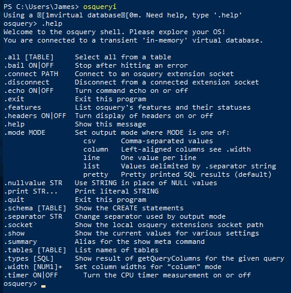
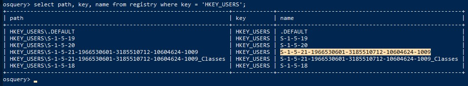

# Osquery: The Basics

[Link](https://tryhackme.com/room/osqueryf8)

## _**1: Introduction**_

[Osquery](https://osquery.io/) is an [open-source](https://github.com/osquery/osquery) agent created by [Facebook](https://engineering.fb.com/2014/10/29/security/introducing-osquery/) in 2014. It converts the operating system into a relational database. It allows us to ask questions from the tables using SQL queries, like returning the list of running processes, a user account created on the host, and the process of communicating with certain suspicious domains. It is widely used by Security Analysts, Incident Responders, Threat Hunters, etc. Osquery can be installed on multiple platforms: Windows, Linux, macOS, and FreeBSD.  

Learning Objective

In this introductory room, the following learning objectives are covered:

- What is Osquery, and what problem it solves?
- Osquery in Interactive Mode  
    
- How to use the interactive mode of Osquery to interact with the operating system
- How to join two tables to get a single answer  
    

  

**Note**: It is highly beneficial if you're already familiar with SQL queries. If not, check out this [SQL Tutorial](https://www.w3schools.com/sql/sql_intro.asp).


## _**2: Connect with the Lab**_

The virtual machine attached to this room already has Osquery installed and configured for you on Windows and Linux. Before proceeding, start the attached VM and use the following credentials to connect. The VM will be accessible in the split screen on the right side. In case the VM is not visible, use the blue **Show Split View** button at the top-right of the page.

Click on the `powershell terminal` pinned at the taskbar and enter `osqueryi` to enter the interactive mode of osquery.


## _**3: Osquery: Interactive Mode**_

One of the ways to interact with Osquery is by using the interactive mode. Open the terminal and run run `osqueryi`. To understand the tool, run the `.help` command in the interactive terminal, as shown below:



Note: As per the documentation, meta-commands are prefixed with a `.`.

**List the tables**

To list all the available tables that can be queried, use the `.tables` meta-command.

For example, if you wish to check what tables are associated with processes, you can use `.tables process`.


To list all the tables with the term `user` in them, we will use `.tables user` as shown below:


In the above example, four tables are returned that contain the word **user**.  

**Understanding the table Schema**

Table names are not enough to know what information it contains without actually querying it. Knowledge of columns and types (known as a **schema** ) for each table is also helpful. 

We can list a table's schema with the following meta-command: `.schema table_name`

Here, we are interested in understanding the columns in the user's table.


The above result provides the column names like username, description, PID followed by respective datatypes like BIGINT, TEXT, INTEGER, etc. Let us pick a few columns from this schema and use SQL query to ask osquery to display the columns from the user table using the following syntax:

**SQL QUERY SYNTAX:** `select column1, column2, column3 from table;`

Query: `select gid, uid, description, username, directory from users;`


**Display Mode**

Osquery comes with multiple display modes to select from. Use the `.help` option to list the available modes or choose 1 of them as shown below:

```
.mode MODE       Set output mode where MODE is one of:
                   csv      Comma-separated values
                   column   Left-aligned columns see .width
                   line     One value per line
                   list     Values delimited by .separator string
                   pretty   Pretty printed SQL results (default)
```

**Questions**

How many tables are returned when we query "table process" in the interactive mode of Osquery?

- 3

```
osquery> .table process
  => process_memory_map
  => process_open_sockets
  => processes
```

Looking at the schema of the processes table, which column displays the process id for the particular process?

- pid

```
osquery> .schema processes
CREATE TABLE processes(`pid` BIGINT, `name` TEXT, `path` TEXT, `cmdline` TEXT, `state` TEXT, `cwd` TEXT, `root` TEXT, `uid` BIGINT, `gid` BIGINT, `euid` BIGINT, `egid` BIGINT, `suid` BIGINT, `sgid` BIGINT, `on_disk` INTEGER, `wired_size` BIGINT, `resident_size` BIGINT, `total_size` BIGINT, `user_time` BIGINT, `system_time` BIGINT, `disk_bytes_read` BIGINT, `disk_bytes_written` BIGINT, `start_time` BIGINT, `parent` BIGINT, `pgroup` BIGINT, `threads` INTEGER, `nice` INTEGER, `elevated_token` INTEGER, `secure_process` INTEGER, `protection_type` TEXT, `virtual_process` INTEGER, `elapsed_time` BIGINT, `handle_count` BIGINT, `percent_processor_time` BIGINT, `upid` BIGINT HIDDEN, `uppid` BIGINT HIDDEN, `cpu_type` INTEGER HIDDEN, `cpu_subtype` INTEGER HIDDEN, `translated` INTEGER HIDDEN, `cgroup_path` TEXT HIDDEN, `phys_footprint` BIGINT HIDDEN, PRIMARY KEY (`pid`)) WITHOUT ROWID;
```

Examine the .help command, how many output display modes are available for the .mode command?

- 5


## _**4: Schema Documentation**_

For this task, go to the schema [documentation](https://osquery.io/schema/5.5.1/) of Osquery version 5.5.1, the latest version. The schema documentation looks like the image shown below:  

  

Breakdown  

Let's break down the important information we could find in this schema documentation:

1. A dropdown lists various versions of Osquery. Choose the version of Osquery you wish to see schema tables for.
2. The number of tables within the selected version of Osquery. (In the above image, 106 tables are available).
3. The list of tables is listed in alphabetical order for the selected version of Osquery. This is the same result we get when we use the `.table` command in the interactive mode.  
    
4. The name of the table and a brief description.
5. A detailed chart showing each table's **column**, **type**, and **description**.
6. Information to which Operating System the table applies. (In the above image, the **account\_policy\_data** table is available only for **macOS**)
7. A dropdown menu to select the Operating System of choice. We can choose multiple Operating Systems, which will display the tables available for those Operating systems.

  

  

You have enough information to navigate this resource to retrieve any necessary information confidently.  

**Questions**

In Osquery version 5.5.1, how many common tables are returned, when we select both Linux and Window Operating system?

- 56

In Osquery version 5.5.1, how many tables for MAC OS are available?

- 180

In the Windows Operating system, which table is used to display the installed programs?

- programs

In Windows Operating system, which column contains the registry value within the registry table?

- data


## _**5: Creating SQL queries**_

The SQL language implemented in Osquery is not an entire SQL language that you might be accustomed to, but rather it's a superset of SQLite. 

Realistically all your queries will start with a **SELECT** statement. This makes sense because, with Osquery, you are only querying information on an endpoint. You won't be updating or deleting any information/data on the endpoint. 

**The exception to the rule**: Using other SQL statements, such as **UPDATE** and **DELETE,** is possible, but only if you're creating run-time tables (views) or using an extension if the extension supports them. 

Your queries will also include a **FROM** clause and end with a **semicolon**.  

**Exploring Installed Programs**

If you wish to retrieve all the information about the installed programs on the endpoint, first understand the table schema either using the `.schema programs` command in the interactive mode or use the documentation [here](https://osquery.io/schema/5.5.1/#programs).  

**Query:** `SELECT * FROM programs LIMIT 1;`

```
--osquery interactive mode--
           
root@analyst$ osqueryi
Using a virtual database. Need help, type '.help'

osquery>select * from programs limit 1;
              name = 7-Zip 21.07 (x64)
           version = 21.07
  install_location = C:\Program Files\7-Zip\
    install_source =
          language =
         publisher = Igor Pavlov
  uninstall_string = "C:\Program Files\7-Zip\Uninstall.exe"
      install_date =
identifying_number =
```

In the above example `LIMIT` was used followed by the number to limit the results to display.  

**Note**: Your results will be different if you run this query in the attached VM or your local machine (if Osquery is installed). Here line mode is used to display the result.  

The number of columns returned might be more than what you need. You can select specific columns rather than retrieve every column in the table. 

**Query**: `SELECT name, version, install_location, install_date from programs limit 1;`

```
--osquery interactive mode--
           
root@analyst$ osqueryi
Using a virtual database. Need help, type '.help'

osquery>select name, version, install_location, install_date from programs limit 1;
            name = 7-Zip 21.07 (x64)
         version = 21.07
install_location = C:\Program Files\7-Zip\
    install_date =
```        

The above query will list the name, version, install location, and installed date of the programs on the endpoint. This will still return many results, depending on how busy the endpoint is.

**Count**

To see how many programs or entries in any table are returned, we can use the **count()** function, as shown below:

**Query**: `SELECT count(*) from programs;`

```
--osquery interactive mode--
           
root@analyst$ osqueryi
Using a virtual database. Need help, type '.help'

osquery>select count(*) from programs;
count(*) = 160
```

**WHERE Clause**

Optionally, you can use a **WHERE** clause to narrow down the list of results returned based on specified criteria. The following query will first get the user table and only display the result for the user James, as shown below:  

**Query**: `SELECT * FROM users WHERE username='James';`

```
--osquery interactive mode--

root@analyst$ osqueryi
Using a virtual database. Need help, type '.help'

osquery>SELECT * FROM users WHERE username='James';
        uid = 1002
        gid = 544
 uid_signed = 1002
 gid_signed = 544
   username = James
description =
  directory = C:\Users\James
      shell = C:\Windows\system32\cmd.exe
       uuid = S-1-5-21-605937711-2036809076-574958819-1002
       type = local
```

The equal sign is not the only filtering option in a **WHERE** clause. Below are filtering operators that can be used in a **WHERE** clause:

- `=` \[equal\]
- `<> ` \[not equal\]
- `>`, `>=` \[greater than, greater than, or equal to\]
- `<`, `<=` \[less than or less than or equal to\] 
- `BETWEEN` \[between a range\]
- `LIKE` \[pattern wildcard searches\]
- `%` \[wildcard, multiple characters\]
- `_` \[wildcard, one character\]

**Matching Wildcard Rules** 

Below is a screenshot from the Osquery [documentation](https://osquery.readthedocs.io/en/stable/deployment/file-integrity-monitoring/) showing examples of using wildcards when used in folder structures:  

- `%`: Match all files and folders for one level.
- `%%`: Match all files and folders recursively.
- `%abc`: Match all within-level ending in "abc".
- `abc%`: Match all within-level starting with "abc".

**Matching Examples**

- `/Users/%/Library`: Monitor for changes to every user's Library folder, _but not the contents within_.
- `/Users/%/Library/`: Monitor for changes to files _within_ each Library folder, but not the contents of their subdirectories.
- `/Users/%/Library/%`: Same, changes to files within each Library folder.
- `/Users/%/Library/%%`: Monitor changes recursively within each Library.
- `/bin/%sh`: Monitor the `bin` directory for changes ending in `sh`.

Some tables _require_ a **WHERE** clause, such as the **file** table, to return a value. If the required **WHERE** clause is not included in the query, then you will get an error. 

```
--osquery interactive mode--
           
root@analyst$ osqueryi
Using a virtual database. Need help, type '.help'

osquery>select * from file;
W1017 12:38:29.730041 45744 virtual_table.cpp:965] Table file was queried without a required column in the WHERE clause
W1017 12:38:29.730041 45744 virtual_table.cpp:976] Please see the table documentation: https://osquery.io/schema/#file
Error: constraint failed
```

**Joining Tables using JOIN Function**

OSquery can also be used to join two tables based on a column that is shared by both tables. Let's look at two tables to demonstrate this further. Below is the schema for the **user's** table and the **processes** table. 

```
--osquery interactive mode--

           
root@analyst$ osqueryi
Using a virtual database. Need help, type '.help'

osquery>.schema users
CREATE TABLE users(`uid` BIGINT, `gid` BIGINT, `uid_signed` BIGINT, `gid_signed` BIGINT, `username` TEXT, `description` TEXT, `directory` TEXT, `shell` TEXT, `uuid` TEXT, `type` TEXT, `is_hidden` INTEGER HIDDEN, `pid_with_namespace` INTEGER HIDDEN, PRIMARY KEY (`uid`, `username`, `uuid`, `pid_with_namespace`)) WITHOUT ROWID;

osquery>.schema processes
CREATE TABLE processes(`pid` BIGINT, `name` TEXT, `path` TEXT, `cmdline` TEXT, `state` TEXT, `cwd` TEXT, `root` TEXT, `uid` BIGINT, `gid` BIGINT, `euid` BIGINT, `egid` BIGINT, `suid` BIGINT, `sgid` BIGINT, `on_disk` INTEGER, `wired_size` BIGINT, `resident_size` BIGINT, `total_size` BIGINT, `user_time` BIGINT, `system_time` BIGINT, `disk_bytes_read` BIGINT, `disk_bytes_written` BIGINT, `start_time` BIGINT, `parent` BIGINT, `pgroup` BIGINT, `threads` INTEGER, `nice` INTEGER, `elevated_token` INTEGER, `secure_process` INTEGER, `protection_type` TEXT, `virtual_process` INTEGER, `elapsed_time` BIGINT, `handle_count` BIGINT, `percent_processor_time` BIGINT, `upid` BIGINT HIDDEN, `uppid` BIGINT HIDDEN, `cpu_type` INTEGER HIDDEN, `cpu_subtype` INTEGER HIDDEN, `translated` INTEGER HIDDEN, `cgroup_path` TEXT HIDDEN, `phys_footprint` BIGINT HIDDEN, PRIMARY KEY (`pid`)) WITHOUT ROWID;
```

Looking at both schemas, `uid` in `users` table is meant to identify the user record, and in the processes table, the column `uid` represents the user responsible for executing the particular process. We can join both tables using this `uid` field as shown below:

**Query1:** `select uid, pid, name, path from processes;`

**Query2:** `select uid, username, description from users;`

**Joined Query:** `select p.pid, p.name, p.path, u.username from processes p JOIN users u on u.uid=p.uid LIMIT 10;`  

```
--osquery interactive mode--
           
root@analyst$ osqueryi
Using a virtual database. Need help, type '.help'

osquery>select p.pid, p.name, p.path, u.username from processes p JOIN users u on u.uid=p.uid LIMIT 10;
+-------+-------------------+---------------------------------------+----------+
| pid   | name              | path                                  | username |
+-------+-------------------+---------------------------------------+----------+
| 7560  | sihost.exe        | C:\Windows\System32\sihost.exe        | James    |
| 6984  | svchost.exe       | C:\Windows\System32\svchost.exe       | James    |
| 7100  | svchost.exe       | C:\Windows\System32\svchost.exe       | James    |
| 7144  | svchost.exe       | C:\Windows\System32\svchost.exe       | James    |
| 8636  | ctfmon.exe        | C:\Windows\System32\ctfmon.exe        | James    |
| 8712  | taskhostw.exe     | C:\Windows\System32\taskhostw.exe     | James    |
| 9260  | svchost.exe       | C:\Windows\System32\svchost.exe       | James    |
| 10168 | RuntimeBroker.exe | C:\Windows\System32\RuntimeBroker.exe | James    |
| 10232 | RuntimeBroker.exe | C:\Windows\System32\RuntimeBroker.exe | James    |
| 8924  | svchost.exe       | C:\Windows\System32\svchost.exe       | James    |
+-------+-------------------+---------------------------------------+----------+
```
        

Note: Please refer to the Osquery [documentation](https://osquery.readthedocs.io/en/stable/introduction/sql/) for more information regarding SQL and creating queries specific to Osquery.

**Questions**

Using Osquery, how many programs are installed on this host?

- `osqueryi`
- `select count(*) from programs;`
- 19


Using Osquery, what is the description for the user James?

- select uid, username, description from users;
- Creative Artist

When we run the following search query, what is the full SID of the user with RID '1009'?

Query: `select path, key, name from registry where key = 'HKEY_USERS';`

- S-1-5-21-1966530601-3185510712-10604624-1009



When we run the following search query, what is the Internet Explorer browser extension installed on this machine?

Query: select * from ie_extensions;

- C:\Windows\System32\ieframe.dll

After running the following query, what is the full name of the program returned?

Query: `select name,install_location from programs where name LIKE '%wireshark%';`

- Wireshark 3.6.8 64-bit


## _**6: Challenge and Conclusion**_

Now that we have explored various tables, learned how to create search queries, and ask questions from the operating system, it's time for a challenge. Use OSquery to examine the host and answer the following questions.

**Questions**

Which table stores the evidence of process execution in Windows OS?

- userassist
- [Link](https://osquery.io/schema/5.5.1/#userassist)

One of the users seems to have executed a program to remove traces from the disk; what is the name of that program?

- `.schema userassist`
- `select * from userassist;`
- DiskWipe.exe


Create a search query to identify the VPN installed on this host. What is name of the software?

- `.schema programs`
- `select name from programs WHERE name Like '%vpn%';`
- ProtonVPN

How many services are running on this host?

- `select count(*) from services;`
- 214

A table autoexec contains the list of executables that are automatically executed on the target machine. There seems to be a batch file that runs automatically. What is the name of that batch file (with the extension .bat)?

- `.schema autoexec`
- `select path, name from autoexec where path like '%.bat';`
- batstartup.bat

What is the full path of the batch file found in the above question? (Last in the List)

- C:\Users\James\AppData\Roaming\Microsoft\Windows\Start Menu\Programs\Startup\batstartup.bat


