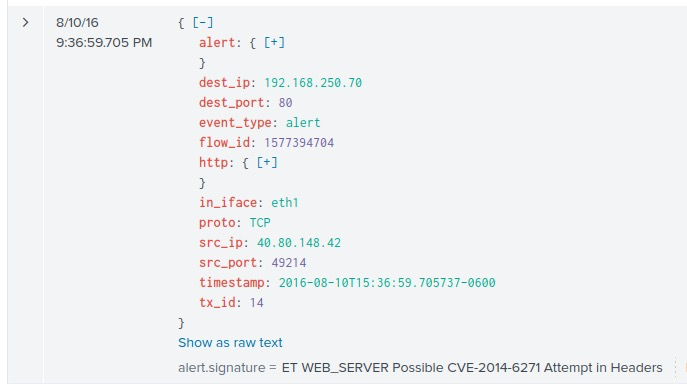
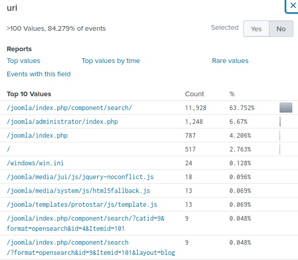
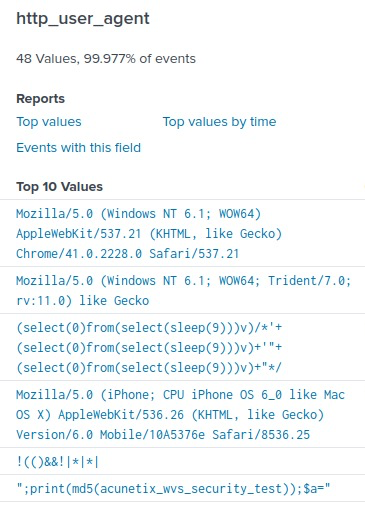

# Incident handling with Splunk

Learn to use Splunk for incident handling through interactive scenarios.

[Link](https://tryhackme.com/room/splunk201)

## _**1: Introduction: Incident Handling**_

This room covers an incident Handling scenario using Splunk. An incident from a security perspective is "Any event or action, that has a negative consequence on the security of a user/computer or an organization is considered a security incident." Below are a few of the events that would negatively affect the environment when they occurred:  

- Crashing the system
- Execution of an unwanted program
- Access to sensitive information from an unauthorized user
- A Website being defaced by the attacker
- The use of USB devices when there is a restriction in usage is against the company's policy

**Learning Objective**

- Learn how to leverage OSINT sites during an investigation
- How to map Attacker's activities to Cyber Kill Chain Phases  
    
- How to utilize effective Splunk searches to investigate logs
- Understand the importance of host-centric and network-centric log sources

**Room Prerequisites**  

Before going through this room, it is expected that the participants will have a basic understanding of Splunk. If not, consider going through this room, Splunk 101 ([https://tryhackme.com/jr/splunk101](https://tryhackme.com/jr/splunk101)).

It is good to understand the following before completing this lesson:  

- Splunk overview and basic navigation
- Important Splunk Queries
- Know how to use different functions/values to craft a search query
- How to look for interesting fields

## _**2: Incident Handling - Life Cycle**_

As an Incident Handler / SOC Analyst, we would aim to know the attackers' tactics, techniques, and procedures. Then we can stop/defend/prevent against the attack in a better way. The Incident Handling process is divided into four different phases. Let's briefly go through each phase before jumping into the incident, which we will be going through in this exercise.

  
**1\. Preparation**

The preparation phase covers the readiness of an organization against an attack. That means documenting the requirements, defining the policies, incorporating the security controls to monitor like EDR / SIEM / IDS / IPS, etc. It also includes hiring/training the staff.

  

**2\. Detection and Analysis**

The detection phase covers everything related to detecting an incident and the analysis process of the incident. This phase covers getting alerts from the security controls like SIEM/EDR investigating the alert to find the root cause. This phase also covers hunting for the unknown threat within the organization.

  

**3\. Containment, Eradication, and Recovery**

This phase covers the actions needed to prevent the incident from spreading and securing the network. It involves steps taken to avoid an attack from spreading into the network, isolating the infected host, clearing the network from the infection traces, and gaining control back from the attack.

**4\. Post-Incident Activity / Lessons Learnt**

This phase includes identifying the loopholes in the organization's security posture, which led to an intrusion, and improving so that the attack does not happen next time. The steps involve identifying weaknesses that led to the attack, adding detection rules so that similar breach does not happen again, and most importantly, training the staff if required.

## _**3: Incident Handling: Scenario**_

In this exercise, we will investigate a cyber attack in which the attacker defaced an organization's website. This organization has Splunk as a SIEM solution setup. Our task as a Security Analysis would be to investigate this cyber attack and map the attacker's activities into all 7 of the Cyber Kill Chain Phases. It is important to note that we don't need to follow the sequence of the cyber kill chain during the Investigation. One finding in one phase will lead to another finding that may have mapped into some other phase.

# Cyber Kill Chain

We will follow the Cyber kill Chain Model and map the attacker's activity in each phase during this Investigation. When required, we will also utilize Open Source Intelligence (OSINT) and other findings to fill the gaps in the kill chain. It is not necessary to follow this sequence of the phases while investigating.

  

  

  

- Reconnaissance
- Weaponization
- Delivery
- Exploitation
- Installation
- Command & Control
- Actions on Objectives

  

**Scenario**

A Big corporate organization **Wayne Enterprises** has recently faced a cyber-attack where the attackers broke into their network, found their way to their web server, and have successfully defaced their website **http://www.imreallynotbatman.com**. Their website is now showing the trademark of the attackers with the message **YOUR SITE HAS BEEN DEFACED** as shown below.

  

They have requested "**US**" to join them as a **Security Analyst** and help them investigate this cyber attack and find the root cause and all the attackers' activities within their network.

  

The good thing is, that they have Splunk already in place, so we have got all the event logs related to the attacker's activities captured. We need to explore the records and find how the attack got into their network and what actions they performed.  

This Investigation comes under the `Detection and Analysis phase.`

**Splunk**

During our investigation, we will be using `Splunk` as our SIEM solution. Logs are being ingested from webserver/firewall/Suricata/Sysmon etc. In the data summary tab, we can explore the log sources showing visibility into both network-centric and host-centric activities. To get the complete picture of the hosts and log sources being monitored in Wayne Enterprise, please click on the **Data summary** and navigate the available tabs to get the information.

  

**Interesting log Sources**  

Some of the interesting log sources that will help us in our Investigation are:  

<table class="table table-bordered"><tbody><tr><td><b>Log Sources&nbsp;&nbsp;&nbsp;&nbsp;&nbsp;&nbsp; </b></td><td><b>Details&nbsp;&nbsp;&nbsp;&nbsp;&nbsp;&nbsp;&nbsp;&nbsp;&nbsp;&nbsp;&nbsp;&nbsp; &nbsp; &nbsp; &nbsp; &nbsp; &nbsp; &nbsp; &nbsp; &nbsp; &nbsp; &nbsp; &nbsp; &nbsp; &nbsp; &nbsp; &nbsp; &nbsp; &nbsp; &nbsp; &nbsp; &nbsp; &nbsp; &nbsp; &nbsp; &nbsp; &nbsp; &nbsp; &nbsp; &nbsp; &nbsp; &nbsp; &nbsp; &nbsp; &nbsp; &nbsp; &nbsp; &nbsp; &nbsp; &nbsp; &nbsp; &nbsp; &nbsp; &nbsp; &nbsp; &nbsp; &nbsp; &nbsp; &nbsp; &nbsp; &nbsp; &nbsp; &nbsp; &nbsp; &nbsp; &nbsp; &nbsp; &nbsp; &nbsp; &nbsp; &nbsp; &nbsp; &nbsp; &nbsp; &nbsp; &nbsp; &nbsp; &nbsp; &nbsp; &nbsp; &nbsp; &nbsp; &nbsp; &nbsp; &nbsp; &nbsp; &nbsp; &nbsp; &nbsp; &nbsp; &nbsp; &nbsp; &nbsp; &nbsp; &nbsp; &nbsp;&nbsp; &nbsp;&nbsp;&nbsp;&nbsp;&nbsp;&nbsp;&nbsp;&nbsp;&nbsp;&nbsp;&nbsp;&nbsp;&nbsp;&nbsp;&nbsp;&nbsp;&nbsp;&nbsp;&nbsp;&nbsp;&nbsp;&nbsp;&nbsp;&nbsp;&nbsp;&nbsp;&nbsp;&nbsp;&nbsp;&nbsp;&nbsp;&nbsp;&nbsp;&nbsp;&nbsp;&nbsp;&nbsp;&nbsp;&nbsp;&nbsp;&nbsp;&nbsp;&nbsp;&nbsp;&nbsp;&nbsp; </b></td></tr><tr><td><b>wineventlog&nbsp;&nbsp;&nbsp;&nbsp;</b> </td><td>It contains Windows Event logs&nbsp; &nbsp; &nbsp; &nbsp; &nbsp; &nbsp; &nbsp; &nbsp; &nbsp; &nbsp; &nbsp; &nbsp; &nbsp; &nbsp; &nbsp; &nbsp; &nbsp; &nbsp; &nbsp; &nbsp; &nbsp; &nbsp; &nbsp; &nbsp; &nbsp; &nbsp; &nbsp; &nbsp; &nbsp; &nbsp; &nbsp; &nbsp; &nbsp; &nbsp; &nbsp; &nbsp; &nbsp; &nbsp; &nbsp; &nbsp; &nbsp; &nbsp; &nbsp; &nbsp; &nbsp; &nbsp; &nbsp; &nbsp; &nbsp; &nbsp; &nbsp; &nbsp;&nbsp; &nbsp; &nbsp; &nbsp; &nbsp;&nbsp;&nbsp; &nbsp; &nbsp; &nbsp; &nbsp; &nbsp; &nbsp; &nbsp; &nbsp; &nbsp; &nbsp; &nbsp; &nbsp; &nbsp; &nbsp; &nbsp; &nbsp; &nbsp; &nbsp; &nbsp; &nbsp; &nbsp; &nbsp; &nbsp; &nbsp; &nbsp; &nbsp; &nbsp; &nbsp; &nbsp; &nbsp; &nbsp; &nbsp; &nbsp; &nbsp;&nbsp;&nbsp;&nbsp;&nbsp;&nbsp;&nbsp;&nbsp;&nbsp;&nbsp;&nbsp;&nbsp;&nbsp;&nbsp;&nbsp;&nbsp;&nbsp;&nbsp;&nbsp;&nbsp;&nbsp;&nbsp;&nbsp;&nbsp;&nbsp;&nbsp;&nbsp;&nbsp;&nbsp;&nbsp;&nbsp;&nbsp;&nbsp;&nbsp;&nbsp;&nbsp;&nbsp;&nbsp;&nbsp;&nbsp;&nbsp;&nbsp;&nbsp;&nbsp;&nbsp;&nbsp;&nbsp;&nbsp;&nbsp;&nbsp;&nbsp;&nbsp;&nbsp;&nbsp;&nbsp;&nbsp;&nbsp;&nbsp;&nbsp;&nbsp;&nbsp;&nbsp;&nbsp;&nbsp;&nbsp;&nbsp;&nbsp;&nbsp;&nbsp;&nbsp;&nbsp;&nbsp;&nbsp;&nbsp;&nbsp;&nbsp;&nbsp;&nbsp;&nbsp;&nbsp;&nbsp;&nbsp;&nbsp;&nbsp;&nbsp;&nbsp;&nbsp;&nbsp;&nbsp;&nbsp;&nbsp;&nbsp;&nbsp;&nbsp;&nbsp;&nbsp;&nbsp;&nbsp;&nbsp;&nbsp;&nbsp;&nbsp; </td></tr><tr><td><b>winRegistry&nbsp;&nbsp;&nbsp;&nbsp;&nbsp;&nbsp;&nbsp;&nbsp;&nbsp;&nbsp;&nbsp;</b> </td><td>It contains the logs related to registry creation / modification / deletion etc.&nbsp; &nbsp; &nbsp; &nbsp; &nbsp; &nbsp; &nbsp; &nbsp; &nbsp; &nbsp; &nbsp;&nbsp;&nbsp; &nbsp; &nbsp;&nbsp;&nbsp; &nbsp; &nbsp; &nbsp; &nbsp; &nbsp; &nbsp; &nbsp; &nbsp; &nbsp; &nbsp; &nbsp; &nbsp; &nbsp; &nbsp; &nbsp; &nbsp; &nbsp; &nbsp; &nbsp; &nbsp; &nbsp; &nbsp; &nbsp; &nbsp; &nbsp; &nbsp; &nbsp; &nbsp; &nbsp; &nbsp; &nbsp; &nbsp; &nbsp; </td></tr><tr><td><b>XmlWinEventLog</b> </td><td>It contains the sysmon event logs. It is a very important log source from an investigation point of view. &nbsp; &nbsp; &nbsp; &nbsp; &nbsp; &nbsp; &nbsp; &nbsp; &nbsp; &nbsp; &nbsp; &nbsp; &nbsp; &nbsp; &nbsp; &nbsp;&nbsp; &nbsp;&nbsp;&nbsp; &nbsp; &nbsp; &nbsp; &nbsp;&nbsp;&nbsp;&nbsp;&nbsp;&nbsp;&nbsp;&nbsp;&nbsp;&nbsp;&nbsp;&nbsp;&nbsp;&nbsp;&nbsp;&nbsp;&nbsp;&nbsp;&nbsp;&nbsp;&nbsp;&nbsp;&nbsp;&nbsp;&nbsp;&nbsp;&nbsp;&nbsp;&nbsp;&nbsp;&nbsp;&nbsp; </td></tr><tr><td><b>fortigate_utm </b></td><td>It contains Fortinet Firewall logs&nbsp; &nbsp; &nbsp; &nbsp; &nbsp;&nbsp;&nbsp; &nbsp; &nbsp; &nbsp; &nbsp; &nbsp; &nbsp; &nbsp; &nbsp; &nbsp; &nbsp; &nbsp; &nbsp; &nbsp; &nbsp; &nbsp; &nbsp; &nbsp; &nbsp; &nbsp; &nbsp; &nbsp; &nbsp; &nbsp; &nbsp; &nbsp; &nbsp; &nbsp; &nbsp;&nbsp; &nbsp; &nbsp; &nbsp; &nbsp;&nbsp;&nbsp; &nbsp; &nbsp; &nbsp; &nbsp; &nbsp; &nbsp; &nbsp; &nbsp; &nbsp; &nbsp; &nbsp; &nbsp; &nbsp; &nbsp; &nbsp; &nbsp; &nbsp; &nbsp; &nbsp;&nbsp;&nbsp;&nbsp;&nbsp;&nbsp;&nbsp;&nbsp;&nbsp;&nbsp;&nbsp;&nbsp;&nbsp;&nbsp;&nbsp;&nbsp;&nbsp;&nbsp;&nbsp;&nbsp;&nbsp;&nbsp;&nbsp;&nbsp;&nbsp;&nbsp;&nbsp;&nbsp;&nbsp;&nbsp;&nbsp;&nbsp;&nbsp;&nbsp;&nbsp;&nbsp;&nbsp;&nbsp;&nbsp;&nbsp;&nbsp;&nbsp;&nbsp;&nbsp;&nbsp;&nbsp;&nbsp;&nbsp;&nbsp;&nbsp;&nbsp;&nbsp;&nbsp;&nbsp;&nbsp;&nbsp;&nbsp;&nbsp;&nbsp;&nbsp;&nbsp;&nbsp;&nbsp;</td></tr><tr><td><b>iis </b></td><td>It contains IIS web server logs &nbsp; &nbsp; &nbsp;&nbsp;&nbsp; &nbsp; &nbsp; &nbsp; &nbsp; &nbsp; &nbsp; &nbsp; &nbsp; &nbsp; &nbsp; &nbsp; &nbsp; &nbsp; &nbsp; &nbsp; &nbsp; &nbsp; &nbsp; &nbsp; &nbsp; &nbsp; &nbsp; &nbsp; &nbsp; &nbsp; &nbsp; &nbsp; &nbsp;&nbsp; &nbsp; &nbsp; &nbsp; &nbsp;&nbsp;&nbsp; &nbsp; &nbsp; &nbsp; &nbsp; &nbsp; &nbsp; &nbsp; &nbsp; &nbsp; &nbsp; &nbsp; &nbsp; &nbsp; &nbsp; &nbsp; &nbsp; &nbsp; &nbsp; &nbsp;&nbsp;&nbsp;&nbsp;&nbsp;&nbsp;&nbsp;&nbsp;&nbsp;&nbsp;&nbsp;&nbsp;&nbsp;&nbsp;&nbsp;&nbsp;&nbsp;&nbsp;&nbsp;&nbsp;&nbsp;&nbsp;&nbsp;&nbsp;&nbsp;&nbsp;&nbsp;&nbsp;&nbsp;&nbsp;&nbsp;&nbsp;&nbsp;&nbsp;&nbsp;&nbsp;&nbsp;&nbsp;&nbsp;&nbsp;&nbsp;&nbsp;&nbsp;&nbsp;&nbsp;&nbsp;&nbsp;&nbsp;&nbsp;&nbsp;&nbsp;&nbsp;&nbsp;&nbsp;&nbsp;&nbsp;&nbsp;&nbsp;&nbsp;&nbsp;&nbsp;&nbsp;&nbsp;&nbsp;&nbsp;&nbsp;&nbsp;&nbsp;&nbsp;&nbsp;&nbsp; </td></tr><tr><td><b>Nessus:scan </b></td><td>It contains the results from the Nessus vulnerability scanner. &nbsp; &nbsp; &nbsp;&nbsp; &nbsp; &nbsp; &nbsp; &nbsp; &nbsp; &nbsp; &nbsp;&nbsp; &nbsp; &nbsp; &nbsp; &nbsp; &nbsp; &nbsp; &nbsp; &nbsp; &nbsp; &nbsp; &nbsp; &nbsp; &nbsp; &nbsp; &nbsp; &nbsp; &nbsp; &nbsp; &nbsp; &nbsp; &nbsp; &nbsp; &nbsp; &nbsp; &nbsp; &nbsp; &nbsp; &nbsp;&nbsp; &nbsp; &nbsp; &nbsp; &nbsp;&nbsp;&nbsp; &nbsp; &nbsp; &nbsp; &nbsp; &nbsp; &nbsp; &nbsp; &nbsp; &nbsp; &nbsp; &nbsp; &nbsp; &nbsp; &nbsp; &nbsp; &nbsp; &nbsp; &nbsp; </td></tr><tr><td><b>Suricata </b></td><td>It contains the details of the alerts from the Suricata IDS.&nbsp;&nbsp; This log source shows which alert was triggered and what caused the alert to get triggered— a very important log source for the Investigation. &nbsp; &nbsp; &nbsp;&nbsp;&nbsp;&nbsp;&nbsp;&nbsp;&nbsp;&nbsp;&nbsp;&nbsp;&nbsp;&nbsp;&nbsp;&nbsp;&nbsp;&nbsp;&nbsp;&nbsp;&nbsp;&nbsp;&nbsp;&nbsp;&nbsp;&nbsp;&nbsp;&nbsp;&nbsp;&nbsp;&nbsp;&nbsp;&nbsp;&nbsp;&nbsp;&nbsp;&nbsp;&nbsp;&nbsp;&nbsp;&nbsp;&nbsp;&nbsp;&nbsp;&nbsp;&nbsp;&nbsp;&nbsp;&nbsp;&nbsp;&nbsp;&nbsp;&nbsp;&nbsp;&nbsp;&nbsp;&nbsp;&nbsp;&nbsp;&nbsp;&nbsp;&nbsp;&nbsp;&nbsp;&nbsp;&nbsp;&nbsp;&nbsp;&nbsp;&nbsp;&nbsp;&nbsp;&nbsp;&nbsp;&nbsp;&nbsp;&nbsp;&nbsp;&nbsp;&nbsp;&nbsp;&nbsp;&nbsp;&nbsp;&nbsp;&nbsp;&nbsp;&nbsp;&nbsp; </td></tr><tr><td><b>stream:http </b></td><td>It contains the network flow related to http traffic. &nbsp; &nbsp; &nbsp;&nbsp;&nbsp; &nbsp; &nbsp; &nbsp; &nbsp; &nbsp; &nbsp; &nbsp; &nbsp; &nbsp; &nbsp; &nbsp; &nbsp; &nbsp; &nbsp; &nbsp; &nbsp; &nbsp; &nbsp; &nbsp; &nbsp; &nbsp; &nbsp; &nbsp; &nbsp; &nbsp; &nbsp; &nbsp; &nbsp; &nbsp; &nbsp; &nbsp; &nbsp; &nbsp; &nbsp; &nbsp; &nbsp; &nbsp; &nbsp; &nbsp; &nbsp; &nbsp; &nbsp; &nbsp; &nbsp;&nbsp; &nbsp; &nbsp; &nbsp; &nbsp;&nbsp;&nbsp; &nbsp; &nbsp; &nbsp; &nbsp; &nbsp; &nbsp; &nbsp; &nbsp; &nbsp; &nbsp; &nbsp; &nbsp; &nbsp; &nbsp; &nbsp; &nbsp; &nbsp; &nbsp; </td></tr><tr><td><b>stream: DNS </b></td><td>It contains the network flow related to DNS traffic. &nbsp; &nbsp; &nbsp; &nbsp; &nbsp; &nbsp; &nbsp; &nbsp; &nbsp; &nbsp; &nbsp; &nbsp; &nbsp; &nbsp; &nbsp; &nbsp; &nbsp; &nbsp; &nbsp;&nbsp;&nbsp; &nbsp; &nbsp; &nbsp; &nbsp; &nbsp; &nbsp; &nbsp; &nbsp; &nbsp; &nbsp; &nbsp; &nbsp; &nbsp; &nbsp; &nbsp; &nbsp; &nbsp; &nbsp; &nbsp; &nbsp; &nbsp; &nbsp; &nbsp; &nbsp; &nbsp; &nbsp; &nbsp; &nbsp;&nbsp; &nbsp; &nbsp; &nbsp; &nbsp;&nbsp;&nbsp; &nbsp; &nbsp; &nbsp; &nbsp; &nbsp; &nbsp; &nbsp; &nbsp; &nbsp; &nbsp; &nbsp; &nbsp; &nbsp; &nbsp; &nbsp; &nbsp; &nbsp; &nbsp;</td></tr><tr><td><b>stream:icmp </b></td><td>It contains the network flow related to icmp traffic. &nbsp; &nbsp;&nbsp;&nbsp; &nbsp; &nbsp; &nbsp; &nbsp; &nbsp; &nbsp; &nbsp; &nbsp; &nbsp; &nbsp; &nbsp; &nbsp; &nbsp; &nbsp; &nbsp; &nbsp; &nbsp; &nbsp; &nbsp; &nbsp; &nbsp; &nbsp; &nbsp; &nbsp; &nbsp; &nbsp; &nbsp; &nbsp; &nbsp; &nbsp; &nbsp; &nbsp; &nbsp; &nbsp; &nbsp; &nbsp; &nbsp; &nbsp; &nbsp; &nbsp; &nbsp; &nbsp; &nbsp; &nbsp; &nbsp; &nbsp; &nbsp; &nbsp;&nbsp; &nbsp; &nbsp; &nbsp; &nbsp;&nbsp;&nbsp; &nbsp; &nbsp; &nbsp; &nbsp; &nbsp; &nbsp; &nbsp; &nbsp; &nbsp; &nbsp; &nbsp; &nbsp; &nbsp; &nbsp; &nbsp; &nbsp; &nbsp; &nbsp;&nbsp;&nbsp;&nbsp;&nbsp;&nbsp;&nbsp;&nbsp;&nbsp;&nbsp;&nbsp;&nbsp;&nbsp;&nbsp;&nbsp;&nbsp;&nbsp;&nbsp;&nbsp;&nbsp;&nbsp;&nbsp;&nbsp;&nbsp;&nbsp;&nbsp;&nbsp;&nbsp;&nbsp;&nbsp;&nbsp;&nbsp;&nbsp;&nbsp; </td></tr></tbody></table>

  

**Note:** All the event logs that we are going to investigate are present in `index=botsv1`  

Now that we know what hosts we have to investigate, what sources and the source types are, **let's connect to the lab and start Investigating**.  

Room Machine

Before moving forward, deploy the machine. When you deploy the machine, it will be assigned an IP **Machine IP**: `MACHINE_IP`. The machine will take up to 3-5 minutes to start.

## _**4: Reconnaissance Phase**_

Reconnaissance is an attempt to discover and collect information about a target. It could be knowledge about the system in use, the web application, employees or location, etc.

  

We will start our analysis by examining any reconnaissance attempt against the webserver `imreallynotbatman.com`. From an analyst perspective, where do we first need to look? If we look at the available log sources, we will find some log sources covering the network traffic, which means all the inbound communication towards our web server will be logged into the log source that contains the web traffic. Let's start by searching for the domain in the search head and see which log source includes the traces of our domain.

**Search Query**: `index=botsv1 imreallynotbatman.com`

**Search Query explanation:** We are going to look for the event logs in the index "botsv1" which contains the term `imreallynotbatman.com`

  

Here we have searched for the term `imreallynotbatman.com` in the index `botsv1`. In the sourcetype field, we saw that the following log sources contain the traces of this search term.

- Suricata
- stream:http
- fortigate\_utm
- iis

From the name of these log sources, it is clear what each log source may contain. Every analyst may have a different approach to investigating a scenario. Our first task is to identify the IP address attempting to perform reconnaissance activity on our web server. It would be obvious to look at the web traffic coming into the network. We can start looking into any of the logs mentioned above sources.

Let us begin looking at the log source **stream:http**, which contains the http traffic logs, and examine the `src_ip` field from the left panel. **Src\_ip** field contains the source IP address it finds in the logs.  

**Search Query:** `index=botsv1 imreallynotbatman.com sourcetype=stream:http  
`

**Search Query Explanation:** This query will only look for the term  `imreallynotbatman.com`in the **stream:http** log source.  

**Note:** The important thing to note, if you don't find the field of interest, keep scrolling in the left panel. When you click on a field, it will contain all the values it finds in the logs.  
So far, we have found two IPs in the src\_ip field `40.80.148.42` and `23.22.63.114`. The first IP seems to contain a high percentage of the logs as compared to the other IP, which could be the answer. If you want to confirm further, click on each IP one by one, it will be added into the search query, and look at the logs, and you will find the answer.

To further confirm our suspicion about the IP address **40.80.148.42**, click on the IP and examine the logs. We can look at the interesting fields like User-Agent, Post request, URIs, etc., to see what kind of traffic is coming from this particular IP.  

We have narrowed down the results to only show the logs from the source IP **40.80.148.42**, looked at the fields of interest and found the traces of the domain being probed.  

**Validate the IP that is scanning  
**  
So what do we need to do to validate the scanning attempt? Simple, dig further into the weblogs. Let us narrow down the result, look into the `suricata` logs, and see if any rule is triggered on this communication.

**Search Query:** `index=botsv1 imreallynotbatman.com src=40.80.148.42 sourcetype=suricata`

**Search Query Explanation:** This query will show the logs from the suricata log source that are detected/generated from the source IP **40.80.248.42**  

  

We have narrowed our search on the **src IP** and looked at the source type `suricata` to see what Suricata triggered alerts. In the right panel, we could not find the field of our interest, so we clicked on more fields and searched for the fields that contained the signature alerts information, which is an important point to note.

**Questions**

One suricata alert highlighted the CVE value associated with the attack attempt. What is the CVE value?

- `index=botsv1 imreallynotbatman.com src=40.80.148.42 sourcetype=suricata CVE`
- add alert.signature to select field and look for the oldest log
- cve-2014-6271

What is the CMS our web server is using?

- CMS = content management software
- joomla
- can be seen in the URI

What is the web scanner, the attacker used to perform the scanning attempts?

- `index=botsv1 imreallynotbatman.com src=40.80.148.42 sourcetype=suricata`
- Look at the http_user_agent
- acunetix

What is the IP address of the server imreallynotbatman.com?

- `index=botsv1 imreallynotbatman.com sourcetype="stream:http"`
- Look for dest_ip
- 192.168.250.70

## _**5: Exploitation Phase**_

The attacker needs to exploit the vulnerability to gain access to the system/server.

In this task, we will look at the potential exploitation attempt from the attacker against our web server and see if the attacker got successful in exploiting or not.  

To begin our investigation, let's note the information we have so far:

- We found two IP addresses from the reconnaissance phase with sending requests to our server.
- One of the IPs `40.80.148.42` was seen attempting to scan the server with IP **192.168.250.70**.
- The attacker was using the web scanner Acunetix for the scanning attempt.

**Count**

Let's use the following search query to see the number of counts by each source IP against the webserver.  

**Search Query**:`index=botsv1 imreallynotbatman.com sourcetype=stream* | stats count(src_ip) as Requests by src_ip | sort - Requests`

**Query Explanation:** This query uses the stats function to display the count of the IP addresses in the field src\_ip.  

  

Additionally, we can also create different visualization to show the result. Click on **Visualization → Select Visualization** as shown below.  

  

Now we will narrow down the result to show requests sent to our web server, which has the IP `192.168.250.70`  

**Search Query:** `index=botsv1 sourcetype=stream:http dest_ip="192.168.250.70"`  

**Query Explanation:** This query will look for all the inbound traffic towards IP **192.168.250.70.**

  

The result in the **src\_ip** field shows three IP addresses (1 local IP and two remote IPs) that originated the HTTP traffic towards our webserver.  

Another interesting field, **http\_method** will give us information about the HTTP Methods observed during these HTTP communications.  

We observed most of the requests coming to our server through the POST request, as shown below.

  

To see what kind of traffic is coming through the POST requests, we will narrow down on the field `http_method=POST` as shown below:

**Search Query:** `index=botsv1 sourcetype=stream:http dest_ip="192.168.250.70" http_method=POST  
`

  

 The result in the **src\_ip** field shows two IP addresses sending all the POST requests to our server.

**Interesting fields:** In the left panel, we can find some interesting fields containing valuable information. Some of the fields are:  

- src\_ip
- form\_data
- http\_user\_agent
- uri

  

The term Joomla is associated with the webserver found in a couple of fields like **uri, uri\_path, http\_referrer**, etc. This means our webserver is using Joomla CMS (Content Management Service) in the backend.

A little search on the internet for the admin login page of the Joomla CMS will show as -> `/joomla/administrator/index.php`

It is important because this uri contains the login page to access the web portal therefore we will be examining the traffic coming into this admin panel for a potential brute-force attack.  

  

Reference: [https://www.joomla.org/administrator/index.php](https://www.joomla.org/administrator/index.php)

We can narrow down our search to see the requests sent to the login portal using this information.

**Search query:** `index=botsv1 imreallynotbatman.com sourcetype=stream:http dest_ip="192.168.250.70"  uri="/joomla/administrator/index.php"  
`  

**Query Explanation:** We are going to add `uri="/joomla/administrator/index.php"` in the search query to show the traffic coming into this URI.  

  

`form_data` The field contains the requests sent through the form on the admin panel page, which has a login page. We suspect the attacker may have tried multiple credentials in an attempt to gain access to the admin panel. To confirm, we will dig deep into the values contained within the form\_data field, as shown below:

**Search Query:** `index=botsv1 sourcetype=stream:http dest_ip="192.168.250.70" http_method=POST uri="/joomla/administrator/index.php" | table _time uri src_ip dest_ip form_data`

**Query Explanation:** We will add this -> `| table _time uri src dest_ip form_data` to create a table containing important fields as shown below:   

  

If we keep looking at the results, we will find two interesting fields `username` that includes the single username `admin` in all the events and another field `passwd` that contains multiple passwords in it, which shows the attacker from the IP `23.22.63.114` Was trying to guess the password by brute-forcing and attempting numerous passwords.

The time elapsed between multiple events also suggests that the attacker was using an automated tool as various attempts were observed in a short time.

**Extracting Username and Passwd Fields using Regex**

Looking into the logs, we see that these fields are not parsed properly. Let us use **Regex** in the search to extract only these two fields and their values from the logs and display them.

We can display only the logs that contain the **username** and **passwd** values in the form\_data field by adding `form_data=*username*passwd*` in the above search.  

**Search Query:** `index=botsv1 sourcetype=stream:http dest_ip="192.168.250.70" http_method=POST uri="/joomla/administrator/index.php" form_data=*username*passwd* | table _time uri src_ip dest_ip form_data`

  

It's time to use Regex **(regular expressions)** to extract all the password values found against the field passwd in the logs. To do so, Splunk has a function called rex. If we type it in the search head, it will show detail and an example of how to use it to extract the values.

  

  

  

  

  

  

  

  

  

Now, let's use Regex.  **`rex field=form_data "passwd=(?<creds>\w+)"`** To extract the **passwd** values only. This will pick the **form\_data** field and extract all the values found with the field. **`creds`**.  

**Search Query:**`index=botsv1 sourcetype=stream:http dest_ip="192.168.250.70" http_method=POST form_data=*username*passwd* | rex field=form_data "passwd=(?<creds>\w+)"  | table src_ip creds`  

  

We have extracted the passwords being used against the username admin on the admin panel of the webserver. If we examine the fields in the logs, we will find two values against the field `http_user_agent` as shown below:

  

The first value clearly shows attacker used a python script to automate the brute force attack against our server. But one request came from a Mozilla browser. WHY? To find the answer to this query, let's slightly change to the about search query and add `http_user_agent` a field in the search head.

Let's create a table to display key fields and values by appending -> `| table _time src_ip uri http_user_agent creds` in the search query as shown below.  

**Search Query:** `index=botsv1 sourcetype=stream:http dest_ip="192.168.250.70" http_method=POST form_data=*username*passwd* | rex field=form_data "passwd=(?<creds>\w+)" |table _time src_ip uri http_user_agent creds`  

  

This result clearly shows a continuous brute-force attack attempt from an IP **23.22.63.114** and 1 password attempt **batman** from IP **40.80.148.42** using the Mozilla browser.

**Questions**

What IP address is likely attempting a brute force password attack against imreallynotbatman.com?

- 23.22.63.114

What was the URI which got multiple brute force attempts?

- /joomla/administrator/index.php

Against which username was the brute force attempt made?

- admin

What was the correct password for admin access to the content management system running imreallynotbatman.com?

- batman

How many unique passwords were attempted in the brute force attempt?

- 412

After finding the correct password, which IP did the attacker use to log in to the admin panel?

- 40.80.148.42

## _**6: Installation Phase**_

Once the attacker has successfully exploited the security of a system, he will try to install a backdoor or an application for persistence or to gain more control of the system. This activity comes under the installation phase.

In the previous Exploitation phase, we found evidence of the webserver `iamreallynotbatman.com` getting compromised via brute-force attack by the attacker using the python script to automate getting the correct password. The attacker used the IP" for the attack and the IP to log in to the server. This phase will investigate any payload / malicious program uploaded to the server from any attacker's IPs and installed into the compromised server.

To begin an investigation, we first would narrow down any http traffic coming into our server **192.168.250.70** containing the term ".exe." This query may not lead to the findings, but it's good to start from 1 extension and move ahead.

**Search Query**: `index=botsv1 sourcetype=stream:http dest_ip="192.168.250.70" *.exe`

  

With the search query in place, we are looking for the fields that could have some values of our interest. As we could not find the file name field, we looked at the missing fields and saw a field. `part_filename{}`.

Observing the interesting fields and values, we can see the field `part_filename{}` contains the two file names. an executable file `3791.exe` and a PHP file `agent.php`

  

Next, we need to find if any of these files came from the IP addresses that were found to be associated with the attack earlier.

Click on the file name; it will be added to the search query, then look for the field c\_ip, which seems to represent the client IP.

**Search Query:**`index=botsv1 sourcetype=stream:http dest_ip="192.168.250.70" "part_filename{}"="3791.exe"`

  

**Was this file executed on the server after being uploaded?**

We have found that file **3791.exe** was uploaded on the server. The question that may come to our mind would be, was this file executed on the server? We need to narrow down our search query to show the logs from the host-centric log sources to answer this question.

**Search Query:** `index=botsv1 "3791.exe"`

  

Following the Host-centric log, sources were found to have traces of the executable 3791. exe.

- Sysmon
- WinEventlog
- fortigate\_utm

For the evidence of execution, we can leverage sysmon and look at the EventCode=1 for program execution.

Reference: [https://docs.microsoft.com/en-us/sysinternals/downloads/sysmon](https://docs.microsoft.com/en-us/sysinternals/downloads/sysmon)

  

**Search Query:** `index=botsv1 "3791.exe" sourcetype="XmlWinEventLog" EventCode=1`

**Query Explanation:** This query will look for the process Creation logs containing the term **"3791.exe"** in the logs.

  

Looking at the output, we can clearly say that this file was executed on the compromised server. We can also look at other host-centric log sources to confirm the result.

**Questions**

Sysmon also collects the Hash value of the processes being created. What is the MD5 HASH of the program 3791.exe?

- 

Looking at the logs, which user executed the program 3791.exe on the server?

- 

Search hash on the virustotal. What other name is associated with this file 3791.exe?

- 

## 7: 