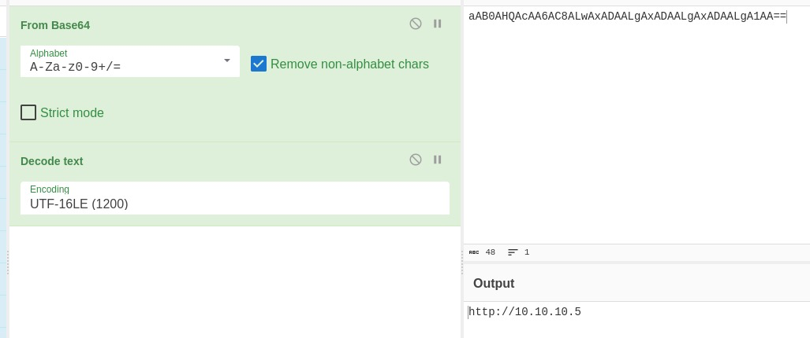

# Investigating with Splunk

Investigate anomalies using Splunk.

[Link](https://tryhackme.com/room/investigatingwithsplunk)

## _**1: Investigating with Splunk**_

SOC Analyst **Johny** has observed some anomalous behaviours in the logs of a few windows machines. It looks like the adversary has access to some of these machines and successfully created some backdoor. His manager has asked him to pull those logs from suspected hosts and ingest them into Splunk for quick investigation. Our task as SOC Analyst is to examine the logs and identify the anomalies.

To learn more about Splunk and how to investigate the logs, look at the rooms [splunk101](https://tryhackme.com/room/splunk101) and [splunk201](https://tryhackme.com/room/splunk201).

Room Machine

Before moving forward, deploy the machine. When you deploy the machine, it will be assigned an IP **Machine IP**: `MACHINE_IP`. You can visit this IP from the VPN or the Attackbox. The machine will take up to 3-5 minutes to start. All the required logs are ingested in the index **main.**

**Questions**

How many events were collected and Ingested in the index main?

- search for `index=main` to show all alerts
- 12256

On one of the infected hosts, the adversary was successful in creating a backdoor user. What is the new username?

- `index=main EventID=4720` 
- 4720 is the account creation EventID
- A1berto

On the same host, a registry key was also updated regarding the new backdoor user. What is the full path of that registry key?

- `index=main Hostname="Micheal.Beaven" A1berto`
- `index=main Category="Registry object added or deleted (rule: RegistryEvent)" A1berto`
- HKLM\SAM\SAM\Domains\Account\Users\Names\A1berto 

Examine the logs and identify the user that the adversary was trying to impersonate.

- Alberto
- `index=main` look at users

What is the command used to add a backdoor user from a remote computer?

- `index=main A1berto net user` look at the CommandLine field
- C:\windows\System32\Wbem\WMIC.exe" /node:WORKSTATION6 process call create "net user /add A1berto paw0rd1

How many times was the login attempt from the backdoor user observed during the investigation?

- `index=main A1berto` no EventID for logon
- 0

What is the name of the infected host on which suspicious Powershell commands were executed?

- `index=main powershell`
- James.browne 

PowerShell logging is enabled on this device. How many events were logged for the malicious PowerShell execution?

- `index=main EventID=4103` eventid for powershell command logging
- 79

An encoded Powershell script from the infected host initiated a web request. What is the full URL?

- `index=main powershell`
- exapnd the first event and copy the message to cyberchef
- [CyberChef](https://www.google.com/url?sa=t&rct=j&q=&esrc=s&source=web&cd=&cad=rja&uact=8&ved=2ahUKEwiGk7Lo-LD-AhWPM8AKHTteCrsQFnoECA4QAQ&url=https%3A%2F%2Fgchq.github.io%2FCyberChef%2F&usg=AOvVaw3cJhXGWs_4gKkmjmhQLSNC)
- remove the beginning and end of message then decode text using UTF-16LE(1200)
- You can now see a FroMBASe64StRInG with a news.php, Decode the string like the last one
- hxxp[://]10[.]10[.]10[.]5/news[.]php

