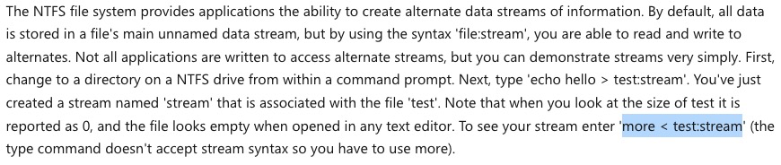
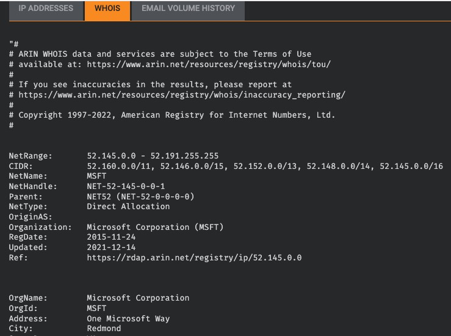

# Sysinternals

Use the Sysinternals tools to analyze Windows systems or applications

## _**1: Introduction**_

What are the tools known as **Sysinternals**?

The Sysinternals tools is a compilation of over 70+ Windows-based tools. Each of the tools falls into one of the following categories:

- File and Disk Utilities
- Networking Utilities
- Process Utilities
- Security Utilities
- System Information
- Miscellaneous

The Sysinternals tools and its website (sysinternals.com) were created by Mark Russinovich in the late '90s, along with Bryce Cogswell under the company Wininternals Software.  

In 2006, Microsoft acquired Wininternals Software, and Mark Russinovich joined Microsoft. Today he is the CTO of Microsoft Azure. 

Mark Russinovich made headlines when he reported that Sony embedded rootkits into their music CDs back in 2005. This discovery was made known thanks to one of the Sysinternals tools he was testing. You can read more about that [here](https://www.virusbulletin.com/virusbulletin/2005/12/inside-sony-s-rootkit).  

He also discovered in 2006 that Symantec was using rootkit-like technology. You can read more about that [here](https://www.zdnet.com/article/symantec-confesses-to-using-rootkit-technology/). 

The Sysinternals tools are extremely popular among IT professionals who manage Windows systems. These tools are so popular that even red teamers and adversaries alike use them. Throughout this room, I'll note which tools MITRE has identified to have been used by adversaries. 

The goal of this room is to introduce you to a handful of Sysinternals tools with the hopes that you will expand on this knowledge with your own research and curiosity.

Hopefully, you can add Sysinternals to your toolkit, as many already have.

## _**2: Install the Sysinternals Suite**_

Time to get our hands dirty with Sysinternals.

The Sysinternals tool(s) can be downloaded and run from the local system, or the tool(s) can be run from the web. 

Regarding local install/run, you can download the entire suite or just the tool(s) you need.

If you wish to download a tool or two but not the entire suite, you can navigate to the **Sysinternals Utilities Index** page, [https://docs.microsoft.com/en-us/sysinternals/downloads/](https://docs.microsoft.com/en-us/sysinternals/downloads/), and download the tool(s). If you know which tool you want to download, then this is fine. The tools are listed in alphabetical order are not separated by categories.

Alternatively, you can use the category links to find and download the tool(s). This route is better since there are so many tools you can focus on all the tools of interest instead of the entire index.

For example, let's say you need tools to inspect Windows processes; then, you can navigate to the **Process Utilities** page, [https://docs.microsoft.com/en-us/sysinternals/downloads/process-utilities/](https://docs.microsoft.com/en-us/sysinternals/downloads/process-utilities/), for all the tools that fall under this category.

Notice that you are conveniently supplied with a brief explanation for each tool. 

Lastly, you can do the same from the Sysinternals Live URL, [https://live.sysinternals.com/](https://live.sysinternals.com/). This is the same URL to use if you wish to run the tool from the web. We will look at how to accomplish this in the next section.

If you chose to download from this page, it is similar to the Sysinternals Utilities Index page. The tools are listed in alphabetical order and are not separated by categories.

If you wish to download the Sysinternals Suite, you can download the zip file from [here](https://docs.microsoft.com/en-us/sysinternals/downloads/sysinternals-suite).

The suite has a select number of Sysinternal tools. See below for a rundown of the tools included in the suite.

After you download the zip file, you need to extract the files. After the files are extracted, the extra step, which is by choice, is to add the folder path to the environment variables. By doing so, you can launch the tools via the command line without navigating to the directory the tools reside in. 

**Environment Variables** can be edited from **System Properties**.

The System Properties can be launched via the command line by running `sysdm.cpl`. Click on the `Advanced` tab then `Environment Variables` at the bottom.

Select `Path` under `System Variables` and select Edit... then OK.

In the next screen select `New` and enter the folder path where the Sysinternals Suite was extracted to. Press OK to confirm the changes.

Open a new command prompt (elevated) to confirm that the Sysinternals Suite can be executed from any location.

A local copy of the Sysinternals Suite is located in `C:\Tools\Sysint`. 

Alternatively, a PowerShell module can download and install all of the Sysinternals tools. 

- PowerShell command: `Download-SysInternalsTools C:\Tools\Sysint`

Now let's look at how to run the Sysinternals tools from the web.

**Questions**

What is the last tool listed within the Sysinternals Suite?

- zoomit

## _**3: Usijng Sysinternals Live**_

Per the Sysinternals website, "Sysinternals Live is a service that enables you to execute Sysinternals tools directly from the Web without hunting for and manually downloading them. Simply enter a tool's Sysinternals Live path into Windows Explorer or a command prompt as **live.sysinternals.com/<toolname>** or **\\\\live.sysinternals.com\\tools\\<toolname>**."

Let's take a look at how we can do this.

Based on the instructions, to launch Process Monitor from the web the syntax is `\\live.sysinternals.com\tools\procmon.exe`.

And it fails.

To resolve this issue the WebDAV client must be installed and running on the machine. The WebDAV protocol is what allows a local machine to access a remote machine running a WebDAV share and perform actions in it.

On a Windows 10 client, the WebDAV client is installed but the client is most likely not running. If you try to run a Sysinternals tool it will fail with a message "The network path was not found."

  

Command: `get-service webclient`

The service needs to be started before attempting to call any Sysinternals tool in this fashion.

Command: `start-service webclient`

  

Verify it's running before proceeding.

Command: `get-service webclient`

  

Also, **Network Discovery** needs to be enabled as well. This setting can be enabled in the **Network and Sharing Center**.

There are a few ways to open the Network and Sharing Center. Here is a neat command line to launch it.

Command: `control.exe /name Microsoft.NetworkAndSharingCenter`

  

Click on `Change advanced sharing settings` and select `Turn on network discovery` for your current network profile.

The attached VM is a Windows Server 2019 edition. The WebDAV client is not installed by default.  

The feature to install on Windows Server is **WebDAV Redirector**. This feature can be installed via **Server Manager** or using **PowerShell**.

To install with PowerShell, `Install-WindowsFeature WebDAV-Redirector –Restart`. The server needs to reboot for the installation to complete.

After reboot, the installation can be verified with the following PowerShell command, `Get-WindowsFeature WebDAV-Redirector | Format-Table –Autosize`.

  

The same process as with a Windows 10 client applies from this point:

- Make sure the WebClient service is running
- Make sure Network Discovery is enabled

Now with all the necessary components installed and enabled the local machine is ready to run Sysinternals tools from the web. 

There are 2 ways the tools can be run:

- Run the tool from the command line (as shown above from the Windows 10 machine)
- Create a network drive and run the tool from the mapped drive

Method 1 - Run tool from command line

  

Method 2 - Run tool from a mapped drive

Command: `net use * \\live.sysinternals.com\tools\`

**Note**: The asterisk will auto-assign a drive letter. The asterick can be replaced with an actual drive letter instead.

  

The website is now browsable within the local machine.

  

`y:`  
Command: `procmon /?`

  

Now that we got that out of the way time to start exploring some of these tools.

**Questions**

What service needs to be enabled on the local host to interact with live.sysinternals.com?

- webclient

##  _**4: File and Disk Utilities**_

Each task within this room will focus on 1 or 2 tools per section (maybe more).

Again, the goal is to introduce you to the Sysinternals tools, but there are far too many tools to go into each tool in depth.

**Sigcheck**

"**Sigcheck** is a command-line utility that shows file version number, timestamp information, and digital signature details, including certificate chains. It also includes an option to check a file’s status on VirusTotal, a site that performs automated file scanning against over 40 antivirus engines, and an option to upload a file for scanning." (**official definition**)

  

Command: `sigcheck -accepteula`

From the official Sigcheck [page](https://docs.microsoft.com/en-us/sysinternals/downloads/sigcheck), a use case is identified towards the bottom of the page.

If you completed the Core Windows Processes room you should be aware that the location of all the executables is `C:\Windows\System32`, except for **Explorer.exe** (which is `C:\Windows`).

Use Case: Check for unsigned files in C:\\Windows\\System32.

Command: `sigcheck -u -e C:\Windows\System32`

  

Parameter usage:

- `-u` "If VirusTotal check is enabled, show files that are unknown by VirusTotal or have non-zero detection, otherwise show only unsigned files."
- `-e` "Scan executable images only (regardless of their extension)"

**Note**: If the results were different it would warrant an investigation into any listed executables. 

**Streams**

"The NTFS file system provides applications the ability to create alternate data streams of information. By default, all data is stored in a file's main unnamed data stream, but by using the syntax 'file:stream', you are able to read and write to alternates." (**official definition**)

Alternate Data Streams (ADS) is a file attribute specific to Windows NTFS (New Technology File System). Every file has at least one data stream ($DATA) and ADS allows files to contain more than one stream of data. Natively Window Explorer doesn't display ADS to the user. There are 3rd party executables that can be used to view this data, but Powershell gives you the ability to view ADS for files.

Malware writers have used ADS to hide data in an endpoint, but not all its uses are malicious. When you download a file from the Internet unto an endpoint, there are identifiers written to ADS to identify that it was downloaded from the Internet.

Command: `streams -accepteula`

Example: A file downloaded from the Internet.

Command: `streams C:\Users\Administrator\Desktop\SysinternalsSuite.zip -accepteula`

Since the file has this identifier, additional security measures are added to its properties.

You can read more on streams [here](https://docs.microsoft.com/en-us/sysinternals/downloads/streams).

**SDelete**

"**SDelete** is a command line utility that takes a number of options. In any given use, it allows you to delete one or more files and/or directories, or to cleanse the free space on a logical disk."

As per the official documentation page, SDelete (**Secure Delete**) implemented the **DOD 5220.22-M** (Department of Defense clearing and sanitizing protocol).

Source: [https://www.lifewire.com/dod-5220-22-m-2625856](https://www.lifewire.com/dod-5220-22-m-2625856)

SDelete has been used by adversaries and is associated with MITRE techniques [T1485](https://attack.mitre.org/techniques/T1485/) (**Data Destruction**) and [T1070.004](https://attack.mitre.org/techniques/T1070/004/) (**Indicator Removal on Host: File Deletion**). It's MITRE ID [S0195](https://attack.mitre.org/software/S0195/).  

You can review this tool more in-depth by visiting its Sysinternals SDelete [page](https://docs.microsoft.com/en-us/sysinternals/downloads/sdelete). 

Other tools fall under the **File and Disk Utilities** category. I encourage you to explore these tools at your own leisure.

Link: [https://docs.microsoft.com/en-us/sysinternals/downloads/file-and-disk-utilities](https://docs.microsoft.com/en-us/sysinternals/downloads/file-and-disk-utilities) 

**Question**

There is a txt file on the desktop named file.txt. Using one of the three discussed tools in this task, what is the text within the ADS?

- start attach box and then run `remmina` from the terminal
- enter the IP, username, and password from Task 1
- expand the rdp session to full screen then use stretch screen mode on the remmina tool bar
- open command prompt
- `cd Desktop`
- `streams file.txt`
- you can see there is *ads.txt*
- `more <file.txt:ads.txt` from Microsoft link
- I am hiding in the stream.
- Hint: Use the streams command to find the stream file name. Use "notepad .\file.txt:example.txt" to open the stream file.
- `notepad .\file.txt:ads.txt`
- Powershell: `get-item -path .\file.txt -stream *`
- Powershell: `get-content -path .\file.txt -stream ads.txt`

## _**5: Networking Utilities**_

**TCPView**

"**TCPView** is a Windows program that will show you detailed listings of all TCP and UDP endpoints on your system, including the local and remote addresses and state of TCP connections. On Windows Server 2008, Vista, and XP, TCPView also reports the name of the process that owns the endpoint. TCPView provides a more informative and conveniently presented subset of the Netstat program that ships with Windows. The TCPView download includes Tcpvcon, a command-line version with the same functionality." (**official definition**)

This is a good time to mention that Windows has a built-in utility that provides the same functionality. This tool is called **Resource Monitor**. There are many ways to open this tool. From the command line use `resmon`.

  

Expand **TCP Connections** to view the **Remote Address** for each **Process** with an outbound connection.

  

This tool can also be called from the Performance tab within Task Manager. Look at the bottom left for the link to open Resource Monitor.

Now back to TCPView.

Command: `tcpview -accepteula`

The below image shows the default view for TCPView.

  

We can apply additional filtering by turning off TCP v4, TCP v6, UDP v4, and UDP v6 at the top toolbar, depending on which protocols we want to display. Moreover, we can click on the green flag to use the States Filter.

  

Clicking the green flag opens the **States Filter**, which provides an extensive list of options to select which connection states we want to display. Most of the connection states available apply only to TCP connections. (UDP, being a connectionless protocol, cannot offer this flexibility in filtering.)

  

The list below shows all TCP v4 and TCP v6 connections in any state except in the "Listen" state. For instance, we notice that we have one TCP connection in an _Established_ state and another connection in a _Close Wait_ state.

In the below image, I unselected Listen in the Connection States from the States Filter and turned off UDP v4 and UDP v6 from the top toolbar.

  

Now the output only displays processes with an established outbound connection.

Other tools fall under the Networking Utilities category. I encourage you to explore these tools at your own leisure.

Link: [https://docs.microsoft.com/en-us/sysinternals/downloads/networking-utilities](https://docs.microsoft.com/en-us/sysinternals/downloads/networking-utilities)

**Questions**

Using WHOIS tools, what is the ISP/Organization for the remote address in the screenshots above?

- Hint: You can use a website such as https://talosintelligence.com/ and make sure to check the whois tab.
- [Talos Intellilgence](https://talosintelligence.com/reputation_center/lookup?search=52.154.170.73#whois)
- look up 52[.]154[.]170[.]73
- Microsoft Corporation

## _**6: Process Utilities**_

**Note**: Some of these tools require you to run as an administrator.

**Autoruns**

"This utility, which has the most comprehensive knowledge of auto-starting locations of any startup monitor, shows you what programs are configured to run during system bootup or login, and when you start various built-in Windows applications like Internet Explorer, Explorer and media players. These programs and drivers include ones in your startup folder, Run, RunOnce, and other Registry keys. **Autoruns** reports Explorer shell extensions, toolbars, browser helper objects, Winlogon notifications, auto-start services, and much more. Autoruns goes way beyond other autostart utilities." (official definition)

**Note**: This is a good tool to search for any malicious entries created in the local machine to establish **Persistence**.

Launch Autoruns.

Command: `autoruns`

  

Below is a snapshot of Autoruns, showing the first couple of items from the **Everything** tab. Normally there are a lot of entries within this tab.

  

Notice all the tabs within the application. Click on each tab to inspect the items associated with each.   

The below image is a snapshot of the **Image Hijacks** tab. (At this time there is only 1 item listed)

  

**ProcDump**

"**ProcDump** is a command-line utility whose primary purpose is monitoring an application for CPU spikes and generating crash dumps during a spike that an administrator or developer can use to determine the cause of the spike." (official definition)

Command: `procdump -accepteula`

  

Alternatively, you can use **Process Explorer** to do the same.

Right-click on the process to create a **Minidump** or **Full Dump** of the process.  

  
Please refer to the examples listed on the ProcDump [page](https://docs.microsoft.com/en-us/sysinternals/downloads/procdump) to learn about all the available options with running this tool.

**Process Explorer**

"The **Process Explorer** display consists of two sub-windows. The top window always shows a list of the currently active processes, including the names of their owning accounts, whereas the information displayed in the bottom window depends on the mode that Process Explorer is in: if it is in handle mode you'll see the handles that the process selected in the top window has opened; if Process Explorer is in DLL mode you'll see the DLLs and memory-mapped files that the process has loaded." (official definition)

Command: `procexp -accepteula`

  

This tool was touched on slightly within the **Core Windows Processes** room. **Process Hacker** was intentionally used in that room to broaden your exposure to various tools that essentially perform the same tasks with subtle differences. 

Since much of the basic foundational information was discussed in the **Core Windows Processes** room, Process Explorer will be briefly touched.

In the following images, let's look at svchost.exe PID 3636 more closely.

  

  

This process is associated with the WebClient service that is needed to connect to live.sysinternals.com (WebDAV).

There should be web traffic listed in the TCP/IP tab.

  

Ideally, it would be wise to check if that IP is what we assume it is.

Various online tools can be utilized to verify the authenticity of an IP address. For this demonstration, I'll use **Talos Reputation Center**.

  

[https://talosintelligence.com/reputation\_center/lookup?search=52.154.170.73](https://talosintelligence.com/reputation_center/lookup?search=52.154.170.73)

As mentioned in the **ProcExp** description, we can see open handles associated with the process within the bottom window.

Listed as an open handle is the connection to the remote WebDAV folder.

There is an option within ProcExp to **Verify Signatures**. Once enabled, it shows up as a column within the Process view.

Other options to note include **Run at Logon** and **Replace Task Manager**.

You may have noticed that some of the processes within Process Explorer have different colors. Those colors have meaning.

Below is a snippet from MalwareBytes explaining what each of those colors means.

  

**Process Monitor**

"Process Monitor is an advanced monitoring tool for Windows that shows real-time file system, Registry and process/thread activity. It combines the features of two legacy Sysinternals utilities, Filemon and Regmon, and adds an extensive list of enhancements including rich and non-destructive filtering, comprehensive event properties such as session IDs and user names, reliable process information, full thread stacks with integrated symbol support for each operation, simultaneous logging to a file, and much more. Its uniquely powerful features will make Process Monitor a core utility in your system troubleshooting and malware hunting toolkit." (**official definition**)

Launch ProcMon.

Command: `procmon -accepteula`

  

In the below snapshot, I set a filter to capture all the events related to PID 3888, notepad.exe. You can see some of the file operations that were captured and the file path or registry path/key the action occurred on, and the operation result.

  

ProcMon will capture thousands upon thousands of events occurring within the operating system.

The option to capture events can be toggled on and off. 

  

In this ProcMon example, the session captured events only for a few seconds. Look at how many events were captured in that short space of time!

  

To use ProcMon effectively you **must** use the Filter and **must** configure it properly.

  

In the above image, a filter was already set to capture events associated with **PID** 3888. Alternatively, a filter could have been set to capture events with the **Process Name** = notepad.exe. 

[Here](https://adamtheautomator.com/procmon/) is a useful guide on configuring ProcMon.

**Note**: To fully understand the output from some of these tools you need to understand some Windows concepts, such as [Processes and Threads](https://docs.microsoft.com/en-us/windows/win32/procthread/about-processes-and-threads) and [Windows API](https://docs.microsoft.com/en-us/windows/win32/apiindex/windows-api-list) calls.    

**PsExec**

"**PsExec** is a light-weight telnet-replacement that lets you execute processes on other systems, complete with full interactivity for console applications, without having to manually install client software. PsExec's most powerful uses include launching interactive command-prompts on remote systems and remote-enabling tools like IpConfig that otherwise do not have the ability to show information about remote systems." (official definition)

Command: `psexec -accepteula`

  

PsExec is another tool that is utilized by adversaries. This tool is associated with MITRE techniques [T1570](https://attack.mitre.org/techniques/T1570) (**Lateral Tool Transfer**), [T1021.002](https://attack.mitre.org/techniques/T1021/002) (**Remote Services: SMB/Windows Admin Shares**), and [T1569.002](https://attack.mitre.org/techniques/T1569/002) (**System Services: Service Execution**). It's MITRE ID is [S0029](https://attack.mitre.org/software/S0029/).

You can review this tool more in-depth by visiting its Sysinternals PsExec [page](https://docs.microsoft.com/en-us/sysinternals/downloads/psexec). You can also check out this resource [page](https://adamtheautomator.com/psexec-ultimate-guide/).

Other tools fall under the Process Utilities category. I encourage you to explore these tools at your own leisure.

Link: [https://docs.microsoft.com/en-us/sysinternals/downloads/process-utilities](https://docs.microsoft.com/en-us/sysinternals/downloads/process-utilities)

**Questions**

Run Autoruns and inspect what are the new entries in the Image Hijacks tab compared to the screenshots above.

What entry was updated?  

- taskmgr.exe

What is the updated value?

- C:\TOOLS\SYSINIT\PROCEXP.EXE

## _**7: Security Utilities**_

**Sysmon**

"System Monitor (Sysmon) is a Windows system service and device driver that, once installed on a system, remains resident across system reboots to monitor and log system activity to the Windows event log. It provides detailed information about process creations, network connections, and changes to file creation time. By collecting the events it generates using Windows Event Collection or SIEM agents and subsequently analyzing them, you can identify malicious or anomalous activity and understand how intruders and malware operate on your network." (**official definition**)

Sysmon is a comprehensive tool, and it can't be summarized in just one section.

Check out the Sysmon [room](https://tryhackme.com/room/sysmon) to further learn what Sysmon is and how to use it.  

  

Other tools fall under the Security Utilities category. I encourage you to explore these tools at your own leisure.

Link: [https://docs.microsoft.com/en-us/sysinternals/downloads/security-utilities](https://docs.microsoft.com/en-us/sysinternals/downloads/security-utilities)

## _**8: System Information**_

**WinObj**

"**WinObj** is a 32-bit Windows NT program that uses the native Windows NT API (provided by NTDLL.DLL) to access and display information on the NT Object Manager's name space." (**official definition**)

To showcase this tool, let's look into the concept of **Session 0** and **Session 1** that was mentioned in the Core Windows Processes room.

Remember that Session 0 is the OS session and Session 1 is the User session. Also recall that there will be at least 2 csrss.exe processes running, one for each session. **Note Session 1 will be for the first user logged into the system**. 

Launch WinObj.

Command: `winobj -accepteula`

  

The below image shows the default view for WinObj.

  

Within Session 0, under `DosDevices`, there is an entry for the network drive I mounted in my local machine.  

  

Let's look at `WindowStations` value for Session 1. 

  

Let's compare this information with Process Explorer. The below image is for **csrss.exe**, which was launched along with **winlogon.exe** by **smss.exe**.

  

**Note**: This is a high-level exposure for this tool.

Other tools fall under the **System** Information category. I encourage you to explore these tools at your own leisure.

Link: [https://docs.microsoft.com/en-us/sysinternals/downloads/system-information](https://docs.microsoft.com/en-us/sysinternals/downloads/system-information)

## _**9: Miscellaneous**_

**BgInfo**

"It automatically displays relevant information about a Windows computer on the desktop's background, such as the computer name, IP address, service pack version, and more." (**official definition**)

Command: `bginfo -accepteula`

  

This is a handy utility if you manage multiple machines. This tool, or similar tools, are typically utilized on servers. When a user RDPs into a server, the system information is displayed on the wallpaper to provide quick information about the server, such as the server's name.

Refer to the Sysinternals BgInfo [page](https://docs.microsoft.com/en-us/sysinternals/downloads/bginfo) for more information on installation and usage.

**RegJump**

"This little command-line applet takes a registry path and makes Regedit open to that path. It accepts root keys in standard (e.g. HKEY\_LOCAL\_MACHINE) and abbreviated form (e.g. HKLM)." (official definition)

When navigating through the registry using the Registry Editor, one must manually drill down to the key you wish to inspect.

  

There are multiple ways to query the Windows Registry without using the Registry Editor, such as via the command line (`reg query`) and PowerShell (`Get-Item`/`Get-ItemProperty`).

Using Regjump will open the Registry Editor and automatically open the editor directly at the path, so one doesn't need to navigate it manually.

Command: `regjump -accepteula`

  

Command: `regjump HKLM\System\CurrentControlSet\Services\WebClient -accepteula`

  

**Strings**

"Strings just scans the file you pass it for UNICODE (or ASCII) strings of a default length of 3 or more UNICODE (or ASCII) characters. Note that it works under Windows 95 as well." (official definition)

This is the tool that was used on Day 21 of AoC2 to inspect a mysterious binary.

The example below **strings** is used to search within the ZoomIt binary for any string containing the word 'zoom'.

Command: `strings .\ZoomIt.exe | findstr /i zoom*`

  

Other tools fall under the **Miscellaneous** category. I encourage you to explore these tools at your own leisure.

Link: [https://docs.microsoft.com/en-us/sysinternals/downloads/misc-utilities](https://docs.microsoft.com/en-us/sysinternals/downloads/system-information)

_**Questions**_

Run the Strings tool on ZoomIt.exe. What is the full path to the .pdb file?

- open command prompt
- `cd C:\Tools\sysint`
- `strings .\ZoomIt.exe | findstr /i .pdb`
- D:\a\1\s\Win32\Release\ZoomIt.pdb
- D:\a\1\s\x64\Release\ZoomIt64.pdb
- Neither worked
- go to the desktop and unzip the Sysinternals Suite
- `cd C:\Users\Administrator\Desktop\SysinternalsSuite`
- `strings .\ZoomIt.exe | findstr /i .pdb`
- Found answer in a youtube video and submitted a bug ticket to fix.
- [YouTube](https://youtu.be/CzMBmfcN3NU?t=2288)
- `C:\agent\_work\112\s\Win32\Release\ZoomIt.pdb`

## _**10: Conclusion**_

When you read the Sysinternals documentation, it might hint these tools are for troubleshooting purposes only, but that is not entirely the case.  

You should know or be familiar with the Sysinternals tools whether you're a Desktop Engineer, Systems Analyst, or Security Engineer.

**Real-world scenario**: As a security engineer, I had to work with vendors to troubleshoot why an agent wasn't responding on an endpoint—the tools used were **ProcExp**, **ProcMon**, and **ProcDump**.

- ProcExp = to inspect the agent process, its properties, and associated threads and handles.
- ProcMon = to investigate if there were any indicators on why the agent was not operating as it should.
- ProcDump = to create a dump of the agent process to send to the vendor for further analysis.

And guess what? Asking questions about Sysinternals became part of the interview questions when hiring additional staff.

Remember, red teamers and adversaries even use these tools.  

Below are some additional links to further your knowledge on how to use these tools as a Security Analyst, Security Engineer, or even an Incident Responder:

- Mark's Blog - [https://docs.microsoft.com/en-us/archive/blogs/markrussinovich/](https://docs.microsoft.com/en-us/archive/blogs/markrussinovich/)
- Windows Blog Archive - [https://techcommunity.microsoft.com/t5/windows-blog-archive/bg-p/Windows-Blog-Archive/label-name/Mark%20Russinovich](https://techcommunity.microsoft.com/t5/windows-blog-archive/bg-p/Windows-Blog-Archive/label-name/Mark%20Russinovich)
- License to Kill: Malware Hunting with Sysinternals Tools - [https://www.youtube.com/watch?v=A\_TPZxuTzBU](https://www.youtube.com/watch?v=A_TPZxuTzBU)  
    
- Malware Hunting with Mark Russinovich and the Sysinternals Tools - [https://www.youtube.com/watch?v=vW8eAqZyWeo](https://www.youtube.com/watch?v=vW8eAqZyWeo)

**Note**: Some of the videos/blogs are a bit outdated, but they're still good to review as it showcases how to use these tools extensively. This will build your foundation on the tools covered, along with the tools that weren't covered in this room.

