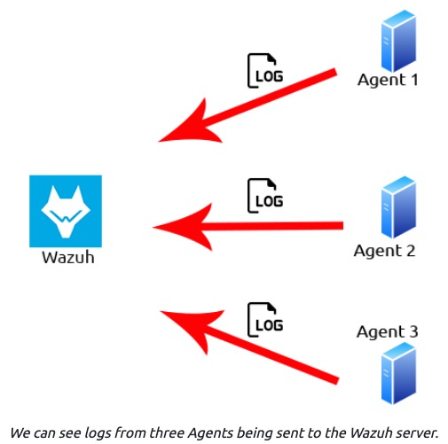

# Wazuh

Wazuh is a free, open source and enterprise-ready security monitoring solution for threat detection, integrity monitoring.

[Link](https://tryhackme.com/room/wazuhct)

## _**1: Introduction**_

Welcome to a room showcasing the capabilities of the Wazuh EDR software solution. In this room, you can expect to learn the following things:

- What is an EDR and why are they useful solutions
- Where an EDR like Wazuh is used
- Accessing Wazuh
- Navigating Wazuh
- Learning about Wazuh rules and alerts
- Digesting logs to view specific events on devices including Linux and Windows
- How you can extend Wazuh using plugins and its API

Firstly, let's understand what EDR solutions are exactly. Endpoint detection and response (EDR) are a series of tools and applications that monitor devices for an activity that could indicate a threat or security breach. These tools and applications have features that include:

- Auditing a device for common vulnerabilities
- Proactively monitoring a device for suspicious activity such as unauthorised logins, brute-force attacks or privilege escalations
- Visualising complex data and events into neat and trendy graphs
- Recording a device's normal operating behaviour to help with detecting anomalies

  

Created in 2015, [Wazuh](https://wazuh.com/) is an open-source, freely available and extensive EDR solution. It can be used in all scales of environments. Wazuh operates on a management and agent module. Simply, a device is dedicated to running Wazuh named a manager, where Wazuh operates on a management and agent model where the manager is responsible for managing agents installed on the devices you’d like to monitor. Let's look at this model in the diagram below:

**Questions**

When was Wazuh released?

- 2015

What is the term that Wazuh calls a device that is being monitored for suspicious activity and potential security threats? 

- agent

Lastly, what is the term for a device that is responsible for managing these devices?

- manager

## _**2: Required: Deploy Wazuh Server**_

Connect to the TryHackMe network and deploy the Wazuh management server attached to this task and wait a minimum of five minutes before visiting the Wazuh server on HTTPS://MACHINE_IP . It is essential that you prefix the IP address (MACHINE_IP) with HTTPS like so: HTTPS://MACHINE_IP

If you load the Wazuh management server too early, it will say "Kibana Server is not ready yet" Please wait a few more minutes before refreshing the page and trying again.

Select "Global Tenant" after successfully logging in.

Note: The questions within the tasks of this room will expect the data stored on this Wazuh management server, so it is vital that you are able to connect to this server before continuing.  

The Wazuh management server in this room will show the agents as being disconnected - this is expected. 

## _**3: Wazuh Agents**_

