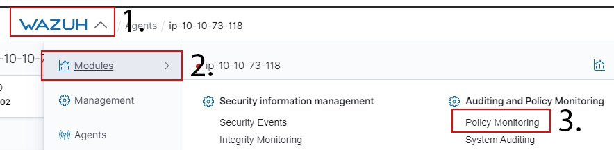
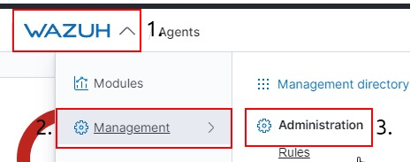
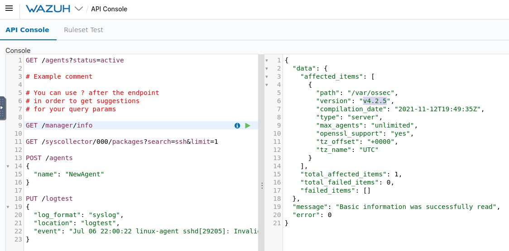

# Wazuh

Wazuh is a free, open source and enterprise-ready security monitoring solution for threat detection, integrity monitoring.

[Link](https://tryhackme.com/room/wazuhct)

## _**1: Introduction**_

Welcome to a room showcasing the capabilities of the Wazuh EDR software solution. In this room, you can expect to learn the following things:

- What is an EDR and why are they useful solutions
- Where an EDR like Wazuh is used
- Accessing Wazuh
- Navigating Wazuh
- Learning about Wazuh rules and alerts
- Digesting logs to view specific events on devices including Linux and Windows
- How you can extend Wazuh using plugins and its API

Firstly, let's understand what EDR solutions are exactly. Endpoint detection and response (EDR) are a series of tools and applications that monitor devices for an activity that could indicate a threat or security breach. These tools and applications have features that include:

- Auditing a device for common vulnerabilities
- Proactively monitoring a device for suspicious activity such as unauthorised logins, brute-force attacks or privilege escalations
- Visualising complex data and events into neat and trendy graphs
- Recording a device's normal operating behaviour to help with detecting anomalies

  

Created in 2015, [Wazuh](https://wazuh.com/) is an open-source, freely available and extensive EDR solution. It can be used in all scales of environments. Wazuh operates on a management and agent module. Simply, a device is dedicated to running Wazuh named a manager, where Wazuh operates on a management and agent model where the manager is responsible for managing agents installed on the devices you’d like to monitor. Let's look at this model in the diagram below:


**Questions**

When was Wazuh released?

- 2015

What is the term that Wazuh calls a device that is being monitored for suspicious activity and potential security threats? 

- agent

Lastly, what is the term for a device that is responsible for managing these devices?

- manager


## _**2: Required: Deploy Wazuh Server**_

Connect to the TryHackMe network and deploy the Wazuh management server attached to this task and wait a minimum of five minutes before visiting the Wazuh server on HTTPS://MACHINE_IP . It is essential that you prefix the IP address (MACHINE_IP) with HTTPS like so: HTTPS://MACHINE_IP

If you load the Wazuh management server too early, it will say "Kibana Server is not ready yet" Please wait a few more minutes before refreshing the page and trying again.

Select "Global Tenant" after successfully logging in.

Note: The questions within the tasks of this room will expect the data stored on this Wazuh management server, so it is vital that you are able to connect to this server before continuing.  

The Wazuh management server in this room will show the agents as being disconnected - this is expected. 

## _**3: Wazuh Agents**_

Devices that record the events and processes of a system are called agents. Agents monitor the processes and events that take place on the device, such as authentication and user management. Agents will offload these logs to a designated collector for processing, such as Wazuh.

In order for Wazuh to be populated, agents need to be installed onto devices to log such events. Wazuh can guide you through the agent deployment process provided you fill out some pre-requisites such as::

- Operating System
- The address of the Wazuh server that the agent should send logs to (this can be a DNS entry or an IP address)
- What group the agent will be under - you can sort agents into groups within Wazuh if you wish

This wizard can be launched by navigating to the following location on the Wazuh server: **Wazuh -> Agents -> Deploy New Agent** as illustrated in this screenshot below:

  

Once you navigate to this display, the intuitive wizard will be available to you. I have shared screenshots of using the wizard to install Wazhur's agent on both Windows and Debian/Ubuntu. At stage 4, you are given a command to copy and paste to your clipboard which will install & configure the agent on the device that you wish to collect logs from.

**Installing the Wazuh agent on Windows:**

  

**Installing the Wazuh agent on Debian/Ubuntu:** 

  

**Questions**

Ensure that you are logged in to the Wazuh management server on HTTPS://Machine_IP

- 

Navigate to the "Agents" tab by pressing Wazuh -> Agents

- 

How many agents does this Wazuh management server manage?

- 2

What are the status of the agents managed by this Wazuh management server?

- disconnected


## _**4: Wazuh Vulnerability Assessment & Security Events**_

Wazuh’s Vulnerability Assessment module is a powerful tool that can be used to periodically scan an agent's operating system for installed applications and their version numbers.

Once this information has been gathered, it is sent back to the Wazuh server and compared against a database of CVEs to discover potential vulnerabilities. For example, the agent in the screenshot below has a version of Vim that is vulnerable to **CVE-2019-12735**.

  

The vulnerability scanner module will perform a full scan when the Wazuh agent is first installed on a device and **must** be configured to run at a set interval then after (by default, this is set to 5 minute intervals when enabled) like so:  

  

_Configuring the Wazuh management server to audit agents for vulnerabilities frequently (/var/ossec/etc/ossec.conf)_

  

Wazuh is capable of testing an agent's configuration against certain rulesets to check for compliance. However, out of the box, it is arguably sensitive. Take, for example, this Linux host running the Wazuh agent. There have been a total of 769 events occurring that the system performs as part of its daily maintenance


These frequent actions, such as removing files, are often detected as a security event. These events and the related severities are determined by Wazuh's rulesets, which is something that we will come on to explore adjusting in another task.

We can analyze these events individually by selecting the event's dropdown. You can sort events based upon various factors such as timestamp, tactics, or description.


**Questions**

Ensure that you are logged in to the Wazuh management server on HTTPS://10.10.246.88

- 

Navigate to the Agents tab by pressing Wazuh -> Agents like so

- 

Select the agent named "AGENT-001"

- 

How many "Security Event" alerts have been generated by the agent "AGENT-001"?

Note: You will need to make sure that your time range includes the 11th of March 2022

- 196


## _**5: Wazuh Policy Auditing**_

Wazuh is capable of auditing and monitoring an agent's configuration whilst proactively recording event logs. When the Wazuh agent is installed, an audit is performed where a metric is given using multiple frameworks and legislations such as NIST, MITRE and GDPR.

For example, see how this agent DC-01 scores against MITRE, NIST, and SCA:

  

These frameworks are outlined in the [Pentesting Fundamentals](https://tryhackme.com/room/pentestingfundamentals) room if you wish to learn more about them.

Wazuh presents a broad illustration of the logs. We can use the visualizations to break down this data and explore it further. Let's do this with the same agent. For example, see the benchmark for this domain controller running on a windows server:

  

**Questions**

Ensure that you are logged in to the Wazuh management server on MACHINE_IP

- 

Navigate to the "Modules" tab by pressing Wazuh -> Modules and open the "Policy Management" module like so:




## _**6: Monitoring Logons with Wazuh**_

Wazuh's security event monitor is capable to actively record both successful and unsuccessful authentication attempts. The rule with an id of 5710 detects attempted connections that are unsuccessful for the SSH protocol. Let's look at this animated picture below as an example.


The alert was created because someone tried to log onto the agent "**ip-10-10-73- 118**" with the user "**cmnatic**" which does not exist. I have summarized this alert into the table below:

<table class="table table-bordered"><tbody><tr><td><b>Field</b></td><td><b>Value</b></td><td><b>Description</b></td></tr><tr><td>agent.ip</td><td>10.10.73.118</td><td>This is the IP address of the agent that the alert was triggered on.</td></tr><tr><td>agent.name</td><td>ip-10-10-73-118</td><td>This is the hostname of the agent that the alert was triggered on.</td></tr><tr><td>rule.description</td><td>sshd: Attempt to login using a non-existent user</td><td>This field is a brief description of what the event is alerting to.</td></tr><tr><td>rule.mitre.technique</td><td>Brute-Force</td><td><span>This field explains the MITRE technique that the alert pertains to.</span></td></tr><tr><td>rule.mitre.id</td><td>T1110</td><td><span>This field is the MITRE ID of the alert</span></td></tr><tr><td>rule.id</td><td>5710</td><td>This field is the ID assigned to the alert by Wazuh's ruleset</td></tr><tr><td>location</td><td>/var/log/auth.log</td><td>This field is the location of the file that the alert was generated from on the agent. In this example, it is the authentication log on the linux agent.</td></tr></tbody></table>

For reference, this alert is stored in a specific file on the Wazuh management server: `/var/ossec/logs/alerts/alerts.log`. We can use a command such as grep or nano to search through this file on the management server manually.

```
Viewing the Wazuh logon alert log for a login session (su) on the root account by the ubuntu user

ubuntu@wazuh-server:~$ sudo less /var/ossec/logs/alerts/alerts.log
** Alert 1634284538.566764: - pam,syslog,authentication_success,pci_dss_10.2.5,gpg13_7.8,gpg13_7.9,gdpr_IV_32.2,hipaa_164.312.b,ni>
2021 Oct 15 07:55:38 ip-10-10-218-190->/var/log/auth.log
Rule: 5501 (level 3) -> 'PAM: Login session opened.'
User: root
Oct 15 07:55:37 ip-10-10-218-190 sudo: pam_unix(sudo:session): session opened for user root by ubuntu(uid=0)
uid: 0
```     

Looking at the animated gif below, we can see how Wazuh has created an alert for successful login to a Window's server running the Wazuh agent. Because this attempt was successful, the severity of the alert is considered less than that of an unsuccessful login. This can, of course, be tailored to your environment. For example, if a user infrequently used is logged on, you can configure Wazuh to list this alert with higher severity.  


  

The animated gif below shows the number of Windows agent events/alerts triggered to show how many times a user has logged on. . In this case, it narrows down the total logon events of **285** to **79**.

  

**QUESTIONS**

Ensure that you are logged in to the Wazuh management server on 10.10.229.53

- 

Navigate to the "Management" tab by pressing Wazuh -> Management and open the "Rules" module like so:



## _**7: Collecting Windows Logs with Wazuh**_

All sorts of actions and events are captured and recorded on a Windows operating system. This includes authentication attempts, networking connections, files that were accessed, and the behaviours of applications and services. This information is stored in the Windows event log using a tool called Sysmon.

We can use the Wazuh agent to aggregate these events recorded by _Sysmon_ for processing to the Wazuh manager. Now, we will need to configure both the Wazuh agent and the Sysmon application.  Sysmon uses rules that are made in XML formatting to be triggered. For example, in the XML snippet below, we are telling Sysmon to monitor for the event of the powershell.exe process starting.

```
A Sysmon configuration file for monitoring the Powershell process

Sysmon schemaversion="3.30" 
         HashAlgorithms md5 /HashAlgorithms 
  EventFiltering 
  !--SYSMON EVENT ID 1 : PROCESS CREATION-- 
  ProcessCreate onmatch="include" 
  Image condition="contains" powershell.exe /Image 
  /ProcessCreate 
  !--SYSMON EVENT ID 2 : FILE CREATION TIME RETROACTIVELY CHANGED IN THE FILESYSTEM-- 
  FileCreateTime onmatch="include"  /FileCreateTime 
  !--SYSMON EVENT ID 3 : NETWORK CONNECTION INITIATED-- 
  NetworkConnect onmatch="include"  /NetworkConnect 
  !--SYSMON EVENT ID 4 : RESERVED FOR SYSMON STATUS MESSAGES, THIS LINE IS INCLUDED FOR DOCUMENTATION PURPOSES ONLY-- 
  !--SYSMON EVENT ID 5 : PROCESS ENDED-- 
  ProcessTerminate onmatch="include"  /ProcessTerminate 
  !--SYSMON EVENT ID 6 : DRIVER LOADED INTO KERNEL-- 
  DriverLoad onmatch="include"  /DriverLoad  
  !--SYSMON EVENT ID 7 : DLL (IMAGE) LOADED BY PROCESS-- 
  ImageLoad onmatch="include"  /ImageLoad 
  !--SYSMON EVENT ID 8 : REMOTE THREAD CREATED-- 
  CreateRemoteThread onmatch="include"  /CreateRemoteThread 
  !--SYSMON EVENT ID 9 : RAW DISK ACCESS-- 
  RawAccessRead onmatch="include"  /RawAccessRead  
  !--SYSMON EVENT ID 10 : INTER-PROCESS ACCESS-- 
  ProcessAccess onmatch="include"  /ProcessAccess 
  !--SYSMON EVENT ID 11 : FILE CREATED-- 
  FileCreate onmatch="include"  /FileCreate 
  !--SYSMON EVENT ID 12 & 13 & 14 : REGISTRY MODIFICATION-- 
  RegistryEvent onmatch="include"  /RegistryEvent 
  !--SYSMON EVENT ID 15 : ALTERNATE DATA STREAM CREATED-- 
  FileCreateStreamHash onmatch="include"  /FileCreateStreamHash  
  PipeEvent onmatch="include"  /PipeEvent 
  /EventFiltering 
 /Sysmon
```

  

To instruct Sysmon to do, we need to execute the Sysmon application and provide the aforementioned configuration file like so: `Sysmon64.exe -accepteula -i detect_powershell.xml`

  

  

  

We can verify that Sysmon has accepted our configuration file by navigating to the Event Viewer and searching for the “**Sysmon**” module like so:

  

  

Let’s launch a powershell prompt on the Windows Server and return to our Event Viewer. We can now see a record of this powershell prompt being opened, kept within the Event Viewer.

  

Now we will need to configure the Wazuh agent on this Window Server to instruct it to send these events to the Wazuh management server. To do so, we need to open the Wazuh agent file located at: `C:\Program Files (x86)\ossec-agent\ossec.conf`

  

To include the following snippet:

Configuring the Wazuh Agent's configuration

```
<localfile>
<location>Microsoft-Windows-Sysmon/Operational</location>
<log_format>eventchannel</log_format>
</localfile>
```        

Looking like so:

   

Now, we will need to restart the Wazuh agent. In this instance, I am restarting the operating system just to be sure that these changes have taken place.

  

Once this is done, we need to tell the Wazuh Management server to add Sysmon as a rule to visualize these events. This can be done by adding  an XML file to the local rules located in `/var/ossec/etc/rules/local_rules.xml`

Configuring the Wazuh Server to ingress Ssymon events

```
<group name="sysmon,">
 <rule id="255000" level="12">
 <if_group>sysmon_event1</if_group>
 <field name="sysmon.image">\\powershell.exe||\\.ps1||\\.ps2</field>
 <description>Sysmon - Event 1: Bad exe: $(sysmon.image)</description>
 <group>sysmon_event1,powershell_execution,</group>
 </rule>
</group>
```

 You will need to restart the Wazuh Management server for this to apply. Once done, we can refer back to our Wazuh Management server and notice that data has been retrieved from an agent.

**Questions**

What is the name of the tool that we can use to monitor system events?

- sysmon

What standard application on Windows do these system events get recorded to?

- event viewer


## _**8: Collecting Linux Logs with Wazuh**_

Capturing logs from a Linux agent is a simple process similar to capturing events from a Windows agent. We will be using Wazuh’s log collector service to create an entry on the agent to instruct what logs should be sent to the Wazuh management server.

For example, in this task, we will be monitoring the logs of an Apache2 web server. To begin, let’s configure the log collector service on a Linux server running the Wazuh agent.

Wazuh comes with many rules that enable Wazuh to analyze log files and can be found in `/var/ossec/ruleset/rules`. Some common applications include:

- Docker
- FTP
- WordPress
- SQL Server
- MongoDB
- Firewalld
- And many, many more (approximately 900).

However, you can always make your own rules. In this task, Wazuh will digest _Apache2_ logs using the `0250-apache_rules.xml` ruleset.

This ruleset can analyze apache2 logs for warnings and error messages like so: We will need to insert this into the Wazuh’s agent that is sending logs to the Wazuh management servers configuration file located in `/var/ossec/etc/ossec.conf`:

```
Apache2 Log Analysis

  <!-- Apache2 Log Analysis -->
  <localfile>
    <location>/var/log/example.log</location>
    <log_format>syslog</log_format>
  </localfile>
```

We will now need to restart the Linux agent running the Apache2 service.

**Questions**

What is the full file path to the rules located on a Wazuh management server?

- /var/ossec/ruleset/rules


## _**9: Auditing Commands on Linux with Wazuh**_

Wazuh utilises the `auditd` package that can be installed on Wazuh agents running on Debian/Ubuntu and CentOS operating systems. In this task, we will be using `auditd` on a Ubuntu system. `Auditd` monitors the system for certain actions and events and will write this to a log file.

We can then use the log collector module on a Wazuh agent to read this log file and send it to the Wazuh management server for processing.

First, we will need to install the `auditd` package and an `auditd` plugin. This may already be installed on your system; however, let’s install it to make sure. Let’s run the command `sudo apt-get install auditd audispd-plugins` and enable this service to run currently as well as on boot.`sudo systemctl enable auditd.service` & `sudo systemctl start auditd.service`

We will need to configure `auditd` to create a rule for the commands and events that we wish for it to monitor. In this task, we will be telling `auditd` to monitor for any commands executed as root.

You can extend this to monitor commands such as `tcpdump`, `netcat`, or _catting_ files such as _/etc/passwd_, which are all hallmarks of a breach.  

`Auditd` rules are located in the following directory: `/etc/audit/rules.d/audit.rules`. We will be adding our rules manually.

For this task, we will need to open this _audit.rules_ file and append our rule ourselves. First, let’s edit the file using `sudo nano /etc/audit/rules.d/audit.rules` and appending `-a exit,always -F arch=64 -F euid=0 -S execve -k audit-wazuh-c`

```
Monitoring commands executed as root

## First rule - delete all
-D ## Increase the buffers to survive stress events.
## Make this bigger for busy systems
-b 8192 ## This determine how long to wait in burst of events
--backlog_wait_time 0 ## Set failure mode to syslog
-f 1

-a exit,always -F arch=b64 -F euid=0 -S execve -k  audit-wazuh-c
```

We will now need to inform audits of this new rule, so let's run this command `sudo auditctl -R /etc/audit/rules.d/audit.rules` to now read the new _audit.rules_ file that we appended to in the previous task.

Now, let’s configure the system that is running a Wazuh agent that we wish to monitor these events on. We’ll be monitoring a Linux host in this case, so like in our previous tasks, we will need to configure the Wazuh agent to detect this new log file that is generated by `auditd` like so `sudo nano /var/ossec/etc/ossec.conf` and add the `auditd` log like so:

Configuring the Wazuh agent to add the auditd log as a log file to send to the Wazuh management server

```
<localfile>
    <location>/var/log/audit/audit.log</location>
    <log_format>audit</log_format>
</localfile>
```

  

**Questions**

What application do we use on Linux to monitor events such as command execution?

- auditd

What is the full path & filename for where the aforementioned application stores rules?

- /etc/audit/rules.d/audit.rules


## _**10: Wazuh API**_

**Using Our Own Client**

The Wazuh management server features a rich and extensive API to allow the Wazuh management server to be interacted with using the command line. Because the Wazuh management server requires authentication, we must first authenticate our client.

In this task, we will be using a Linux machine with the `curl` tool installed to interact with the Wazuh management server API. First, we will need to authenticate ourselves by providing a valid set of credentials to the authentication endpoint.

Once we are authenticated, the Wazuh management server will give us a token (similar to a session) that we will need to provide for any further interaction. We can store this token as an environment variable on our Linux machine like the snippet below:

(replacing _WAZUH\_MANAGEMENT\_SERVER\_IP_ with the IP address of the Wazuh management server (i.e. 10.10.246.88):

`TOKEN=$(curl -u : -k -X GET "https://WAZUH_MANAGEMENT_SERVER_IP:55000/security/user/authenticate?raw=true")`  
  
Let’s confirm that we have authenticated okay and have been given a token by the Wazuh management server:  
  
`curl -k -X GET "https://10.10.246.88:55000/" -H "Authorization: Bearer $TOKEN"`  
  
```
Wazuh API Verify Authentication

{
    "data": {
        "title": "Wazuh API",
        "api_version": "4.0.0",
        "revision": 4000,
        "license_name": "GPL 2.0",
        "license_url": "https://github.com/wazuh/wazuh/blob/master/LICENSE",
        "hostname": "wazuh-master",
        "timestamp": "2021-10-25T07:05:00+0000"
    },
    "error": 0
}
```
        

We can use the standard HTTP request methods such as `GET/POST/PUT/DELETE` by providing the relevant option after a `-X` i.e. `-X GET`

`curl -k -X GET "https://10.10.246.88:55000/manager/status?pretty=true" -H "Authorization: Bearer $TOKEN"`

For example, let’s use the Wazuh API to list some statistics and important information about the Wazuh management server, including what services are being monitored and some general settings about the Wazuh management server:

`curl -k -X GET "https://10.10.246.88:55000/manager/configuration?pretty=true§ion=global" -H "Authorization: Bearer $TOKEN"`

  
```
Getting information about the Wazuh manager

{
  "data": {
    "affected_items": [
      {
        "wazuh-agentlessd": "running",
        "wazuh-analysisd": "running",
        "wazuh-authd": "running",
        "wazuh-csyslogd": "running",
        "wazuh-dbd": "stopped",
        "wazuh-monitord": "running",
        "wazuh-execd": "running",
        "wazuh-integratord": "running",
        "wazuh-logcollector": "running",
        "wazuh-maild": "running",
        "wazuh-remoted": "running",
        "wazuh-reportd": "stopped",
        "wazuh-syscheckd": "running",
        "wazuh-clusterd": "running",
        "wazuh-modulesd": "running",
        "wazuh-db": "running",
        "wazuh-apid": "stopped"
      }
    ],
    "total_affected_items": 1,
    "total_failed_items": 0,
    "failed_items": []
  },
  "message": "Processes status were successfully read in specified node",
  "error": 0
}
```
        

Or perhaps, we can use the Wazuh management server’s API to interact with an agent:

`curl -k -X GET "https://10.10.246.88:55000/agents?pretty=true&offset=1&limit=2&select=status%2Cid%2Cmanager%2Cname%2Cnode_name%2Cversion&status=active" -H "Authorization: Bearer $TOKEN"`

```
Using the Wazuh management server’s API to interact with an agent

{
  "data": {
    "affected_items": [
      {
        "node_name": "worker2",
        "status": "active",
        "manager": "wazuh-worker2",
        "version": "Wazuh v3.13.1",
        "id": "001",
        "name": "wazuh-agent1"
      }
],
    "total_affected_items": 9,
    "total_failed_items": 0,
    "failed_items": []
  },
  "message": "All selected agents information was returned",
  "error": 0
}
```
        

**Using Wazuh's API Console**

Wazuh has a powerful, integrated API console within the Wazuh website to query management servers and agents. Whilst it is not as extensive as using your own environment (where you can create and run scripts using python, for example), it is convenient.

To find this API console, we need to open the "Tools" category within the Wazuh heading at the top:

  

You will be greeted with a few sample queries that you can run. Simply _select_ the line and _press_ the green run arrow to run the query as demonstrated below:

  

Reminder, the syntax for running queries uses the same web methods (i.e. GET/PUT/POST) and endpoints (i.e. /manager/info) as you would use with curl. You can view some more options about API endpoints by following Wazuh's detailed API documentation [here](https://documentation.wazuh.com/current/user-manual/api/reference.html)

**Questions**

What is the name of the standard Linux tool that we can use to make requests to  the Wazuh management server?

- curl

What HTTP method would we use to retrieve information for a Wazuh management server API?

- get

What HTTP method would we use to perform an action on a Wazuh management server API?

- put

Navigate to Wazuh's API console.

- 

Use the API console to find the Wazuh server's version.

Note: You will need to add the "v" prefix to the number for this answer. For example v1.2.3

- v4.2.5




## _**11: Generating Reports with Wazuh**_

Wazuh features a reporting module that allows you to view a summarised breakdown of events that have occurred on an agent. 

  

First, we will need to select a view to generate reports from. In this example, I want to generate a report of the security events in the last 24 hours. To do so, I will need to open the view: **1\. Modules -> 2. Security Events**


  

Now, if there have been alerts within the last 24 hours, I can generate a report like so: 

  

  

**Note:** If this button is greyed out, there is no report data, so you will either need to change your query or extend the date range.

  

The report **may** take between a couple of seconds to a few minutes to generate (depending on the amount of data needed to be processed). After allowing some time, we will navigate to the report overview dashboard within Wazuh.

  

First, press on the "Wazuh" heading at the top of the screen and select "**Management**", and then click on the "**Reporting**" text located under the "**Status and Reports**" sub-heading:

  

  

  

The report overview dashboard lists all generated reports. To download a report, press the save icon on the right of the report located under the "**Actions**" heading. 

  

Which will download the report as a PDF to your machine. A generated security events report looks like so:

**Questions**

Use Wazuh's "Report" feature to generate a report of an agent.

- 

Navigate to the Wazuh "Report" dashboard

- 

Analyse the report. What is the name of the agent that has generated the most alerts?

- agent-001


## _**12: Loading Sample Data**_

The Wazuh management server comes with sample data bundled with the installation that can be loaded at your convenience. I have not enabled this by default to improve the performance of the server. However, if you wish to import much more data to showcase the extensibility of Wazuh further, follow the steps below. Navigate to the module to load the sample data: 

1. Open the "**Wazuh"** tab in the heading.
2. Highlight over "**Settings".**
3. Select the "**Sample Data"** heading.
4. Press the "**Add Data**" button on the respective three cards to import the data.

  

  

- Note that this may take up to a minute for each. Refer to this animated picture below for example. The data will have successfully imported when the button on the card says "Remove data"

  

Return to the Wazuh dashboard to see the newly imported data. For example, we can now see that the "Security Events" module has a tonne more data for us to explore.

**Please note** that you will need to play with the date range. The absolute minimum required to show the sample will need to be Last 7 days+ and refresh the dashboard for this to apply.  

  

**Questions**

