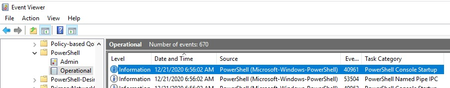
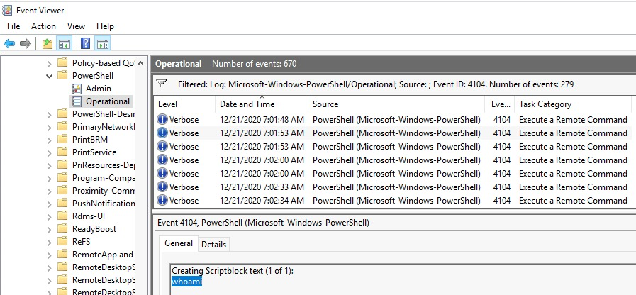
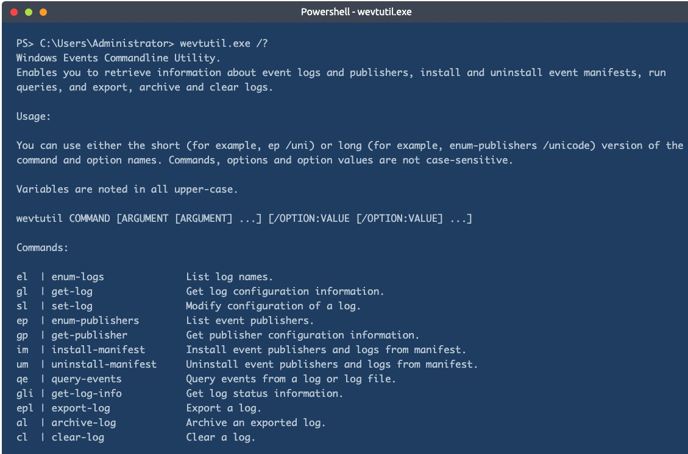
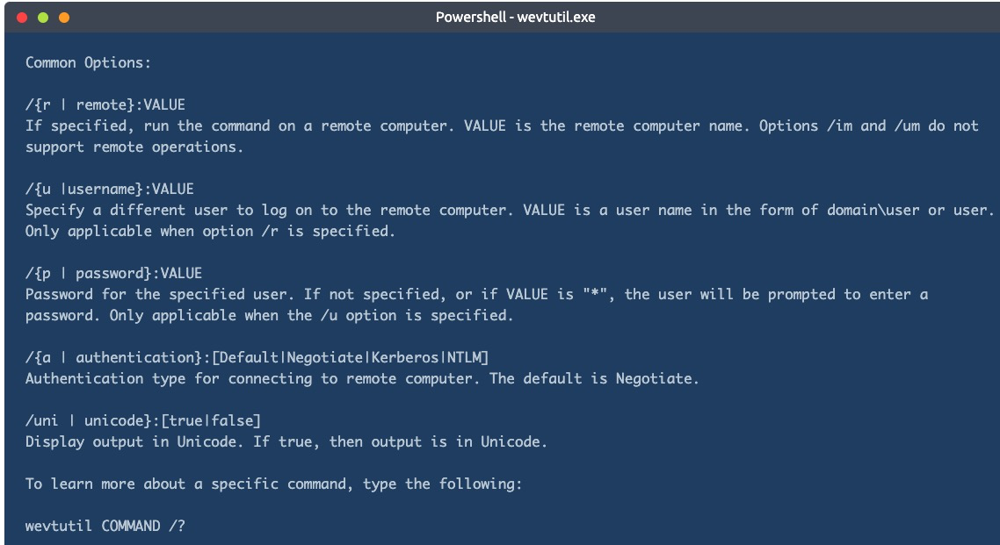
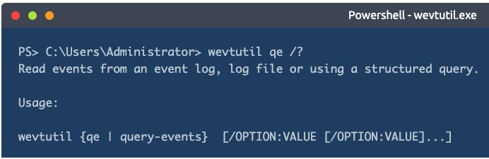
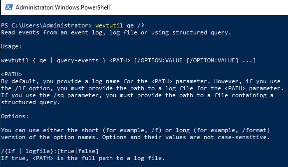

# Windows Event Logs

Windows Event Logs and the tools to query them

## _**1: What are event logs?**_

Per Wikipedia, "_**Event logs** record events taking place in the execution of a system to provide an audit trail that can be used to understand the activity of the system and to diagnose problems. They are essential to understand the activities of complex systems, particularly in applications with little user interaction (such as server applications)._"

This definition would apply to system administrators, IT technicians, desktop engineers, etc. If the endpoint is experiencing an issue, the event logs can be queried to see clues about what led to the problem. The operating system, by default, writes messages to these logs.

As defenders (blue teamers), there is another use case for event logs. "_It can also be useful to combine log file entries from multiple sources. This approach, in combination with statistical analysis, may yield correlations between seemingly unrelated events on different servers._"

This is where SIEMs (**Security information and event management**) such as Splunk and Elastic come into play.

If you don't know exactly what a SEIM is used for, below is a visual overview of its capabilities. (Image credit: [Varonis](https://www.varonis.com/blog/what-is-siem/))

  

Even though it's possible to access a remote machine's event logs, this will not be feasible in a large enterprise environment. Instead, one can view the logs from all the endpoints, appliances, etc., in a SIEM. This will allow you to query the logs from multiple devices instead of manually connecting to a single device to view its logs.

Windows is not the only operating system that uses a logging system. Linux and macOS do as well. For example, on Linux systems, the logging system is known as **Syslog**. Within this room, though, we're only focusing on the Windows logging system called Windows Event Logs.

## _**2: Event Viewer**_

The Windows Event Logs are not text files that can be viewed using a text editor. However, the raw data can be translated into XML using the Windows API. The events in these log files are stored in a proprietary binary format with a .evt or .evtx extension. The log files with the .evtx file extension typically reside in `C:\Windows\System32\winevt\Logs`.  

## Elements of a Windows Event Log

Event logs are crucial for troubleshooting any computer incident and help understand the situation and how to remediate the incident. To get this picture well, you must first understand the format in which the information will be presented. Windows offers a standardized means of relaying this system information.

First, we need to know what elements form event logs in Windows systems. These elements are:

- **System Logs:** Records events associated with the Operating System segments. They may include information about hardware changes, device drivers, system changes, and other activities related to the device.
- **Security Logs:** Records events connected to logon and logoff activities on a device. The system's audit policy specifies the events. The logs are an excellent source for analysts to investigate attempted or successful unauthorized activity.
- **Application Logs**: Records events related to applications installed on a system. The main pieces of information include application errors, events, and warnings.
- **Directory Service Events:** Active Directory changes and activities are recorded in these logs, mainly on domain controllers.
- **File Replication Service Events:** Records events associated with Windows Servers during the sharing of Group Policies and logon scripts to domain controllers, from where they may be accessed by the users through the client servers.
- **DNS Event Logs:** DNS servers use these logs to record domain events and to map out
- **Custom Logs:** Events are logged by applications that require custom data storage. This allows applications to control the log size or attach other parameters, such as ACLs, for security purposes.

Under this categorization, event logs can be further classified into types. Here, types describe the activity that resulted in the event being logged. There are 5 types of events that can be logged, as described in the table below from [docs.microsoft.com](https://docs.microsoft.com/en-us/windows/win32/eventlog/event-types).

 

There are three main ways of accessing these event logs within a Windows system:

1. **Event Viewer** (GUI-based application)
2. **Wevtutil.exe** (command-line tool)
3. **Get-WinEvent** (PowerShell cmdlet)

## Event Viewer

In any Windows system, the Event Viewer, a **Microsoft Management Console (MMC)** snap-in, can be launched by simply right-clicking the Windows icon in the taskbar and selecting **Event Viewer**. For the savvy sysadmins that use the CLI much of their day, Event Viewer can be launched by typing `eventvwr.msc`. It is a GUI-based application that allows you to interact quickly with and analyze logs.

Event Viewer has three panes.

1. The pane on the left provides a hierarchical tree listing of the event log providers.
2. The pane in the middle will display a general overview and summary of the events specific to a selected provider.
3. The pane on the right is the actions pane.

The standard logs we had earlier defined on the left pane are visible under **Windows Logs**. 

The following section is the **Applications and Services Logs**. Expand this section and drill down on `Microsoft > Windows > PowerShell > Operational.` PowerShell will log operations from the engine, providers, and cmdlets to the Windows event log. 

Right-click on **Operational** then **Properties**.

Within **Properties,** you see the log location, log size, and when it was created, modified, and last accessed. Within the Properties window, you can also see the maximum set log size and what action to take once the criteria are met. This concept is known as log rotation. These are discussions held with corporations of various sizes. How long does it take to keep logs, and when it's permissible to overwrite them with new data.

Lastly, notice the **Clear Log** button at the bottom right. There are legitimate reasons to use this button, such as during security maintenance, but adversaries will likely attempt to clear the logs to go undetected. **Note**: This is not the only method to remove the event logs for any given event provider.

Focus your attention on the middle pane. Remember from previous descriptions that this pane will display the events specific to a selected provider. In this case, **PowerShell/Operational**.

From the above image, notice the event provider's name and the number of events logged. In this case, there are 44 events logged. You might see a different number. No worries, though. Each column of the pane presents a particular type of information as described below:

- **Level:** Highlights the log recorded type based on the identified event types specified earlier. In this case, the log is labeled as **Information**.
- **Date and Time:** Highlights the time at which the event was logged.
- **Source:** The name of the software that logs the event is identified. From the above image, the source is PowerShell.
- **Event ID:** This is a predefined numerical value that maps to a specific operation or event based on the log source. This makes Event IDs not unique, so `Event ID 4103` in the above image is related to Executing Pipeline but will have an entirely different meaning in another event log.
- **Task Category:** Highlights the Event Category. This entry will help you organize events so the Event Viewer can filter them. The event source defines this column.

The middle pane has a split view. More information is displayed in the bottom half of the middle pane for any event you click on.

This section has two tabs: **General** and **Details**.

- General is the default view, and the rendered data is displayed.
- The Details view has two options: Friendly view and XML view.

Below is a snippet of the General view.

   

Lastly, take a look at the **Actions** pane. Several options are available, but we'll only focus on a few. Please examine all the actions that can be performed at your leisure if you're unfamiliar with MMC snap-ins.

As you should have noticed, you can open a saved log within the Actions pane. This is useful if the remote machine can't be accessed. The logs can be provided to the analyst. You will perform this action a little later. 

The **Create Custom View** and **Filter Current Log** are nearly identical. The only difference between the 2 is that the `By log` and `By source` radio buttons are greyed out in **Filter Current Log**. What is the reason for that? The filter you can make with this specific action only relates to the current log. Hence no reason for 'by log' or 'by source' to be enabled.

  

Why are these actions beneficial? Say, for instance, you don't want all the events associated with PowerShell/Operational cluttering all the real estate in the pane. Maybe you're only interested in 4104 events. That is possible with these two actions. 

To view event logs from another computer, right-click `Event Viewer (Local) > Connect to Another Computer...`

That will conclude the general overview of the Event Viewer—time to become familiar with the tool.

**Questions**

For the questions below, use Event Viewer to analyze Microsoft-Windows-PowerShell/Operational log.

- oepn event viewer
- navigate to Microsoft -> Windows -> Powershell -> Operational log

What is the Event ID for the first recorded event?

- 40961

Filter on Event ID 4104. What was the 2nd command executed in the PowerShell session?

- whoami

What is the Task Category for Event ID 4104?

- execute a remote command

Analyze the Windows PowerShell log. What is the Task Category for Event ID 800?

- Pipeline Execution Details

## _**wevtutil.exe**_

Ok, you played around with Event Viewer. Imagine you have to sit there and manually sift through hundreds or even thousands of events (even after filtering the log). Not fun. It would be nice if you could write scripts to do this work for you. We will explore some tools that will allow you to query event logs via the command line and/or PowerShell.

Let's look at **wevtutil.exe** first. Per Microsoft, the wevtutil.exe tool "enables you to retrieve information about event logs and publishers. You can also use this command to install and uninstall event manifests, to run queries, and to export, archive, and clear logs."

As with any tool, access its help files to find out how to run the tool. An example of a command to do this is `wevtutil.exe /?`.

From the above screenshot, under **Usage**, you are provided a brief example of how to use the tool. In this example, `ep` (**enum-publishers**) is used. This is a **command** for wevtutil.exe.

Below, we can find the **Common options** that can be used with Windows Events Utility.

Notice at the bottom of the above snapshot, `wevtutil COMMAND /?`. This will provide additional information specific to a command. We can use it to get more information on the command `qe` (**query-events**).

Look over the information within the help menu to fully understand how to use this command.

Ok, great! You have enough information to use this tool—time to answer some questions. It is always recommended to look into the tool and its related information at your own leisure. 

**Note**: You can get more information about using this tool further but visiting the online help documentation [docs.microsoft.com](https://docs.microsoft.com/en-us/windows-server/administration/windows-commands/wevtutil). 

**Questions**

How many log names are in the machine? 

- open powershell
- `wevtutil /?`
- `wevtutil el` gave a long list no count thought
- Hint: Use PowerShell. Pipe the 'el' command to the PowerShell Measure-Object cmdlet
- `wevtutil el | Measure-Object`
- 1071

What event files would be read when using the **query-events** command?  

- `wevtutil qe /?`
- event log, log file, structured query

What option would you use to provide a path to a log file?

- `/lf:true`

What is the **VALUE** for **/q**?

- XPath query

The questions below are based on this command: **`wevtutil qe Application /c:3 /rd:true /f:text`**

What is the log name?  

- Application

What is the **/rd** option for?

- Event read direction

What is the **/c** option for?

- Maximum number of events to read

## _**Get-WinEvent**_

