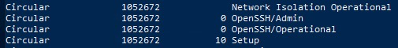
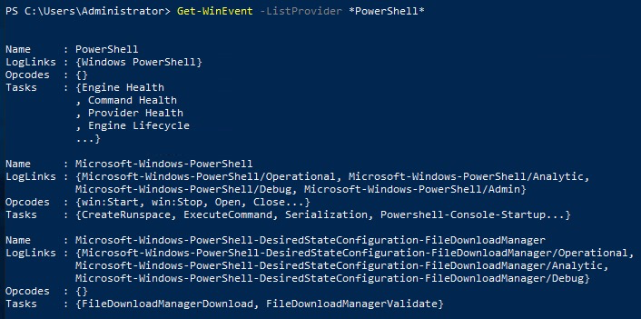
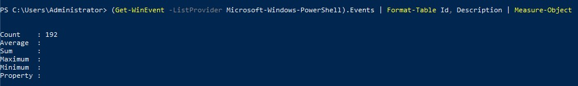
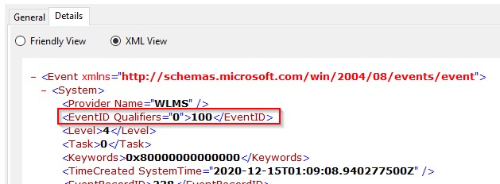
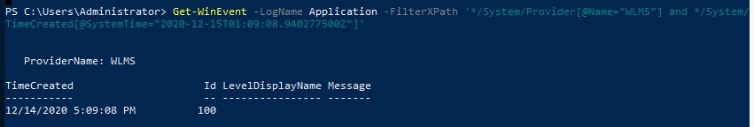
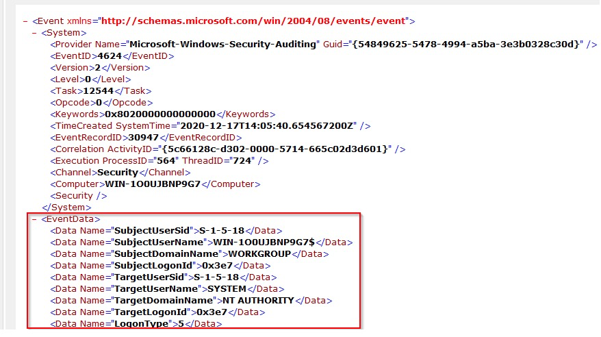
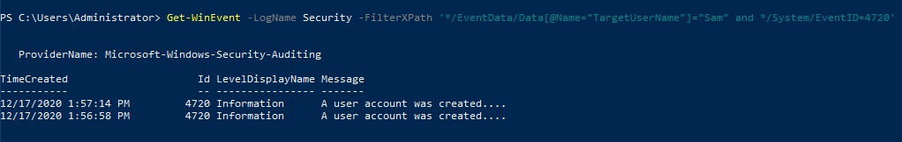
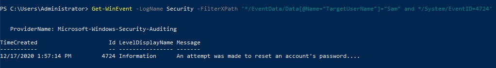

# Windows Event Logs

Windows Event Logs and the tools to query them

## _**1: What are event logs?**_

Per Wikipedia, "_**Event logs** record events taking place in the execution of a system to provide an audit trail that can be used to understand the activity of the system and to diagnose problems. They are essential to understand the activities of complex systems, particularly in applications with little user interaction (such as server applications)._"

This definition would apply to system administrators, IT technicians, desktop engineers, etc. If the endpoint is experiencing an issue, the event logs can be queried to see clues about what led to the problem. The operating system, by default, writes messages to these logs.

As defenders (blue teamers), there is another use case for event logs. "_It can also be useful to combine log file entries from multiple sources. This approach, in combination with statistical analysis, may yield correlations between seemingly unrelated events on different servers._"

This is where SIEMs (**Security information and event management**) such as Splunk and Elastic come into play.

If you don't know exactly what a SEIM is used for, below is a visual overview of its capabilities. (Image credit: [Varonis](https://www.varonis.com/blog/what-is-siem/))

  

Even though it's possible to access a remote machine's event logs, this will not be feasible in a large enterprise environment. Instead, one can view the logs from all the endpoints, appliances, etc., in a SIEM. This will allow you to query the logs from multiple devices instead of manually connecting to a single device to view its logs.

Windows is not the only operating system that uses a logging system. Linux and macOS do as well. For example, on Linux systems, the logging system is known as **Syslog**. Within this room, though, we're only focusing on the Windows logging system called Windows Event Logs.


## _**2: Event Viewer**_

The Windows Event Logs are not text files that can be viewed using a text editor. However, the raw data can be translated into XML using the Windows API. The events in these log files are stored in a proprietary binary format with a .evt or .evtx extension. The log files with the .evtx file extension typically reside in `C:\Windows\System32\winevt\Logs`.  

## Elements of a Windows Event Log

Event logs are crucial for troubleshooting any computer incident and help understand the situation and how to remediate the incident. To get this picture well, you must first understand the format in which the information will be presented. Windows offers a standardized means of relaying this system information.

First, we need to know what elements form event logs in Windows systems. These elements are:

- **System Logs:** Records events associated with the Operating System segments. They may include information about hardware changes, device drivers, system changes, and other activities related to the device.
- **Security Logs:** Records events connected to logon and logoff activities on a device. The system's audit policy specifies the events. The logs are an excellent source for analysts to investigate attempted or successful unauthorized activity.
- **Application Logs**: Records events related to applications installed on a system. The main pieces of information include application errors, events, and warnings.
- **Directory Service Events:** Active Directory changes and activities are recorded in these logs, mainly on domain controllers.
- **File Replication Service Events:** Records events associated with Windows Servers during the sharing of Group Policies and logon scripts to domain controllers, from where they may be accessed by the users through the client servers.
- **DNS Event Logs:** DNS servers use these logs to record domain events and to map out
- **Custom Logs:** Events are logged by applications that require custom data storage. This allows applications to control the log size or attach other parameters, such as ACLs, for security purposes.

Under this categorization, event logs can be further classified into types. Here, types describe the activity that resulted in the event being logged. There are 5 types of events that can be logged, as described in the table below from [docs.microsoft.com](https://docs.microsoft.com/en-us/windows/win32/eventlog/event-types).

 

There are three main ways of accessing these event logs within a Windows system:

1. **Event Viewer** (GUI-based application)
2. **Wevtutil.exe** (command-line tool)
3. **Get-WinEvent** (PowerShell cmdlet)

## Event Viewer

In any Windows system, the Event Viewer, a **Microsoft Management Console (MMC)** snap-in, can be launched by simply right-clicking the Windows icon in the taskbar and selecting **Event Viewer**. For the savvy sysadmins that use the CLI much of their day, Event Viewer can be launched by typing `eventvwr.msc`. It is a GUI-based application that allows you to interact quickly with and analyze logs.

Event Viewer has three panes.

1. The pane on the left provides a hierarchical tree listing of the event log providers.
2. The pane in the middle will display a general overview and summary of the events specific to a selected provider.
3. The pane on the right is the actions pane.


The standard logs we had earlier defined on the left pane are visible under **Windows Logs**. 

The following section is the **Applications and Services Logs**. Expand this section and drill down on `Microsoft > Windows > PowerShell > Operational.` PowerShell will log operations from the engine, providers, and cmdlets to the Windows event log. 

Right-click on **Operational** then **Properties**.


Within **Properties,** you see the log location, log size, and when it was created, modified, and last accessed. Within the Properties window, you can also see the maximum set log size and what action to take once the criteria are met. This concept is known as log rotation. These are discussions held with corporations of various sizes. How long does it take to keep logs, and when it's permissible to overwrite them with new data.

Lastly, notice the **Clear Log** button at the bottom right. There are legitimate reasons to use this button, such as during security maintenance, but adversaries will likely attempt to clear the logs to go undetected. **Note**: This is not the only method to remove the event logs for any given event provider.

Focus your attention on the middle pane. Remember from previous descriptions that this pane will display the events specific to a selected provider. In this case, **PowerShell/Operational**.


From the above image, notice the event provider's name and the number of events logged. In this case, there are 44 events logged. You might see a different number. No worries, though. Each column of the pane presents a particular type of information as described below:

- **Level:** Highlights the log recorded type based on the identified event types specified earlier. In this case, the log is labeled as **Information**.
- **Date and Time:** Highlights the time at which the event was logged.
- **Source:** The name of the software that logs the event is identified. From the above image, the source is PowerShell.
- **Event ID:** This is a predefined numerical value that maps to a specific operation or event based on the log source. This makes Event IDs not unique, so `Event ID 4103` in the above image is related to Executing Pipeline but will have an entirely different meaning in another event log.
- **Task Category:** Highlights the Event Category. This entry will help you organize events so the Event Viewer can filter them. The event source defines this column.

The middle pane has a split view. More information is displayed in the bottom half of the middle pane for any event you click on.

This section has two tabs: **General** and **Details**.

- General is the default view, and the rendered data is displayed.
- The Details view has two options: Friendly view and XML view.

Below is a snippet of the General view.

   

Lastly, take a look at the **Actions** pane. Several options are available, but we'll only focus on a few. Please examine all the actions that can be performed at your leisure if you're unfamiliar with MMC snap-ins.

As you should have noticed, you can open a saved log within the Actions pane. This is useful if the remote machine can't be accessed. The logs can be provided to the analyst. You will perform this action a little later. 

The **Create Custom View** and **Filter Current Log** are nearly identical. The only difference between the 2 is that the `By log` and `By source` radio buttons are greyed out in **Filter Current Log**. What is the reason for that? The filter you can make with this specific action only relates to the current log. Hence no reason for 'by log' or 'by source' to be enabled.

  

Why are these actions beneficial? Say, for instance, you don't want all the events associated with PowerShell/Operational cluttering all the real estate in the pane. Maybe you're only interested in 4104 events. That is possible with these two actions. 

To view event logs from another computer, right-click `Event Viewer (Local) > Connect to Another Computer...`


That will conclude the general overview of the Event Viewer—time to become familiar with the tool.

**Questions**

For the questions below, use Event Viewer to analyze Microsoft-Windows-PowerShell/Operational log.

- oepn event viewer
- navigate to Microsoft -> Windows -> Powershell -> Operational log

What is the Event ID for the first recorded event?

- 40961


Filter on Event ID 4104. What was the 2nd command executed in the PowerShell session?

- whoami


What is the Task Category for Event ID 4104?

- execute a remote command

Analyze the Windows PowerShell log. What is the Task Category for Event ID 800?

- Pipeline Execution Details


## _**wevtutil.exe**_

Ok, you played around with Event Viewer. Imagine you have to sit there and manually sift through hundreds or even thousands of events (even after filtering the log). Not fun. It would be nice if you could write scripts to do this work for you. We will explore some tools that will allow you to query event logs via the command line and/or PowerShell.

Let's look at **wevtutil.exe** first. Per Microsoft, the wevtutil.exe tool "enables you to retrieve information about event logs and publishers. You can also use this command to install and uninstall event manifests, to run queries, and to export, archive, and clear logs."

As with any tool, access its help files to find out how to run the tool. An example of a command to do this is `wevtutil.exe /?`.


From the above screenshot, under **Usage**, you are provided a brief example of how to use the tool. In this example, `ep` (**enum-publishers**) is used. This is a **command** for wevtutil.exe.

Below, we can find the **Common options** that can be used with Windows Events Utility.


Notice at the bottom of the above snapshot, `wevtutil COMMAND /?`. This will provide additional information specific to a command. We can use it to get more information on the command `qe` (**query-events**).


Look over the information within the help menu to fully understand how to use this command.

Ok, great! You have enough information to use this tool—time to answer some questions. It is always recommended to look into the tool and its related information at your own leisure. 

**Note**: You can get more information about using this tool further but visiting the online help documentation [docs.microsoft.com](https://docs.microsoft.com/en-us/windows-server/administration/windows-commands/wevtutil). 

**Questions**

How many log names are in the machine? 

- open powershell
- `wevtutil /?`
- `wevtutil el` gave a long list no count thought
- Hint: Use PowerShell. Pipe the 'el' command to the PowerShell Measure-Object cmdlet
- `wevtutil el | Measure-Object`
- 1071

What event files would be read when using the **query-events** command?  

- `wevtutil qe /?`
- event log, log file, structured query


What option would you use to provide a path to a log file?

- `/lf:true`

What is the **VALUE** for **/q**?

- XPath query

The questions below are based on this command: **`wevtutil qe Application /c:3 /rd:true /f:text`**

What is the log name?  

- Application

What is the **/rd** option for?

- Event read direction

What is the **/c** option for?

- Maximum number of events to read


## _**4: Get-WinEvent**_

On to the next tool. This is a PowerShell cmdlet called **Get-WinEvent**. Per Microsoft, the Get-WinEvent cmdlet "gets events from event logs and event tracing log files on local and remote computers." It provides information on event logs and event log providers. Additionally, you can combine numerous events from multiple sources into a single command and filter using XPath queries, structured XML queries, and hash table queries.

**Note**: The **Get-WinEvent** cmdlet replaces the **Get-EventLog** cmdlet. 

As with any new tool, it's good practice to read the Get-Help documentation to become acquainted with its capabilities. Please refer to the Get-Help information online at [docs.microsoft.com](https://docs.microsoft.com/en-us/powershell/module/microsoft.powershell.diagnostics/get-winevent?view=powershell-5.1). 

Let us look at a couple of examples of how to use Get-WinEvent, as supported by the documentation. Some tasks might require some PowerShell-fu, while others don't. Even if your PowerShell-fu is not up to par, fret not; each example has a detailed explanation of the commands/cmdlets used. 

### Example 1: Get all logs from a computer

Here, we are obtaining all event logs locally, and the list starts with classic logs first, followed by new Windows Event logs. It is possible to have a log's **RecordCount** be zero or null.

Powershell - Get-WinEvent Logs

```
Get-WinEvent -ListLog *

LogMode   MaximumSizeInBytes RecordCount LogName
-------   ------------------ ----------- -------
Circular            15532032       14500 Application
Circular             1052672         117 Azure Information Protection
Circular             1052672        3015 CxAudioSvcLog
Circular            20971520             ForwardedEvents
Circular            20971520           0 HardwareEvents
```

### Example 2: Get event log providers and log names

The command here will result in the event log providers and their associated logs. The **Name** is the provider, and **LogLinks** is the log that is written to.

Powershell - Get-WinEvent Providers

```
Get-WinEvent -ListProvider *

Name     : .NET Runtime
LogLinks : {Application}
Opcodes  : {}
Tasks    : {}

Name     : .NET Runtime Optimization Service
LogLinks : {Application}
Opcodes  : {}
Tasks    : {}
```

### Example 3: Log filtering

Log filtering allows you to select events from an event log. We can filter event logs using the **Where-Object** cmdlet as follows:

Powershell - Get-WinEvent Filters

```
PS C:\Users\Administrator> Get-WinEvent -LogName Application | Where-Object { $_.ProviderName -Match 'WLMS' }

   ProviderName: WLMS

TimeCreated                     Id LevelDisplayName Message
-----------                     -- ---------------- -------
12/21/2020 4:23:47 AM          100 Information
12/18/2020 3:18:57 PM          100 Information
12/15/2020 8:50:22 AM          100 Information
12/15/2020 8:18:34 AM          100 Information
12/15/2020 7:48:34 AM          100 Information
12/14/2020 6:42:18 PM          100 Information
12/14/2020 6:12:18 PM          100 Information
12/14/2020 5:39:08 PM          100 Information
12/14/2020 5:09:08 PM          100 Information
```

**Tip**: If you are ever working on a Windows evaluation virtual machine that is cut off from the Internet eventually, it will shut down every hour. ;^)   

When working with large event logs, per Microsoft, it's inefficient to send objects down the pipeline to a `Where-Object` command. The use of the Get-WinEvent cmdlet's **FilterHashtable** parameter is recommended to filter event logs. We can achieve the same results as above by running the following command:

Powershell - Get-WinEvent Filters

```
Get-WinEvent -FilterHashtable @{
  LogName='Application' 
  ProviderName='WLMS' 
}
```

The syntax of a hash table is as follows:

Hash Table Syntax

```
@{ <name> = <value>; [<name> = <value> ] ...}
```

Guidelines for defining a hash table are:  

- Begin the hash table with an @ sign.
- Enclose the hash table in braces {}
- Enter one or more key-value pairs for the content of the hash table.
- Use an equal sign (=) to separate each key from its value.

**Note**: You don't need to use a semicolon if you separate each key/value with a new line, as in the screenshot above for the -FilterHashtable for `ProviderName='WLMS'`. 

Below is a table that displays the accepted key/value pairs for the Get-WinEvent FilterHashtable parameter.

  

When building a query with a hash table, Microsoft recommends making the hash table one key-value pair at a time. Event Viewer can provide quick information on what you need to build your hash table.

  

Based on this information, the hash table will look as follows:

  

For more information on creating Get-WinEvent queries with FilterHashtable, check the official Microsoft documentation [docs.microsoft.com](https://docs.microsoft.com/en-us/powershell/scripting/samples/Creating-Get-WinEvent-queries-with-FilterHashtable?view=powershell-7.1).

Since we're on the topic of Get-WinEvent and FilterHashtable, here is a command that you might find helpful (shared by [@mubix](https://twitter.com/mubix)): 

Powershell - Get-WinEvent Filters

```shell-source
Get-WinEvent -FilterHashtable @{LogName='Microsoft-Windows-PowerShell/Operational'; ID=4104} | Select-Object -Property Message | Select-String -Pattern 'SecureString'
```

You can read more about creating hash tables in general [docs.microsoft.com](https://docs.microsoft.com/en-us/powershell/module/microsoft.powershell.core/about/about_hash_tables?view=powershell-7.1).

_**Questions**_ 

Answer the following questions using the **[online](https://docs.microsoft.com/en-us/powershell/module/microsoft.powershell.diagnostics/Get-WinEvent?view=powershell-7.1)** help documentation for **Get-WinEvent**

Execute the command from **Example 1** (as is). What are the names of the logs related to **OpenSSH**?

- `Get-WinEvent -ListLog *`
- OpenSSH/Admin,OpenSSH/Operational



Execute the command from **Example 8**. Instead of the string **\*Policy\*** search for **\*PowerShell\***. What is the name of the 3rd log provider?

- `Get-WinEvent -ListProvider *PowerShell*`
- Microsoft-Windows-PowerShell-DesiredStateConfiguration-FileDownloadManager



Execute the command from **Example 9**. Use **Microsoft-Windows-PowerShell** as the log provider. How many event ids are displayed for this event provider?

- `(Get-WinEvent -ListProvider Microsoft-Windows-PowerShell).Events | Format-Table Id, Description | Measure-Object`
- 192



How do you specify the number of events to display?

- -MaxEvents
- [Link](https://learn.microsoft.com/en-us/powershell/module/microsoft.powershell.diagnostics/Get-WinEvent?view=powershell-7.3#-maxevents)

When using the **FilterHashtable** parameter and filtering by level, what is the value for **Informational**?

- 4


## _**5: XPath Queries**_

Now we will examine filtering events with **XPath**. The W3C created XPath, or **XML Path Language** in full, to provide a standard syntax and semantics for addressing parts of an XML document and manipulating strings, numbers, and booleans. The Windows Event Log supports a subset of [XPath 1.0](https://www.w3.org/TR/1999/REC-xpath-19991116/). 

Below is an example XPath query along with its explanation:

XPath Query

```shell-session
// The following query selects all events from the channel or log file where the severity level is less than or equal to 3 and the event occurred in the last 24 hour period. 
XPath Query: *[System[(Level <= 3) and TimeCreated[timediff(@SystemTime) <= 86400000]]]
```

Based on [docs.microsoft.com](https://docs.microsoft.com/en-us/windows/win32/wes/consuming-events#xpath-10-limitations), an XPath event query starts with '**\***' or '**Event**'. The above code block confirms this. But how do we construct the rest of the query? Luckily the Event Viewer can help us with that. 

Let's create an XPath query for the same event from the previous section. Note that both wevtutil and Get-WinEvent support XPath queries as event filters. 

  

Draw your attention to the bottom half of the middle pane. In the Event Viewer section, the Details tab was briefly touched on. Now you'll see how the information in this section can be useful.   

Click on the `Details` tab and select the `XML View` radio button. Don't worry if the log details you are viewing are slightly different. The point is understanding how to use the XML View to construct a valid XPath query.


The first tag is the starting point. This can either be an `*` or the word `Event`.

The command so far looks like this: `Get-WinEvent -LogName Application -FilterXPath '*'`

  

Now we work our way down the XML tree. The next tag is `System`.

Let's add that. Now our command is: `Get-WinEvent -LogName Application -FilterXPath '*/System/'`

**Note**: Its best practice to explicitly use the keyword `System` but you can use an `*` instead as with the `Event` keyword. The query `-FilterXPath '*/*'` is still valid. 

The **Event ID** is **100**. Let's plug that into the command. 

  

Our command now is: `Get-WinEvent -LogName Application -FilterXPath '*/System/EventID=100'`

XPath Query Powershell

```shell-session
PS C:\Users\Administrator> Get-WinEvent -LogName Application -FilterXPath '*/System/EventID=100'

   ProviderName: WLMS

TimeCreated                     Id LevelDisplayName Message
-----------                     -- ---------------- -------
12/21/2020 4:23:47 AM          100 Information
12/18/2020 3:18:57 PM          100 Information
12/15/2020 8:50:22 AM          100 Information
12/15/2020 8:18:34 AM          100 Information
12/15/2020 7:48:34 AM          100 Information
12/14/2020 6:42:18 PM          100 Information
12/14/2020 6:12:18 PM          100 Information
12/14/2020 5:39:08 PM          100 Information
12/14/2020 5:09:08 PM          100 Information
```

When using wevtutil.exe and XPath to query for the same event log and ID, this is our result:

XPath Query using Wevtutil.exe

```shell-session
C:\Users\Administrator>wevtutil.exe qe Application /q:*/System[EventID=100] /f:text /c:1
Event[0]:
  Log Name: Application
  Source: WLMS
  Date: 2020-12-14T17:09:08.940
  Event ID: 100
  Task: None
  Level: Information
  Opcode: Info
  Keyword: Classic
  User: N/A
  User Name: N/A
  Computer: WIN-1O0UJBNP9G7
  Description:
N/A
```

**Note**: 2 additional parameters were used in the above command. This was done to retrieve just 1 event and for it not to contain any XML tags.

If you want to query a different element, such as `Provider Name`, the syntax will be different. To filter on the provider, we need to use the `Name` attribute of `Provider`

The XPath query is: 

XPath Query for Provider

```shell-session
PS C:\Users\Administrator> Get-WinEvent -LogName Application -FilterXPath '*/System/Provider[@Name="WLMS"]'

   ProviderName: WLMS

TimeCreated                     Id LevelDisplayName Message
-----------                     -- ---------------- -------
12/21/2020 4:23:47 AM          100 Information
12/18/2020 3:18:57 PM          100 Information
12/15/2020 8:50:22 AM          100 Information
12/15/2020 8:48:34 AM          101 Information
12/15/2020 8:18:34 AM          100 Information
12/15/2020 7:48:34 AM          100 Information
12/14/2020 7:12:18 PM          101 Information
12/14/2020 6:42:18 PM          100 Information
12/14/2020 6:12:18 PM          100 Information
12/14/2020 6:09:09 PM          101 Information
12/14/2020 5:39:08 PM          100 Information
12/14/2020 5:09:08 PM          100 Information
```

What if you want to combine 2 queries? Is this possible? The answer is yes.

Let's build this query based on the screenshot above. The Provider Name is **WLMS,** and based on the output, there are **2 Event IDs**.

This time we only want to query for events with **Event ID 101**. 

The XPath query would be `Get-WinEvent -LogName Application -FilterXPath '*/System/EventID=101 and */System/Provider[@Name="WLMS"]'`

XPath Two Queries

```shell-session
PS C:\Users\Administrator> Get-WinEvent -LogName Application -FilterXPath '*/System/Provider[@Name="WLMS"]'

   ProviderName: WLMS

TimeCreated                     Id LevelDisplayName Message
-----------                     -- ---------------- -------
12/15/2020 8:48:34 AM          101 Information
12/14/2020 7:12:18 PM          101 Information
12/14/2020 6:09:09 PM          101 Information
```

Lastly, let's discuss how to create XPath queries for elements within `EventData`. The query will be slightly different.

**Note:** The EventData element doesn't always contain information.

Below is the XML View of the event for which we will build our XPath query.

  

We will build the query for `TargetUserName`. In this case, that will be System. The XPath query would be `Get-WinEvent -LogName Security -FilterXPath '*/EventData/Data[@Name="TargetUserName"]="System"'`

XPath Query for TargetUserName

```shell-session
PS C:\Users\Administrator> Get-WinEvent -LogName Security -FilterXPath '*/EventData/Data[@Name="TargetUserName"]="System"' -MaxEvents 1

   ProviderName: Microsoft-Windows-Security-Auditing

TimeCreated                     Id LevelDisplayName Message
-----------                     -- ---------------- -------
12/21/2020 10:50:26 AM         4624 Information     An account was successfully logged on...
```

**Note**: The `-MaxEvents` parameter was used, and it was set to 1. This will return just 1 event. 

At this point, you have enough knowledge to create XPath queries for **wevtutil.exe** or **Get-WinEvent**. To further this knowledge, I suggest reading the official Microsoft XPath Reference [docs.microsoft.com](https://docs.microsoft.com/en-us/previous-versions/dotnet/netframework-4.0/ms256115(v=vs.100)).

_**Questions**_

Using **Get-WinEvent** and **XPath**, what is the query to find WLMS events with a System Time of 2020-12-15T01:09:08.940277500Z?

- `Get-WinEvent -LogName Application -FilterXPath '*/System/Provider[@Name="WLMS"] and */System/TimeCreated[@SystemTime="2020-12-15T01:09:08.940277500Z"]'`




Using **Get-WinEvent** and **XPath**, what is the query to find a user named Sam with an Logon Event ID of 4720?

- `Get-WinEvent -LogName Security -FilterXPath '*/EventData/Data[@Name="TargetUserName"]="Sam" and */System/EventID=4720'`




Based on the previous query, how many results are returned?

- 2

Based on the output from the question #2, what is Message?

- A user account was created

Still working with Sam as the user, what time was Event ID 4724 recorded? (**MM/DD/YYYY H:MM:SS \[AM/PM\]**)

- `Get-WinEvent -LogName Security -FilterXPath '*/EventData/Data[@Name="TargetUserName"]="Sam" and */System/EventID=4724'`
- 12/17/2020 1:57:14 PM



What is the Provider Name?

- Microsoft-Windows-Security-Auditing


## _**6: Event IDs**_

When it comes to monitoring and hunting, you need to know what you are looking for. There are a large number of event IDs in use. This section is aimed at assisting you with this task. There are plenty of blogs, writeups, etc., on this topic. A few resources will be shared in this section. Please note this is not an exhaustive list.

First on the list is [The Windows Logging Cheat Sheet (Windows 7 - Windows 2012)](https://static1.squarespace.com/static/552092d5e4b0661088167e5c/t/580595db9f745688bc7477f6/1476761074992/Windows+Logging+Cheat+Sheet_ver_Oct_2016.pdf). The last version update is October 2016, but it's still a good resource. The document covers a few things that need to be enabled and configured and what event IDs to look for based on different categories, such as Accounts, Processes, Log Clear, etc. 

  

Above is a snippet from the cheatsheet. Want to detect if a new service was installed? Look for **Event ID 7045** within the **System Log**.

Next is [Spotting the Adversary with Windows Event Log Monitoring](https://apps.nsa.gov/iaarchive/library/reports/spotting-the-adversary-with-windows-event-log-monitoring.cfm). This NSA resource is also a bit outdated but good enough to build upon your foundation. The document covers some concepts touched on in this room and beyond. You must click on `Get File` to download the resource. 

  

Above is a snippet from the document. Maybe you want to monitor if a firewall rule was deleted from the host. That is **Event ID 2006/2033**. 

Where else can we get a list of event IDs to monitor/hunt for? [MITRE ATT&CK](https://attack.mitre.org/)!

If you are unfamiliar with **MITRE** or **MITRE ATT&CK**, I suggest you check out the [MITRE Room](https://tryhackme.com/room/mitre). 

Let's look at ATT&CK ID [T1098](https://attack.mitre.org/techniques/T1098/) (Account Manipulation). Each ATT&CK ID will contain a section sharing tips to mitigate the technique and detection tips. 

  

The last two resources are from **Microsoft**:

- [Events to Monitor](https://docs.microsoft.com/en-us/windows-server/identity/ad-ds/plan/appendix-l--events-to-monitor) (Best Practices for Securing Active Directory)
- [The Windows 10 and Windows Server 2016 Security Auditing and Monitoring Reference](https://www.microsoft.com/en-us/download/confirmation.aspx?id=52630) (a comprehensive list \[**over 700 pages**\])

  

**Note**: Some events will not be generated by default, and certain features will need to be enabled/configured on the endpoint, such as PowerShell logging. This feature can be enabled via **Group Policy** or the **Registry**.

`Local Computer Policy > Computer Configuration > Administrative Templates > Windows Components > Windows PowerShell`

  

Some resources to provide more information about enabling this feature, along with its associated event IDs:

- [About Logging Windows](https://docs.microsoft.com/en-us/powershell/module/microsoft.powershell.core/about/about_logging_windows?view=powershell-7.1)
- [Greater Visibility Through PowerShell Logging](https://www.fireeye.com/blog/threat-research/2016/02/greater_visibilityt.html)
- [Configure PowerShell logging to see PowerShell anomalies in Splunk UBA](https://docs.splunk.com/Documentation/UBA/5.0.4/GetDataIn/AddPowerShell)

  

Another feature to enable/configure is **Audit Process Creation**, which will generate **event ID 4688**. This will allow **command-line process auditing**. This setting is NOT enabled in the virtual machine but feel free to enable it and observe the events generated after executing some commands.

`Local Computer Policy > Computer Configuration > Administrative Templates > System > Audit Process Creation`

  

  

To read more about this feature, refer to [docs.microsoft.com](https://docs.microsoft.com/en-us/windows-server/identity/ad-ds/manage/component-updates/command-line-process-auditing#try-this-explore-command-line-process-auditing). The steps to test the configuration are at the bottom of the document. 

  

To conclude this section, it will be reiterated that this is not an exhaustive list. There are countless blogs, writeups, threat intel reports, etc., on this topic.

To effectively monitor and detect, you need to know what to look for (as mentioned earlier).


## _**7: Putting theory into practice**_

