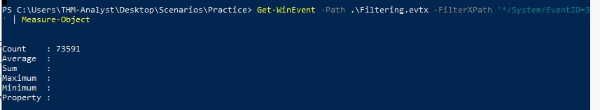
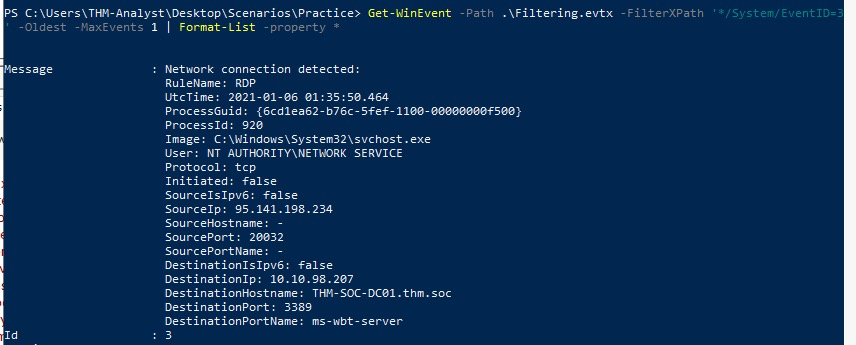

# Sysmon

Learn how to utilize Sysmon to monitor and log your endpoints and environments.

## _**1: Introduction**_

Sysmon, a tool used to monitor and log events on Windows, is commonly used by enterprises as part of their monitoring and logging solutions. Part of the Windows Sysinternals package, Sysmon is similar to Windows Event Logs with further detail and granular control.


This room uses a modified version of the [Blue](https://tryhackme.com/room/blue) and [Ice](https://tryhackme.com/room/ice) boxes, as well as Sysmon logs from the Hololive network lab.

_Before completing this room we recommend completing the [Windows Event Log](https://tryhackme.com/room/windowseventlogs) room. It is also recommended to complete the Blue and Ice rooms to get an understanding of vulnerabilities present however is not required to continue._


## _**2: Sysmon Overview**_

From the Microsoft Docs, "System Monitor (Sysmon) is a Windows system service and device driver that, once installed on a system, remains resident across system reboots to monitor and log system activity to the Windows event log. It provides detailed information about process creations, network connections, and changes to file creation time. By collecting the events it generates using Windows Event Collection or SIEM agents and subsequently analyzing them, you can identify malicious or anomalous activity and understand how intruders and malware operate on your network."

Sysmon gathers detailed and high-quality logs as well as event tracing that assists in identifying anomalies in your environment. Sysmon is most commonly used in conjunction with security information and event management (SIEM) system or other log parsing solutions that aggregate, filter, and visualize events. When installed on an endpoint, Sysmon will start early in the Windows boot process. In an ideal scenario, the events would be forwarded to a SIEM for further analysis. However, in this room, we will focus on Sysmon itself and view the events on the endpoint itself with Windows Event Viewer.

Events within Sysmon are stored in `_Applications and Services Logs/Microsoft/Windows/Sysmon/Operational_`

Sysmon Config Overview

Sysmon requires a config file in order to tell the binary how to analyze the events that it is receiving. You can create your own Sysmon config or you can download a config. Here is an example of a high-quality config that works well for identifying anomalies created by SwiftOnSecurity: [Sysmon-Config.](https://github.com/SwiftOnSecurity/sysmon-config) Sysmon includes 29 different types of Event IDs, all of which can be used within the config to specify how the events should be handled and analyzed. Below we will go over a few of the most important Event IDs and show examples of how they are used within config files.

When creating or modifying configuration files you will notice that a majority of rules in sysmon-config will exclude events rather than include events. This will help filter out normal activity in your environment that will in turn decrease the number of events and alerts you will have to manually audit or search through in a SIEM. On the other hand, there are rulesets like the ION-Storm sysmon-config fork that takes a more proactive approach with it's ruleset by using a lot of include rules. You may have to modify configuration files to find what approach you prefer. Configuration preferences will vary depending on what SOC team so prepare to be flexible when monitoring.

_Note: As there are so many Event IDs Sysmon analyzes. we will only be going over a few of the ones that we think are most important to understand._

Event ID 1: Process Creation

This event will look for any processes that have been created. You can use this to look for known suspicious processes or processes with typos that would be considered an anomaly. This event will use the CommandLine and Image XML tags.

`<RuleGroup name="" groupRelation="or">  
<ProcessCreate onmatch="exclude">  
  <CommandLine condition="is">C:\Windows\system32\svchost.exe -k appmodel -p -s camsvc</CommandLine>  
</ProcessCreate>  
</RuleGroup>`

The above code snippet is specifying the Event ID to pull from as well as what condition to look for. In this case, it is excluding the svchost.exe process from the event logs.

Event ID 3: Network Connection

The network connection event will look for events that occur remotely. This will include files and sources of suspicious binaries as well as opened ports. This event will use the Image and DestinationPort XML tags. 

`<RuleGroup name="" groupRelation="or">  
<NetworkConnect onmatch="include">  
  <Image condition="image">nmap.exe</Image>  
  <DestinationPort name="Alert,Metasploit" condition="is">4444</DestinationPort>  
</NetworkConnect>  
</RuleGroup>`

The above code snippet includes two ways to identify suspicious network connection activity. The first way will identify files transmitted over open ports. In this case, we are specifically looking for nmap.exe which will then be reflected within the event logs. The second method identifies open ports and specifically port 4444 which is commonly used with Metasploit. If the condition is met an event will be created and ideally trigger an alert for the SOC to further investigate.

Event ID 7: Image Loaded

This event will look for DLLs loaded by processes, which is useful when hunting for DLL Injection and DLL Hijacking attacks. It is recommended to exercise caution when using this Event ID as it causes a high system load. This event will use the Image, Signed, ImageLoaded, and Signature XML tags. 

`<RuleGroup name="" groupRelation="or">  
<ImageLoad onmatch="include">  
  <ImageLoaded condition="contains">\Temp\</ImageLoaded>  
</ImageLoad>  
</RuleGroup>  
`  

The above code snippet will look for any DLLs that have been loaded within the \\Temp\\ directory. If a DLL is loaded within this directory it can be considered an anomaly and should be further investigateded. 

Event ID 8: CreateRemoteThread

The CreateRemoteThread Event ID will monitor for processes injecting code into other processes. The CreateRemoteThread function is used for legitimate tasks and applications. However, it could be used by malware to hide malicious activity. This event will use the SourceImage, TargetImage, StartAddress, and StartFunction XML tags.

`<RuleGroup name="" groupRelation="or">  
<CreateRemoteThread onmatch="include">  
  <StartAddress name="Alert,Cobalt Strike" condition="end with">0B80</StartAddress>  
  <SourceImage condition="contains">\</SourceImage>  
</CreateRemoteThread>  
</RuleGroup>  
`  

The above code snippet shows two ways of monitoring for CreateRemoteThread. The first method will look at the memory address for a specific ending condition which could be an indicator of a Cobalt Strike beacon. The second method will look for injected processes that do not have a parent process. This should be considered an anomaly and require further investigation. 

Event ID 11: File Created

This event ID is will log events when files are created or overwritten the endpoint. This could be used to identify file names and signatures of files that are written to disk. This event uses TargetFilename XML tags.  

`<RuleGroup name="" groupRelation="or">  
<FileCreate onmatch="include">  
  <TargetFilename name="Alert,Ransomware" condition="contains">HELP_TO_SAVE_FILES</TargetFilename>  
</FileCreate>  
</RuleGroup>`   

The above code snippet is an example of a ransomware event monitor. This is just one example of a variety of different ways you can utilize Event ID 11.

Event ID 12 / 13 / 14: Registry Event

This event looks for changes or modifications to the registry. Malicious activity from the registry can include persistence and credential abuse. This event uses TargetObject XML tags.  

`<RuleGroup name="" groupRelation="or">  
<RegistryEvent onmatch="include">  
  <TargetObject name="T1484" condition="contains">Windows\System\Scripts</TargetObject>  
</RegistryEvent>  
</RuleGroup>`  

The above code snippet will look for registry objects that are in the _"Windows\\System\\Scripts"_ directory as this is a common directory for adversaries to place scripts to establish persistence.

Event ID 15: FileCreateStreamHash

This event will look for any files created in an alternate data stream. This is a common technique used by adversaries to hide malware. This event uses TargetFilename XML tags.

`<RuleGroup name="" groupRelation="or">  
<FileCreateStreamHash onmatch="include">  
  <TargetFilename condition="end with">.hta</TargetFilename>  
</FileCreateStreamHash>  
</RuleGroup>`   

The above code snippet will look for files with the .hta extension that have been placed within an alternate data stream.

Event ID 22: DNS Event

This event will log all DNS queries and events for analysis. The most common way to deal with these events is to exclude all trusted domains that you know will be very common "noise" in your environment. Once you get rid of the noise you can then look for DNS anomalies. This event uses QueryName XML tags. 

`<RuleGroup name="" groupRelation="or">  
<DnsQuery onmatch="exclude">  
  <QueryName condition="end with">.microsoft.com</QueryName>  
</DnsQuery>  
</RuleGroup>` 

The above code snippet will get exclude any DNS events with the .microsoft.com query. This will get rid of the noise that you see within the environment. 

There are a variety of ways and tags that you can use to customize your configuration files. We will be using the ION-Storm and SwiftOnSecurity config files for the rest of this room however feel free to use your own configuration files.

## _**3: Installing and Preparing Sysmon**_

Installing Sysmon  

The installation for Sysmon is fairly straightforward and only requires downloading the binary from the Microsoft website. You can also download all of the Sysinternals tools with a PowerShell command if you wanted to rather than grabbing a single binary. It is also recommended to use a Sysmon config file along with Sysmon to get more detailed and high-quality event tracing. As an example config file we will be using the sysmon-config file from the SwiftOnSecurity GitHub repo. 

You can find the Sysmon binary from the [Microsoft Sysinternals](https://docs.microsoft.com/en-us/sysinternals/downloads/sysmon) website. You can also download the [Microsoft Sysinternal Suite](https://docs.microsoft.com/en-us/sysinternals/downloads/sysinternals-suite) or use the below command to run a PowerShell module download and install all of the Sysinternals tools. 

PowerShell command: `Download-SysInternalsTools C:\Sysinternals`

To fully utilize Sysmon you will also need to download a Sysmon config or create your own config. We suggest downloading the [SwiftOnSecurity sysmon-config](https://github.com/SwiftOnSecurity/sysmon-config). A Sysmon config will allow for further granular control over the logs as well as more detailed event tracing. In this room, we will be using both the SwiftOnSecurity configuration file as well as the [ION-Storm config file](https://github.com/ion-storm/sysmon-config/blob/develop/sysmonconfig-export.xml). 

Starting Sysmon

To start Sysmon you will want to open a new PowerShell or Command Prompt as an Administrator. Then, run the below command it will execute the Sysmon binary, accept the end-user license agreement, and use SwiftOnSecurity config file. 

Command Used: `Sysmon.exe -accepteula -i ..\Configuration\swift.xml`
```
Sysmon Installation

C:\Users\THM-Analyst\Desktop\Tools\Sysmon>Sysmon.exe -accepteula -i ..\Configuration\swift.xml

System Monitor v12.03 - System activity monitor
Copyright (C) 2014-2020 Mark Russinovich and Thomas Garnier
Sysinternals - www.sysinternals.com

Loading configuration file with schema version 4.10
Sysmon schema version: 4.40
Configuration file validated.
Sysmon installed.
SysmonDrv installed.
Starting SysmonDrv.
SysmonDrv started.
Starting Sysmon..
```        

Now that Sysmon is started with the configuration file we want to use, we can look at the Event Viewer to monitor events. The event log is located under `_Applications and Services Logs/Microsoft/Windows/Sysmon/Operational_`

_Note: At any time you can change the configuration file used by uninstalling or updating the current configuration and replacing it with a new configuration file. For more information look through the Sysmon help menu._ 

If installed correctly your event log should look similar to the following:


## _**4: Cutting out the Noise**_

**Malicious Activity Overview**

Since most of the normal activity or "noise" seen on a network is excluded or filtered out with Sysmon we're able to focus on meaningful events. This allows us to quickly identify and investigate suspicious activity. When actively monitoring a network you will want to use multiple detections and techniques simultaneously in an effort to identify threats. For this room, we will only be looking at what suspicious logs will look like with both Sysmon configs and how to optimize your hunt using only Sysmon. We will be looking at how to detect ransomware, persistence, Mimikatz, Metasploit, and Command and Control (C2) beacons. Obviously, this is only showcasing a small handful of events that could be triggered in an environment. The methodology will largely be the same for other threats. It really comes down to using an ample and efficient configuration file as it can do a lot of the heavy lifting for you.

You can either download the event logs used for this task or you can open them from the Practice directory on the provided machine.

**Sysmon "Best Practices"**

Sysmon offers a fairly open and configurable platform for you to use. Generally speaking, there are a few best practices that you could implement to ensure you're operating efficiently and not missing any potential threats. A few common best practices are outlined and explained below.  

- Exclude > Include

When creating rules for your Sysmon configuration file it is typically best to prioritize excluding events rather than including events. This prevents you from accidentally missing crucial events and only seeing the events that matter the most.  

- CLI gives you further control

As is common with most applications the CLI gives you the most control and filtering allowing for further granular control. You can use either `Get-WinEvent` or `wevutil.exe` to access and filter logs. As you incorporate Sysmon into your SIEM or other detection solutions these tools will become less used and needed.   

- Know your environment before implementation

Knowing your environment is important when implementing any platform or tool. You should have a firm understanding of the network or environment you are working within to fully understand what is normal and what is suspicious in order to effectively craft your rules.

**Filtering Events with Event Viewer**

Event Viewer might not the best for filtering events and out-of-the-box offers limited control over logs. The main filter you will be using with Event Viewer is by filtering the `EventID` and keywords. You can also choose to filter by writing XML but this is a tedious process that doesn't scale well.  

To open the filter menu select `Filter Current Log` from the Actions menu. 


If you have successfully opened the filter menu it should look like the menu below.


From this menu, we can add any filters or categories that we want.

**Filtering Events with PowerShell**

To view and filter events with PowerShell we will be using `Get-WinEvent` along with `XPath` queries. We can use any XPath queries that can be found in the XML view of events. We will be using `wevutil.exe` to view events once filtered. The command line is typically used over the Event Viewer GUI as it allows for further granular control and filtering whereas the GUI does not. For more information about using `Get-WinEvent` and `wevutil.exe` check out the [Windows Event Log](https://tryhackme.com/room/windowseventlogs) room.

For this room, we will only be going over a few basic filters as the Windows Event Log room already extensively covers this topic.

Filter by Event ID: `*/System/EventID=<ID>`

Filter by XML Attribute/Name: `*/EventData/Data[@Name="<XML Attribute/Name>"]`

Filter by Event Data: `*/EventData/Data=<Data>`

We can put these filters together with various attributes and data to get the most control out of our logs. Look below for an example of using `Get-WinEvent` to look for network connections coming from port 4444.

`Get-WinEvent -Path <Path to Log> -FilterXPath '*/System/EventID=3 and */EventData/Data[@Name="DestinationPort"] and */EventData/Data=4444'`

```
Filtering Events

PS C:\Users\THM-Analyst> Get-WinEvent -Path C:\Users\THM-Analyst\Desktop\Scenarios\Practice\Hunting_Metasploit.evtx -FilterXPath '*/System/EventID=3 and */EventData/Data[@Name="DestinationPort"] and */EventData/Data=4444'

   ProviderName: Microsoft-Windows-Sysmon

TimeCreated                     Id LevelDisplayName Message
-----------                     -- ---------------- -------
1/5/2021 2:21:32 AM              3 Information      Network connection detected:...
```

**Questions**

Read the above and practice filtering events.

- `cd C:\Users\THM-Analyst\Desktop\Scenarios\Practice`

How many event ID 3 events are in C:\\Users\\THM-Analyst\\Desktop\\Scenarios\\Practice\\Filtering.evtx?

- `Get-WinEvent -Path .\Filtering.evtx -FilterXPath '*/System/EventID=3' | Measure-Object`
- 73,591



What is the UTC time created of the first network event in C:\\Users\\THM-Analyst\\Desktop\\Scenarios\\Practice\\Filtering.evtx?

- `Get-WinEvent -Path .\Filtering.evtx -FilterXPath '*/System/EventID=3' -Oldest -MaxEvents 1 | Format-List -property *`
- 2021-01-06 01:35:50.464



## _**5: Hunting Metasploit**_

