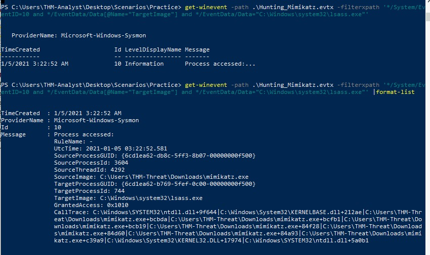
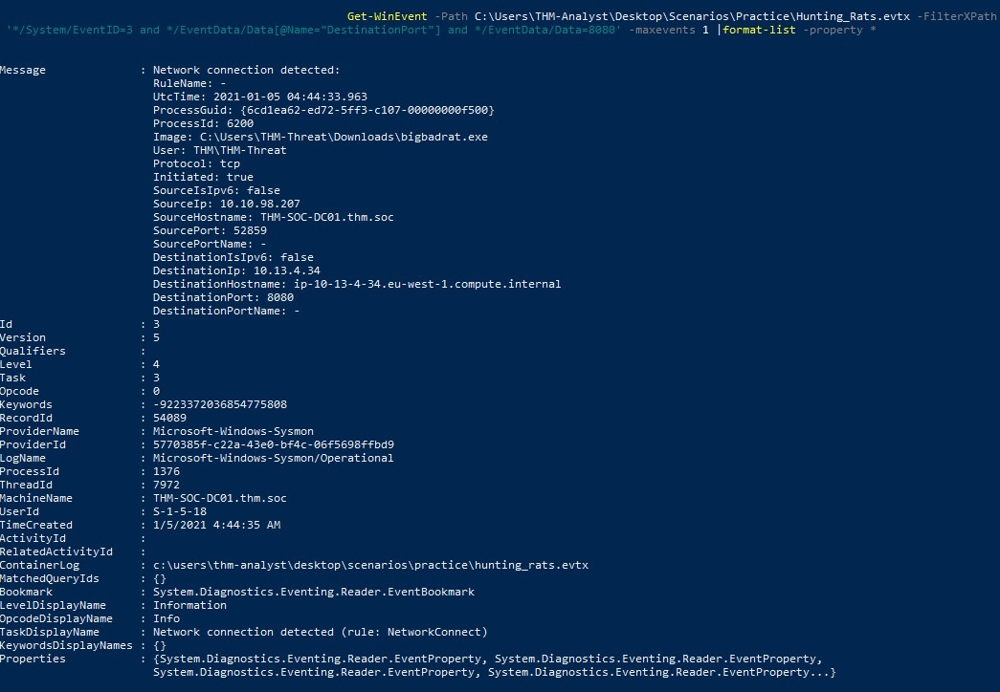
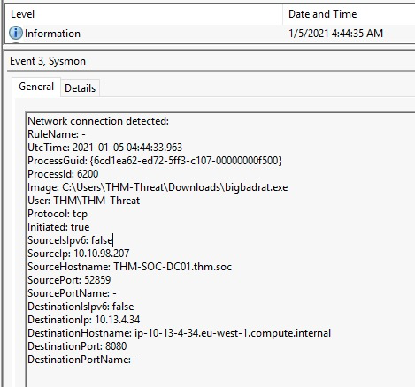
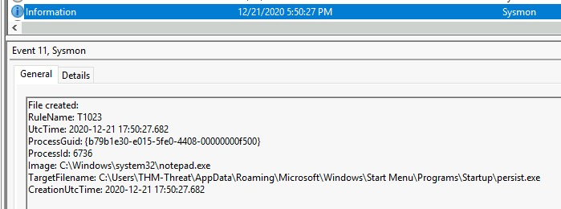
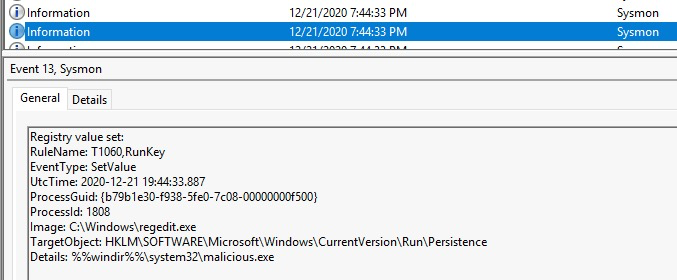
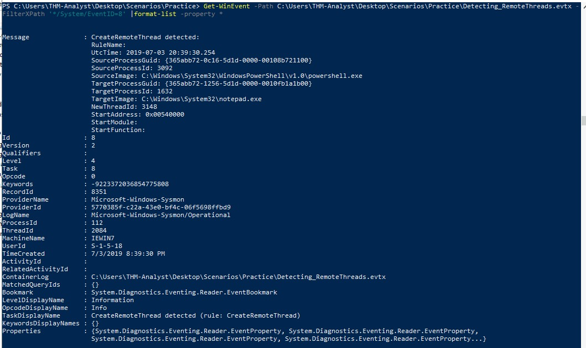
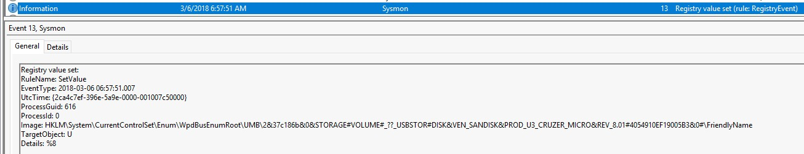
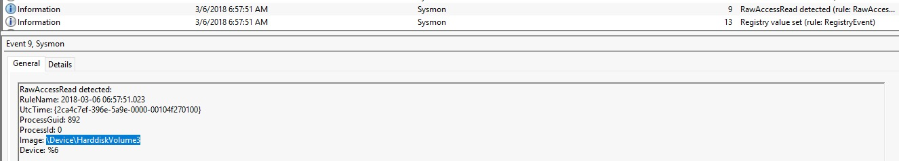
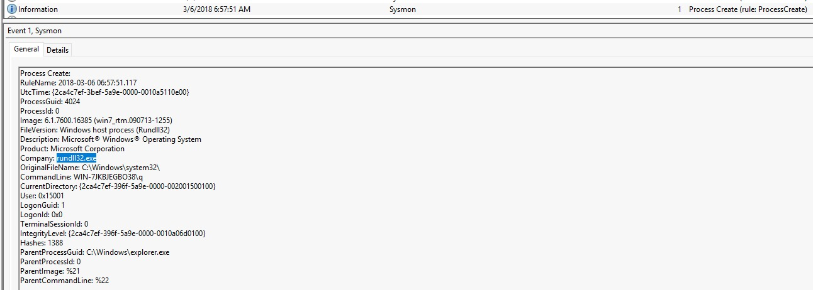

# Sysmon

Learn how to utilize Sysmon to monitor and log your endpoints and environments.

## _**1: Introduction**_

Sysmon, a tool used to monitor and log events on Windows, is commonly used by enterprises as part of their monitoring and logging solutions. Part of the Windows Sysinternals package, Sysmon is similar to Windows Event Logs with further detail and granular control.


This room uses a modified version of the [Blue](https://tryhackme.com/room/blue) and [Ice](https://tryhackme.com/room/ice) boxes, as well as Sysmon logs from the Hololive network lab.

_Before completing this room we recommend completing the [Windows Event Log](https://tryhackme.com/room/windowseventlogs) room. It is also recommended to complete the Blue and Ice rooms to get an understanding of vulnerabilities present however is not required to continue._


## _**2: Sysmon Overview**_

From the Microsoft Docs, "System Monitor (Sysmon) is a Windows system service and device driver that, once installed on a system, remains resident across system reboots to monitor and log system activity to the Windows event log. It provides detailed information about process creations, network connections, and changes to file creation time. By collecting the events it generates using Windows Event Collection or SIEM agents and subsequently analyzing them, you can identify malicious or anomalous activity and understand how intruders and malware operate on your network."

Sysmon gathers detailed and high-quality logs as well as event tracing that assists in identifying anomalies in your environment. Sysmon is most commonly used in conjunction with security information and event management (SIEM) system or other log parsing solutions that aggregate, filter, and visualize events. When installed on an endpoint, Sysmon will start early in the Windows boot process. In an ideal scenario, the events would be forwarded to a SIEM for further analysis. However, in this room, we will focus on Sysmon itself and view the events on the endpoint itself with Windows Event Viewer.

Events within Sysmon are stored in `_Applications and Services Logs/Microsoft/Windows/Sysmon/Operational_`

Sysmon Config Overview

Sysmon requires a config file in order to tell the binary how to analyze the events that it is receiving. You can create your own Sysmon config or you can download a config. Here is an example of a high-quality config that works well for identifying anomalies created by SwiftOnSecurity: [Sysmon-Config.](https://github.com/SwiftOnSecurity/sysmon-config) Sysmon includes 29 different types of Event IDs, all of which can be used within the config to specify how the events should be handled and analyzed. Below we will go over a few of the most important Event IDs and show examples of how they are used within config files.

When creating or modifying configuration files you will notice that a majority of rules in sysmon-config will exclude events rather than include events. This will help filter out normal activity in your environment that will in turn decrease the number of events and alerts you will have to manually audit or search through in a SIEM. On the other hand, there are rulesets like the ION-Storm sysmon-config fork that takes a more proactive approach with it's ruleset by using a lot of include rules. You may have to modify configuration files to find what approach you prefer. Configuration preferences will vary depending on what SOC team so prepare to be flexible when monitoring.

_Note: As there are so many Event IDs Sysmon analyzes. we will only be going over a few of the ones that we think are most important to understand._

Event ID 1: Process Creation

This event will look for any processes that have been created. You can use this to look for known suspicious processes or processes with typos that would be considered an anomaly. This event will use the CommandLine and Image XML tags.

`<RuleGroup name="" groupRelation="or">  
<ProcessCreate onmatch="exclude">  
  <CommandLine condition="is">C:\Windows\system32\svchost.exe -k appmodel -p -s camsvc</CommandLine>  
</ProcessCreate>  
</RuleGroup>`

The above code snippet is specifying the Event ID to pull from as well as what condition to look for. In this case, it is excluding the svchost.exe process from the event logs.

Event ID 3: Network Connection

The network connection event will look for events that occur remotely. This will include files and sources of suspicious binaries as well as opened ports. This event will use the Image and DestinationPort XML tags. 

`<RuleGroup name="" groupRelation="or">  
<NetworkConnect onmatch="include">  
  <Image condition="image">nmap.exe</Image>  
  <DestinationPort name="Alert,Metasploit" condition="is">4444</DestinationPort>  
</NetworkConnect>  
</RuleGroup>`

The above code snippet includes two ways to identify suspicious network connection activity. The first way will identify files transmitted over open ports. In this case, we are specifically looking for nmap.exe which will then be reflected within the event logs. The second method identifies open ports and specifically port 4444 which is commonly used with Metasploit. If the condition is met an event will be created and ideally trigger an alert for the SOC to further investigate.

Event ID 7: Image Loaded

This event will look for DLLs loaded by processes, which is useful when hunting for DLL Injection and DLL Hijacking attacks. It is recommended to exercise caution when using this Event ID as it causes a high system load. This event will use the Image, Signed, ImageLoaded, and Signature XML tags. 

`<RuleGroup name="" groupRelation="or">  
<ImageLoad onmatch="include">  
  <ImageLoaded condition="contains">\Temp\</ImageLoaded>  
</ImageLoad>  
</RuleGroup>  
`  

The above code snippet will look for any DLLs that have been loaded within the \\Temp\\ directory. If a DLL is loaded within this directory it can be considered an anomaly and should be further investigateded. 

Event ID 8: CreateRemoteThread

The CreateRemoteThread Event ID will monitor for processes injecting code into other processes. The CreateRemoteThread function is used for legitimate tasks and applications. However, it could be used by malware to hide malicious activity. This event will use the SourceImage, TargetImage, StartAddress, and StartFunction XML tags.

`<RuleGroup name="" groupRelation="or">  
<CreateRemoteThread onmatch="include">  
  <StartAddress name="Alert,Cobalt Strike" condition="end with">0B80</StartAddress>  
  <SourceImage condition="contains">\</SourceImage>  
</CreateRemoteThread>  
</RuleGroup>  
`  

The above code snippet shows two ways of monitoring for CreateRemoteThread. The first method will look at the memory address for a specific ending condition which could be an indicator of a Cobalt Strike beacon. The second method will look for injected processes that do not have a parent process. This should be considered an anomaly and require further investigation. 

Event ID 11: File Created

This event ID is will log events when files are created or overwritten the endpoint. This could be used to identify file names and signatures of files that are written to disk. This event uses TargetFilename XML tags.  

`<RuleGroup name="" groupRelation="or">  
<FileCreate onmatch="include">  
  <TargetFilename name="Alert,Ransomware" condition="contains">HELP_TO_SAVE_FILES</TargetFilename>  
</FileCreate>  
</RuleGroup>`   

The above code snippet is an example of a ransomware event monitor. This is just one example of a variety of different ways you can utilize Event ID 11.

Event ID 12 / 13 / 14: Registry Event

This event looks for changes or modifications to the registry. Malicious activity from the registry can include persistence and credential abuse. This event uses TargetObject XML tags.  

`<RuleGroup name="" groupRelation="or">  
<RegistryEvent onmatch="include">  
  <TargetObject name="T1484" condition="contains">Windows\System\Scripts</TargetObject>  
</RegistryEvent>  
</RuleGroup>`  

The above code snippet will look for registry objects that are in the _"Windows\\System\\Scripts"_ directory as this is a common directory for adversaries to place scripts to establish persistence.

Event ID 15: FileCreateStreamHash

This event will look for any files created in an alternate data stream. This is a common technique used by adversaries to hide malware. This event uses TargetFilename XML tags.

`<RuleGroup name="" groupRelation="or">  
<FileCreateStreamHash onmatch="include">  
  <TargetFilename condition="end with">.hta</TargetFilename>  
</FileCreateStreamHash>  
</RuleGroup>`   

The above code snippet will look for files with the .hta extension that have been placed within an alternate data stream.

Event ID 22: DNS Event

This event will log all DNS queries and events for analysis. The most common way to deal with these events is to exclude all trusted domains that you know will be very common "noise" in your environment. Once you get rid of the noise you can then look for DNS anomalies. This event uses QueryName XML tags. 

`<RuleGroup name="" groupRelation="or">  
<DnsQuery onmatch="exclude">  
  <QueryName condition="end with">.microsoft.com</QueryName>  
</DnsQuery>  
</RuleGroup>` 

The above code snippet will get exclude any DNS events with the .microsoft.com query. This will get rid of the noise that you see within the environment. 

There are a variety of ways and tags that you can use to customize your configuration files. We will be using the ION-Storm and SwiftOnSecurity config files for the rest of this room however feel free to use your own configuration files.

## _**3: Installing and Preparing Sysmon**_

Installing Sysmon  

The installation for Sysmon is fairly straightforward and only requires downloading the binary from the Microsoft website. You can also download all of the Sysinternals tools with a PowerShell command if you wanted to rather than grabbing a single binary. It is also recommended to use a Sysmon config file along with Sysmon to get more detailed and high-quality event tracing. As an example config file we will be using the sysmon-config file from the SwiftOnSecurity GitHub repo. 

You can find the Sysmon binary from the [Microsoft Sysinternals](https://docs.microsoft.com/en-us/sysinternals/downloads/sysmon) website. You can also download the [Microsoft Sysinternal Suite](https://docs.microsoft.com/en-us/sysinternals/downloads/sysinternals-suite) or use the below command to run a PowerShell module download and install all of the Sysinternals tools. 

PowerShell command: `Download-SysInternalsTools C:\Sysinternals`

To fully utilize Sysmon you will also need to download a Sysmon config or create your own config. We suggest downloading the [SwiftOnSecurity sysmon-config](https://github.com/SwiftOnSecurity/sysmon-config). A Sysmon config will allow for further granular control over the logs as well as more detailed event tracing. In this room, we will be using both the SwiftOnSecurity configuration file as well as the [ION-Storm config file](https://github.com/ion-storm/sysmon-config/blob/develop/sysmonconfig-export.xml). 

Starting Sysmon

To start Sysmon you will want to open a new PowerShell or Command Prompt as an Administrator. Then, run the below command it will execute the Sysmon binary, accept the end-user license agreement, and use SwiftOnSecurity config file. 

Command Used: `Sysmon.exe -accepteula -i ..\Configuration\swift.xml`
```
Sysmon Installation

C:\Users\THM-Analyst\Desktop\Tools\Sysmon>Sysmon.exe -accepteula -i ..\Configuration\swift.xml

System Monitor v12.03 - System activity monitor
Copyright (C) 2014-2020 Mark Russinovich and Thomas Garnier
Sysinternals - www.sysinternals.com

Loading configuration file with schema version 4.10
Sysmon schema version: 4.40
Configuration file validated.
Sysmon installed.
SysmonDrv installed.
Starting SysmonDrv.
SysmonDrv started.
Starting Sysmon..
```        

Now that Sysmon is started with the configuration file we want to use, we can look at the Event Viewer to monitor events. The event log is located under `_Applications and Services Logs/Microsoft/Windows/Sysmon/Operational_`

_Note: At any time you can change the configuration file used by uninstalling or updating the current configuration and replacing it with a new configuration file. For more information look through the Sysmon help menu._ 

If installed correctly your event log should look similar to the following:


## _**4: Cutting out the Noise**_

**Malicious Activity Overview**

Since most of the normal activity or "noise" seen on a network is excluded or filtered out with Sysmon we're able to focus on meaningful events. This allows us to quickly identify and investigate suspicious activity. When actively monitoring a network you will want to use multiple detections and techniques simultaneously in an effort to identify threats. For this room, we will only be looking at what suspicious logs will look like with both Sysmon configs and how to optimize your hunt using only Sysmon. We will be looking at how to detect ransomware, persistence, Mimikatz, Metasploit, and Command and Control (C2) beacons. Obviously, this is only showcasing a small handful of events that could be triggered in an environment. The methodology will largely be the same for other threats. It really comes down to using an ample and efficient configuration file as it can do a lot of the heavy lifting for you.

You can either download the event logs used for this task or you can open them from the Practice directory on the provided machine.

**Sysmon "Best Practices"**

Sysmon offers a fairly open and configurable platform for you to use. Generally speaking, there are a few best practices that you could implement to ensure you're operating efficiently and not missing any potential threats. A few common best practices are outlined and explained below.  

- Exclude > Include

When creating rules for your Sysmon configuration file it is typically best to prioritize excluding events rather than including events. This prevents you from accidentally missing crucial events and only seeing the events that matter the most.  

- CLI gives you further control

As is common with most applications the CLI gives you the most control and filtering allowing for further granular control. You can use either `Get-WinEvent` or `wevutil.exe` to access and filter logs. As you incorporate Sysmon into your SIEM or other detection solutions these tools will become less used and needed.   

- Know your environment before implementation

Knowing your environment is important when implementing any platform or tool. You should have a firm understanding of the network or environment you are working within to fully understand what is normal and what is suspicious in order to effectively craft your rules.

**Filtering Events with Event Viewer**

Event Viewer might not the best for filtering events and out-of-the-box offers limited control over logs. The main filter you will be using with Event Viewer is by filtering the `EventID` and keywords. You can also choose to filter by writing XML but this is a tedious process that doesn't scale well.  

To open the filter menu select `Filter Current Log` from the Actions menu. 


If you have successfully opened the filter menu it should look like the menu below.


From this menu, we can add any filters or categories that we want.

**Filtering Events with PowerShell**

To view and filter events with PowerShell we will be using `Get-WinEvent` along with `XPath` queries. We can use any XPath queries that can be found in the XML view of events. We will be using `wevutil.exe` to view events once filtered. The command line is typically used over the Event Viewer GUI as it allows for further granular control and filtering whereas the GUI does not. For more information about using `Get-WinEvent` and `wevutil.exe` check out the [Windows Event Log](https://tryhackme.com/room/windowseventlogs) room.

For this room, we will only be going over a few basic filters as the Windows Event Log room already extensively covers this topic.

Filter by Event ID: `*/System/EventID=<ID>`

Filter by XML Attribute/Name: `*/EventData/Data[@Name="<XML Attribute/Name>"]`

Filter by Event Data: `*/EventData/Data=<Data>`

We can put these filters together with various attributes and data to get the most control out of our logs. Look below for an example of using `Get-WinEvent` to look for network connections coming from port 4444.

`Get-WinEvent -Path <Path to Log> -FilterXPath '*/System/EventID=3 and */EventData/Data[@Name="DestinationPort"] and */EventData/Data=4444'`

```
Filtering Events

PS C:\Users\THM-Analyst> Get-WinEvent -Path C:\Users\THM-Analyst\Desktop\Scenarios\Practice\Hunting_Metasploit.evtx -FilterXPath '*/System/EventID=3 and */EventData/Data[@Name="DestinationPort"] and */EventData/Data=4444'

   ProviderName: Microsoft-Windows-Sysmon

TimeCreated                     Id LevelDisplayName Message
-----------                     -- ---------------- -------
1/5/2021 2:21:32 AM              3 Information      Network connection detected:...
```

**Questions**

Read the above and practice filtering events.

- `cd C:\Users\THM-Analyst\Desktop\Scenarios\Practice`

How many event ID 3 events are in C:\\Users\\THM-Analyst\\Desktop\\Scenarios\\Practice\\Filtering.evtx?

- `Get-WinEvent -Path .\Filtering.evtx -FilterXPath '*/System/EventID=3' | Measure-Object`
- 73,591


What is the UTC time created of the first network event in C:\\Users\\THM-Analyst\\Desktop\\Scenarios\\Practice\\Filtering.evtx?

- `Get-WinEvent -Path .\Filtering.evtx -FilterXPath '*/System/EventID=3' -Oldest -MaxEvents 1 | Format-List -property *`
- 2021-01-06 01:35:50.464


## _**5: Hunting Metasploit**_

Hunting Metasploit

Metasploit is a commonly used exploit framework for penetration testing and red team operations. Metasploit can be used to easily run exploits on a machine and connect back to a meterpreter shell. We will be hunting the meterpreter shell itself and the functionality it uses. To begin hunting we will look for network connections that originate from suspicious ports such as `4444` and `5555`. By default, Metasploit uses port 4444. If there is a connection to any IP known or unknown it should be investigated. To start an investigation you can look at packet captures from the date of the log to begin looking for further information about the adversary. We can also look for suspicious processes created. This method of hunting can be applied to other various RATs and C2 beacons.

For more information about this technique and tools used check out [MITRE ATT&CK Software](https://attack.mitre.org/software/). 

For more information about how malware and payloads interact with the network check out the [Malware Common Ports Spreadsheet](https://docs.google.com/spreadsheets/d/17pSTDNpa0sf6pHeRhusvWG6rThciE8CsXTSlDUAZDyo). This will be covered in further depth in the Hunting Malware task.

You can download the event logs used in this room from this task or you can open them in the Practice folder on the provided machine.

Hunting Network Connections

We will first be looking at a modified Ion-Security configuration to detect the creation of new network connections. The code snippet below will use event ID 3 along with the destination port to identify active connections specifically connections on port `4444` and `5555`. 

`<RuleGroup name="" groupRelation="or">  
<NetworkConnect onmatch="include">  
<DestinationPort condition="is">4444</DestinationPort>  
<DestinationPort condition="is">5555</DestinationPort>  
</NetworkConnect>  
</RuleGroup>  
`  

Open `C:\Users\THM-Analyst\Desktop\Scenarios\Practice\Hunting_Metasploit.evtx` in Event Viewer to view a basic Metasploit payload being dropped onto the machine.

  

Once we identify the event it can give us some important information we can use for further investigation like the `ProcessID` and `Image`.

Hunting for Open Ports with PowerShell

To hunt for open ports with PowerShell we will be using the PowerShell module `Get-WinEvent` along with `XPath` queries. We can use the same  XPath queries that we used in the rule to filter out events from `NetworkConnect` with `DestinationPort`. The command line is typically used over the Event Viewer GUI because it can allow for further granular control and filtering that the GUI does not offer. For more information about using XPath and the command line for event viewing, check out the [Windows Event Log](https://tryhackme.com/room/windowseventlogs) room by Heavenraiza.

`Get-WinEvent -Path <Path to Log> -FilterXPath '*/System/EventID=3 and */EventData/Data[@Name="DestinationPort"] and */EventData/Data=4444'`

```
Hunting Metasploit

PS C:\Users\THM-Analyst> Get-WinEvent -Path C:\Users\THM-Analyst\Desktop\Scenarios\Practice\Hunting_Metasploit.evtx -FilterXPath '*/System/EventID=3 and */EventData/Data[@Name="DestinationPort"] and */EventData/Data=4444'

   ProviderName: Microsoft-Windows-Sysmon

TimeCreated                     Id LevelDisplayName Message
-----------                     -- ---------------- -------
1/5/2021 2:21:32 AM              3 Information      Network connection detected:...
```        

We can break this command down by its filters to see exactly what it is doing. It is first filtering by Event ID 3 which is the network connection ID. It is then filtering by the data name in this case DestinationPort as well as the specific port that we want to filter. We can adjust this syntax along with our events to get exactly what data we want in return.


## _**6: Detecting Mimikatz**_

Detecting Mimikatz Overview

Mimikatz is well known and commonly used to dump credentials from memory along with other Windows post-exploitation activity. Mimikatz is mainly known for dumping LSASS. We can hunt for the file created, execution of the file from an elevated process, creation of a remote thread, and processes that Mimikatz creates. Anti-Virus will typically pick up Mimikatz as the signature is very well known but it is still possible for threat actors to obfuscate or use droppers to get the file onto the device. For this hunt, we will be using a custom configuration file to minimize network noise and focus on the hunt. 

For more information about this technique and the software used check out MITRE ATTACK [T1055](https://attack.mitre.org/techniques/T1055/) and [S0002](https://attack.mitre.org/software/S0002/).

You can download the event logs used in this room from this task or you can open them in the Practice folder on the provided machine.

Detecting File Creation

The first method of hunting for Mimikatz is just looking for files created with the name Mimikatz. This is a simple technique but can allow you to find anything that might have bypassed AV. Most of the time when dealing with an advanced threat you will need more advanced hunting techniques like searching for LSASS behavior but this technique can still be useful. 

This is a very simple way of detecting Mimikatz activity that has bypassed anti-virus or other detection measures. But most of the time it is preferred to use other techniques like hunting for LSASS specific behavior. Below is a snippet of a config to aid in the hunt for Mimikatz. 

`<RuleGroup name="" groupRelation="or">  
<FileCreate onmatch="include">  
<TargetFileName condition="contains">mimikatz</TargetFileName>  
</FileCreate>  
</RuleGroup>  
`  

As this method will not be commonly used to hunt for anomalies we will not be looking at any event logs for this specific technique.

Hunting Abnormal LSASS Behavior

We can use the _ProcessAccess_ event ID to hunt for abnormal LSASS behavior. This event along with LSASS would show potential LSASS abuse which usually connects back to Mimikatz some other kind of credential dumping tool. Look below for more detail on hunting with these techniques.

If LSASS is accessed by a process other than _svchost.exe_ it should be considered suspicious behavior and should be investigated further, to aid in looking for suspicious events you can use a filter to only look for processes besides svchost.exe. Sysmon will provide us further details to help lead the investigation such as the file path the process originated from. To aid in detections we will be using a custom configuration file. Below is a snippet of the config that will aid in the hunt.

`<RuleGroup name="" groupRelation="or">  
<ProcessAccess onmatch="include">  
       <TargetImage condition="image">lsass.exe</TargetImage>  
</ProcessAccess>  
</RuleGroup>  
`

Open `C:\Users\THM-Analyst\Desktop\Scenarios\Practice\Hunting_LSASS.evtx` in Event Viewer to view an attack using an obfuscated version of Mimikatz to dump credentials from memory.

  

We see the event that has the Mimikatz process accessed but we also see a lot of svchost.exe events? We can alter our config to exclude events with the `SourceImage` event coming from svhost.exe. Look below for a modified configuration rule to cut down on the noise that is present in the event logs.

`<RuleGroup name="" groupRelation="or">  
<ProcessAccess onmatch="exclude">  
<SourceImage condition="image">svchost.exe</SourceImage>  
</ProcessAccess>  
<ProcessAccess onmatch="include">  
<TargetImage condition="image">lsass.exe</TargetImage>  
</ProcessAccess>  
</RuleGroup>  
` 

By modifying the configuration file to include this exception we have cut down our events significantly and can focus on only the anomalies.  This technique can be used throughout Sysmon and events to cut down on "noise" in logs.

Detecting LSASS Behavior with PowerShell

To detect abnormal LSASS behavior with PowerShell we will again be using the PowerShell module `Get-WinEvent` along with `XPath` queries. We can use the same XPath queries used in the rule to filter out the other processes from `TargetImage`. If we use this alongside a well-built configuration file with a precise rule it will do a lot of the heavy lifting for us and we only need to filter a small amount.

`Get-WinEvent -Path <Path to Log> -FilterXPath '*/System/EventID=10 and */EventData/Data[@Name="TargetImage"] and */EventData/Data="C:\Windows\system32\lsass.exe"'`

```
Hunting Mimikatz

           
PS C:\Users\THM-Analyst> Get-WinEvent -Path C:\Users\THM-Analyst\Desktop\Scenarios\Practice\Hunting_Mimikatz.evtx -FilterXPath '*/System/EventID=10 and */EventData/Data[@Name="TargetImage"] and */EventData/Data="C:\Windows\system32\lsass.exe"'

   ProviderName: Microsoft-Windows-Sysmon

TimeCreated                     Id LevelDisplayName Message
-----------                     -- ---------------- -------
1/5/2021 3:22:52 AM             10 Information      Process accessed:...
```




## 7: Hunting Malware

Hunting Malware Overview

Malware has many forms and variations with different end goals. The two types of malware that we will be focusing on are RATs and backdoors. RATs or Remote Access Trojans are used similar to any other payload to gain remote access to a machine. RATs typically come with other Anti-Virus and detection evasion techniques that make them different than other payloads like MSFVenom. A RAT typically also uses a Client-Server model and comes with an interface for easy user administration. Examples of RATs are `Xeexe` and `Quasar`. To help detect and hunt malware we will need to first identify the malware that we want to hunt or detect and identify ways that we can modify configuration files, this is known as hypothesis-based hunting. There are of course a plethora of other ways to detect and log malware however we will only be covering the basic way of detecting open back connect ports. 

For more information about this technique and examples of malware check out [MITRE ATT&CK Software](https://attack.mitre.org/software/). 

You can download the event logs used in this room from this task or you can open them in the Practice folder on the provided machine.

Hunting Rats and C2 Servers

The first technique we will use to hunt for malware is a similar process to hunting Metasploit. We can look through and create a configuration file to hunt and detect suspicious ports open on the endpoint. By using known suspicious ports to include in our logs we can add to our hunting methodology in which we can use logs to identify adversaries on our network then use packet captures or other detection strategies to continue the investigation. The code snippet below is from the Ion-Storm configuration file which will alert when specific ports like `1034` and `1604` as well as exclude common network connections like OneDrive, by excluding events we still see everything that we want without missing anything and cutting down on noise. 

When using configuration files in a production environment you must be careful and understand exactly what is happening within the configuration file an example of this is the Ion-Storm configuration file excludes port 53 as an event. Attackers and adversaries have begun to use port 53 as part of their malware/payloads which would go undetected if you blindly used this configuration file as-is.

For more information about the ports that this configuration file alerts on check out this [spreadsheet](https://docs.google.com/spreadsheets/d/17pSTDNpa0sf6pHeRhusvWG6rThciE8CsXTSlDUAZDyo).

`<RuleGroup name="" groupRelation="or">  
<NetworkConnect onmatch="include">  
<DestinationPort condition="is">1034</DestinationPort>  
<DestinationPort condition="is">1604</DestinationPort>  
</NetworkConnect>  
<NetworkConnect onmatch="exclude">  
<Image condition="image">OneDrive.exe</Image>  
</NetworkConnect>  
</RuleGroup>  
`  

Open `C:\Users\THM-Analyst\Desktop\Scenarios\Practice\Hunting_Rats.evtx` in Event Viewer to view a live rat being dropped onto the server.

  

In the above example, we are detecting a custom RAT that operates on port 8080. This is a perfect example of why you want to be careful when excluding events in order to not miss potential malicious activity.

Hunting for Common Back Connect Ports with PowerShell

Just like previous sections when using PowerShell we will again be using the PowerShell module `Get-WinEvent` along with `XPath` queries to filter our events and gain granular control over our logs. We will need to filter on the `NetworkConnect` event ID and the `DestinationPort` data attribute. If you're using a good configuration file with a reliable set of rules it will do a majority of the heavy lifting and filtering to what you want should be easy.

`Get-WinEvent -Path <Path to Log> -FilterXPath '*/System/EventID=3 and */EventData/Data[@Name="DestinationPort"] and */EventData/Data=<Port>'`

```
Hunting Connections

           
PS C:\Users\THM-Analyst> Get-WinEvent -Path C:\Users\THM-Analyst\Desktop\Scenarios\Practice\Hunting_Rats.evtx -FilterXPath '*/System/EventID=3 and */EventData/Data[@Name="DestinationPort"] and */EventData/Data=8080'

   ProviderName: Microsoft-Windows-Sysmon

TimeCreated                     Id LevelDisplayName Message
-----------                     -- ---------------- -------
1/5/2021 4:44:35 AM              3 Information      Network connection detected:...
1/5/2021 4:44:31 AM              3 Information      Network connection detected:...
1/5/2021 4:44:27 AM              3 Information      Network connection detected:...
1/5/2021 4:44:24 AM              3 Information      Network connection detected:...
1/5/2021 4:44:20 AM              3 Information      Network connection detected:...
```
`Get-WinEvent -Path C:\Users\THM-Analyst\Desktop\Scenarios\Practice\Hunting_Rats.evtx -FilterXPath '*/System/EventID=3 and */EventData/Data[@Name="DestinationPort"] and */EventData/Data=8080' -maxevents 1 |format-list -property *`





## _**8: Hunting Persistence**_

Persistence Overview

Persistence is used by attackers to maintain access to a machine once it is compromised. There is a multitude of ways for an attacker to gain persistence on a machine. We will be focusing on registry modification as well as startup scripts. We can hunt persistence with Sysmon by looking for File Creation events as well as Registry Modification events. The SwiftOnSecurity configuration file does a good job of specifically targeting persistence and techniques used. You can also filter by the Rule Names in order to get past the network noise and focus on anomalies within the event logs. 

You can download the event logs used in this room from this task or you can open them in the Practice folder on the provided machine.

Hunting Startup Persistence  

We will first be looking at the SwiftOnSecurity detections for a file being placed in the `\Startup\` or `\Start Menu` directories. Below is a snippet of the config that will aid in event tracing for this technique. For more information about this technique check out MITRE ATT&CK [T1547](https://attack.mitre.org/techniques/T1547/).

`<RuleGroup name="" groupRelation="or">  
<FileCreate onmatch="include">  
<TargetFilename name="T1023" condition="contains">\Start Menu</TargetFilename>  
<TargetFilename name="T1165" condition="contains">\Startup\</TargetFilename>  
</FileCreate>  
</RuleGroup>  
`  

Open `C:\Users\THM-Analyst\Desktop\Scenarios\Practice\T1023.evtx`  in Event Viewer to view a live attack on the machine that involves persistence by adding a malicious EXE into the Startup folder.


When looking at the Event Viewer we see that persist.exe was placed in the Startup folder. Threat Actors will almost never make it this obvious but any changes to the Start Menu should be investigated. You can adjust the configuration file to be more granular and create alerts past just the _File Created_ tag. We can also filter by the `Rule Name T1023`


  

Once you have identified that a suspicious binary or application has been placed in a startup location you can begin an investigation on the directory.

Hunting Registry Key Persistence  

We will again be looking at another SwiftOnSecurity detection this time for a registry modification that adjusts that places a script inside `CurrentVersion\Windows\Run` and other registry locations. For more information about this technique check out MITRE ATT&CK [T1112](https://attack.mitre.org/techniques/T1112/).

`<RuleGroup name="" groupRelation="or">  
<RegistryEvent onmatch="include">  
<TargetObject name="T1060,RunKey" condition="contains">CurrentVersion\Run</TargetObject>  
<TargetObject name="T1484" condition="contains">Group Policy\Scripts</TargetObject>  
<TargetObject name="T1060" condition="contains">CurrentVersion\Windows\Run</TargetObject>  
</RegistryEvent>  
</RuleGroup>  
`  

Open `C:\Users\THM-Analyst\Desktop\Scenarios\Practice\T1060.evtx` in Event Viewer to view an attack where the registry was modified to gain persistence.

  

When looking at the event logs we see that the registry was modified and malicious.exe was added to `HKLM\SOFTWARE\Microsoft\Windows\CurrentVersion\Run\Persistence` We also see that the exe can be found at `%windir%\System32\malicious.exe`

Just like the startup technique, we can filter by the `RuleName T1060` to make finding the anomaly easier.

If we wanted to investigate this anomaly we would need to look at the registry as well as the file location itself. Below is the registry area where the malicious registry key was placed.






## _**9: Detecting Evasion Techniques**_

Evasion Techniques Overview

There are a number of evasion techniques used by malware authors to evade both anti-virus and detections. Some examples of evasion techniques are Alternate Data Streams, Injections, Masquerading, Packing/Compression, Recompiling, Obfuscation, Anti-Reversing Techniques. In this task, we will be focusing on Alternate Data Streams and Injections. Alternate Data Streams are used by malware to hide its files from normal inspection by saving the file in a different stream apart from `$DATA`. Sysmon comes with an event ID to detect newly created and accessed streams allowing us to quickly detect and hunt malware that uses ADS. Injection techniques come in many different types: Thread Hijacking, PE Injection, DLL Injection, and more. In this room, we will be focusing on DLL Injection and backdooring DLLs. This is done by taking an already used DLL that is used by an application and overwriting or including your malicious code within the DLL.

For more information about this technique check out MITRE ATT&CK [T1564](https://attack.mitre.org/techniques/T1564/004/) and [T1055](https://attack.mitre.org/techniques/T1055/).

You can download the event logs used in this room from this task or you can open them in the Practice folder on the provided machine.

Hunting Alternate Data Streams

The first technique we will be looking at is hiding files using alternate data streams using Event ID 15. Event ID 15 will hash and log any NTFS Streams that are included within the Sysmon configuration file. This will allow us to hunt for malware that evades detections using ADS. To aid in hunting ADS we will be using the SwiftOnSecurity Sysmon configuration file. The code snippet below will hunt for files in the `Temp` and `Startup` folder as well as `.hta` and `.bat` extension.

```
<RuleGroup name="" groupRelation="or">  
<FileCreateStreamHash onmatch="include">  
<TargetFilename condition="contains">Downloads</TargetFilename>  
<TargetFilename condition="contains">Temp\7z</TargetFilename>  
<TargetFilename condition="ends with">.hta</TargetFilename>  
<TargetFilename condition="ends with">.bat</TargetFilename>  
</FileCreateStreamHash>  
</RuleGroup>
```

Open `C:\Users\THM-Analyst\Desktop\Scenarios\Practice\Hunting_ADS.evtx` in Event Viewer to view hidden files using an alternate data stream.


```
Listing Data Streams

C:\\Users\\THM-Threat>dir /r
 Volume in drive C has no label.
 Volume Serial Number is C0C4-7EC1

 Directory of C:\\Users\\THM-Threat

10/23/2022  02:56 AM    <DIR>          .
10/23/2022  02:56 AM    <DIR>          ..
01/02/2021  12:43 AM    <DIR>          3D Objects
01/02/2021  12:43 AM    <DIR>          Contacts
01/05/2021  11:53 PM    <DIR>          Desktop
01/02/2021  12:43 AM    <DIR>          Documents
01/10/2021  12:11 AM    <DIR>          Downloads
01/02/2021  12:43 AM    <DIR>          Favorites
01/02/2021  12:43 AM    <DIR>          Links
01/02/2021  12:43 AM    <DIR>          Music
10/23/2022  02:56 AM                 0 not_malicious.txt
                                    13 not_malicious.txt:malicious.txt:$DATA 
```        

As you can see the event will show us the location of the file name as well as the contents of the file this will be useful if an investigation is necessary.

Detecting Remote Threads 

Adversaries also commonly use remote threads to evade detections in combination with other techniques. Remote threads are created using the Windows API `CreateRemoteThread` and can be accessed using `OpenThread` and `ResumeThread`. This is used in multiple evasion techniques including DLL Injection, Thread Hijacking, and Process Hollowing. We will be using the Sysmon event ID 8 from the SwiftOnSecurity configuration file. The code snippet below from the rule will exclude common remote threads without including any specific attributes this allows for a more open and precise event rule. 

```
<RuleGroup name="" groupRelation="or">  
<CreateRemoteThread onmatch="exclude">  
<SourceImage condition="is">C:\Windows\system32\svchost.exe</SourceImage>  
<TargetImage condition="is">C:\Program Files (x86)\Google\Chrome\Application\chrome.exe</TargetImage>  
</CreateRemoteThread>  
</RuleGroup>  
```  


Open `C:\Users\THM-Analyst\Desktop\Scenarios\Practice\Detecting_RemoteThreads.evtx` in Event Viewer to observe a Process Hollowing attack that abuses the notepad.exe process. 

  

As you can see in the above image powershell.exe is creating a remote thread and accessing notepad.exe. This is obviously a PoC and could in theory execute any other kind of executable or DLL. The specific technique used in this example is called Reflective PE Injection. 

Detecting Evasion Techniques with PowerShell

We have already gone through a majority of the syntax required to use PowerShell with events. Like previous tasks, we will be using `Get-WinEvent` along with the `XPath` to filter and search for files that use an alternate data stream or create a remote thread. In both of the events, we will only need to filter by the `EventID` because the rule used within the configuration file is already doing a majority of the heavy lifting. 

Detecting Remote Thread Creation

Syntax: `Get-WinEvent -Path <Path to Log> -FilterXPath '*/System/EventID=8'`

```
Detecting Remote Threads

           
PS C:\Users\THM-Analyst> Get-WinEvent -Path C:\Users\THM-Analyst\Desktop\Scenarios\Practice\Detecting_RemoteThreads.evtx -FilterXPath '*/System/EventID=8'

   ProviderName: Microsoft-Windows-Sysmon

TimeCreated                     Id LevelDisplayName Message
-----------                     -- ---------------- -------
7/3/2019 8:39:30 PM              8 Information      CreateRemoteThread detected:...
7/3/2019 8:39:30 PM              8 Information      CreateRemoteThread detected:...
7/3/2019 8:39:30 PM              8 Information      CreateRemoteThread detected:...
7/3/2019 8:39:30 PM              8 Information      CreateRemoteThread detected:...
7/3/2019 8:39:30 PM              8 Information      CreateRemoteThread detected:...
```




## _**10: Practical Investigations**_

Event files used within this task have been sourced from the [EVTX-ATTACK-SAMPLES](https://github.com/sbousseaden/EVTX-ATTACK-SAMPLES/tree/master) and [SysmonResources](https://github.com/jymcheong/SysmonResources) Github repositories.

You can download the event logs used in this room from this task or you can open them in the Investigations folder on the provided machine.

Investigation 1 - ugh, BILL THAT'S THE WRONG USB!

In this investigation, your team has received reports that a malicious file was dropped onto a host by a malicious USB. They have pulled the logs suspected and have tasked you with running the investigation for it.

Logs are located in `C:\Users\THM-Analyst\Desktop\Scenarios\Investigations\Investigation-1.evtx`.

Investigation 2 - This isn't an HTML file? 

Another suspicious file has appeared in your logs and has managed to execute code masking itself as an HTML file, evading your anti-virus detections. Open the logs and investigate the suspicious file. 

Logs are located in `C:\Users\THM-Analyst\Desktop\Scenarios\Investigations\Investigation-2.evtx`.

Investigation 3.1 - 3.2 - Where's the bouncer when you need him

Your team has informed you that the adversary has managed to set up persistence on your endpoints as they continue to move throughout your network. Find how the adversary managed to gain persistence using logs provided.

Logs are located in `C:\Users\THM-Analyst\Desktop\Scenarios\Investigations\Investigation-3.1.evtx`

and `C:\Users\THM-Analyst\Desktop\Scenarios\Investigations\Investigation-3.2.evtx`.

Investigation 4 - Mom look! I built a botnet!

As the adversary has gained a solid foothold onto your network it has been brought to your attention that they may have been able to set up C2 communications on some of the endpoints. Collect the logs and continue your investigation.

Logs are located in `C:\Users\THM-Analyst\Desktop\Scenarios\Investigations\Investigation-4.evtx`.

**Questions**

What is the full registry key of the USB device calling svchost.exe in Investigation 1?

- HKLM\System\CurrentControlSet\Enum\WpdBusEnumRoot\UMB\2&37c186b&0&STORAGE#VOLUME#_??_USBSTOR#DISK&VEN_SANDISK&PROD_U3_CRUZER_MICRO&REV_8.01#4054910EF19005B3&0#\FriendlyName



What is the device name when being called by RawAccessRead in Investigation 1?

- \Device\HarddiskVolume3



What is the first exe the process executes in Investigation 1?

- 



What is the full path of the payload in Investigation 2?

- 

What is the full path of the file the payload masked itself as in Investigation 2?

- 

What signed binary executed the payload in Investigation 2?

- 

What is the IP of the adversary in Investigation 2?

- 

What back connect port is used in Investigation 2?

- 

What is the IP of the suspected adversary in Investigation 3.1?

- 

What is the hostname of the affected endpoint in Investigation 3.1?

- 

What is the hostname of the C2 server connecting to the endpoint in Investigation 3.1?

- 

Where in the registry was the payload stored in Investigation 3.1?

- 

What PowerShell launch code was used to launch the payload in Investigation 3.1?

- 

What is the IP of the adversary in Investigation 3.2?

- 

What is the full path of the payload location in Investigation 3.2?

- 

What was the full command used to create the scheduled task in Investigation 3.2?

- 

What process was accessed by schtasks.exe that would be considered suspicious behavior in Investigation 3.2?

- 

What is the IP of the adversary in Investigation 4?

- 

What port is the adversary operating on in Investigation 4?

- 

What C2 is the adversary utilizing in Investigation 4?

- 

